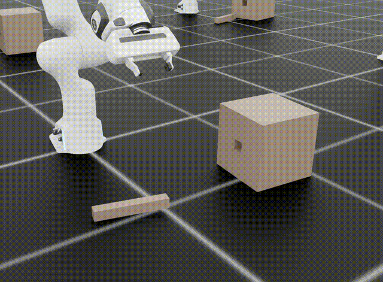
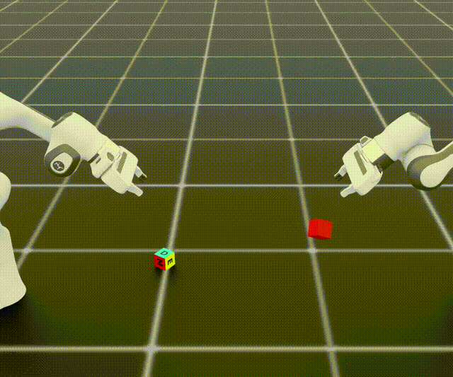
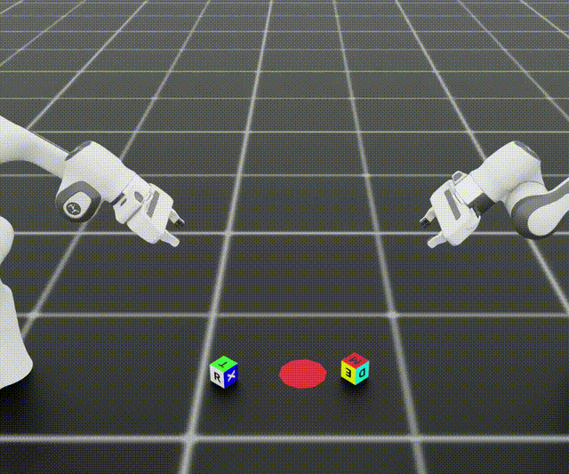

# ALR Isaac Lab Franka Task Suite

This fork of [Isaac Lab](https://github.com/isaac-sim/IsaacLab) focuses on dexterous Franka Panda manipulation.
It packages ready-to-train simulation environments, datasets, and a teleoperation harness that make it simple to
prototype dual-arm skills, collect demonstrations, and evaluate control policies inside Isaac Sim.

> All custom content lives on the `tasks` branch. The branch stays up to date with Isaac Lab `main`, so you can
> merge upstream changes while keeping the Franka extensions isolated from core development.

---

## Highlights

- Four Franka task families (`assembly_kit`, `peg_insertion_side`, `two_robot_pick_cube`, `two_robot_stack_cube`) with Direct/Camera/Teleop variants so you can swap between state, RGB, and task-space controllers by changing the Gym ID.
- Calibrated contact sensors, camera intrinsics, and spawn ranges for each task, enabling both RL and imitation learning.
- A `Se3Gamepad`-driven teleoperation loop for both dual-arm environments that can generate demonstrations or debug controllers with a regular gamepad.
- Turnkey PPO configs for RL Games, RSL RL, SKRL, and Stable-Baselines3 under each task directory to streamline training.

---

## Requirements and Setup

1. Install Isaac Lab exactly as described in the upstream documentation (Isaac Sim 4.5–5.1, Python 3.11). The official pip-based instructions are available [here](https://isaac-sim.github.io/IsaacLab/main/source/setup/installation/isaaclab_pip_installation.html).
2. Clone this fork, checkout the `tasks` branch, and run `./isaaclab.sh --help` to bootstrap the environment.
3. Launch Isaac Sim once to let it compile extensions, then run any of the scripts below.

All instructions below assume you are inside the repository root.

---

## Franka Environments

### Assembly Kit

- **Location:** `source/isaaclab_tasks/isaaclab_tasks/direct/assembly_kit`
- **Gym IDs:** `Isaac-Assembly-Kit-{Direct|Camera|Teleop}-v0`
- **Focus:** Single-arm part assembly using USD/JSON kits sampled per episode. Color randomization and kinematic kit bases
  make it ideal for perception-conditioned policies. `assembly_kit_env_cfg.py` handles asset parsing and spawn logic.


### Peg Insertion (Side)

- **Location:** `source/isaaclab_tasks/isaaclab_tasks/direct/peg_insertion_side`
- **Gym IDs:** `Isaac-Peg-Insertion_Side-{Direct|Camera|Teleop}-v0`
- **Focus:** Sideways peg-in-hole insertion with precise contact sensing and camera views aligned for tactile perception.
  The teleop config switches to a task-space controller and a viewer that centers the workspace.



### Two-Robot Pick Cube

- **Location:** `source/isaaclab_tasks/isaaclab_tasks/direct/two_robot_pick_cube`
- **Gym IDs:** `Isaac-Two-Robot-Pick-Cube-{Direct|Camera|Teleop}-v0`
- **Focus:** Cooperative dual-Franka manipulation of a shared dexterity cube, including goal markers, contact sensors, and
  synchronized frame transformers for reward design. Teleop mode uses high-PD controllers for responsive IK tracking.



### Two-Robot Stack Cube

- **Location:** `source/isaaclab_tasks/isaaclab_tasks/direct/two_robot_stack_cube`
- **Gym IDs:** `Isaac-Two-Robot-Stack-Cube-{Direct|Camera|Teleop}-v0`
- **Focus:** Two Frankas manipulate color-coded cubes and align them on circular markers. The environment config exposes
  per-arm contact sensors and camera offsets chosen for stacking from opposing sides.



Each task directory bundles agent configuration files:

```
source/isaaclab_tasks/isaaclab_tasks/direct/<task>/agents/
    rl_games_ppo_cfg.yaml
    rsl_rl_ppo_cfg.py
    skrl_{amp,ppo}_cfg.yaml
    sb3_ppo_cfg.yaml
```

Launch any of them via `./isaaclab.sh -p <agent_entrypoint> --task <Gym ID>`.

---

## Teleoperation Controller

`scripts/environments/teleoperation/two_robot_controller_teleoperation.py` provides a differential-IK teleoperation loop
that works with both dual-arm teleop environments. Key features:

- Uses `Se3Gamepad` to stream 6-DoF deltas plus a binary gripper toggle (`X` button).
- Press `RIGHT_SHOULDER` to swap which arm is active; the inactive arm holds its last joint pose.
- Supports multiple environments via `--num_envs` for domain randomization or multi-scene debugging.
- Compatible with Fabric and non-Fabric builds (`--disable_fabric` flag).

Example:

```bash
./isaaclab.sh -p scripts/environments/teleoperation/two_robot_controller_teleoperation.py \
    --task Isaac-Two-Robot-Stack-Cube-Teleop-Direct-v0 \
    --num_envs 1
```

Use any registered Gym ID to teleoperate different scenarios.

### Controller Demo Commands

Run the following commands from the repo root to launch each teleop-ready task (add `--disable_fabric` if your install lacks Fabric):

```bash
# Assembly Kit (single arm)
./isaaclab.sh -p scripts/environments/teleoperation/one_robot_controller_teleoperation.py \
    --task Isaac-Assembly-Kit-Teleop-Direct-v0 --num_envs 1

# Peg Insertion (single arm)
./isaaclab.sh -p scripts/environments/teleoperation/one_robot_controller_teleoperation.py \
    --task Isaac-Peg-Insertion_Side-Teleop-Direct-v0 --num_envs 1

# Two-Robot Pick Cube (dual arm)
./isaaclab.sh -p scripts/environments/teleoperation/two_robot_controller_teleoperation.py \
    --task Isaac-Two-Robot-Pick-Cube-Teleop-Direct-v0 --num_envs 1

# Two-Robot Stack Cube (dual arm)
./isaaclab.sh -p scripts/environments/teleoperation/two_robot_controller_teleoperation.py \
    --task Isaac-Two-Robot-Stack-Cube-Teleop-Direct-v0 --num_envs 1
```

---

## Training and Evaluation

1. **Direct State Policies:** Run `./isaaclab.sh -p source/standalone/rsl_rl/ppo.py --task Isaac-Two-Robot-Pick-Cube-Direct-v0 ...`
   or switch to RL Games / SB3 by pointing to the configs under each task.
2. **Camera Policies:** Swap to the `Camera` Gym IDs. Images are published via the Isaac Lab camera sensor API.
3. **Teleop Policies:** Use `Teleop` Gym IDs with task-space controllers to warm-start with human demonstrations or to
   record expert rollouts for imitation learning.

Episodes are 4 seconds (200 simulation steps at 100 Hz) by default, and each config exposes sampling ranges for objects,
goals, and camera poses so you can adapt them to your dataset needs.

---

## Repository Layout

- `source/isaaclab_tasks/isaaclab_tasks/direct/*`: All custom Franka environments and RL configs.
- `scripts/environments/teleoperation/two_robot_controller_teleoperation.py`: Dual-arm teleop runner.
- `source/isaaclab/isaaclab/devices/gamepad/se3_gamepad.py`: Gamepad driver with callback support (used by teleop script).
- `docs/` and the remaining structure follow Isaac Lab upstream for reference.

---

## License and Attribution

This fork inherits Isaac Lab's licensing:

- Core framework: [BSD-3-Clause](LICENSE)
- `isaaclab_mimic` components (if used): [Apache 2.0](LICENSE-mimic)

If you use these environments in academic work, please cite the Orbit/Isaac Lab paper:

```
@article{mittal2023orbit,
  title   = {Orbit: A Unified Simulation Framework for Interactive Robot Learning Environments},
  author  = {Mittal, Mayank et al.},
  journal = {IEEE Robotics and Automation Letters},
  year    = {2023},
  volume  = {8},
  number  = {6},
  pages   = {3740-3747},
  doi     = {10.1109/LRA.2023.3270034}
}
```

---

For questions or issues specific to this fork, open a discussion or issue referencing the `tasks` branch so changes can
be tracked separately from upstream Isaac Lab. Happy experimenting!
