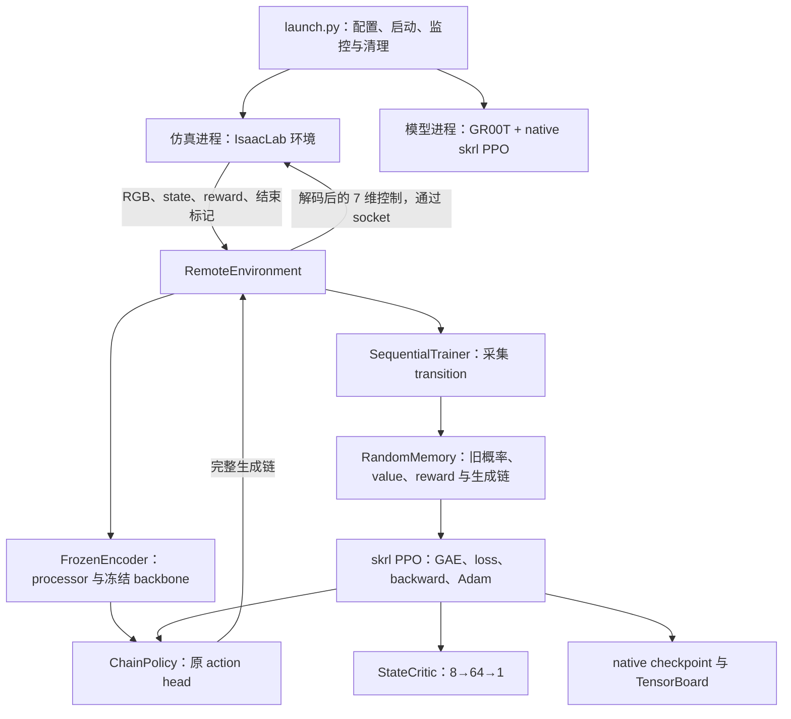

# GR00T N1.7 + Isaac Lab + skrl PPO：从环境反馈到参数更新

这份指南面向刚接触具身智能的读者。你可以一边阅读，一边在 VS Code 中暂停程序，亲眼看到机器人观测如何变成动作、动作如何得到奖励、奖励如何推动模型参数更新。

本文参考了 embodied-template 的 RL_PIPELINE_GUIDE.md 的教学路线，但讲解的是**当前仓库的 native skrl PPO 实现**。这里使用两个本地进程和 Unix socket，不使用参考项目的 RLinf、Ray、独立 rollout worker 或 DCP checkpoint。公式、默认值和断点位置已对照 2026-10-10（北京时间）的本仓库代码及已安装的 skrl 2.1.0。

完整学习链路是：

> micro-SFT checkpoint → 双相机与机器人状态 → 冻结 backbone 提取特征 → 原 action head 采样生成链 → 解码并执行一个动作 → 收集 reward、旧 log probability、旧 value → GAE → PPO loss → backward → Adam → 保存、恢复与推理。

当前两步配置用于理解和验证工程链路。它使用“靠近红方块”的奖励，不能据此判断机器人已经学会堆方块。语言指令、任务名称和奖励目标需要分别理解。

第一次可先按[第 2 节](#2-第一次-f5启动一个能看懂的调试会话)启动，再跟[第 11 节](#11-按断点走完一次训练)观察变量；第二遍回到第 4～9 节，把看到的数据与公式对应起来。

## 1. 先建立直觉：强化学习在学什么

SFT（监督微调）让模型学习“专家在这个观测下采取什么动作”。RL（强化学习）让模型自己尝试动作，再根据环境反馈调整策略。好比先照着教程学抓取，再通过实际尝试的结果改进操作。

| 概念 | 通俗解释 | 当前代码里的对象 |
| --- | --- | --- |
| observation，观测 `o_t` | 机器人现在看到和测到什么 | 桌面 RGB、腕部 RGB、8 维机器人状态、固定指令 |
| policy，策略 `πθ` | 根据观测产生一次行动的模型 | `ChainPolicy` 包装的完整原 N1.7 action head |
| action，动作 | 这次选择的结果 | PPO 保存完整生成链；仿真接收解码后的 7 维命令 |
| reward，奖励 `r_t` | 环境对这一步的评价 | `proximity_reward()` 经 reward manager 积分 |
| value，价值 `V(s_t)` | 从当前状态继续操作，预计能得到多少折扣奖励 | 独立的 `StateCritic` |
| rollout | 连续尝试和记录的一小段经历 | `RandomMemory` 中的两条 transition |
| advantage，优势 `A_t` | 这次结果比原先预期好多少 | skrl 的 `compute_gae()` 输出，随后标准化 |
| return，价值目标 `R_t` | 用这段经历修正价值预测的目标 | 未标准化 advantage 加上旧 value |

`θ` 表示可学习的参数。这里 policy 和 critic 是不同网络，共用一个 native Adam optimizer。critic 的输出不是成功概率，可以为负，也可以大于 1。

PPO（Proximal Policy Optimization）用一批刚采集的经历更新模型。它保存采样时的**旧概率和旧 value**，再问更新中的模型：“对同一个已经采样的结果，你现在赋予多少概率？”advantage 为正时倾向提高其概率，为负时倾向降低；clipping 限制一部分过大概率变化的收益。

这批数据来自当前策略在线交互，不来自专家动作标签。`RandomMemory` 在这里是短期 rollout 存储；每个 rollout 完成后更新，没有从长期历史经验池持续抽样。

## 2. 第一次 F5：启动一个能看懂的调试会话

### 2.1 准备与启动

1. 使用 VS Code Remote SSH 打开 **IsaacLab 根目录**，远程端安装 Microsoft Python 和 Python Debugger 扩展。
2. 确认两套环境和本地模型已按 [runner README](../scripts/reinforcement_learning/gr00t_skrl/README.md) 准备好。
3. 在 `train.py` 的 `run()` 中给 `random.seed(cfg.seed)` 设置断点，在 `simulation.py` 的 `serve()` 中给 `env_cfg = parse_env_cfg(...)` 设置断点。
4. 打开“运行和调试”，选择 **`GR00T PPO: 两步训练（自动调试模型与仿真）`**，按 F5。
5. 主进程先因 `stopOnEntry=true` 停在入口。按 F5 继续，等模型和仿真子进程出现并命中各自断点。
6. 在 Call Stack 中选择对应子进程和函数帧，再查看变量或使用 Debug Console。两个子进程都暂停时，需要分别继续它们，才能完成相互通信。

配置位于 [launch.json](../.vscode/launch.json)，不是伪造的学习循环。它调用原 [launch.py](../scripts/reinforcement_learning/gr00t_skrl/launch.py)，继续使用真实 Franka、相机、GR00T 和 skrl。

```text
launcher / simulation 解释器：IsaacLab/.venv/bin/python
模型 / PPO 解释器：           ../Isaac-GR00T/.venv/bin/python
入口模块：                   scripts.reinforcement_learning.gr00t_skrl.launch
micro-SFT：                  ../embodied-template/models/stack-cube-n1.7-sft/checkpoint
backbone：                   ../embodied-template/models/nvidia/Cosmos-Reason2-2B
输出：                       logs/gr00t_skrl/<自动时间戳>/
```

launch 配置指定 uv 已管理好的解释器，不触发依赖同步；不需要往两个环境安装 `debugpy`。VS Code Python Debugger 扩展提供调试代码。默认使用 GPU 0，修改配置中的 `CUDA_VISIBLE_DEVICES` 可选择其他卡；子进程里的 `cuda:0` 指可见设备中的第一张卡。

路径不同的机器可在所选配置的 `args` 中添加下面三个参数，值改成实际绝对路径：

```json
"--model_project", "/data/Isaac-GR00T",
"--model_path", "/data/models/stack-cube-n1.7-sft/checkpoint",
"--backbone_path", "/data/models/nvidia/Cosmos-Reason2-2B"
```

IsaacLab 环境仍需位于当前 checkout 的 `.venv`。backbone 路径必须保留 `nvidia/Cosmos-Reason2` 字串，因为上游用它选择模型类型。不要把 backbone symlink 换成不含该名称的真实路径。

### 2.2 为什么需要自动调试子进程

`subProcess=true` 让 VS Code 自动附加 Python 子进程，`justMyCode=false` 允许进入 skrl 和 GR00T 的代码。调试参数 `--debug_subprocesses` 让 launcher 直接调用各项目的 `.venv/bin/python`，使调试器能够注入子进程；常规启动仍使用 `uv run --project ... --no-sync python`。两种模式使用同一训练配置和实现。

不启用这个选项时，launcher 通过 uv 的 Rust 进程启动 Python，调试器无法依靠 Python 的 `subprocess` 注入自然跟进。只调试 launcher 时，F11 不能跨进程进入模型或仿真函数。

调试配置把 `rpc_timeout` 从 300 秒延长到 7200 秒，即两小时。暂停模型时，仿真可能正在等待下一条 RPC；暂停仿真时，模型可能正在等待反馈。超时仍有限，超过后会退出。这里没有需要填写的 Ray worker 端口，也不需要往生产代码插入 `breakpoint()`。

### 2.3 调试操作与停止

- **F10**：执行当前行，不进入调用；黄色箭头所在行通常尚未执行，赋值后的变量要等执行后再看。
- **F11**：进入当前进程的函数。初始化时第三方调用很多，第一次优先 F10 和明确的断点。
- **F5**：继续当前暂停会话。在 Call Stack 中确认你选的是 launcher、模型还是仿真。
- **正常停止整个运行**：继续 launcher 会话，让它恢复运行，再在它的集成终端按 Ctrl+C。launcher 会进入 `finally`，清理两个子进程组和私有 socket。
- **Shift+F5**：停止调试会话。调试器可能强制结束进程，跳过 Python 的 `finally`；停止所有相关会话后，用 `nvidia-smi` 确认本次子进程已释放显存，再启动下一轮。

子进程 stdout/stderr 写入本次目录的 `train.log` 和 `simulation.log`，不都显示在集成终端中。可在另一个终端观察日志：

```bash
# 把 <本次目录> 换成 launcher 打印的 Run directory。
tail -f logs/gr00t_skrl/<本次目录>/train.log \
        logs/gr00t_skrl/<本次目录>/simulation.log
```

headless 表示不打开桌面窗口；相机仍需要 GPU 渲染。当前 runner 不自动写视频或开启 WebRTC。先看相机数组、命令、测量位移和指标。两步运行也会加载大模型、启动 Isaac Sim、写约 9.1 GiB checkpoint，耗时和磁盘成本远大于普通小网络示例。

## 3. 代码地图与“步”的区别

### 3.1 谁负责什么

下文项目源码简称为 `runner/`，即 `scripts/reinforcement_learning/gr00t_skrl/`。



| 文件 | 阅读入口 | 责任 |
| --- | --- | --- |
| [launch.py](../scripts/reinforcement_learning/gr00t_skrl/launch.py) | `main()` | 写 `config.json`、启动双环境进程、监控、退出清理 |
| [protocol.py](../scripts/reinforcement_learning/gr00t_skrl/protocol.py) | `RunConfig`、`Observation`、`RpcConnection` | 配置和 RPC 数据契约，处理两套 NumPy 的传输兼容性 |
| [simulation.py](../scripts/reinforcement_learning/gr00t_skrl/simulation.py) | `serve()` | 创建任务，处理 reset/step，采集相机与终止前状态 |
| [environment.py](../scripts/reinforcement_learning/gr00t_skrl/environment.py) | `RemoteEnvironment.step()` | 把 native skrl 的生成链动作转成仿真命令和反馈 |
| [policy.py](../scripts/reinforcement_learning/gr00t_skrl/policy.py) | `FrozenEncoder`、`ChainPolicy.act()`、`StateCritic` | 编码、采样、重算概率、动作解码、价值预测 |
| [train.py](../scripts/reinforcement_learning/gr00t_skrl/train.py) | `run()` | 组装 skrl agent/memory/trainer、一致性检查、最终指标 |
| [agent.py](../scripts/reinforcement_learning/gr00t_skrl/agent.py) | `Gr00tPPO.post_interaction()`、`resume()` | 生命周期、timeout 状态、显存迁移、诊断、边界保存 |
| 模型环境里的 `skrl/agents/torch/ppo/ppo.py` | `compute_gae()`、`PPO.update()` | 真正的 GAE、PPO loss、梯度和 optimizer 更新 |
| 模型环境里的 `skrl/trainers/torch/base.py` | `Trainer.train()` | 当前单 agent 的实际交互循环 |

`SequentialTrainer.train()` 在单 agent 情况会调用基类 `Trainer.train()`；因此在基类里查看交互循环。当前模型环境的 skrl 文件位于 `../Isaac-GR00T/.venv/lib/python3.12/site-packages/skrl/`，也可通过 F11 打开，不必修改安装文件。

`Gr00tPPO` 没有复制一份 PPO 或 GAE 算法，`super().post_interaction(...)` 会进入 native skrl。没有独立 rollout 模型副本，因此也没有 Ray 版指南中的“把 actor 新权重同步给 rollout worker”阶段：下一次采样直接使用刚更新的 `policy` 对象。

### 3.2 当前 F5 的运行规模

| 参数 / 概念 | 值 | 含义 |
| --- | --- | --- |
| `num_envs` | 1 | 一个 Franka 仿真环境，当前 wrapper 固定如此 |
| `timesteps` | 2 | 本次 trainer 执行两次环境控制 |
| `rollouts` | 2 | 每收集两条 transition 做一轮 PPO update |
| `episode_steps` | 2 | 最迟两次控制后 timeout，用来观察 reset 和 bootstrap |
| `generation_steps`，`K` | 2 | 每次模型行动内部有两次随机生成转换 |
| 模型 horizon，`H` | 40 | 每个内部动作张量包含 40 个时间位置 |
| 模型 padded action dim，`D` | 132 | 模型内部容量，包含 padding |
| 实际执行长度 | 1 | 每次只解码并执行最终张量的第一个动作 |
| `learning_epochs` | 2 | 同一批 rollout 数据遍历两次 |
| `mini_batches` | 2 | 每轮拆成两个 minibatch，每批一个 transition |
| native Adam step | 4 | 2 epochs × 2 minibatches，每批一次更新 |

这里没有“五次 backward 累积成一次 update”的设置。**一次 rollout update 内有四次 `optimizer.step()`**。`RunState.updates` 计 rollout update 次数，`optimizer_steps` 计 Adam 次数，`environment_steps` 计交互次数。

当前任务的 `sim.dt=0.01 s`、`decimation=5`，所以每个环境控制步对应五个物理积分步，`step_dt=0.05 s`。两步只覆盖约 0.1 秒仿真时间；模型加载和训练的真实耗时不算仿真时间。

## 4. 第一站：从 SFT 初始化到可训练模型

`train.run()` 先设随机种子，再创建：

```python
encoder = FrozenEncoder(cfg)
policy = ChainPolicy(encoder.head, encoder.layout, cfg.generation_steps, cfg.sigma, "cuda:0")
critic = StateCritic(policy.observation_space, policy.action_space, "cuda:0")
```

`FrozenEncoder.__init__()` 从 micro-SFT checkpoint 加载 N1.7，并让 config 和 processor 使用当前 `backbone_path`。不用编辑 checkpoint 中旧机器的绝对路径。processor 的统计文件决定状态归一化和动作反归一化，不能只看网络权重。

| 部分 | 是否训练 | 原因 / 去向 |
| --- | --- | --- |
| vision/language backbone | 否 | `requires_grad_(False)`，编码阶段 `torch.no_grad()` |
| 原完整 action head | 是 | state/action encoder、VL 处理、DiT、decoder 等都保留训练能力 |
| `StateCritic` | 是 | 独立的小网络，预测未来折扣奖励 |
| processor | 否 | 数据转换及固定统计，不是 Adam 中的可学习参数 |

“冻结 backbone”不代表整个 VLA 都冻结；“完整 head 训练”也不代表 Cosmos backbone 被微调。backbone 不进入 policy、optimizer 或 PPO checkpoint。更新时将它移到 CPU 释放显存，结束后搬回 GPU。

head 用 BF16 节省显存，生成链、概率和 PPO 计算使用 FP32。局部 activation checkpoint 包装会在 backward 时重算部分 transformer 激活，以计算换显存；没有换掉原模型参数或 state-dict 名称。

`ChainPolicy.train()` 始终关闭 dropout，避免对同一个已保存样本重算时出现额外的 dropout 随机性。**`eval()` 和 `no_grad()` 是两回事**：前者控制 dropout 等层的行为，后者控制 autograd。学习阶段仍会建立梯度图。

## 5. 第二站：观测怎样变成可执行动作

### 5.1 从仿真到模型输入

`simulation.observation_packet()` 从任务观测取桌面和腕部 RGB，并构造物理状态：

```text
state = [末端 x, y, z, 旋转向量 rx, ry, rz, 两个手指的关节位置]
shape = (8,)
单位 = [m, m, m, rad, rad, rad, m, m]
```

当前双相机为 200×200 RGB，传输 dtype 是 `uint8`。`critic_state()` 使用 `axis_angle_from_quat(quat_unique(...))` 得到主值旋转向量。processor 的字段仍叫 `roll/pitch/yaw`，但此处存放的是**旋转向量的三个分量**，不能按欧拉角解释。第二手指的符号沿用任务与 micro-SFT 统计，不取绝对值。

`FrozenEncoder.encode()` 将两张图、state 和固定语言指令组装成 `VLAStepData`，使用 `libero_sim` embodiment 选择已有 processor 的数据契约。这个 tag 不表示实际仿真由 LIBERO 运行；实际环境是 Isaac Lab。

processor → collator → `model.prepare_input()` → 冻结 backbone → `FeatureLayout.pack()`，最终得到 native skrl 使用的固定长度二维 observation。保存的是**原始冻结特征、mask、归一化 state 和 embodiment ID**，不是 RGB，也不是提前计算好的可训练 projector 输出。学习阶段还要重新运行 head 的可训练特征处理。

actor observation 长度按配置计算：

```text
max_tokens × (backbone_embedding_dim + 2) + state_dim + 1
```

两个 `+ max_tokens` 对应 attention mask 和 image mask，最后 `+1` 对应 embodiment ID。`max_tokens=1024` 是存储容量，真实 token 数更少时补零；超过容量会报错，不静默截断。

critic 则通过 `RemoteEnvironment.state()` 获得未按 processor 归一化的 8 维物理 state。它看不到图像和方块位置，这限制了它对任务局面的判断能力；当前是工程验证配置。

### 5.2 原 head 怎么变成 PPO 的随机策略

原 action head 预测 flow velocity。runner 在每次转换上加入固定高斯噪声，使生成过程有可重算的概率密度。令 `C=(x₀,x₁,…,x_K)` 为完整生成链：

```text
x₀ ~ Normal(0, I)
μ_k = x_k + velocity_θ(x_k, o, k) / K
x_(k+1) ~ Normal(μ_k, σ² I)，σ = 0.05
```

每个 `x_k` 的 shape 是 `(batch, H, D)`，此处 `H=40`、`D=132`。`ChainPolicy.act()` 的 `taken_actions` 为 `None` 时采样新链，否则使用 memory 里的链重算条件均值和概率。

```python
mean = current.float() + velocity.float() / self.generation_steps
following = mean + self.sigma * torch.randn_like(mean)
```

这两行位于 [policy.py](../scripts/reinforcement_learning/gr00t_skrl/policy.py) 的 `ChainPolicy.act()`。这里的 `sigma` 是归一化内部动作空间的噪声尺度，不是机器人位置噪声的米数。

### 5.3 为什么 PPO action 有 15,840 维，机器人只执行 7 维

PPO 保存 `x₀…x₂`，因此一个样本的 chain 是 `(1,3,40,132)`，展平后是 `(1,15840)`。`RemoteEnvironment.step()` 取 `chain[:, -1]`，也就是最终 `x_K`，交给原 processor 解码，取第一个时间位置：

```text
command = [Δx, Δy, Δz, Δrx, Δry, Δrz, gripper]
```

前六维裁剪到 `[-0.1,0.1]`，夹爪变为 `+1` 或 `-1`。平移和旋转增量分别按 `[m]` 和 `[rad]` 理解；夹爪是开闭标志。命令发给任务的 relative differential IK action，任务内部 `scale=0.5`；runner 没有再乘一次 0.5。它不是直接给七个 Franka 关节各发一个角度。

因此 `K=2` 是一次动作生成内部的转换次数，`H=40` 是模型内部容量，实际执行一个 7 维控制才算一次环境步。机器人没有把 40 个内部位置全部执行完。

### 5.4 log probability 到底评价什么

`chain_log_probability()` 对全部转换、horizon 和 padded coordinates 求和：

```text
log p_θ(C | o) = Σ_k Σ_h Σ_d log Normal(x_(k+1)[h,d]; μ_k[h,d], σ)
```

省略 `x₀` 的密度，因为它与参数无关，在 PPO 新旧概率比中抵消。对应代码：

```python
Normal(means.float(), sigma).log_prob(chain[:, 1:].float()).sum(dim=(1, 2, 3))
```

这是**完整随机生成链的联合转换密度**，包括未执行的 horizon 和 padding。它不是裁剪、夹爪二值化后的物理命令的边缘密度。把 `sum` 改成 `mean` 会改变 PPO 概率比和优化目标，不能当作普通缩放修正。

连续随机变量这里讨论的是“密度”，不是某个精确浮点动作发生的离散概率；log density 可以为正。代码使用 log probability 避免直接连乘大量小数。

`train.run()` 在真实训练前先采样一条链，再用同一 observation 和 `taken_actions` 重算，要求误差不超过 0.01。这个诊断没有执行机器人动作，但消耗随机数。调试中进入 `ChainPolicy.act()` 时，先检查 `taken`，区分诊断、真实采样、PPO 重算和更新后诊断。

## 6. 第三站：执行动作、收集奖励与 episode 边界

`Trainer.train()` 的核心顺序可以这样阅读；下面是导航用的简写，不是另一份训练实现：

```text
env.reset() → observations、states
循环两次：
    agent.act()                         # 采样链，预测旧 value
    env.step(actions)                   # 解码、RPC、物理执行、返回新观测
    agent.record_transition(...)        # 保存 chain/reward/old log_prob/old value
    agent.post_interaction(...)         # 到 rollout 边界时调用 native PPO.update()
    接续 next_observations，或消费自动 reset 的观测
```

### 6.1 当前 reward 的含义

仿真子进程把本 runner 的 reward 换成 `LocalRewards.proximity`：

```text
distance = ||实际末端位置 − 实际红方块位置||₂
reward = step_dt × (1 − tanh(distance / 0.1 m))
```

越靠近红方块，单步奖励越大，范围约为 `[0,0.05]`。`step_dt` 由 native reward manager 乘入，`proximity_reward()` 自己只返回括号内的值。它每一步奖励“距离近”，不要求这一小步距离必须减少。

例如距离 0.1 m 时，括号内约为 0.2384，本任务每步 reward 约为 0.01192。指令虽然要求堆叠三个方块，当前奖励只鼓励接近红方块；它不能单独教出完整抓取、抬升和堆叠流程。success/failure/timeout 终止项沿用共享任务，局部 reset 则恢复默认场景和关节目标，关闭本 runner 的随机化。

### 6.2 两种结束：terminated 与 truncated

| 信号 | 含义 | 是否用最终 state 的价值继续估计 |
| --- | --- | --- |
| `terminated=true` | 任务真的结束，比如成功或失败 | 否 |
| 只有 `truncated=true` | 达到时间限制，被人为截断 | 是，bootstrap |
| 两者同时 true | 既真终止又到时间限制 | 否，真终止优先 |

Isaac Lab 在 episode 结束的那一步自动 reset。普通返回 observation 可能已是**下一 episode 的初始状态**。但 timeout 的价值补偿应该使用**本 episode 终止前的最终 state**。

`simulation.serve()` 设置 `compute_final_obs=True`，从 `infos["final_obs"]` 提取 `final_state`。`RemoteEnvironment` 独立保留它；`Gr00tPPO.record_transition()` 仅对 `truncated & ~terminated` 用它替代 bootstrap 的 `next_states`。

之后 native PPO 会在存储前修改 timeout reward：

```text
stored_reward = physical_reward + γ × V(final_state)，γ=0.99
```

注意 `env.metrics` 中是物理 reward，而 memory 中的 timeout reward 包含这项补偿，二者不必相等。下一次交互仍使用正常 reset 后的 observation。wrapper 的 `_autoreset_pending` 会消费 trainer 的 reset 请求，避免重复物理 reset。

## 7. 第四站：reward 如何变成 advantage 与 return

### 7.1 先看一步预测误差，再向前传递

GAE 是 Generalized Advantage Estimation，广义优势估计。可以理解为“把每一步实际反馈与原先预期的差异，沿时间往前传一些”。

对普通连续步骤：

```text
δ_t = r_t + γ V(s_(t+1)) − V(s_t)
A_raw_t = δ_t + γ λ A_raw_(t+1)，λ=0.95
R_t = A_raw_t + V(s_t)
```

`δ_t>0` 表示这一步的奖励和后续预测比原先预期更好。倒着计算是为了把后续反馈关联到此前的动作。`γ` 控制远期奖励的权重，`λ` 控制后续误差传回的程度，在偏差和方差之间折中。

episode 边界不能把下一 episode 的优势接进来。skrl 2.1.0 在启用 timeout bootstrap 时先在 `record_transition()` 中补偿 timeout reward，再在 `compute_gae()` 中用 `terminated | truncated` 切断递推。理解这两段一起做的事，才不会把 terminal value 加两次。

GAE 算完后先构造 return，再标准化 advantage：

```text
advantages = (A_raw − mean(A_raw)) / (std(A_raw) + 1e−8)
```

标准化主要帮助 policy 优化的尺度稳定。critic 仍拟合原始 return。因此 Debug Console 里看到的 `returns - values` 通常不等于已经标准化的 `advantages`。

### 7.2 一个可以手算的两步例子

下面数值是教学例子，不是 GPU 运行测量。设：

```text
物理奖励 r₀=0.1，r₁=0.2
旧 value V(s₀)=0.5，V(s₁)=0.6
第二步仅 timeout，终止前 V(final_state)=0.7
γ=0.99，λ=0.95
```

native 存储第二步 reward 为 `0.2 + 0.99×0.7 = 0.893`。第二步切断递推：

```text
A_raw₁ = 0.893 − 0.6 = 0.293
δ₀ = 0.1 + 0.99×0.6 − 0.5 = 0.194
A_raw₀ = 0.194 + 0.99×0.95×0.293 = 0.4695665
returns = [0.9695665, 0.893]
```

skrl 用 PyTorch 的样本标准差，标准化后约为 `[+0.7071, −0.7071]`。两步原始优势都为正，标准化后仍有一个负值：这时 policy 根据这批样本内部的相对好坏调整倾向。

本例的 timeout bootstrap 若错误使用 reset 后 state，会从 `0.893` 开始就改变目标。这是一个真实的 episode 数据边界问题，不是学习率能修复的事。

## 8. 第五站：固定旧生成链，重算概率并计算 PPO loss

### 8.1 更新时不会重新采样机器人动作

`PPO.update()` 从 memory 抽取一个 minibatch，调用：

```python
_, outputs = self.policy.act({**inputs, "taken_actions": sampled_actions}, role="policy")
```

这里 `sampled_actions` 就是采样时保存的完整链。policy 在每个旧 `x_k` 上，用当前参数重新预测 `μ_k`，评价旧 `x_(k+1)` 的密度。它不会生成一条新随机链替换旧样本，也不会再次让机器人执行动作。这种固定历史样本进行评价的方式也叫 teacher forcing。

新的可训练特征处理和 velocity 前向都有 autograd 图。旧链、旧 log probability、旧 value 和 GAE 目标固定。第一批更新前新旧概率通常一致；之后每次 Adam 更新会让同一条旧链的新密度发生变化。

### 8.2 概率比与裁剪

```text
ρ_t = exp(log p_θ(C_t | o_t) − log p_old(C_t | o_t))
L_policy = −mean(min(ρ_t A_t, clip(ρ_t, 0.8, 1.2) A_t))
```

`ρ=1` 表示对同一条链，新旧策略密度相等。`ratio_clip=0.2` 对应 `[0.8,1.2]`。

例如 `A=+1`、`ρ=1.5` 时，未裁剪收益为 1.5，裁剪收益为 1.2，取较小值。若 `A=-1`、`ρ=0.5`，两项为 -0.5 和 -0.8，也取较小值。这限制了某些概率变化继续带来的奖励，不是强制模型的所有概率比始终留在区间内。

当前一次联合密度累加 `K×H×D=10560` 个坐标的转换 log density；少量单坐标变化累积后，概率比也可能变化很大。看到高 KL 或高 clip fraction 时，应联系这条链的契约理解，而不把它当作普通 7 维高斯策略。

### 8.3 critic loss 与总 loss

当前 skrl 2.1.0 的实现先裁剪 value 预测相对旧 value 的变化：

```text
V_clipped = V_old + clip(V_new − V_old, −0.2, +0.2)
L_value = 2.5 × mean((R − V_clipped)²)
L_total = L_policy + L_value
```

`2.5` 来自 `PPO_CFG.value_loss_scale` 默认值。以本地源码为准：这里不是一些教材里“取两种 value loss 的最大值”的写法。当前 entropy bonus 为零，没有 adaptive LR、额外 observation/value normalization 或梯度累积。

policy loss 的值为零或很小，不等于梯度为零。比如第一批 `ρ=1`，平均标准化 advantage 接近零，但每个样本对参数的导数仍可能不同。

## 9. 第六站：backward 与四次 Adam 更新

`PPO.update()` 每个 minibatch 按以下顺序执行：

```text
optimizer.zero_grad()
(policy_loss + value_loss).backward()
clip_grad_norm_(policy 与 critic 参数, 1.0)
optimizer.step()
```

实际源码经过 `self.scaler.scale/step`，但当前 `mixed_precision=False`，GradScaler 未启用。head 本身的 BF16 参数类型是另一个设置，不要把这两件事混在一起。

`backward()` 计算“稍微改变某个参数，会怎样改变 loss”。Adam 结合梯度和自己的历史状态更新参数。loss 的数值不是一个逐个参数的更新命令。

两次 learning epoch，每次两个 minibatch，因此更新四次。共享 optimizer 同时包含完整原 head 和独立 critic。`Gr00tPPO._before_optimizer_step()` 在 native 梯度裁剪后检查梯度是否有限并记录范数，`_after_optimizer_step()` 递增计数；`gradient_norm_after_clip` 描述裁剪后的范数。

一次完整 rollout update 后，hook 还会：

1. 比较 head 指纹，确认实际参数改变。
2. 用最终参数重算这一批旧链，记录 ratio、近似 KL 和 clip fraction。
3. 在完整 rollout 边界保存 checkpoint。
4. 将 frozen backbone 放回 GPU，供下一次采样使用。

更新后 KL 的诊断公式是 `mean(ρ − 1 − logρ)`，是基于旧样本的估计量。诊断的 ratio/KL 使用四次 Adam 更新之后的模型；native loss 是更新过程中的 minibatch 平均，两者的测量时刻不同。

## 10. 第七站：保存、恢复、推理与结果判断

### 10.1 输出目录与 checkpoint

```text
logs/gr00t_skrl/<本次目录>/
├── config.json                 # 双进程共享配置
├── simulation_versions.json    # 仿真环境依赖版本
├── simulation.log / train.log
├── native/
│   ├── events.out.tfevents...  # TensorBoard
│   └── checkpoints/agent_2.pt
├── metrics.json                # 训练诊断、动作、位移、RGB统计等
└── processes.json              # 子进程退出码、socket 路径、采样显存峰值
```

每次 F5 自动创建新目录，不覆盖前次结果；只有完整成功结束后才生成最终 `metrics.json`。`agent_2.pt` 的 2 表示累计**环境交互次数**，不是第二次 optimizer update。

checkpoint 包含 `policy`、`value`、`optimizer` 和 `run_state`。`run_state` 保存累计计数、RNG、依赖和 processor 指纹、生成链契约等。它不包含 frozen backbone，不是能直接交给 HF `from_pretrained()` 的完整模型目录。

恢复仍依赖 micro-SFT config/processor、当前 GR00T 代码和本地 Cosmos 权重。兼容性 metadata 采用严格比较，其中还包含模型路径、生成步数、sigma、学习率和 rollout 配置等。移动资产或修改这些设置后，当前恢复会拒绝不匹配的 checkpoint；processor 能处理旧 backbone 内嵌路径，不代表 PPO metadata 可以随意改变。

### 10.2 在 VS Code 中恢复或推理

第一次训练完整退出后：

- 选择 **`GR00T PPO: 恢复训练（选择 native checkpoint）`**，输入本次 `native/checkpoints/agent_2.pt` 的绝对路径。
- 或选择 **`GR00T PPO: 推理（选择 native checkpoint）`**，输入同样的路径。

恢复先在 CPU 验证格式和指纹，再用 native `load()` 恢复 head、critic、Adam 和计数。初始化诊断会消耗 RNG，runner 在 trainer 真正开始前再恢复 RNG。

恢复配置的 `timesteps=2` 是**本次再执行两步**：从 `environment_steps=2、updates=1、optimizer_steps=4` 到 `4、2、8`，写 `agent_4.pt`。它不是“累计最多只到 2 步”。仿真从新 episode 开始，没有恢复暂停瞬间的完整物理状态，所以不等于不中断训练的逐位复现。

推理走 `trainer.eval()`，仍采样随机生成链并执行动作，但不进行 PPO/Adam 更新、不保存新的 rollout-update checkpoint。从 `agent_2.pt` 推理两步后，累计交互计数会到 4，optimizer step 保持 4。它是闭环工程检查，不是足够 episodes 的任务成功率评测。

### 10.3 看哪些证据

| 证据 | 能说明什么 |
| --- | --- |
| RGB 有变化、有限动作、`motion_m>0` | 相机、解码和真实物理交互完成 |
| 采样与同链重算误差小 | 保存链与概率契约一致 |
| loss/梯度有限、`head_changed=true` | 真实更新发生 |
| `backbone_unchanged=true` | 冻结部分保持不变 |
| 恢复后 optimizer tensors 与计数匹配 | 保存/加载训练状态走通 |
| 足够独立 episodes 中成功率提高、行为合理 | 才能评价学习效果 |

已有 smoke 记录中的更新后 ratio 约为 `0.051～8.15`，近似 KL 约 `3.54`，clip fraction 为 `1.0`，说明当前 `1e-6` 学习率没有完成稳定性调优。有限 loss 和更新成功不能代替收敛证据。正式训练前要分别验证动作契约、奖励目标、长期数值稳定性和独立评测。

TensorBoard 可从模型环境启动：

```bash
uv run --project ../Isaac-GR00T --no-sync tensorboard \
  --logdir logs/gr00t_skrl --host 127.0.0.1 --port 6006
```

使用 VS Code Ports 转发 6006 后浏览。先关注 `Loss / Policy loss`、`Loss / Value loss`，再对照 `metrics.json` 中同一次运行的 reward、motion、ratio/KL 和累计步数。`Policy / Standard deviation` 是内部条件转换的固定 `sigma`，不是机械臂动作的实际方差。`processes.json` 的总显存峰值每秒采样，可能漏掉短暂峰值。

## 11. 按断点走完一次训练

第一次只设置 B①、B③、B⑤、B⑦；走通后再深入其他断点。表中给语句而不是固定行号，代码调整后仍能定位。

| 站点 | 会话 / 文件 / 函数 | 在哪个语句暂停 | 要回答什么 |
| --- | --- | --- | --- |
| B① | 模型 / `train.py::run()` | `encoder = FrozenEncoder(cfg)` | 配置、输入资产和输出位置是什么？ |
| B② | 模型 / `policy.py::ChainPolicy.act()` | `probability = chain_log_probability(...)` | 是采样还是重算，链和均值形状是什么？ |
| B③ | 模型 / `environment.py::step()` | `reply = self._request(Request("step", command))` | 交给机器人的是哪七个控制量？ |
| B④ | 仿真 / `simulation.py::serve()` | `packet = observation_packet(observations)`，紧接 `env.step(controls)` 后 | 物理奖励与结束信号是什么？ |
| B⑤ | 模型 / `agent.py::post_interaction()` | `super().post_interaction(...)`，位于 offload 后的 `try` 内 | memory 已收集什么，是否到更新边界？ |
| B⑥ | 模型 / skrl `ppo.py::update()` | `self.memory.set_tensor_by_name("values", ...)`，在 `compute_gae()` 返回后 | return 与标准化 advantage 是什么？ |
| B⑦ | 模型 / `agent.py::_after_optimizer_step()` | `self.run_state.optimizer_steps += 1` | 原 head 有没有梯度，Adam 更新了几次？ |
| B⑧ | 模型 / `agent.py::post_interaction()` | `self.save(...)` | 累计计数与 checkpoint 位置是什么？ |

在 Debug Console 中优先看 shape、小切片和标量。下面表达式只能在对应函数帧中使用；同名 `self` 在 policy、env 和 agent 中代表不同对象。

**B①：模型初始化前。**

```python
cfg
cfg.model_path, cfg.backbone_path, cfg.run_dir
cfg.timesteps, cfg.rollouts, cfg.learning_epochs, cfg.generation_steps
```

F10 越过初始化后，或在 `trainer.train()` 前暂停，再看：

```python
policy.horizon, policy.action_dim, policy.num_actions
encoder.layout
all(p.requires_grad for p in policy.parameters())
any(p.requires_grad for p in encoder.backbone.parameters())
agent.cfg.value_loss_scale, agent.cfg.entropy_loss_scale
```

预期 `40、132、15840`，head 全部可训练、backbone 全部冻结，value loss scale 为 2.5，entropy scale 为 0。

**B②：概率计算前。**

```python
taken is None
chain.shape
len(means), means[0].shape
chain.dtype, chain.device
torch.is_grad_enabled()
```

shape 预期 `(1,3,40,132)`，两个 mean 各为 `(1,40,132)`。采样和诊断通常禁用 autograd；PPO 重算时启用。F10 执行概率计算后看 `probability.shape` 和 `probability.item()`，预期 `(1,1)` 与有限标量。

**B③ / B④：把内部动作与物理动作对起来。**

模型 B③：

```python
actions.shape, chain.shape
command.tolist()
```

F10 越过 RPC 调用会等待仿真进程执行。如果仿真 B④ 暂停，切换到其会话查看：

```python
controls.shape, controls[0].tolist()
reward[0].item(), terminated[0].item(), truncated[0].item()
env.step_dt
```

继续仿真，回到模型后在 `next_observations = self._encode(reply)` 行检查：

```python
reply.reward, reply.motion, reply.terminated, reply.truncated
reply.observation.state.shape
reply.observation.table_rgb.shape, reply.observation.wrist_rgb.shape
reply.final_state
```

第二步预计 timeout；若先触发共享任务真终止，以实际标记为准。不要在 Debug Console 再调用 `env.step()`，否则会额外推进仿真而破坏这一批经历。

**B⑤：更新开始前，观察 memory。**

```python
self.run_state.environment_steps, self.run_state.optimizer_steps
self.memory.get_tensor_by_name("actions").shape
self.memory.get_tensor_by_name("rewards").flatten().tolist()
self.memory.get_tensor_by_name("values").flatten().tolist()
self.memory.get_tensor_by_name("log_prob").flatten().tolist()
self.memory.get_tensor_by_name("terminated").flatten().tolist()
self.memory.get_tensor_by_name("truncated").flatten().tolist()
```

预期累计两步、零次 Adam，actions shape 为 `(2,1,15840)`，reward/value/log probability shape 为 `(2,1,1)`。第二步 reward 可能已含 bootstrap 补偿。F11 进入 native `post_interaction()` 和 `update()`，或直接设置 B⑥。

**B⑥：GAE 已返回。**

```python
returns.flatten().tolist()
advantages.flatten().tolist()
values.flatten().tolist()
self.cfg.discount_factor, self.cfg.gae_lambda
```

若要逐行对应第 7 节，在 skrl 的 `compute_gae()` 给 `returns = advantages + values` 设置断点：此时 `advantages` 还是原始 GAE。到函数最后的 `return returns, advantages` 时，它已经标准化。

继续深入 loss，可在 `PPO.update()` 的 `self.optimizer.zero_grad()` 行暂停，此时 loss 已算完、尚未 backward：

```python
sampled_actions.shape
next_log_prob.shape, sampled_log_prob.shape
ratio.detach().flatten().tolist()
sampled_advantages.flatten().tolist()
policy_loss.item(), value_loss.item()
policy_loss.requires_grad, value_loss.requires_grad
```

每个 minibatch 的 chain shape 为 `(1,15840)`，新旧 log probability 为 `(1,1)`。如需学习 backward，可在随后 `self.scaler.step(self.optimizer)` 行暂停，此时梯度已经计算并裁剪。

**B⑦：每次 optimizer 更新后。**

```python
self.run_state.optimizer_steps
self._finite_gradients, self._gradient_norm
next(self.policy.head.action_decoder.parameters()).grad is None
```

计数递增语句之前依次为 `0、1、2、3`，F10 之后依次为 `1、2、3、4`。要观察实际参数变化，在 native `self.scaler.step(self.optimizer)` 执行前后对同一小切片比较：

```python
# 在 step 之前，通过 Debug Console 保存一个很小的 CPU 副本。
debug_weight_before = next(self.policy.head.action_decoder.parameters()).detach().flatten()[:8].float().cpu().clone()
# F10 越过 step；B⑦ 会打断 step，先继续或 step out 回到 native update 帧，再比较。
(next(self.policy.head.action_decoder.parameters()).detach().flatten()[:8].float().cpu() - debug_weight_before).abs().max().item()
```

某个小切片可能没有明显变化，不能据此断言整个 head 未更新；BF16 也有有限分辨率。runner 的全参数指纹检查给出了更完整的证据。不要把整个参数、RGB 或完整生成链转换成列表，容易使 Debug Console 卡住。

**B⑧：保存前。**

```python
self.run_state.environment_steps, self.run_state.updates, self.run_state.optimizer_steps
checkpoint_dir
self.diagnostics[-1]
```

首次训练预期 `(2,1,4)`。继续到程序完整结束，确认两个子进程退出码为 0，并查看本次 `metrics.json` 与 `agent_2.pt`。停在 `self.save()` 之前不表示 checkpoint 已写完。

## 12. 常见疑惑与复习

| 现象 / 疑问 | 解释或检查方式 |
| --- | --- |
| 只有 launcher 断点命中 | 检查 `subProcess=true`、`--debug_subprocesses`、远程 Python Debugger 扩展与两个 `.venv` 路径 |
| 停在 socket 收发处很久 | 对端可能暂停、加载模型或启动 Kit；查看对端会话和各自日志 |
| 超过很长时间后 RPC 报错 | 暂停超过 `rpc_timeout`；停止整个 launcher，重新启动 |
| F11 没进入 `SequentialTrainer` 的循环 | 单 agent 调用了基类 `Trainer.train()` |
| policy 断点先命中几次，但机器人还没动 | 初始化有 sampling/recompute 诊断，诊断不执行动作 |
| tag 是 `libero_sim`，环境却是 Isaac Lab | tag 选择 processor 数据契约，不选择物理仿真 |
| memory 里的 reward 大于物理 reward | timeout 存储前加入 `γ V(final_state)` |
| timeout state 和下一步 state 不同 | 前者在 reset 之前，后者在 reset 之后 |
| reward 很小，value loss 却明显非零 | critic 初始预测不准；return 与预测的误差仍提供梯度 |
| advantage 有负值，但 reward 都为正 | advantage 比较预期与实际，而且这里还做批内标准化 |
| ratio=1、KL=0，仍有梯度 | 密度值相同，不表示其对参数的导数为零 |
| 一个 update 命中四次 optimizer hook | 两个 epochs × 两个 minibatches，不是梯度累积 |
| clip fraction 高但 loss 有限 | PPO clipping 不保证每次更新后概率比都落在区间内 |
| checkpoint 无法当完整 HF 模型加载 | native 训练状态还依赖 processor、backbone 和代码 |
| 修改学习率后 resume 被拒绝 | 当前 metadata 包含学习率等配置，恢复严格校验 |
| 推理后动作变化 | 推理仍有随机采样，动作差异不能单独归因于 PPO 改善 |
| F5 没有视频 | 当前 runner 不生成视频，可观察 RGB、state、motion 和动作记录 |

一次调试后，试着不用看答案回答：

1. 机器人执行的是 chain 中哪个张量的哪一个动作？为什么 PPO 保存整条 chain？
2. backbone 冻结后，哪些原 action-head 计算仍需要重跑和求梯度？
3. timeout 为什么要保存 reset 前 state？真终止为什么不 bootstrap？
4. return 给谁当目标，标准化 advantage 给谁加权？
5. 两次环境步为什么会出现四次 Adam 更新？
6. 看到 head 改变，距离证明“会堆方块”还缺哪些证据？

本文配套配置已通过 Python Debugger 扩展携带的 debugpy 和真实 Debug Adapter Protocol 会话验证：自动附加两套环境，在仿真、模型初始化、native GAE 和四次 Adam 更新处命中断点，再完成双相机 Franka 两步训练和 checkpoint 保存。两个子进程均正常退出，head 改变而 backbone 不变。第 7 节的手算例子也已用 native `compute_gae()` 核对，现有四个契约测试通过。这些是工程验证证据，不能替代任务成功率评测。

进一步阅读：

- [runner README](../scripts/reinforcement_learning/gr00t_skrl/README.md)：环境部署、既有实测、命令与契约。
- [Isaac Lab RL 概念与入口](source/concepts/reinforcement_learning.rst)：标准任务训练工作流；本项目使用专门的双环境 runner。
- [PPO 原始论文](https://arxiv.org/abs/1707.06347)：clipped surrogate objective。
- [GAE 原始论文](https://arxiv.org/abs/1506.02438)：优势估计与偏差/方差折中。
- [skrl PPO 文档](https://skrl.readthedocs.io/en/latest/api/agents/ppo.html)：配合模型环境中 2.1.0 源码阅读，在线 latest 可能更新。
- [VS Code Python 调试](https://code.visualstudio.com/docs/python/debugging)：多会话、断点、变量与 Debug Console。

提问时提供当前会话、文件、函数、黄色箭头所在语句和关键变量的 shape，就能把疑惑定位到具体一站。
