.. _overview-actuators:

Actuators
=========

An articulated system moves through its actuated joints. Physical joints may use active components,
such as electric or hydraulic motors, or passive components, such as springs and friction. These
components can introduce finite torque, speed limits, delays, and gearbox effects.

Isaac Lab exposes two ways to reproduce that behavior in simulation:

* **Implicit actuators** pass position and velocity gains to the physics engine, which runs a
  spring-damper (PD) controller in its solver. This is a low-overhead option when the built-in PD
  model is sufficient. In isolation, PhysX implicit drives may tolerate higher gains or a larger
  time step. Contacts, mimic joints, joint limits, large target changes, and insufficient solver
  convergence can still make them unstable. See the `PhysX articulation drive stability guidance
  <https://nvidia-omniverse.github.io/PhysX/physx/5.8.0/docs/Articulations.html#articulation-drive-stability>`_.
* **Explicit actuators** run a model that computes joint effort, clips it to the motor's
  capabilities, and submits the result. They can model saturation, delay, gearing, and learned motor
  behavior. Native paths process commands differently: Newton processes them in the solver, while
  PhysX and OVPhysX use a shared host adapter during ``write_data_to_sim()``.

Actuator groups are configured through :attr:`~isaaclab.assets.ArticulationCfg.actuators` and
exposed at runtime through :class:`~isaaclab.actuators.ActuatorCollection` on
:attr:`~isaaclab.assets.Articulation.actuators`. The collection routes groups and stages commands
and telemetry. The articulation executes and submits them. LEAPP action terms still use the
articulation setters; see :ref:`actuators-migrating-setters`.

.. contents:: On this page
    :local:
    :depth: 1

Quick usage
-----------

Declare one or more actuator groups in the articulation config. Each group selects a disjoint set
of joints by regular expression and chooses a model:

.. code-block:: python

    from isaaclab.actuators import ImplicitActuatorCfg
    from isaaclab.assets import ArticulationCfg

    robot_cfg = ArticulationCfg(
        spawn=...,  # your USD / spawner config
        actuators={
            "legs": ImplicitActuatorCfg(
                joint_names_expr=[".*_hip_.*", ".*_knee_.*"],
                stiffness=40.0,
                damping=2.0,
                joint_effort_limit=80.0,
            ),
        },
    )

At runtime, send commands through :attr:`~isaaclab.actuators.ActuatorCollection.target_command`. Position
and velocity commands are expressed in joint-side coordinates, and every command buffer is indexed
by articulation joint. The setters are keyword-only and default to all environments and all joints:

.. code-block:: python

    import torch

    # desired position for every joint of every environment
    values = torch.full((robot.num_instances, robot.num_joints), 0.5, device=robot.device)
    robot.actuators.target_command.set_position_index(value=values)

The articulation stages and submits actuator commands inside
:meth:`~isaaclab.assets.Articulation.write_data_to_sim`. Isaac Lab-managed models and the shared
host adapter run during this call. Newton-native controllers finish processing inside the solver.
The following sections describe this pipeline, the available models, and their parameters.

.. _actuators-pipeline:

The actuator pipeline
---------------------

Setting an actuator command does not write directly to the solver. Commands first enter the
collection. Each group then follows one of three execution paths:

#. **Command view** -- ``actuators.target_command.set_*_index`` and ``_mask`` write desired position,
   velocity, and effort into joint-indexed buffers.
#. **ActuatorCollection** -- routes groups and stages full-articulation commands, processed joint
   commands, and telemetry. Actuator models retain their own gains and temporary state.
#. **Execution path** -- an Isaac Lab explicit model computes and clips effort, an implicit drive
   applies targets with solver-side PD gains, or a native actuator runs through Newton or the shared
   host adapter.

For Isaac Lab-managed models, ``actuators.output_command`` contains the processed position,
velocity, and effort submitted to the backend. Native paths bypass this view, so it is not
submitted-command telemetry for them. PhysX and OVPhysX process commands during
``write_data_to_sim()``, while Newton-native controllers process them inside the solver. See
:ref:`actuators-native` for supported native models and limitations.

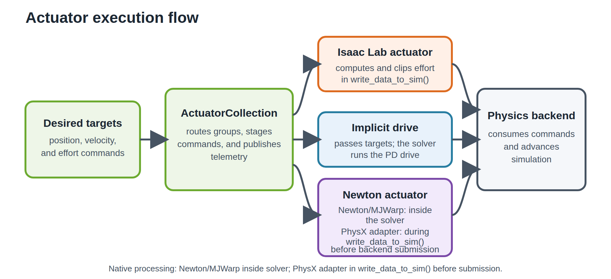
        execute in the solver, and native models execute in the Newton/MJWarp solver or in the
        shared PhysX/OVPhysX host adapter before submission.

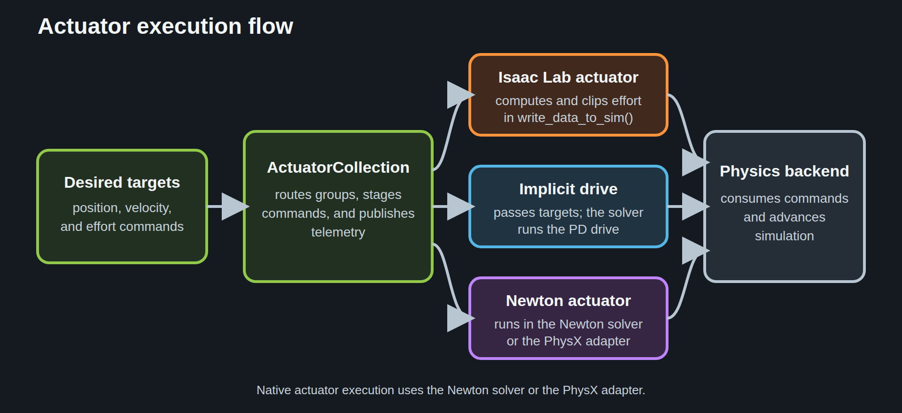
        execute in the solver, and native models execute in the Newton/MJWarp solver or in the
        shared PhysX/OVPhysX host adapter before submission.

Implicit and explicit groups store gains differently:

* For an **implicit** group, :attr:`~isaaclab.actuators.ActuatorBaseCfg.stiffness` and
  :attr:`~isaaclab.actuators.ActuatorBaseCfg.damping` are written to the solver, which
  runs the PD law. ``compute()`` passes the desired targets through unchanged while recording an
  approximate torque for telemetry.
* For an **explicit** group, the same gains are consumed by the model to compute a torque, and the
  solver's own PD gains for those joints are set to zero. Reading ``data.joint_stiffness`` or
  ``data.joint_damping`` on an explicit joint therefore returns **zero** -- the gains live in the
  actuator model, not the solver.

Gains configured for an actuator group are separate from
:attr:`~isaaclab.assets.ArticulationData.joint_stiffness` and
:attr:`~isaaclab.assets.ArticulationData.joint_damping`. Those data fields report solver drive
gains. They match implicit gains after initialization and are zero for explicit actuator joints.
They do not mirror actuator-model gains.

.. _actuators-joint-property-ownership:

Joint and actuator property ownership
--------------------------------------

An actuator configuration selects joints and can override their properties during construction.
Isaac Lab resolves ``joint_effort_limit``, ``joint_velocity_limit``, armature, friction, and
implicit drive gains when it builds the articulation.
:class:`~isaaclab.assets.ArticulationData` holds the live values, including
``joint_effort_limits``, ``joint_vel_limits``, ``joint_armature``, and supported friction
properties. Use articulation data and joint writers to read or change them.
:class:`~isaaclab.actuators.ActuatorCollection` has no joint-property API.

The runtime group properties ``effort_limit_sim``, ``velocity_limit_sim``, ``armature``,
``friction``, ``dynamic_friction``, and ``viscous_friction`` were removed. Read their live values
from articulation data and use the corresponding joint writers. The deprecated
``effort_limit_sim`` and ``velocity_limit_sim`` configuration aliases remain available through 3.x.
See :ref:`actuators-solver-limit-migration` for replacement data views and writers.

Explicit actuators store model state such as ``actuator_effort_limit``, rated ``actuator_velocity_limit``, gains,
delay, and motor curves. They do not store separate solver-limit or friction values. Because the
backend runs their drives, implicit actuators read stiffness, damping, and effort projection from
live articulation properties; assigning to these properties is ignored with a warning — use the
articulation joint writers or the ``randomize_actuator_gains`` event instead.

Newton-executed groups have no Isaac Lab model at all: the collection mapping entry is the owning
Newton ``Actuator`` object, whose controller keeps its parameters separate from solver gains.
Read or modify its components (``controller``, ``delay``, ``clamping``) directly for raw access,
or use :func:`~isaaclab.actuators.newton.read_group_parameter` and
:func:`~isaaclab.actuators.newton.write_group_parameter` for group-scoped access in
public joint order with environment selection.

``actuator_effort_limit`` and ``actuator_velocity_limit`` apply to the actuator model.
``joint_effort_limit`` and ``joint_velocity_limit`` apply to the joint or solver and can have
different values. Explicit models clip output to ``actuator_effort_limit``;
``joint_effort_limit`` limits the solver.
``actuator_velocity_limit`` is the model's rated joint-side speed, or a soft-limit snapshot for
implicit actuators. ``joint_velocity_limit`` requests a solver constraint. Because backends
enforce it differently, solver velocity limits are not portable clamps. ``effort_limit`` and
``velocity_limit`` are deprecated configuration and runtime group aliases. ``velocity_limit``
resolves to ``actuator_velocity_limit``; ``effort_limit`` resolves to ``actuator_effort_limit``.
An implicit group may configure ``actuator_effort_limit`` separately from ``joint_effort_limit``
to keep a rated model-facing limit distinct from the solver clamp; when unset, it tracks the
live solver limit.

Choosing a model
-----------------

All models use :class:`~isaaclab.actuators.ActuatorBaseCfg`. PD models differ in clipping and
state. Neural models replace the analytical PD law with a learned torque predictor. Choose the
simplest model that meets your requirements.

.. list-table::
    :header-rows: 1
    :widths: 22 34 24 20

    * - Model (config)
      - Torque / clipping
      - Where limits clip
      - Extra config fields
    * - :class:`~isaaclab.actuators.ImplicitActuator`
        (:class:`~isaaclab.actuators.ImplicitActuatorCfg`)
      - Solver runs the PD law from the written gains.
      - ``joint_effort_limit`` clips in the solver.
      - --
    * - :class:`~isaaclab.actuators.IdealPDActuator`
        (:class:`~isaaclab.actuators.IdealPDActuatorCfg`)
      - :math:`\tau = k_p (q_{des}-q) + k_d(\dot{q}_{des}-\dot{q}) + \tau_{ff}`
      - Model clips directly to :math:`\pm\,\tau_{max}` (``actuator_effort_limit``).
      - --
    * - :class:`~isaaclab.actuators.DCMotor`
        (:class:`~isaaclab.actuators.DCMotorCfg`)
      - Same PD torque, clipped to a four-quadrant torque-speed envelope.
      - Model clips against a velocity-dependent limit.
      - ``saturation_effort``, ``actuator_velocity_limit``
    * - :class:`~isaaclab.actuators.DelayedPDActuator`
        (:class:`~isaaclab.actuators.DelayedPDActuatorCfg`)
      - Ideal PD applied to commands delayed by a circular buffer.
      - Same as ideal PD (``actuator_effort_limit``).
      - ``min_delay``, ``max_delay``
    * - :class:`~isaaclab.actuators.RemotizedPDActuator`
        (:class:`~isaaclab.actuators.RemotizedPDActuatorCfg`)
      - Delayed PD with an angle-dependent torque ceiling.
      - Torque clipped by a joint-angle lookup table.
      - ``joint_parameter_lookup``
    * - :class:`~isaaclab.actuators.ActuatorNetMLP` /
        :class:`~isaaclab.actuators.ActuatorNetLSTM`
      - A trained network predicts the torque from the joint history.
      - Network output clipped by the DC-motor envelope.
      - ``network_file`` (+ input scaling)

**ImplicitActuator.** The default model. The solver applies the gains and limits. Isaac Lab
estimates effort telemetry from the current state when the backend does not expose it.

**IdealPDActuator.** An explicit PD controller with feed-forward effort and a symmetric model-side
torque limit at :math:`\pm\,\tau_{max}`.

**DCMotor.** Adds a linear four-quadrant torque-speed curve. ``saturation_effort`` is the stall
torque, and ``actuator_velocity_limit`` is the no-load speed.

**DelayedPDActuator.** An ideal PD controller with delayed position, velocity, and effort commands.
The delay is sampled uniformly from ``[min_delay, max_delay]`` at reset.

**RemotizedPDActuator.** A delayed PD controller with an angle-dependent torque limit. The
``joint_parameter_lookup`` table stores joint angle, transmission ratio, and maximum torque. Use it
for linkages whose effective lever arm changes through their range of motion.

**ActuatorNetMLP / ActuatorNetLSTM.** Learned torque models that use joint-position error and
velocity history and clip output with the DC-motor envelope. They require a TorchScript checkpoint.
See the :mod:`isaaclab.actuators` API reference for configuration details.

.. _actuators-parameter-reference:

Parameter reference
-------------------

Each subsection compares five actuators while varying one parameter. All clips use a single-joint
pendulum stepped at :math:`dt = 1/360\text{ s}`, with commands issued at 60 Hz. The stiffness,
damping, and armature sweeps use the *implicit* path.

.. important::

    **Explicit groups keep the solver effort limit.** The solver retains the authored
    :attr:`~isaaclab.actuators.ActuatorBaseCfg.joint_effort_limit` for explicit groups, so effort
    submitted by an explicit model is clipped a second time by the solver. Configure
    ``joint_effort_limit`` at least as large as ``actuator_effort_limit`` when the model should be
    the only clip. See :ref:`actuators-joint-property-ownership` for model-limit, joint-limit, and
    implicit-alias semantics.

Stiffness
^^^^^^^^^

Stiffness (:math:`k_p`, the proportional gain) controls how strongly the joint moves toward its
position target. Higher stiffness improves tracking but can increase overshoot and oscillation.
Too little stiffness leaves steady-state error under load. Tune stiffness together with damping.
Units are [N·m/rad] for revolute joints and [N/m] for prismatic joints.

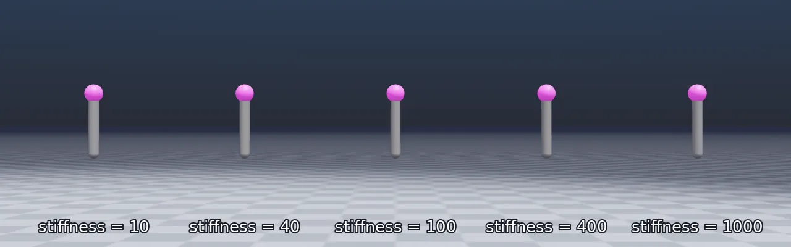

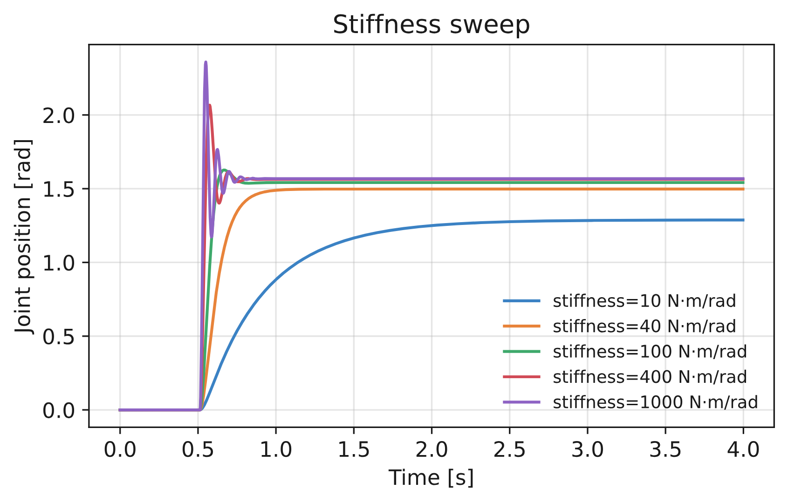

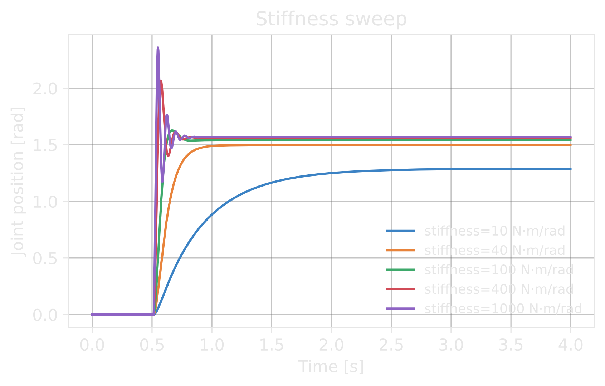

Damping
^^^^^^^

Damping (:math:`k_d`, the derivative gain) resists joint velocity. Too little damping allows a
stiff joint to oscillate. More damping reduces overshoot until the joint becomes critically damped;
beyond that point, the response becomes sluggish. Damping also sets the tracking gain for velocity
targets. Units are [N·m·s/rad] for revolute joints and [N·s/m] for prismatic joints.

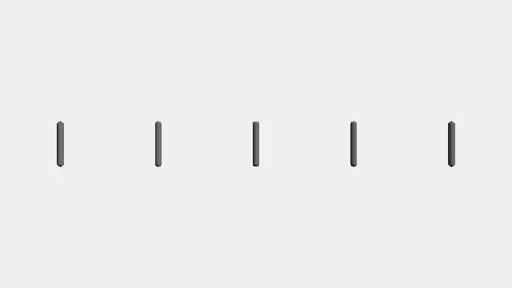

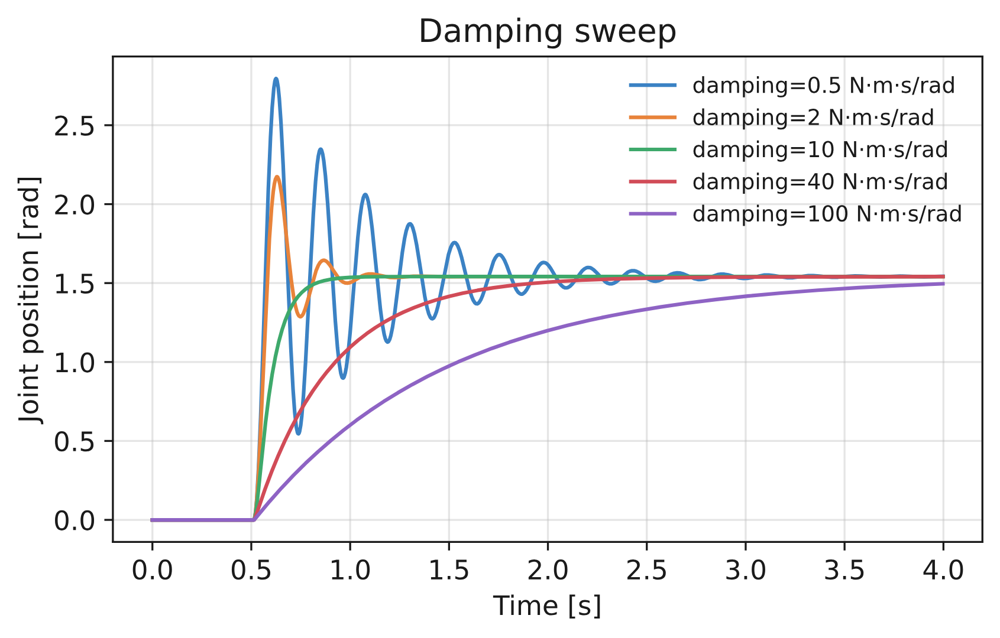

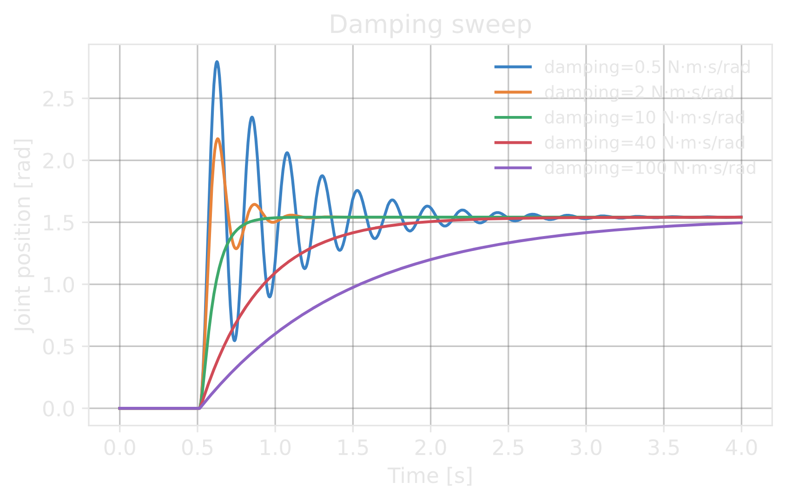

Armature
^^^^^^^^

Armature [kg or kg·m², depending on joint type] represents the reflected inertia of the motor and
gearbox. It is added to the joint-space inertia, so it changes the physical model. In this
single-joint comparison, more armature slows the response and increases the stability margin for
the selected gains. It can also improve numerical conditioning for low-inertia joints.

Explicit and implicit actuators may require different stability settings because explicit models
submit effort while implicit models use solver drives. If an explicit simulation diverges, check
mass and inertia, target scaling and update rate, effort limits, gains, time step, and solver
convergence. Choose armature from the motor and transmission model. See the `OmniPhysics articulation stability guide
<https://docs.omniverse.nvidia.com/kit/docs/omni_physics/latest/dev_guide/guides/articulation_stability_guide.html>`_
for more information.

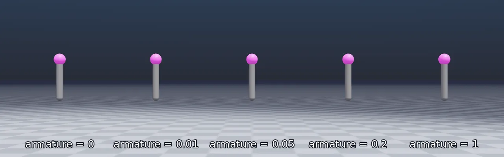

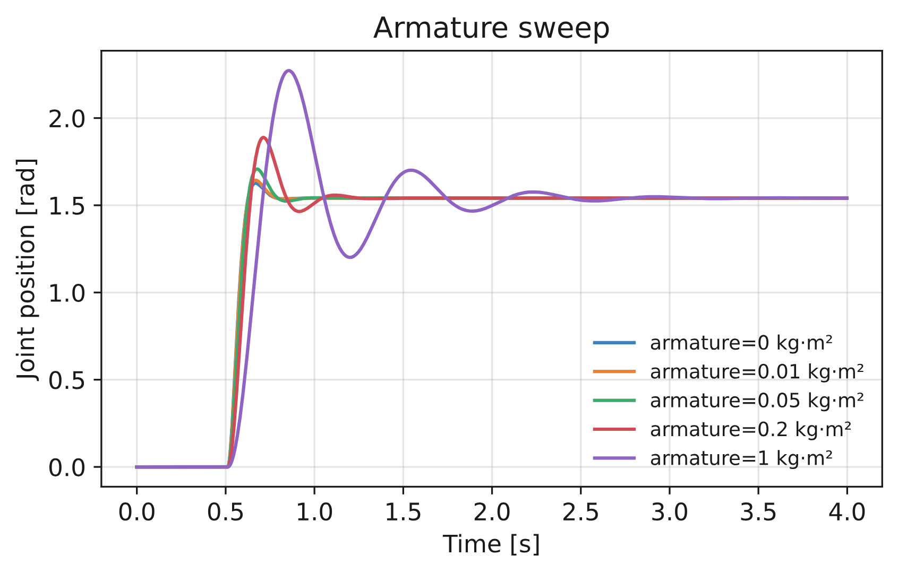

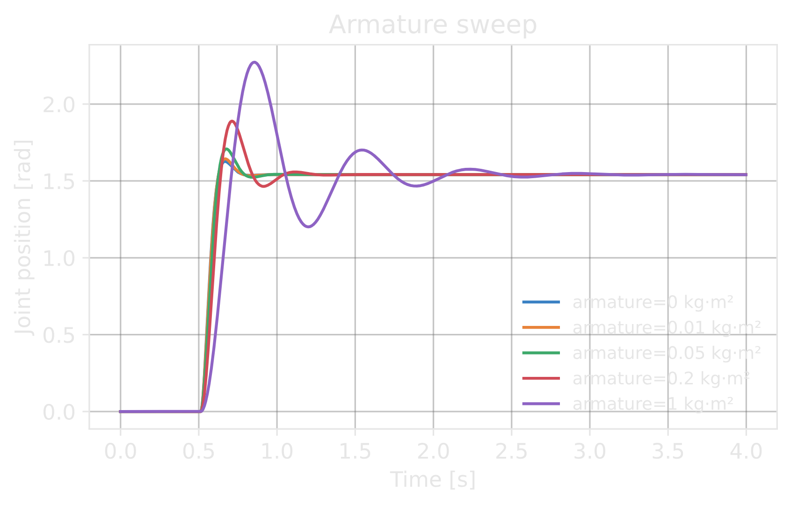

Friction
^^^^^^^^

Joint friction acts independently of the PD command. On a freely spinning joint, higher friction
removes velocity faster. Isaac Lab supports static
(:attr:`~isaaclab.actuators.ActuatorBaseCfg.friction`), dynamic
(:attr:`~isaaclab.actuators.ActuatorBaseCfg.dynamic_friction`), and viscous
(:attr:`~isaaclab.actuators.ActuatorBaseCfg.viscous_friction`) friction. Use it to model gearbox
stiction and drag, not to stabilize a controller.

.. note::

    Friction conventions depend on the backend. PhysX uses dimensionless static and dynamic
    coefficients in Isaac Sim 4.5, and effort values [N or N·m, depending on joint type] in 5.0
    and later. OVPhysX uses dimensionless static and dynamic coefficients. Newton uses a dry-friction
    effort and has no separate dynamic-friction value. All three use viscous damping
    [N·s/m or N·m·s/rad, depending on joint type].

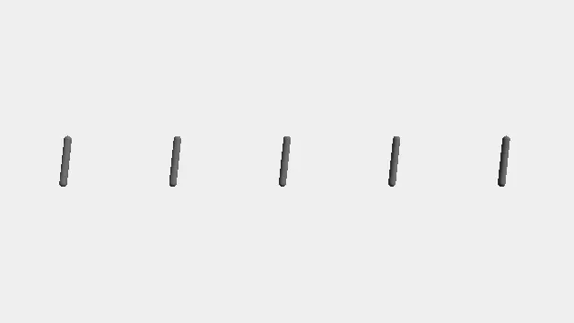

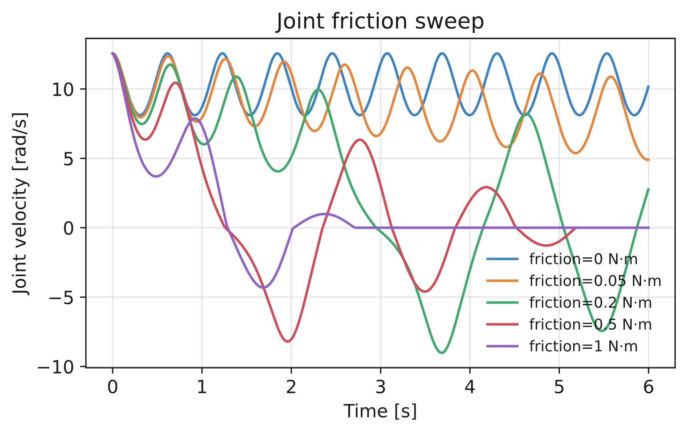

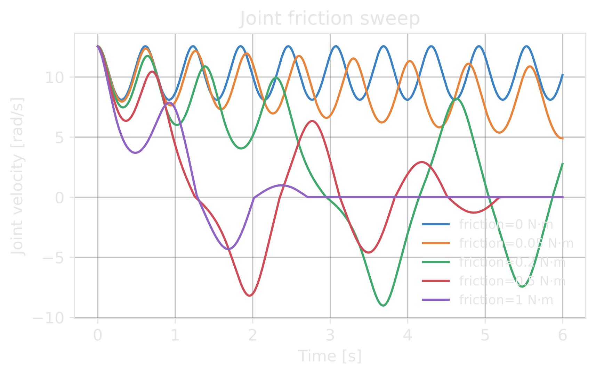

Effort limit
^^^^^^^^^^^^

The effort limit is the torque ceiling the motor can produce [N·m or N]. The clip below drives an
:class:`~isaaclab.actuators.IdealPDActuator` swing-up from hanging to horizontal against a
~2.94 N·m gravity-hold torque, with the model's ``actuator_effort_limit`` swept over
:math:`[1, 2, 3, 4, 6]` N·m.

The limit shapes the transient response, while gravity determines the steady state. Limits above
the approximately 2.94 N·m hold torque reach the horizontal target. Lower limits leave the joint
below it, where gravity torque (:math:`\approx 2.94 \sin\theta`) matches the limit. When the PD
demand exceeds the limit, the applied torque and damping term are both clipped. The joint can
therefore oscillate until the demand returns within the limit. An effort limit below the load's
static demand prevents the controller from damping the joint effectively.

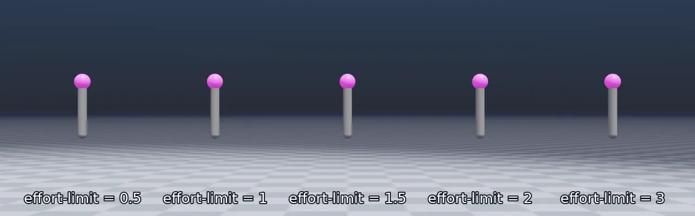

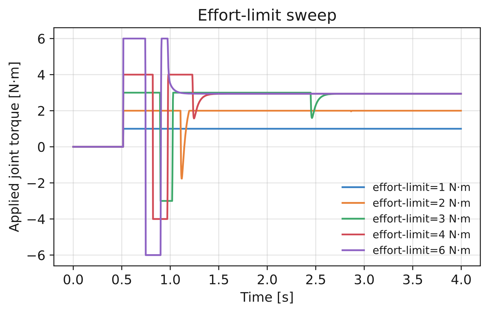

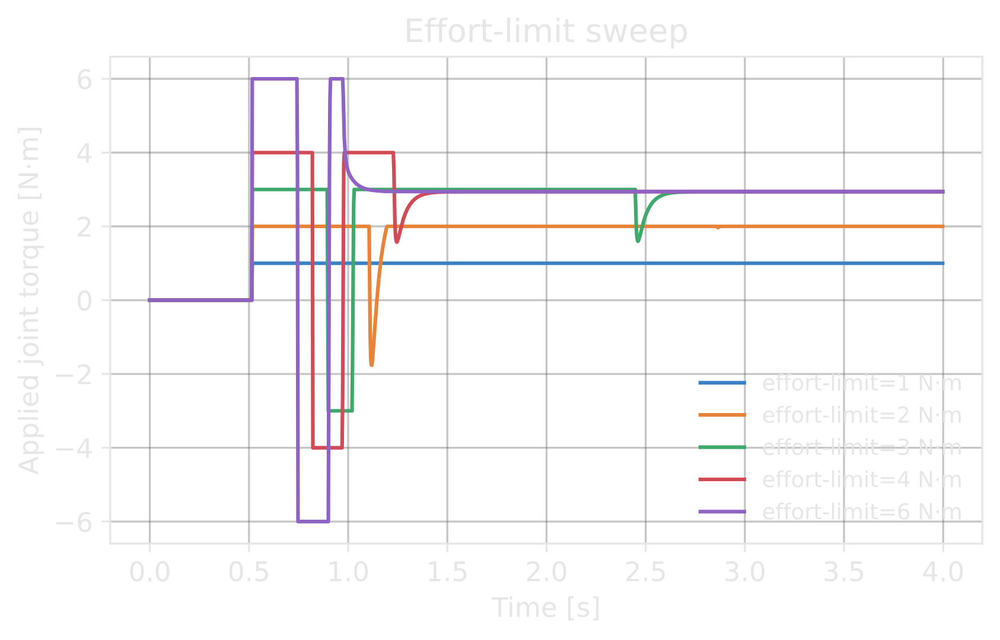

Velocity limit
^^^^^^^^^^^^^^

For a :class:`~isaaclab.actuators.DCMotor`, ``actuator_velocity_limit`` is the no-load speed [rad/s or m/s].
Torque decreases as the joint approaches this speed, forming the four-quadrant torque-speed
envelope. Lower limits reduce the usable speed range and cause earlier clipping. For an implicit
group, the value is exposed through the soft velocity-limit view. ``joint_velocity_limit`` instead
requests a solver constraint. Enforcement depends on the backend; see
:ref:`newton-velocity-limits`.

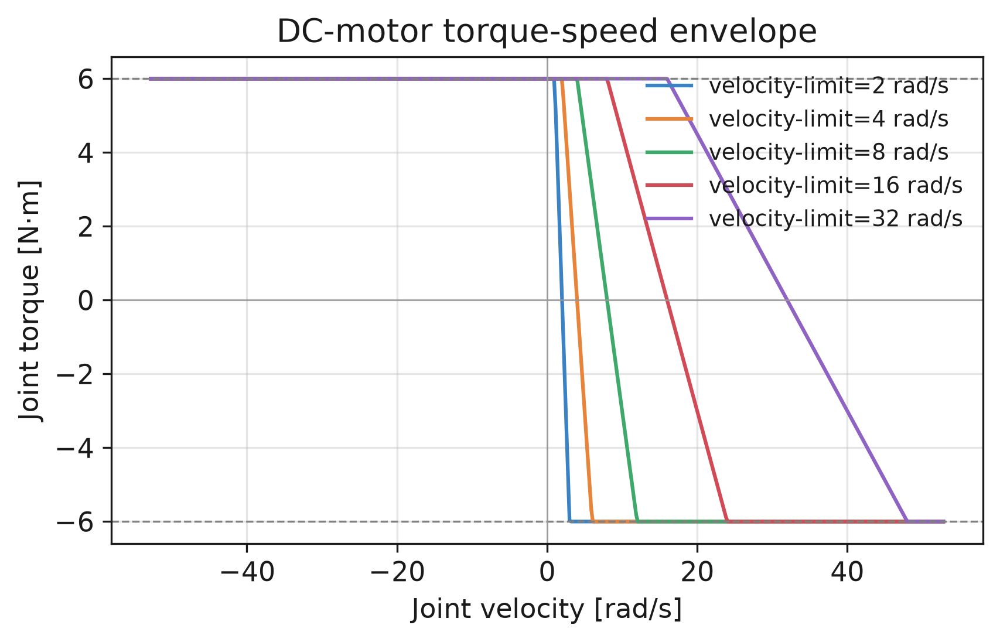

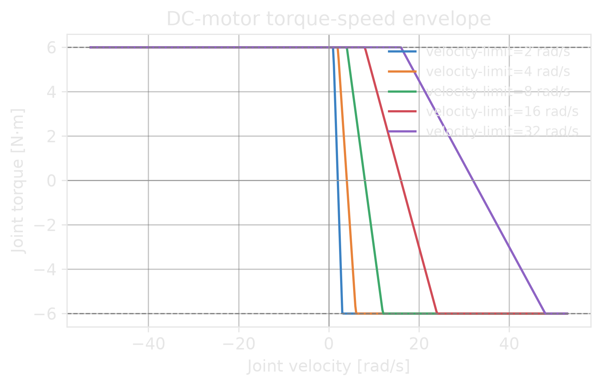

Command delay
^^^^^^^^^^^^^

A :class:`~isaaclab.actuators.DelayedPDActuator` delays every command by a fixed number of physics
steps sampled from ``[min_delay, max_delay]`` at reset. The clip compares delays of
:math:`[0, 6, 12, 24, 48]` steps (0--133 ms at :math:`dt = 1/360\text{ s}`) for a square-wave
position command. Longer delays make the pendulum trail the reference. Randomizing delay between
resets can model transport delay during sim-to-real training.

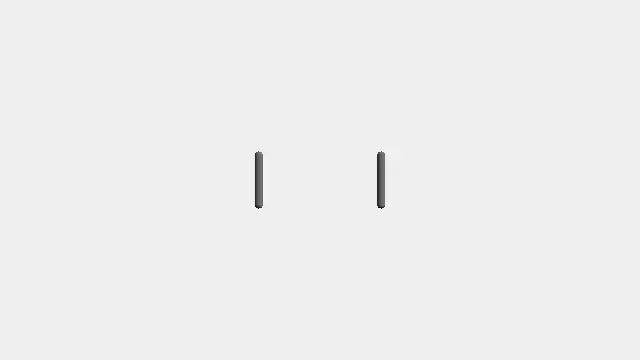

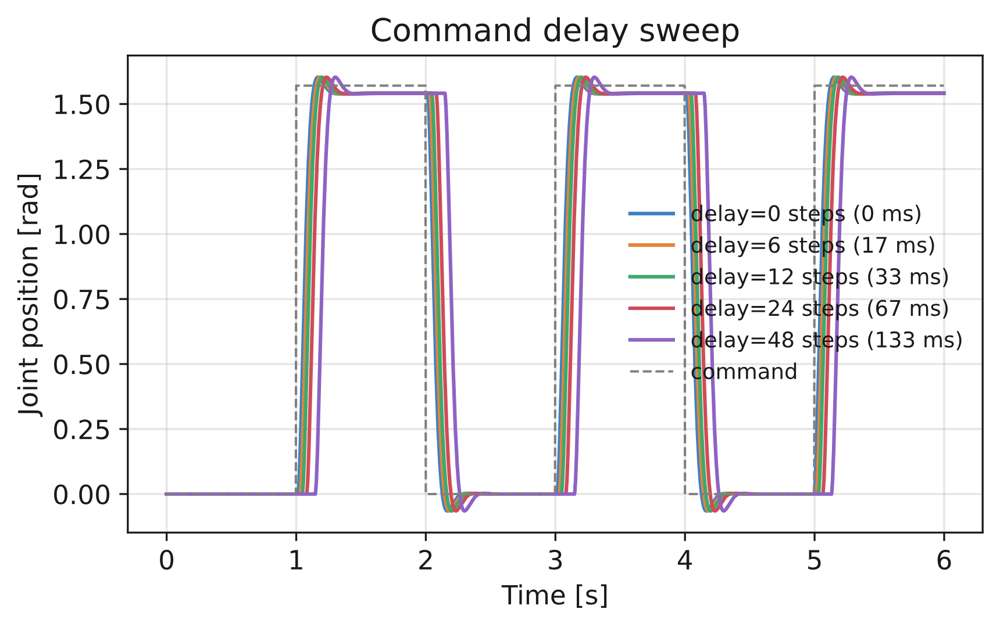

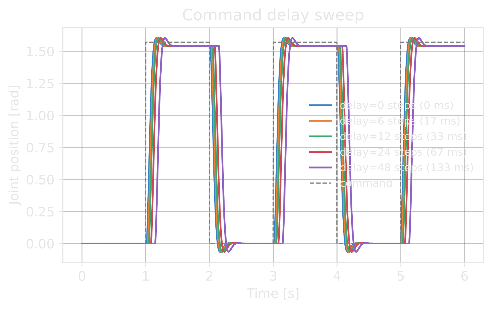

Implicit vs. explicit
^^^^^^^^^^^^^^^^^^^^^

In this single-joint demo at :math:`dt = 1/360\text{ s}`, implicit and ideal-PD explicit actuators
with identical gains produce nearly the same response. Outside this example, their response and
stability can differ. The solver applies the implicit drive, whereas the explicit model evaluates
PD once per step. Policies trained with implicit actuators may therefore need adjustment for
explicit actuators. For explicit joints, ``data.joint_stiffness`` and ``data.joint_damping`` are
zero because the gains belong to the actuator model.

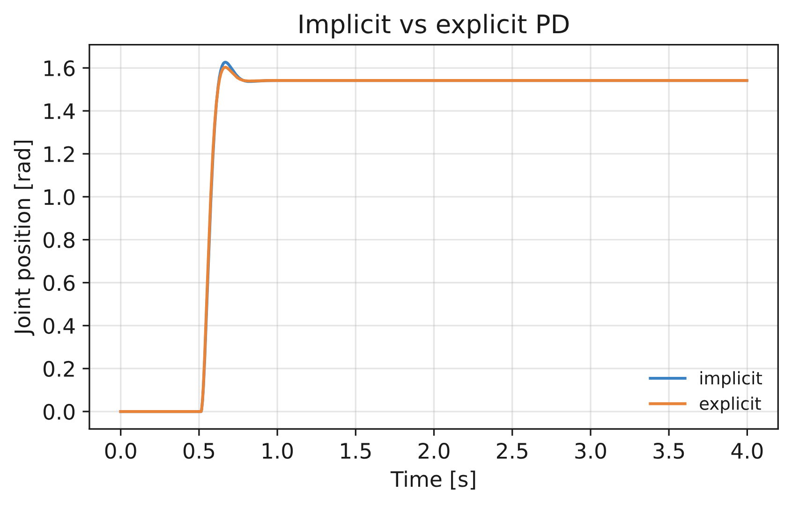

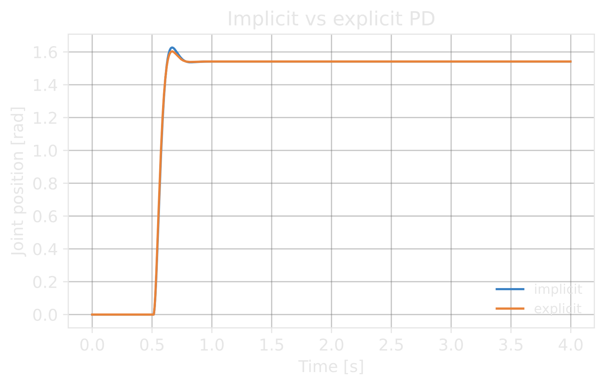

.. _actuators-runtime-api:

Runtime API: ``articulation.actuators``
---------------------------------------

Group access
^^^^^^^^^^^^

:attr:`~isaaclab.assets.Articulation.actuators` is an
:class:`~isaaclab.actuators.ActuatorCollection`, a read-only ``Mapping`` from group name to
whoever owns the group. Isaac Lab-executed groups map to their
:class:`~isaaclab.actuators.ActuatorBase` model instances. Newton-executed groups map to the
Newton ``Actuator`` objects that drive their joints — no Isaac Lab model exists for them, so
their controller parameters are read and modified on the owning object (see
:ref:`actuators-native`). Membership is fixed after construction, so you can look up and iterate
groups but not add, replace, or delete them:

.. code-block:: python

    legs = robot.actuators["legs"]          # the group's owner: an ActuatorBase, or a
                                            # Newton Actuator under use_newton_actuators=True
    for name, actuator in robot.actuators.items():
        print(name, type(actuator).__name__)

Configure topology before creating the articulation:

.. code-block:: python

    robot_cfg.actuators["gripper"] = ImplicitActuatorCfg(...)
    robot = Articulation(robot_cfg)

At runtime, both ``robot.actuators["gripper"] = ...`` and
``del robot.actuators["gripper"]`` raise :class:`TypeError`. Group membership and joint coverage
are fixed when the articulation is created.

Logical groups and execution batches
~~~~~~~~~~~~~~~~~~~~~~~~~~~~~~~~~~~~

Named groups such as ``hips`` and ``knees`` remain distinct when you configure or access them.
A single internal executor computes all plain implicit groups in one fused kernel launch without
changing the tensors returned by ``robot.actuators["hips"]``. Each joint may belong to only one
group; overlapping selections raise :class:`ValueError`. Explicit, stateful, neural, and
subclassed groups execute one group at a time on the Isaac Lab path, and Newton-executed groups
run inside the solver or host adapter. Fused execution is an internal optimization.

Commands, telemetry, and lifecycle
^^^^^^^^^^^^^^^^^^^^^^^^^^^^^^^^^^

**Setting actuator commands.** The mutable ``target_command`` view contains the desired position,
velocity, and effort. Use index setters with environment or joint index lists and tensors. Use mask
setters when you already have boolean Warp masks. All setters are keyword-only:

.. code-block:: python

    import torch

    ids = torch.tensor([0, 1], device=robot.device)          # first two joints
    env_ids = torch.arange(robot.num_instances, device=robot.device)
    sub = torch.zeros((env_ids.numel(), ids.numel()), device=robot.device)
    robot.actuators.target_command.set_position_index(value=sub, joint_ids=ids, env_ids=env_ids)

``env_ids`` and ``joint_ids`` must not contain duplicates. Duplicate indices write to the same
destination concurrently, so the result is undefined. Remove duplicates or use a boolean mask,
which selects each destination at most once.

By default, ``value`` has shape ``(len(env_ids), len(joint_ids))``. Pass ``full_data=True`` when
``value`` already has shape ``(num_instances, num_joints)``. The setter then reads the selected
values directly from the full buffer.

**Reading commands and telemetry.** ``target_command`` contains the desired values staged for
actuator processing. For Isaac Lab-managed models, ``output_command`` contains the processed joint
commands.
Native paths bypass this view, so it does not show submitted commands. Newton processes commands in
the solver, while PhysX and OVPhysX process them through the shared host adapter during
``write_data_to_sim()``. Access the arrays through ``.torch`` or ``.warp``:

.. code-block:: python

    desired_position = robot.actuators.target_command.position.torch
    processed_effort = robot.actuators.output_command.effort.torch  # Isaac Lab-managed path
    applied = robot.actuators.applied_effort.torch      # after clipping [N·m or N]
    computed = robot.actuators.computed_effort.torch   # before clipping [N·m or N]

:attr:`~isaaclab.actuators.ActuatorCollection.computed_effort` is the model output before clipping.
:attr:`~isaaclab.actuators.ActuatorCollection.applied_effort` is the value after clipping. For
implicit actuators, these are approximate efforts recorded for rewards and telemetry.

**Randomizing gains.** Gain updates depend on the actuator implementation. Managed environments
should use the ``randomize_actuator_gains`` event. It updates actuator-owned gains, implicit solver
drives, or native-controller parameters as appropriate. There is no generic collection-level
stiffness or damping writer.

**Lifecycle.** Do not call ``compute()`` or ``submit_commands()`` directly. The articulation resets
actuators during environment resets. It runs actuator compute, staging, and submission from
:meth:`~isaaclab.assets.Articulation.write_data_to_sim`. Call this method before advancing the
simulation, or let the scene or environment loop call it. The effort telemetry reflects its most
recent call. Newton-native processing continues inside the solver; host-adapter processing finishes
during the call.

.. _actuators-migrating-setters:

.. rubric:: Migrating from the deprecated setters

Joint commands were previously set on the articulation. Those methods now forward to the collection
and emit a :class:`DeprecationWarning`:

.. code-block:: python

    # Before (deprecated)
    robot.set_joint_position_target(target, joint_ids=ids)

    # After
    robot.actuators.target_command.set_position_index(value=target, joint_ids=ids)

LEAPP-exported action terms must keep using the annotated articulation ``*_index`` or ``*_mask``
setters until the exporter supports collection setters. Other runtime code should migrate to the
collection API.

The data accessors also moved: ``articulation.data.joint_pos_target`` becomes
``robot.actuators.target_command.position``, and ``data.computed_torque`` / ``data.applied_torque`` become
``robot.actuators.computed_effort`` / ``robot.actuators.applied_effort``. See the
:doc:`Isaac Lab 3.0 migration guide <../migration/migrating_to_isaaclab_3-0>` for the full table.

Value resolution: USD vs. ActuatorCfg
-------------------------------------

Gains and limits can come from the USD joint-drive prim or the actuator config. If a config field is
``None``, Isaac Lab uses the USD value. A value set in the config overrides the USD value. The robot
schema supplies joint and body ordering, not actuator parameters.

Set :attr:`~isaaclab.assets.ArticulationCfg.actuator_value_resolution_debug_print` to ``True`` to
log the USD, configuration, and applied values for every joint when the sources differ or the
configuration leaves a value unspecified. Unspecified values appear as ``Not Specified``. See
:ref:`how-to-write-articulation-config` for examples and the limit table.

.. _actuators-native:

Native actuators
----------------

By default, Isaac Lab runs explicit actuator models once per step outside the solver, usually on
Torch or Warp. This path is deprecated. Set
:attr:`~isaaclab.sim.SimulationCfg.use_newton_actuators` to ``True`` to use the native path for
supported explicit models:

.. code-block:: python

    from isaaclab.sim import SimulationCfg

    sim_cfg = SimulationCfg(use_newton_actuators=True)

With the flag enabled, each supported explicit actuator config becomes a ``NewtonActuator`` USD
prim. Newton executes it in the solver. PhysX and OVPhysX execute the same model through the shared
host adapter during :meth:`~isaaclab.assets.Articulation.write_data_to_sim`.

On Newton, native actuators run in the CUDA-graph-captured region. Implicit actuators are unchanged:
the solver still applies their PD gains. On CUDA, the host adapter captures actuator staging, model
execution, and telemetry publication when possible; otherwise it uses eager execution. Stateful
native actuators cannot run in a caller-owned CUDA graph, so the host adapter manages them.

Newton executes native actuators in its controller, and the collection exposes that ownership
directly: ``robot.actuators[name]`` returns the Newton ``Actuator`` object driving the group's
joints instead of an Isaac Lab model. Newton merges structurally identical joints into one
actuator, so several groups can share an object (a group spanning several returns them as a
tuple). Raw component access reads and writes the controller storage in Newton's layout; for
group-scoped access in public joint order, use
:func:`~isaaclab.actuators.newton.read_group_parameter` and
:func:`~isaaclab.actuators.newton.write_group_parameter`:

.. code-block:: python

    # raw ownership: the Newton actuator object itself
    legs = robot.actuators["legs"]
    print(type(legs.controller).__name__)

    # group-scoped, user-ordered parameter access
    from isaaclab.actuators.newton import read_group_parameter, write_group_parameter

    kp = read_group_parameter(robot.actuators, "legs", "controller", "kp")
    write_group_parameter(robot.actuators, "legs", "controller", "kp", values=kp * 2.0)

Isaac Lab retains named groups for configuration, joint bookkeeping, and command and telemetry
staging.

**Supported models.** Each supported config maps to USD schemas:

.. list-table::
    :header-rows: 1
    :widths: 45 55

    * - Config
      - USD schemas
    * - :class:`~isaaclab.actuators.IdealPDActuatorCfg`
      - ``NewtonPDControlAPI`` + ``NewtonMaxEffortClampingAPI``
    * - :class:`~isaaclab.actuators.DCMotorCfg`
      - ``NewtonPDControlAPI`` + ``NewtonDCMotorClampingAPI``
    * - :class:`~isaaclab.actuators.DelayedPDActuatorCfg`
      - ideal PD + ``NewtonActuatorDelayAPI``
    * - :class:`~isaaclab.actuators.RemotizedPDActuatorCfg`
      - delayed PD + ``NewtonPositionBasedClampingAPI``
    * - :class:`~isaaclab.actuators.ActuatorNetMLPCfg` /
        :class:`~isaaclab.actuators.ActuatorNetLSTMCfg`
      - ``NewtonNeuralControlAPI`` (+ ``NewtonDCMotorClampingAPI``)

**Existing USD actuators.** For joints covered by an explicit Lab actuator config, the config
replaces any existing ``NewtonActuator`` prim. Joints not covered by a Lab config keep their
USD-authored actuators. USD-authored and Lab-configured actuators can therefore coexist on different
joints.

.. warning::

    With ``use_newton_actuators=True``, every explicit actuator config must be supported. An
    unsupported config raises an error before native authoring. Disable ``use_newton_actuators`` to
    use the Isaac Lab execution path, or select a supported config.

.. note::

    Under native execution, delay is fixed. The schema stores only ``max_delay``, so ``min_delay``
    is ignored. A :class:`~isaaclab.actuators.DelayedPDActuator` does not randomize delay between
    resets as it does on the Isaac Lab path.

Backend submission
------------------

Submission differs by backend, but the collection interface is the same:

.. list-table::
    :header-rows: 1
    :widths: 24 76

    * - Backend
      - Submit behavior
    * - PhysX
      - The Isaac Lab-managed path pushes processed position, velocity, and effort staging buffers
        through the PhysX Tensor API. The shared host adapter processes native commands during
        ``write_data_to_sim()`` and submits raw position and velocity targets plus raw effort.
        ``applied_effort`` remains telemetry. A fused reorder gather runs first when a non-identity
        joint ordering is active.
    * - OVPhysX
      - The native path uses the shared host adapter during ``write_data_to_sim()``. It writes raw
        position and velocity targets plus raw effort through ``set_attribute`` tensor bindings.
        ``applied_effort`` remains telemetry. Raw setter writes are mirrored into the binding
        immediately. A fused reorder gather runs first when joint ordering is non-identity.
    * - Newton / MJWarp
      - Newton writes targets to solver-bound control arrays. Effort is feed-forward, and native
        actuators also use ``joint_act``. The built-in drive applies PD to implicit joints.

For explicit actuators, solver stiffness and damping are zero on every backend because the actuator
model owns the gains.

This page does **not** cover:

* Motion generators or low-level control modes -- see
  :doc:`/source/overview/core-concepts/motion_generators`.
* Cross-backend policy transfer and solver-dynamics differences -- see
  :doc:`/source/how-to/transfer_policies_between_physx_and_newton`.

.. seealso::

    * :ref:`how-to-write-articulation-config` -- authoring configs and the full gain/limit value
      resolution walkthrough.
    * :ref:`import-new-asset-ensure-drives-exist` -- making sure joint drives exist on an imported
      asset so actuators can bind.
    * ``Joints actuate in PhysX but not in a Newton-based backend`` in
      :doc:`../refs/troubleshooting` -- the USD drive / backend actuation pitfall.
    * :mod:`isaaclab.actuators` -- the full actuator model and config API reference.
