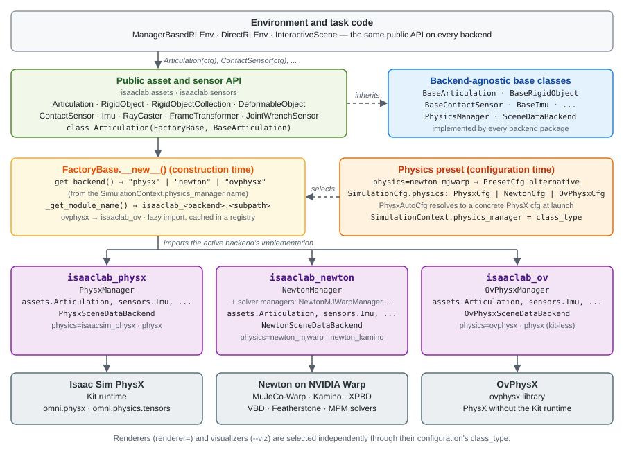
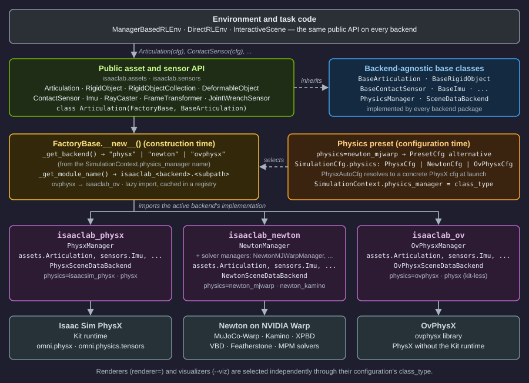

.. Copyright (c) 2026, The Isaac Lab Project Developers (https://github.com/isaac-sim/IsaacLab/blob/main/CONTRIBUTORS.md).
.. All rights reserved.
..
.. SPDX-License-Identifier: BSD-3-Clause

.. _backends-and-presets:

Backends and Presets
====================

.. seealso::

   This page is the source of truth for the ``isaaclab-selecting-backends`` and
   ``isaaclab-using-presets`` agent skills
   (`skills/user/select-backends/ <../../../skills/user/select-backends/SKILL.md>`__,
   `skills/user/use-presets/ <../../../skills/user/use-presets/SKILL.md>`__).
   When you change this page, update those skills so agent guidance stays in sync. See
   :doc:`/source/developer-tools/agent_skills`.

An Isaac Lab environment describes the robot, scene, sensors, and task. A
**backend** supplies the physics or rendering implementation that brings that
description to life. A **preset** is a named, tested configuration choice that
lets you switch implementations or task modes without editing Python.

In practice, the same environment can run with a different physics engine,
renderer, or observation mode by adding a short selector:

.. code-block:: bash

   uv run isaaclab train --rl_library rsl_rl \
      --task Isaac-Cartpole-Direct physics=newton_mjwarp

The task stays ``Isaac-Cartpole-Direct``. The preset changes the configuration
used to launch it.

The mental model
----------------

Think of an environment as the experiment and presets as the knobs that select
tested versions of its larger building blocks:

.. code-block:: text

   Environment
   ├── physics=...    Which physics configuration runs the simulation?
   ├── renderer=...   Which renderer produces camera data?
   └── presets=...    Which task-specific mode or config bundle is used?

After configuration is resolved, Isaac Lab's common asset, sensor, and scene
APIs dispatch to the selected backend implementation. Environment code can use
the same public API across PhysX, Newton, and OvPhysX instead of branching on
the active engine throughout the task.

Physics, rendering, and visualization are separate choices. For example, a
camera environment can use Newton physics with the Newton Warp renderer, while
the visualizer is selected independently with ``--viz``.

.. _backend-architecture:

Backend architecture
--------------------

Factories dispatch an object to the active backend implementation at
construction time, so code can use the same public API without importing
backend-specific modules directly.

          preset to the PhysX, Newton, and OvPhysX backend packages and their engines

          preset to the PhysX, Newton, and OvPhysX backend packages and their engines

Factory dispatch
^^^^^^^^^^^^^^^^

All factories inherit from :class:`~isaaclab.utils.backend_utils.FactoryBase`.
They locate supported backend implementations through a core backend-key
selector followed by package and module-path conventions:

1. The name of ``SimulationContext.physics_manager`` is mapped to one of the
   backend keys recognized by ``FactoryBase._get_backend()``. Adding another
   physics backend requires extending this core selector.
2. The factory module path determines the backend module path. For example,
   ``isaaclab.assets.articulation`` maps to
   ``isaaclab_physx.assets.articulation``,
   ``isaaclab_newton.assets.articulation``, or
   ``isaaclab_ov.assets.articulation``. The OvPhysX backend key uses the shared
   ``isaaclab_ov`` integration package.
3. The factory lazily imports the backend module and caches the implementation
   class in a registry.

.. code-block:: text

    User code: Articulation(cfg)
        │
        ▼
    FactoryBase.__new__()
        │
        ├─ _get_backend()       → "physx", "newton", or "ovphysx"
        │    (reads SimulationContext.physics_manager)
        │
        ├─ _get_module_name()   → "isaaclab_physx.assets.articulation"
        │    (OvPhysX maps to the shared isaaclab_ov package)
        │
        ├─ importlib.import_module()
        │    (lazy load — only on first use)
        │
        └─ Return backend-specific instance

Renderers and visualizers instead select their implementations through their
configuration's ``class_type``. Their selection is independent of physics;
renderer instances are shared through the simulation registry described below.

Physics manager lifecycle
^^^^^^^^^^^^^^^^^^^^^^^^^

Each backend implements :class:`~isaaclab.physics.PhysicsManager`, the abstract
base class that owns its simulation lifecycle. Implementations initialize their
engine from a :class:`~isaaclab.sim.SimulationContext`, update kinematics with
``forward()``, advance simulation with ``step()``, reset state with ``reset()``,
and release resources with ``close()``.

The manager exposes :class:`~isaaclab.physics.PhysicsEvent` callbacks for
cross-backend lifecycle work. ``MODEL_INIT`` occurs during scene construction,
``PHYSICS_READY`` after physics initialization, and ``STOP`` before native resources are replaced
or shut down.
The concrete ``close()`` implementation dispatches the ``STOP`` event.

``SimulationContext`` owns native resources and renderer instances in one registry.
``get_or_create_backend(backend_cfg)``
reuses one resource for equal configurations of the same concrete type; a cache miss
constructs ``instantiate(backend_cfg)``.
:class:`~isaaclab.sim.BackendCfg` describes resource settings and identity, and
:class:`~isaaclab.renderers.RendererCfg` extends it for renderer instances.
``PhysicsCfg`` selects a physics manager. Finalize configurations before
registration and treat them, including nested values, as read-only afterward.
Use a new configuration for different settings. ``close_backend(backend)`` closes
the exact registered object after all consumers have released their bindings;
it does not compare or hash configurations. Resources declared through ``BackendCfg`` must
implement ``close()``. Plain construction cfgs share Python-owned data without a teardown
operation; removing the registry entry releases its reference. A failed close retains
the entry for retry. After physics shutdown invalidates camera
render data, simulation teardown closes material writers, renderer instances, visualizers,
and remaining native resources, in that order, before closing the stage.

Managers and native renderers expose their borrowed resource through ``backend``.
For example, ``NewtonManager.backend.model`` accesses the finalized native model.
Closing a renderer releases its bindings, not the shared native resource.
Exposing native handles does not replace SDP transport.

Clone contexts are registered separately as ``sim.clone_contexts[Context] = Context(...)``
before plan dispatch. They apply the plan but do not own native runtime resources.

Newton has two resources with different lifetimes, not two interchangeable backends:

* ``ModelBuilder`` holds mutable construction data. Cloning populates it and sensors declare
  requirements before finalization. It remains available for hard reset. ``NewtonBuilderCfg``
  is a plain construction cfg, not a ``BackendCfg``; the builder needs no native ``close()``.
* ``NewtonBackend`` owns the finalized model and native buffers. Physics and render consumers
  borrow those handles. Closing it releases runtime allocations without closing the builder.

Both resources use the same registry:

.. code-block:: python

    builder_cfg = NewtonBuilderCfg(physics_cfg=sim.cfg.physics)
    builder = sim.get_or_create_backend(builder_cfg)
    # Clone/import populates this builder before model allocation.
    model_cfg = NewtonBackendCfg(physics_cfg=sim.cfg.physics, device=sim.device)
    backend = sim.get_or_create_backend(model_cfg)

Both configurations use the selected physics cfg; non-Newton physics selects a render-only
representation. ``SimulationContext`` has no backend-specific cfg fields, and consumers do not
access clone contexts. Consumers request body transforms and visual points directly through SDP.
Queries share the native resource's BVHs but keep each consumer's captured work separate.

Portable asset and sensor interfaces
^^^^^^^^^^^^^^^^^^^^^^^^^^^^^^^^^^^^

Assets and sensors use the same layering as the factories:

1. A base class in ``isaaclab`` defines the public contract, such as
   ``BaseArticulation`` or ``BaseContactSensor``.
2. A factory class inherits from both :class:`FactoryBase
   <isaaclab.utils.backend_utils.FactoryBase>` and that base class.
3. Backend packages provide the supported implementations.

Data classes use the same pattern, for example
``ContactSensorData(FactoryBase, BaseContactSensorData)``. Implementations expose
:class:`~isaaclab.utils.warp.ProxyArray` values through public asset and sensor
data properties. Each proxy wraps the underlying ``wp.array`` and provides
explicit ``.warp`` access to that array and cached, zero-copy ``.torch`` access
to a :class:`torch.Tensor` view. Use those accessors when an API specifically
requires one representation. Passing a ``ProxyArray`` to ``wp.to_torch()`` is
supported only by a deprecated compatibility shim; new code should use
``proxy_array.torch``. Backend-native and internal storage may still use raw
Warp arrays. See :doc:`/source/how-to/proxy_array` for usage and buffer lifetime
guidance.

Portable renderer and scene-data interfaces
^^^^^^^^^^^^^^^^^^^^^^^^^^^^^^^^^^^^^^^^^^^

Rendering is selected independently from physics. Acquire implementations of the
:class:`~isaaclab.renderers.BaseRenderer` contract through
``sim.get_or_create_backend(renderer_cfg)``. The
:class:`~isaaclab.renderers.RenderContext` coordinates their rendering lifecycle
through a filtered view of that registry, without a separate renderer cache or
renderer ownership. It validates global settings and registration timing, initializes
renderers after physics is ready, and coordinates stage preparation, scene updates,
and material writers. See
:ref:`overview_renderers` for renderer choices and usage.

Physics managers expose live simulation data through
:class:`~isaaclab.scene_data.SceneDataBackend`. The
:class:`~isaaclab.scene_data.SceneDataProvider` owned by the simulation context
converts and remaps that data for backend-independent consumers:

.. code-block:: text

   physics manager -> SceneDataBackend -> SceneDataProvider -> renderer or visualizer

This boundary lets renderers and visualizers consume a common Warp-native data
path without knowing which physics engine owns the state. See
:doc:`/source/developer-tools/scene_data_providers` for the complete
data-flow model.

Native engine access boundary
^^^^^^^^^^^^^^^^^^^^^^^^^^^^^

The portable interfaces define the stable API boundary. Advanced code can use
each engine's native low-level data API, but those APIs intentionally keep their
own ownership and synchronization semantics. See
:doc:`/source/concepts/native-physics-api/index`
for PhysX typed views, Newton live model/state arrays and generic selections,
and OvPhysX tensor bindings.

Design principles
^^^^^^^^^^^^^^^^^

- **Lazy loading:** Backend modules are imported only when first instantiated,
  keeping startup fast and avoiding dependencies on unused backends.
- **Recognized keys plus convention:** Once the core selector recognizes a
  backend key, module paths mirror the ``isaaclab.X.Y`` structure. OvPhysX
  maps to ``isaaclab_ov.X.Y``; other recognized backends use
  ``isaaclab_<backend>.X.Y`` by default.
- **Independent selection:** Physics backend, renderer, and visualizer are
  selected independently.
- **Explicit data interop:** Public asset and sensor data properties return
  :class:`~isaaclab.utils.warp.ProxyArray`; its ``.warp`` and ``.torch``
  accessors expose the required array representation without copying.
- **Zero runtime overhead:** Selection occurs at instantiation time; it does
  not add dispatch logic to the simulation hot path.

Find what a task supports
-------------------------

Preset support is task-specific. Before choosing a name, ask the task what it
offers:

.. code-block:: bash

   uv run isaaclab train --rl_library rsl_rl \
      --task Isaac-Cartpole-Camera-Direct --help

The help output groups names by ``physics=``, ``renderer=``, and ``presets=``.
To browse all registered environments and their presets at once, run:

.. code-block:: bash

   uv run python scripts/environments/list_envs.py --show_presets

An empty preset list is not an error. It means that the environment uses its
registered default configuration and does not expose alternatives. Passing a
name that a task does not list is unsupported and fails during configuration
validation.

Choose a selector
-----------------

.. list-table::
   :widths: 23 32 45
   :header-rows: 1

   * - Selector
     - Example
     - What it changes
   * - ``physics=NAME``
     - ``physics=newton_mjwarp``
     - Selects a physics configuration, including its backend and solver.
   * - ``renderer=NAME``
     - ``renderer=newton_renderer``
     - Selects a renderer configuration for tasks that produce camera data.
   * - ``presets=NAME[,NAME,...]``
     - ``presets=rgb``
     - Applies task-specific choices such as observation modes, camera layouts,
       or compatible configuration bundles.

These are Hydra tokens, so append them without leading dashes. They work with
training, playback, and environment scripts that use Isaac Lab's task
configuration launcher.

Selectors can be combined. This command chooses Newton with the MuJoCo-Warp
solver, the Newton Warp renderer, and RGB observations:

.. code-block:: bash

   uv run isaaclab train --rl_library rsl_rl \
      --task Isaac-Cartpole-Camera-Direct \
      physics=newton_mjwarp renderer=newton_renderer presets=rgb

Only combine values listed for the task. Some physics, renderer, sensor, and
observation configurations are incompatible, and the task may reject an
invalid combination with a focused error message.

Common backend choices
----------------------

The exact list depends on the environment, but these names follow shared
conventions:

.. list-table:: Physics presets
   :widths: 30 70
   :header-rows: 1

   * - Name
     - Meaning
   * - ``isaacsim_physx``
     - Concrete Isaac Sim PhysX configuration. This is the default for tasks
       whose established default is Isaac Sim PhysX.
   * - ``physx``
     - Automatic PhysX-family selection. Isaac Sim PhysX is used when the
       runtime needs Kit; a configured OvPhysX alternative can be used for
       fully kit-less runs.
   * - ``newton_mjwarp``
     - Newton physics with the MuJoCo-Warp solver.
   * - ``newton_kamino``
     - Newton physics with the Kamino solver. Support is beta and currently
       limited to selected tasks and compatible assets.
   * - ``ovphysx``
     - Concrete OvPhysX configuration for supported kit-less tasks.

.. list-table:: Renderer presets
   :widths: 30 70
   :header-rows: 1

   * - Name
     - Meaning
   * - ``isaacsim_rtx``
     - Concrete Isaac Sim RTX renderer configuration. This is the default for
       tasks that use the multi-backend renderer preset.
   * - ``rtx``
     - Automatic RTX-family selection. Isaac Sim RTX is used when physics,
       visualization, livestreaming, or another runtime choice requires Kit;
       otherwise OVRTX is used for a fully kit-less run.
   * - ``newton_renderer``
     - Newton Warp renderer.
   * - ``ovrtx``
     - Concrete OVRTX renderer configuration for supported kit-less workflows.

Automatic selectors such as ``physics=physx`` and ``renderer=rtx`` are opt-in.
Defaults are concrete so that running a task without selectors is predictable.
A solver is not a separate backend: ``newton_mjwarp`` and ``newton_kamino``
both use Newton but configure different solvers.

Defaults, presets, and fine-tuning
----------------------------------

A preset replaces the complete configuration section at its location; it does
not merge fields from two alternatives. Isaac Lab resolves configuration in
this order:

1. Apply each preset config's ``default`` choice.
2. Apply global choices from ``presets=...``.
3. Apply a preset targeted at a specific path, such as
   ``env.sim.physics=newton_mjwarp``.
4. Apply scalar Hydra overrides, such as ``env.sim.dt=0.002``.

The last step makes it easy to start from a maintained preset and tune one
value:

.. code-block:: bash

   uv run isaaclab train --rl_library rsl_rl \
      --task Isaac-Cartpole-Direct \
      physics=newton_mjwarp env.sim.dt=0.002

Prefer ``physics=`` and ``renderer=`` for backend choices because they state
intent clearly. Use ``presets=`` for task-specific modes or when one name must
update several matching sections together. Use a path selector only when you
intend to replace one particular section.

.. important::

   Keep behavior-changing presets the same when loading a checkpoint. An
   observation preset can change tensor shapes, and a policy trained with one
   observation mode may not load with another.

How task authors expose choices
-------------------------------

Task authors define alternatives with
:class:`~isaaclab_tasks.utils.hydra.PresetCfg` and choose one as the default.
For a multi-backend task, the preset wrapper belongs in
:class:`~isaaclab.sim.SimulationCfg`:

.. code-block:: python

   from isaaclab.physics import PhysxAutoCfg
   from isaaclab.sim import SimulationCfg
   from isaaclab.utils import configclass
   from isaaclab_newton.physics import MJWarpSolverCfg, NewtonCfg
   from isaaclab_ov.physics import OvPhysxCfg
   from isaaclab_physx.physics import PhysxCfg
   from isaaclab_tasks.utils import PresetCfg

   @configclass
   class PhysicsCfg(PresetCfg):
       isaacsim_physx = PhysxCfg()
       ovphysx = OvPhysxCfg()
       physx = PhysxAutoCfg(
           isaacsim_physx=isaacsim_physx,
           ovphysx=ovphysx,
       )
       default = isaacsim_physx
       newton_mjwarp = NewtonCfg(solver_cfg=MJWarpSolverCfg())

   @configclass
   class MyEnvCfg:
       sim: SimulationCfg = SimulationCfg(physics=PhysicsCfg())

Keep backend-specific values inside named configurations whenever possible.
This keeps task logic shared and makes every supported choice visible from the
command line.

When backend selection must also change simulation-wide settings such as the
time step, a physics preset may instead contain complete ``SimulationCfg``
alternatives. The ``physics=`` selector recognizes these bundles from their
``physics`` field and applies the complete matching simulation configuration.

Where to go next
----------------

- :doc:`/source/setup/environments` lists environments and their supported
  presets.
- :doc:`/source/features/hydra` covers scalar overrides, preset authoring,
  conflict handling, and advanced configuration behavior.
- :ref:`physics-backends` compares physics backend runtime requirements,
  maturity, solver families, and intended uses.
- :doc:`/source/concepts/renderers` explains renderer selection and
  implementation details.
