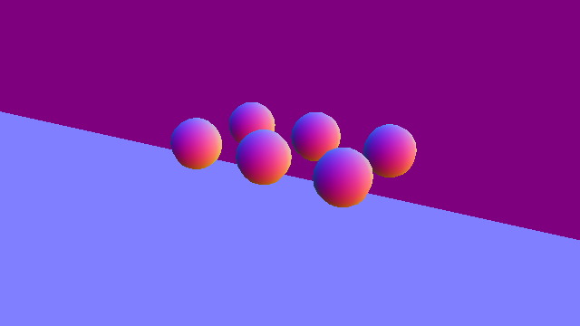

.. _concepts_sensors_camera:
.. _overview_sensors_camera:

.. currentmodule:: isaaclab

Camera
======

A :class:`~sensors.Camera` defines what to capture: camera pose, projection, resolution, sampling
period, and output data types. A renderer defines how those images are produced. Keeping these
responsibilities separate lets one camera configuration work with different physics and rendering
backends.

Camera data is expensive compared with low-dimensional state. Isaac Lab therefore batches the
camera copies from cloned environments into tiled render passes and exposes the de-tiled result as
one device-resident buffer per requested output.

Rendering model
---------------

:attr:`~sensors.CameraCfg.renderer_cfg` selects the renderer. A plain
:class:`~isaaclab.renderers.RendererCfg` requests the runtime default. Use a concrete configuration
when the renderer must be fixed:

.. list-table::
   :header-rows: 1
   :widths: 34 23 43

   * - Renderer configuration
     - Requires Isaac Sim
     - Characteristics
   * - :class:`~isaaclab_physx.renderers.IsaacRtxRendererCfg`
     - Yes
     - Replicator and RTX rendering through Isaac Sim
   * - :class:`~isaaclab_ov.renderers.OVRTXRendererCfg`
     - No
     - Kit-less RTX rendering through ``isaaclab_ov``
   * - :class:`~isaaclab_newton.renderers.NewtonWarpRendererCfg`
     - No
     - Kit-less Warp rasterization through Newton

For an environment that exposes renderer presets, select the renderer at launch instead of editing
the scene configuration:

.. code-block:: bash

   uv run isaaclab train --rl_library rsl_rl \
      --task Isaac-Cartpole-Camera-Direct renderer=newton_renderer

See :doc:`/source/concepts/backends_and_presets` for preset discovery and
:ref:`renderer-visual-comparison` for a same-scene comparison of the renderer outputs.

.. _camera-configuration:

Configure a camera
------------------

A camera can spawn a pinhole or fisheye camera prim, or bind to a camera already on the stage.
``offset`` uses the convention declared on :class:`~sensors.CameraCfg.OffsetCfg`:

* ``world``: forward ``+X``, up ``+Z``.
* ``ros``: forward ``+Z``, up ``-Y``.
* ``opengl``: forward ``-Z``, up ``+Y``.

.. code-block:: python

   import isaaclab.sim as sim_utils
   from isaaclab.sensors import CameraCfg
   from isaaclab_newton.renderers import NewtonWarpRendererCfg

   front_camera = CameraCfg(
       prim_path="{ENV_REGEX_NS}/Robot/base/front_camera",
       update_period=0.05,
       height=240,
       width=320,
       data_types=["rgb", "depth", "normals"],
       spawn=sim_utils.PinholeCameraCfg(
           focal_length=24.0,
           horizontal_aperture=20.955,
           clipping_range=(0.1, 20.0),
       ),
       offset=CameraCfg.OffsetCfg(
           pos=(0.45, 0.0, 0.1),
           rot=(0.0, 0.0, 0.0, 1.0),
           convention="world",
       ),
       renderer_cfg=NewtonWarpRendererCfg(),
   )

A renderer instance is reused only when cameras use equal renderer configurations of the same
concrete configuration type. Different renderer settings create distinct instances. Camera
configurations, including output types and backgrounds, remain per sensor.

Read camera data
----------------

:attr:`~sensors.CameraData.output` maps each requested name to a
:class:`~isaaclab.utils.warp.ProxyArray`. For ``N`` camera views, height ``H``, width ``W``, and
``C`` channels, each output has shape ``(N, H, W, C)``. Use ``torch`` for a cached zero-copy Torch
view or ``warp`` for the underlying Warp array:

.. code-block:: python

   camera_data = scene["front_camera"].data
   rgb = camera_data.output["rgb"].torch
   depth = camera_data.output["depth"].torch
   intrinsics = camera_data.intrinsic_matrices.torch

Camera pose and intrinsic buffers are also ``ProxyArray`` objects. ``pos_w`` has shape ``(N, 3)``,
``intrinsic_matrices`` has shape ``(N, 3, 3)``, and camera quaternions have shape ``(N, 4)`` in
``(x, y, z, w)`` order. Set ``update_latest_camera_pose=True`` only when current pose data is needed;
updating it adds frame-query overhead.

.. _camera-output-types:

Output types
------------

The active renderer validates ``data_types`` and allocates the channel count and data type declared
by its :class:`~isaaclab.renderers.RenderBufferSpec`.

.. list-table:: Common output contracts
   :header-rows: 1
   :widths: 34 22 44

   * - Name
     - Channels and type
     - Meaning
   * - ``rgb`` / ``rgba``
     - 3 / 4, ``uint8``
     - Low-dynamic-range color
   * - ``rgb_hdr``
     - 3, ``float32``
     - Scene-linear high-dynamic-range color
   * - ``albedo``
     - 4, ``uint8``
     - Material base color
   * - ``depth`` / ``distance_to_image_plane``
     - 1, ``float32``
     - Distance [m] along the camera optical axis
   * - ``distance_to_camera``
     - 1, ``float32``
     - Euclidean distance [m] from the optical center
   * - ``normals``
     - 3, ``float32``
     - Local surface normal ``(x, y, z)``
   * - ``motion_vectors``
     - 2, ``float32``
     - Image-space motion; positive ``x`` is left and positive ``y`` is up
   * - ``semantic_segmentation``
     - 4 ``uint8`` or 1 ``int32``
     - Semantic color or ID per pixel
   * - ``instance_segmentation``
     - 4 ``uint8`` or 1 ``int32``
     - Semantically labeled instance color or ID per pixel
   * - ``instance_id_segmentation_fast``
     - 4 ``uint8`` or 1 ``int32``
     - USD-prim instance color or ID per pixel

``depth`` is an alias of ``distance_to_image_plane``. Colorized segmentation uses RGBA ``uint8``;
non-colorized segmentation uses one ``int32`` ID channel. Label and prim-path mappings are stored in
``camera_data.info[output_name]``.

.. figure:: ../../_static/overview/sensors/camera-renderer-isaac-rtx.webp
   :align: center
   :figwidth: 100%
   :alt: RGB camera output

   Isaac RTX RGB output. The animation shows the six material spheres falling onto the table.

   Isaac RTX depth output. Display colors encode optical-axis distance; the sensor returns metric
   values [m].

.. _camera-supported-annotators:

Renderer support
~~~~~~~~~~~~~~~~

The common API does not imply that every renderer produces every output. For same-scene examples
across these backends, see the :ref:`renderer visual comparison <renderer-visual-comparison>`. The
current support matrix is:

.. list-table::
   :header-rows: 1
   :widths: 38 20 20 22

   * - Output
     - Isaac RTX
     - OVRTX
     - Newton Warp
   * - ``rgb``, ``rgba``, ``rgb_hdr``
     - Yes
     - Yes
     - Yes
   * - ``depth`` and both distance outputs
     - Yes
     - Yes
     - Yes
   * - ``normals``
     - Yes
     - Yes
     - Yes
   * - ``albedo``
     - Isaac Sim 6.0+
     - Yes
     - Yes
   * - ``motion_vectors``
     - Yes
     - Yes
     - No
   * - semantic and instance segmentation
     - Yes
     - Yes
     - Yes
   * - ``instance_id_segmentation_fast``
     - Yes
     - No
     - No
   * - ``simple_shading_*`` modes
     - Isaac Sim 6.0+
     - Yes
     - No

Querying an unsupported output fails during camera initialization. Renderer configuration controls
semantic filters, segmentation colorization, and depth clipping where those options are
backend-specific.

   Isaac RTX normals output. Red, green, and blue encode the surface normal X, Y, and Z components.

   Isaac RTX semantic segmentation. One color represents each class: the six spheres share one
   class, while the table and backdrop use separate classes.

   Isaac RTX instance segmentation. Each sphere receives its own color, distinguishing objects
   that share the same semantic class.

Background color
----------------

When :attr:`~sensors.CameraCfg.background_color` is ``None``, each renderer uses its default
background. Set a normalized RGB tuple to use a solid color for pixels that miss all geometry:

.. code-block:: python

   mask_camera = front_camera.replace(background_color=(0.0, 0.0, 0.0))

The setting is per camera. Cameras with renderer-default and solid backgrounds can coexist in one
scene.

Post-render image signal processing
-----------------------------------

:attr:`~sensors.CameraCfg.isp_cfg` optionally applies an image signal processing (ISP) pass to the
renderer's scene-linear HDR output. The shipped implementation is PPISP (Physically Plausible Image
Signal Processing), which applies responsivity, exposure, vignetting, color correction, and a camera
response function before writing ``rgb`` or ``rgba``.

The field accepts:

* ``None`` to disable post-render ISP.
* :class:`~isaaclab_ppisp.PpispCfg` for explicit coefficients or coefficients imported from a USD
  camera.
* :class:`~sensors.CameraISPMode` to discover ``ppisp:*`` attributes on a camera prim.

.. code-block:: python

   from isaaclab.sensors.camera import CameraCfg, CameraISPMode
   from isaaclab_ppisp import PpispCfg

   explicit_isp = front_camera.replace(
       data_types=["rgb"],
       isp_cfg=PpispCfg(inputs={"exposureOffset": 1.5}),
   )

   discovered_isp = front_camera.replace(
       data_types=["rgb"],
       isp_cfg=CameraISPMode.AUTO_CAMERA,
   )

``AUTO_CAMERA`` checks the first matched camera prim. ``AUTO_ANY`` falls back to the first PPISP
camera anywhere on the stage. Discovery happens once during camera construction.

PPISP is composed by Isaac RTX, OVRTX, and Newton Warp. It requires ``rgb`` or ``rgba`` output. A
static configuration is shared by all cloned views in one camera batch; controller weights may
predict per-view exposure and color parameters, while the remaining coefficients stay shared. ISP
configuration and discovered USD attributes are fixed for the camera lifetime.

Run ``scripts/demos/sensors/ppisp_camera.py`` for a complete PPISP workflow:

.. code-block:: bash

   uv run --extra isaacsim python scripts/demos/sensors/ppisp_camera.py \
      --renderer newton_renderer --max_steps 60

Performance and validation
--------------------------

Image memory and rendering cost scale with the number of environments, resolution, channel count,
and requested outputs. Start camera-based tasks with a small environment count, verify shapes and
renderer support, and then scale while monitoring GPU memory. Avoid requesting buffers that the task
does not consume.

Tiled rendering batches the cloned views into shared render passes, but it does not remove the memory
cost of the de-tiled outputs or downstream vision models. The camera follows the shared sensor
``update_period`` contract; choose a period that matches the observation cadence instead of rendering
at every physics step by default.

A runnable camera example is available in ``scripts/demos/sensors/cameras.py``:

.. code-block:: bash

   uv run --extra isaacsim python scripts/demos/sensors/cameras.py

For saving output to disk, see :doc:`/source/how-to/save_camera_output`. For camera-capacity
estimation, see :doc:`/source/how-to/estimate_how_many_cameras_can_run`.
