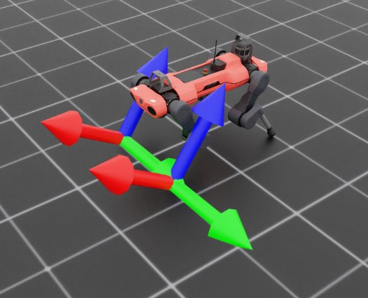

.. _concepts_sensors_frame_transformer:
.. _overview_sensors_frame_transformer:

.. currentmodule:: isaaclab

Frame Transformer
=================

A :class:`~sensors.FrameTransformer` tracks the pose of one or more target frames relative to a
source frame. It provides the same batched interface across cloned environments, avoiding repeated
USD traversal or per-environment transform calculations.

.. figure:: ../../_static/overview/sensors/frame_transformer.jpg
   :align: center
   :figwidth: 100%
   :alt: Source and target frames used by a frame transformer

Define frames
-------------

The sensor's :attr:`~sensors.FrameTransformerCfg.prim_path` selects the source rigid body. Each
:class:`~sensors.FrameTransformerCfg.FrameCfg` selects one or more target rigid bodies and can add a
fixed pose offset. Target paths accept regular expressions; the data order is recorded in
:attr:`~sensors.FrameTransformerData.target_frame_names`.

.. code-block:: python

   from isaaclab.sensors import FrameTransformerCfg

   feet_in_base = FrameTransformerCfg(
       prim_path="{ENV_REGEX_NS}/Robot/base",
       target_frames=[
           FrameTransformerCfg.FrameCfg(
               prim_path="{ENV_REGEX_NS}/Robot/.*_FOOT",
               name="foot",
           ),
       ],
       debug_vis=True,
   )

A target expression is inclusive. If it also matches the source body, the output includes the
identity transform from the source to itself. Use a narrower expression when that entry is not
wanted.

Read transforms
---------------

For ``E`` environments and ``T`` resolved target frames, positions have shape ``(E, T, 3)``,
quaternions have shape ``(E, T, 4)``, and combined poses have shape ``(E, T, 7)``. Quaternions use
``(x, y, z, w)`` order.

.. code-block:: python

   transforms = scene["feet_in_base"].data
   foot_names = transforms.target_frame_names
   foot_pos_b = transforms.target_pos_source.torch
   foot_quat_b = transforms.target_quat_source.torch
   foot_pose_w = transforms.target_pose_w.torch

``target_*_source`` fields express targets in the configured source frame. ``target_*_w`` fields
express the offset target frames in the world frame. The corresponding ``source_*_w`` fields expose
the offset source frame in world coordinates. Positions are in meters; quaternions are unitless.

A complete runnable example is available in
``scripts/demos/sensors/frame_transformer_sensor.py``:

.. code-block:: bash

   uv run --extra isaacsim python scripts/demos/sensors/frame_transformer_sensor.py
