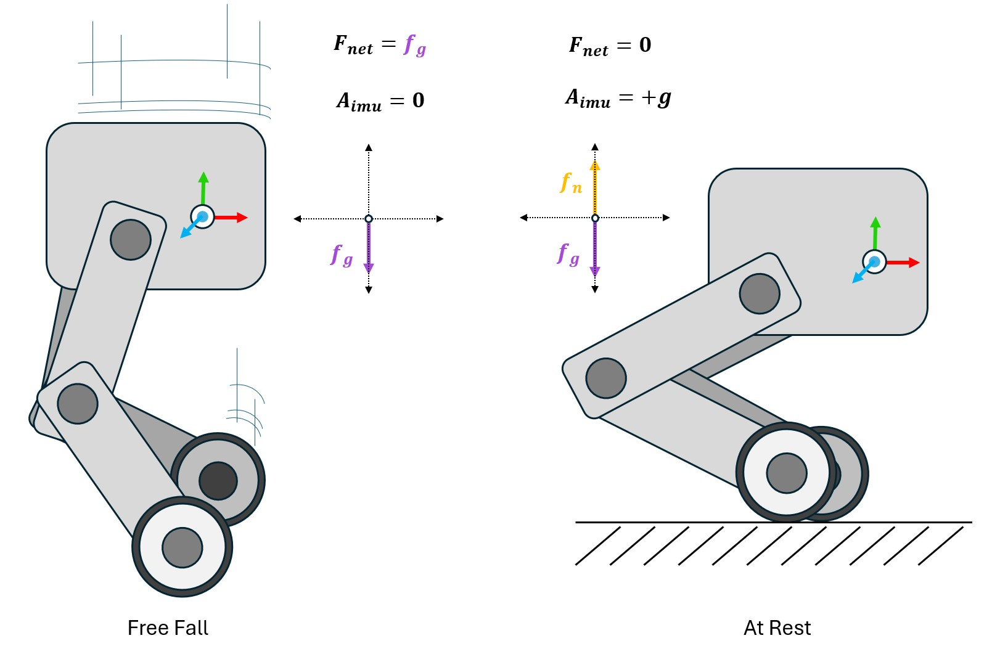
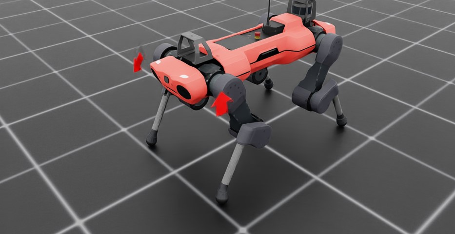

.. _concepts_sensors_imu:
.. _overview_sensors_imu:

.. currentmodule:: isaaclab

Inertial Measurement Unit (IMU)
===============================

A :class:`~sensors.Imu` models the two quantities produced by a conventional inertial measurement
unit:

* :attr:`~sensors.ImuData.ang_vel_b`: angular velocity [rad/s] relative to the world, expressed in
  the IMU frame.
* :attr:`~sensors.ImuData.lin_acc_b`: proper linear acceleration [m/s²], expressed in the IMU frame.

Proper acceleration is what an accelerometer measures. It is zero in free fall and points upward
with magnitude :math:`g` for a stationary sensor supported against gravity. This differs from the
coordinate acceleration reported by the :doc:`pva`.

Configure the sensor
--------------------

Attach the sensor to a rigid body or to a fixed child frame beneath one. ``offset`` places and
orients the measurement frame relative to the parent frame.

.. code-block:: python

   from isaaclab.sensors import ImuCfg

   base_imu = ImuCfg(
       prim_path="{ENV_REGEX_NS}/Robot/base/imu",
       update_period=0.0,
       offset=ImuCfg.OffsetCfg(
           pos=(0.0, 0.0, 0.05),
           rot=(0.0, 0.0, 0.0, 1.0),
       ),
       debug_vis=True,
   )

Both data fields are :class:`~isaaclab.utils.warp.ProxyArray` buffers. For ``E`` environments, their
Torch views have shape ``(E, 3)``:

.. code-block:: python

   imu_data = scene["base_imu"].data
   angular_velocity = imu_data.ang_vel_b.torch
   proper_acceleration = imu_data.lin_acc_b.torch

The acceleration estimate depends on consecutive simulation states. Reset the scene and its sensors
together so derivative history is not carried across episodes. Use a sensor update period compatible
with the control loop that consumes the measurement.

A complete runnable example is available in ``scripts/demos/sensors/imu_sensor.py``:

.. code-block:: bash

   uv run --extra isaacsim python scripts/demos/sensors/imu_sensor.py
