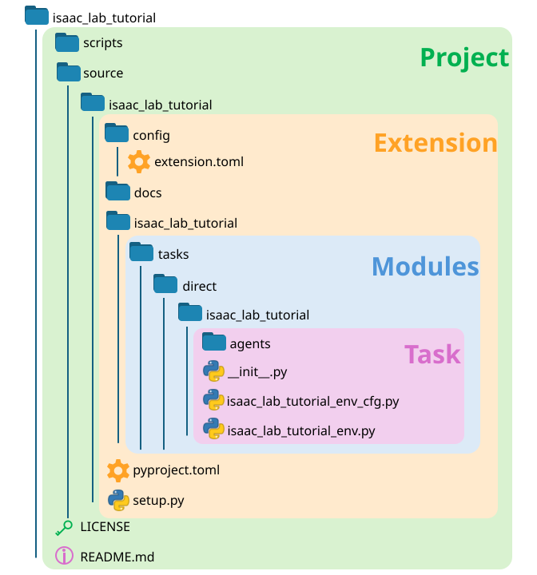

.. _own-project:
.. _template-generator:

Build your own project or task
==============================

The template generator creates a working Cartpole task, its selected agent
configurations, and the packaging needed for the Isaac Lab CLI to discover it.
The quickest path is an external project: choose a name and workflow, run
``uv sync``, and start the generated task with the Newton backend.

The generator runs entirely in the active Isaac Lab environment. It does not
invoke ``pip`` or install a second set of template dependencies, so it works in
the pip-less virtual environments created by ``uv``.

Create and run a project
------------------------

First, :ref:`install Isaac Lab <isaaclab-installation-root>`. Run the generator
from the Isaac Lab source checkout or from a uv project that contains the
installed Isaac Lab package:

.. code-block:: bash

   uv run isaaclab --new

The short form is equivalent:

.. code-block:: bash

   uv run isaaclab -n

Select the following options for a small first project:

* **External** project
* A parent directory outside the Isaac Lab repository
* A Python-compatible project name, such as ``my_cartpole``
* **Manager-based | single-agent** workflow
* **rsl_rl** with **PPO**

The prompts display the valid options and accept numbered, comma-separated
selections when more than one choice is allowed. The generator creates the
project under ``<parent-directory>/<project-name>`` and initializes a Git
repository there.

Enter the generated project and create its environment:

.. code-block:: bash

   cd <parent-directory>/my_cartpole
   uv sync

This default environment includes the selected RL library and the kit-less
Newton backend. It does **not** install Isaac Sim.

List the generated task name and its available presets:

.. code-block:: bash

   uv run python scripts/list_envs.py --show_presets

Copy the task name from the output, then run a quick smoke test:

.. code-block:: bash

   uv run isaaclab random_agent --task <TASK_NAME> --num_envs 16 --viz newton

If the environment launches and the cart moves, the project is ready to edit.
You can then train and play a policy with the same command surface used by
Isaac Lab itself:

.. code-block:: bash

   uv run isaaclab train --rl_library rsl_rl --task <TASK_NAME>
   uv run isaaclab play --rl_library rsl_rl --task <TASK_NAME> --checkpoint latest --viz newton

Choose what to generate
-----------------------

The first prompt chooses where the new task will live.

.. list-table::
   :widths: 22 48 30
   :header-rows: 1

   * - Type
     - Use it when
     - Result
   * - External (recommended)
     - You are creating an application, experiment, or reusable project outside
       the Isaac Lab repository.
     - A standalone Git repository and uv workspace.
   * - Internal
     - You intend to contribute the task to the Isaac Lab repository.
     - A task package under ``source/isaaclab_tasks``.

Installed Isaac Lab wheels only offer external projects. The internal option is
available from a source checkout because it writes directly into that checkout.

Next, choose one or more task workflows. See :ref:`feature-workflows` for the
complete comparison.

.. list-table::
   :widths: 30 70
   :header-rows: 1

   * - Workflow
     - Good fit
   * - Manager-based | single-agent
     - Most new tasks. Observations, actions, rewards, events, and terminations
       remain modular and easy to replace.
   * - Direct | single-agent
     - Tasks that need custom step and reset control or a compact environment
       implementation.
   * - Direct | multi-agent
     - Tasks with multiple policies or agent-specific observation and action
       spaces.

Finally, choose the RL libraries and algorithms whose configuration files you
want generated. The prompt adapts the available choices to the selected
workflow. See :ref:`rl-frameworks` for the framework comparison.

Choose a simulation backend
---------------------------

Generated projects follow the same optional-extra model as Isaac Lab. Newton is
available after the default ``uv sync``; heavier simulator runtimes are only
installed when a command requests their extra.

.. list-table::
   :widths: 29 23 48
   :header-rows: 1

   * - Backend selector
     - Required extra
     - Example
   * - ``physics=newton_mjwarp``
     - None
     - ``uv run isaaclab random_agent --task <TASK_NAME> physics=newton_mjwarp``
   * - ``physics=newton_kamino``
     - None
     - ``uv run isaaclab random_agent --task <TASK_NAME> physics=newton_kamino``
   * - ``physics=ovphysx``
     - ``ovphysx`` or ``ov``
     - ``uv run --extra ovphysx isaaclab random_agent --task <TASK_NAME> physics=ovphysx``
   * - ``physics=isaacsim_physx``
     - ``isaacsim``
     - ``uv run --extra isaacsim isaaclab random_agent --task <TASK_NAME> physics=isaacsim_physx``

The ``ov`` extra installs both the OV PhysX and OVRTX runtimes. To combine
Newton physics with OVRTX rendering, request only the ``ovrtx`` extra:

.. code-block:: bash

   uv run --extra ovrtx isaaclab random_agent --task <TASK_NAME> \
      physics=newton_mjwarp renderer=ovrtx

Place ``--extra`` before ``isaaclab``. Keep it on every command that needs the
optional runtime; this lets ``uv`` reproduce the intended environment without a
separate installation step. See :ref:`isaac-lab-quickstart` for all physics,
renderer, and visualizer combinations.

.. _project-structure:

Understand the generated project
--------------------------------

An external project is both an installable Python package and an Isaac Sim
extension. Its top-level ``pyproject.toml`` defines the uv workspace and backend
extras. The package under ``source`` declares the selected RL dependencies and
registers its task module through the ``isaaclab.tasks`` entry-point group.

The generated files are organized into four layers:

* **Project:** The Git repository, uv workspace, README, VS Code configuration,
  and utility scripts.
* **Extension:** The installable package under ``source``. Its
  ``config/extension.toml`` also lets Isaac Sim load it through the Extension
  Manager.
* **Module:** The Python package containing task implementations. Installing it
  in editable mode means code changes are available immediately.
* **Task:** An environment family and its environment and agent configurations.
  The generated ``config/cartpole`` directory is one common organization, not a
  required robot-based hierarchy. A project can instead organize families by
  behavior or another useful axis.

Code shared by several task families can live in a package such as
``tasks/mdp``. The generated task importer skips packages named ``mdp`` while it
searches for task registrations, so shared modules do not register as task
families.

A generated project resembles:

.. code-block:: text

   my_cartpole/
   ├── pyproject.toml
   ├── README.md
   ├── scripts/
   │   └── list_envs.py
   └── source/
       └── my_cartpole/
           ├── pyproject.toml
           ├── docs/
           │   └── CHANGELOG.rst
           ├── config/
           │   └── extension.toml
           └── my_cartpole/
               ├── __init__.py
               ├── ui_extension_example.py
               └── tasks/
                   ├── __init__.py
                   └── my_cartpole/
                       ├── mdp/
                       └── config/
                           └── cartpole/
                               ├── agents/
                               └── my_cartpole_env_cfg.py

The optional ``ui_extension_example.py`` demonstrates an Isaac Sim Extension
Manager UI. If the project does not need that UI, delete the file and its
``[[python.module]]`` entry from ``config/extension.toml``.

Run commands from the project root so ``uv`` can find the workspace and task
entry point. Commit both ``pyproject.toml`` files and ``uv.lock`` to give
collaborators the same dependency resolution.

Develop the generated task
--------------------------

Start with a dummy agent before training. A zero-action agent is useful for
checking resets and passive dynamics, while a random-action agent also exercises
the action and observation paths:

.. code-block:: bash

   uv run isaaclab zero_agent --task <TASK_NAME> --num_envs 16
   uv run isaaclab random_agent --task <TASK_NAME> --num_envs 16

Edit the generated environment configuration and task terms under
``source/<project-name>/<project-name>/tasks``. The generated package is
installed in editable mode, so you do not need to reinstall it after each
change.

Use the remaining project commands as the task matures:

.. code-block:: bash

   uv run isaaclab train_multigpu --rl_library <RL_LIBRARY> \
      --task <TASK_NAME> --num_gpus 2
   uv run isaaclab benchmark runtime --task <TASK_NAME> \
      --num_envs 16 --num_steps 1000
   uv run pre-commit run --all-files

The generated ``pyproject.toml`` installs pytest for development and registers
the ``unit``, ``integration``, ``smoke``, and ``kitless`` markers. Put
project-owned tests under ``tests`` and run them with:

.. code-block:: bash

   uv run pytest tests

The reusable-looking helpers under ``source/isaaclab_tasks/test`` belong to the
Isaac Lab repository test suite and are not installed with ``isaaclab_tasks``.
External projects should build their environment harness from public APIs and
maintain project-local fixtures. Copying ``env_test_utils.py`` into a project is
vendoring it, so the project must track upstream changes to that copy.

To configure VS Code, run the generated setup task or invoke it directly:

.. code-block:: bash

   uv run python .vscode/tools/setup_vscode.py

Create an internal task
-----------------------

Choose **Internal** only when working from an Isaac Lab source checkout. The
generator writes the new task into ``source/isaaclab_tasks`` instead of creating
a separate project. From the Isaac Lab repository root, list and test it with:

.. code-block:: bash

   uv run python scripts/environments/list_envs.py --show_presets
   uv run isaaclab random_agent --task <TASK_NAME> --num_envs 16
   uv run isaaclab train --rl_library <RL_LIBRARY> --task <TASK_NAME>

Troubleshooting
---------------

**The project path is rejected**
   External projects must live outside the Isaac Lab repository. Enter the
   parent directory; the generator appends the project name automatically.

**The project name is rejected**
   Use a valid Python identifier containing letters, numbers, and underscores,
   without spaces or hyphens. The name cannot begin with a number.

**The CLI cannot find the generated task**
   Run ``uv sync`` and invoke the command from the generated project root. Then
   confirm the task appears in ``uv run python scripts/list_envs.py``.

**An optional backend module is missing**
   Add its extra before the command, such as ``uv run --extra ovphysx
   isaaclab ...`` or ``uv run --extra isaacsim isaaclab ...``.

**The generator reports a missing template dependency**
   Current versions obtain the renderer and prompts from the Isaac Lab
   environment; no manual ``pip install`` is required. Update the Isaac Lab
   checkout or installed package and run the generator again.

The generated ``README.md`` contains the same project-local commands and should
be kept up to date as the project evolves.
