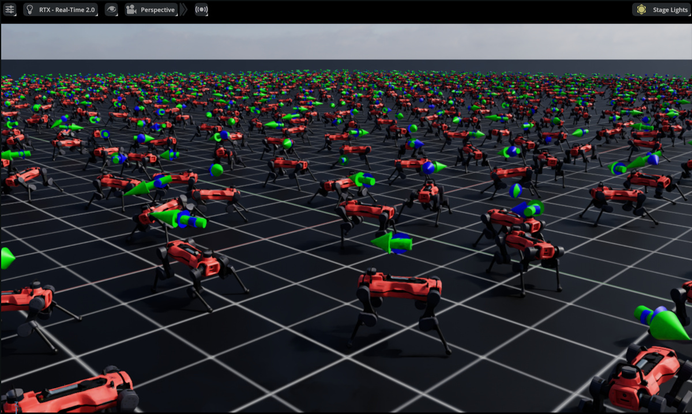

Visualization
=============

.. currentmodule:: isaaclab

Isaac Lab offers several lightweight visualizers for real-time simulation inspection and debugging. Unlike renderers that process sensor data, visualizers are meant for fast, interactive feedback.

You can use any visualizer regardless of your chosen physics engine or rendering backend.

Overview
--------

Isaac Lab supports three visualizer backends, each optimized for different use cases:

.. list-table:: Visualizer Comparison
   :widths: 15 35 50
   :header-rows: 1

   * - Visualizer
     - Best For
     - Key Features
   * - **Omniverse**
     - High-fidelity, Isaac Sim integration
     - USD, visual markers, live plots
   * - **Newton**
     - Fast iteration
     - Low overhead, visual markers
   * - **Rerun**
     - Remote viewing, replay
     - Webviewer, time scrubbing, recording export

*The following visualizers are shown training the Isaac-Velocity-Flat-Anymal-D-v0 environment.*

   Omniverse Visualizer

.. figure:: ../../_static/visualizers/newton_viz.jpg
   :width: 100%
   :alt: Newton Visualizer

   Newton Visualizer

.. figure:: ../../_static/visualizers/rerun_viz.jpg
   :width: 100%
   :alt: Rerun Visualizer

   Rerun Visualizer

Quick Start
-----------

Launch visualizers from the command line with ``--visualizer``:

.. code-block:: bash

    # Launch all visualizers (comma-delimited list, no spaces)
    python scripts/reinforcement_learning/rsl_rl/train.py --task Isaac-Cartpole-v0 --visualizer kit,newton,rerun

    # Launch only the Newton visualizer
    python scripts/reinforcement_learning/rsl_rl/train.py --task Isaac-Cartpole-v0 --visualizer newton

For explicit headless execution, prefer:

.. code-block:: bash

    python scripts/reinforcement_learning/rsl_rl/train.py --task Isaac-Cartpole-v0 --viz none

.. note::

    The ``--headless`` argument is deprecated. Prefer ``--viz none`` for explicit headless execution.
    For compatibility, ``--headless`` still takes precedence and disables all visualizers.

Resolution Rules (CLI + Config)
~~~~~~~~~~~~~~~~~~~~~~~~~~~~~~~

The effective visualizer mode is resolved from both CLI and ``SimulationCfg.visualizer_cfgs``:

- ``--visualizer`` / ``--viz`` uses comma-separated values (for example ``--viz kit,newton``).
- ``--viz none`` explicitly disables all visualizers.
- If ``--headless`` is passed, it overrides ``--viz`` and disables visualizers.
- If ``--viz`` is omitted, Isaac Lab falls back to ``SimulationCfg.visualizer_cfgs``.

For the migration-focused summary and deprecation context, see
:doc:`/source/migration/migrating_to_isaaclab_3-0`.

.. list-table:: Common modes
   :header-rows: 1
   :widths: 30 35 35

   * - CLI args
     - ``SimulationCfg.visualizer_cfgs``
     - Effective behavior
   * - ``--viz kit,newton``
     - ``[KitVisualizerCfg(...)]``
     - Use custom Kit cfg and create default Newton cfg.
   * - ``--viz rerun``
     - ``[KitVisualizerCfg(...)]``
     - Launch default Rerun only.
   * - no ``--viz``
     - ``[KitVisualizerCfg(...), NewtonVisualizerCfg(...)]``
     - Use config visualizers directly.
   * - ``--viz none``
     - any
     - Run headless with all visualizers disabled.
   * - ``--headless --viz <names>``
     - any
     - Run headless; ``--headless`` takes precedence.

Configuration
~~~~~~~~~~~~~

Launching visualizers with the command line will use default visualizer configurations. Visualizer backends live in the ``isaaclab_visualizers`` package (e.g. ``source/isaaclab_visualizers/isaaclab_visualizers/kit``, ``newton``, ``rerun``).

You can also configure custom visualizers in the code by defining ``VisualizerCfg`` instances for the ``SimulationCfg``, for example:

.. code-block:: python

    from isaaclab.sim import SimulationCfg
    from isaaclab_visualizers.kit import KitVisualizerCfg
    from isaaclab_visualizers.newton import NewtonVisualizerCfg
    from isaaclab_visualizers.rerun import RerunVisualizerCfg

    sim_cfg = SimulationCfg(
        visualizer_cfgs=[
            KitVisualizerCfg(
                viewport_name="Visualizer Viewport",
                create_viewport=True,
                dock_position="SAME",
                window_width=1280,
                window_height=720,
                camera_position=(0.0, 0.0, 20.0), # high top down view
                camera_target=(0.0, 0.0, 0.0),
            ),
            NewtonVisualizerCfg(
                camera_position=(5.0, 5.0, 5.0), # closer quarter view
                camera_target=(0.0, 0.0, 0.0),
                show_joints=True,
            ),
            RerunVisualizerCfg(
                keep_historical_data=True,
                keep_scalar_history=True,
                record_to_rrd="my_training.rrd",
            ),
        ]
    )

Concrete workflow example
^^^^^^^^^^^^^^^^^^^^^^^^^

A handy pattern is to keep a non-empty ``visualizer_cfgs`` list in task config so local debugging has a stable
camera view and optional telemetry, without needing extra CLI flags every run:

.. code-block:: python

    from isaaclab.sim import SimulationCfg
    from isaaclab_visualizers.kit import KitVisualizerCfg
    from isaaclab_visualizers.rerun import RerunVisualizerCfg

    sim_cfg = SimulationCfg(
        visualizer_cfgs=[
            KitVisualizerCfg(camera_position=(6.0, 6.0, 3.0), camera_target=(0.0, 0.0, 0.0)),
            RerunVisualizerCfg(record_to_rrd="debug_rollout.rrd"),
        ]
    )

.. code-block:: bash

    # Uses visualizer_cfgs directly (fixed Kit camera + Rerun recording)
    python scripts/reinforcement_learning/rsl_rl/train.py --task Isaac-Cartpole-v0

    # Temporary override: only launch Rerun for a lightweight run
    python scripts/reinforcement_learning/rsl_rl/train.py --task Isaac-Cartpole-v0 --viz rerun

You can combine config defaults with CLI overrides:

.. code-block:: bash

    # Use visualizer_cfgs from SimulationCfg (no CLI override)
    python scripts/reinforcement_learning/rsl_rl/train.py --task Isaac-Cartpole-v0

    # Override config defaults with explicit CLI selection
    python scripts/reinforcement_learning/rsl_rl/train.py --task Isaac-Cartpole-v0 --viz rerun

    # Explicit headless mode (preferred over deprecated --headless)
    python scripts/reinforcement_learning/rsl_rl/train.py --task Isaac-Cartpole-v0 --viz none

Visualizer Backends
-------------------

Omniverse Visualizer
~~~~~~~~~~~~~~~~~~~~

**Main Features:**

- Native USD stage integration
- Visualization markers for debugging (arrows, frames, points, etc.)
- Live plots for monitoring training metrics
- Full Isaac Sim rendering capabilities and tooling

**Core Configuration:**

.. code-block:: python

    from isaaclab_visualizers.kit import KitVisualizerCfg

    visualizer_cfg = KitVisualizerCfg(
        # Viewport settings
        viewport_name="Visualizer Viewport",      # Viewport window name
        create_viewport=True,                     # Create new viewport vs. use existing
        dock_position="SAME",                     # Docking: 'LEFT', 'RIGHT', 'BOTTOM', 'SAME'
        window_width=1280,                        # Viewport width in pixels
        window_height=720,                        # Viewport height in pixels

        # Camera settings
        camera_position=(8.0, 8.0, 3.0),         # Initial camera position (x, y, z)
        camera_target=(0.0, 0.0, 0.0),           # Camera look-at target

        # Feature toggles
        enable_markers=True,                      # Enable visualization markers
        enable_live_plots=True,                   # Enable live plots (auto-expands frames)
    )

Newton Visualizer
~~~~~~~~~~~~~~~~~~~~~~~~~

**Main Features:**

- Lightweight OpenGL rendering with low overhead
- Visualization markers (joints, contacts, springs, COM)
- Training and rendering pause controls
- Adjustable update frequency for performance tuning
- Some customizable rendering options (shadows, sky, wireframe)

**Interactive Controls:**

.. list-table::
   :widths: 30 70
   :header-rows: 1

   * - Key/Input
     - Action
   * - **W, A, S, D** or **Arrow Keys**
     - Forward / Left / Back / Right
   * - **Q, E**
     - Down / Up
   * - **Left Click + Drag**
     - Look around
   * - **Mouse Scroll**
     - Zoom in/out
   * - **H**
     - Toggle UI sidebar
   * - **ESC**
     - Exit viewer

**Core Configuration:**

.. code-block:: python

    from isaaclab_visualizers.newton import NewtonVisualizerCfg

    visualizer_cfg = NewtonVisualizerCfg(
        # Window settings
        window_width=1920,                        # Window width in pixels
        window_height=1080,                       # Window height in pixels

        # Camera settings
        camera_position=(8.0, 8.0, 3.0),         # Initial camera position (x, y, z)
        camera_target=(0.0, 0.0, 0.0),           # Camera look-at target

        # Performance tuning
        update_frequency=1,                       # Update every N frames (1=every frame)

        # Physics debug visualization
        show_joints=False,                        # Show joint visualizations
        show_contacts=False,                      # Show contact points and normals
        show_springs=False,                       # Show spring constraints
        show_com=False,                           # Show center of mass markers

        # Rendering options
        enable_shadows=True,                      # Enable shadow rendering
        enable_sky=True,                          # Enable sky rendering
        enable_wireframe=False,                   # Enable wireframe mode

        # Color customization
        background_color=(0.53, 0.81, 0.92),     # Sky/background color (RGB [0,1])
        ground_color=(0.18, 0.20, 0.25),         # Ground plane color (RGB [0,1])
        light_color=(1.0, 1.0, 1.0),             # Directional light color (RGB [0,1])
    )

Rerun Visualizer
~~~~~~~~~~~~~~~~

**Main Features:**

- Web viewer interface accessible from local or remote browser
- Metadata logging and filtering
- Recording to .rrd files for offline replay (.rrd files can be opened with ctrl+O from the web viewer)
- Timeline scrubbing and playback controls of recordings

**Core Configuration:**

.. code-block:: python

    from isaaclab_visualizers.rerun import RerunVisualizerCfg

    visualizer_cfg = RerunVisualizerCfg(
        # Server settings
        app_id="isaaclab-simulation",             # Application identifier for viewer
        grpc_port=9876,                           # gRPC endpoint for logging SDK connection
        web_port=9090,                            # Port for local web viewer (launched in browser)
        bind_address="0.0.0.0",                  # Endpoint host formatting/reuse checks

        # Camera settings
        camera_position=(8.0, 8.0, 3.0),         # Initial camera position (x, y, z)
        camera_target=(0.0, 0.0, 0.0),           # Camera look-at target

        # History settings
        keep_historical_data=False,               # Keep transforms for time scrubbing
        keep_scalar_history=False,                # Keep scalar/plot history

        # Recording
        record_to_rrd="recording.rrd",            # Path to save .rrd file (None = no recording)
    )

Rerun startup uses the Python SDK through ``newton.viewer.ViewerRerun`` (no external ``rerun`` CLI process
management). If ``grpc_port`` is already active, Isaac Lab reuses that server. If ``web_port`` is occupied while
starting a new server, initialization fails with a clear port-conflict error.

Performance Note
----------------

To reduce overhead when visualizing large-scale environments, consider:

- Using Newton instead of Omniverse or Rerun
- Reducing window sizes
- Higher update frequencies
- Pausing visualizers while they are not being used

Limitations
-----------

**Rerun Visualizer Performance**

The Rerun web-based visualizer may experience performance issues or crashes when visualizing large-scale
environments. For large-scale simulations, the Newton visualizer is recommended. Alternatively, to reduce load,
the num of environments can be overwritten and decreased using ``--num_envs``:

.. code-block:: bash

    python scripts/reinforcement_learning/rsl_rl/train.py --task Isaac-Cartpole-v0 --visualizer rerun --num_envs 512

.. note::

    A future feature will support visualizing only a subset of environments, which will improve visualization performance
    and reduce resource usage while maintaining full-scale training in the background.

**Rerun Visualizer FPS Control**

The FPS control in the Rerun visualizer UI may not affect the visualization frame rate in all configurations.

**Newton Visualizer Contact and Center of Mass Markers**

Contact and center of mass markers are not yet supported in the Newton visualizer. This will be addressed in a future release.

**Newton Visualizer CUDA/OpenGL Interoperability Warnings**

On some system configurations, the Newton visualizer may display warnings about CUDA/OpenGL interoperability:

.. code-block:: text

    Warning: Could not get MSAA config, falling back to non-AA.
    Warp CUDA error 999: unknown error (in function wp_cuda_graphics_register_gl_buffer)
    Warp UserWarning: Could not register GL buffer since CUDA/OpenGL interoperability
    is not available. Falling back to copy operations between the Warp array and the
    OpenGL buffer.

The visualizer will still function correctly but may experience reduced performance due to falling back to
CPU copy operations instead of direct GPU memory sharing.
