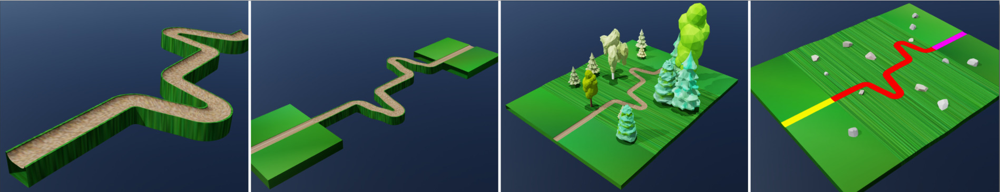
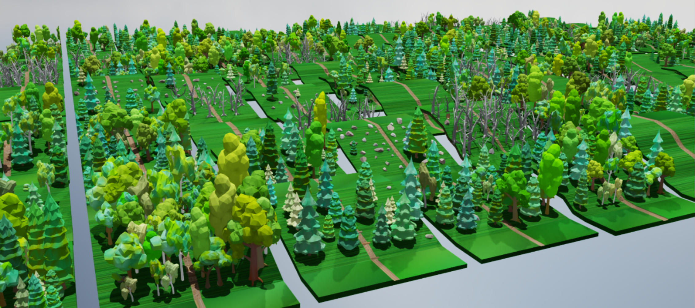
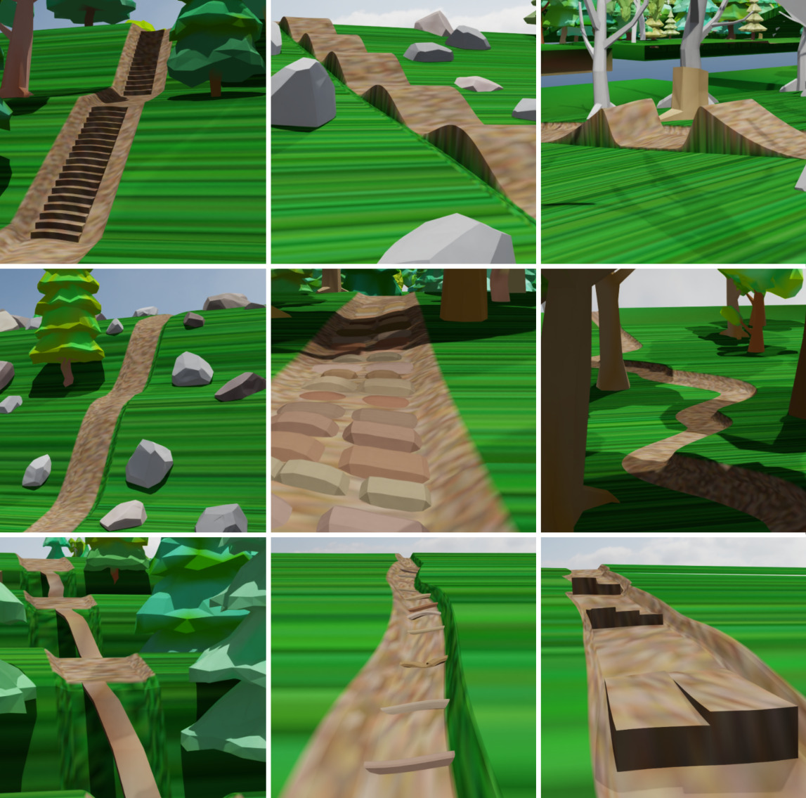

.. _experimental_features_trail:

.. currentmodule:: isaaclab_contrib

Trail Library
=============

The Trail library is a modular framework for generating parameterizable mountain-bike trails.
Each terrain patch comprises four components: a starting platform, a final platform, a connecting
trail segment, and distinct skill elements. The resulting terrain is represented as a single mesh
using the trimesh library, which models geometry as triangles and stores visual information within
the RGB channels.

A trail segment is generated by first defining a cross-section polygon with counter-clockwise
ordered vertices. This polygon is then swept along a sweeping path, a sequence of knot-points
``(x, y, z, yaw)`` connecting the two platforms. To form a simple ground floor around the trail,
the vertices on the left and right borders are expanded outward. Each trail segment may contain one
or more skill elements of a unique type, such as ramps, skinnies, roots, rocks, or waves. Each
element is parameterized by a uniform distribution over its dimensions. Semantic information is 
explicitly stored in the vertex colors. The exact RGB values can be chosen arbitrarily, 
provided the mapping from RGB to semantic label remains bijective.

   Figure 1: The procedural generation of lightweight mountain-bike meshes is divided into four
   stages. First, a cross-section polygon is swept along a 4D sweeping path. Second, two geometric
   platforms are welded to the start and end of the trail. Third, the lateral vertices are extended
   to align with the terrain patch size. Forest objects can optionally be placed. Finally, semantic
   information is embedded into the vertex colors.

The generated terrains can easily be embedded into the existing Terrain Generator. The
parameterization of the skill elements scales linearly (other maps may be defined) with the
difficulty level. The generated terrains can be embedded into terrain generation workflows and
support curriculum scaling through a ``difficulty`` value in ``[0, 1]``.

The terrain mesh is systematically randomized by overlaying the vertices with a sequence of
geometric disturbances. Additionally, decorative elements such as trees, roots, or stones can be
procedurally placed adjacent to the trail. These perturbations break predictable structural
patterns, preventing overfitting to specific procedural patterns.

   Figure 2: Multiple terrain patches are instantiated across a uniform grid to construct the learning environment.

Module Contents
---------------

The trail implementation is organized under ``isaaclab_contrib/terrains/trail``:

- ``trail_terrains.py``: Core mesh-generation routines. Main entry point:
  ``mesh_trail_segment(difficulty, cfg)``, which returns a generated mesh and its origin.
- ``trail_cfg.py``: Ready-to-use terrain presets (e.g. ``WavesCfg``, ``JumpsCfg``, ``StonesCfg``,
  ``RootsCfg``, ``RampsCfg``, ``SlalomCfg``). Presets extend ``TrailBaseCfg`` and define profile,
  sweep, and object-parameter ranges.
- ``elements/``: Reusable low-level building blocks:

  - ``object_profiles.py``: 2D object profiles for skill elements (waves, ramps, roots, etc.).
  - ``sweeping_paths.py``: Sweep-path functions that turn 2D profiles into 3D geometry.
  - ``trail_profiles.py``: Trail cross-section profiles.
  - ``trail_walls.py``: Parameterization of the left and right trail walls.
  - ``decoration_functions.py``: Decorative object generation (trees, roots, rocks, etc.).
  - ``terrain_functions.py``: Terrain disturbance functions (sine patterns, noise, etc.).
  - ``roll_functions.py``: Trail roll angle functions relative to the heading axis.

- ``utils/``: Shared utilities across the terrain generator:

  - ``colors.py``: Color palettes and color helpers.
  - ``numpy_arrays.py``: Helper functions based on NumPy parameterization.
  - ``transformations.py``: Pose and transform helpers.
  - ``trimesh_utils.py``: Mesh cleaning and repair helpers.
  - ``math.py``: Math helper functions.

- ``examples/``: Example code and ready-to-use configurations:

  - ``trails.py``: Trail terrain configurations ready for plug-and-play.

Decoration functions extract the ``decoration_elements.zip`` archive and build ``.glb`` assets within
the system temporary directory (under ``<tmp_dir>/isaaclab_contrib/trail/``). Depending on the setup,
two ``.glb`` files may exist: one detailed for deployment/rendering and one simplified for training.
If any decoration objects or preprocessing functions are changed, these cached ``.glb`` files in the temporary directory must be manually deleted to force a recomputation.

Available Terrain Presets
-------------------------

The trail library provides the following preset configuration classes in
``isaaclab_contrib.terrains.trail.trail_cfg``:

- ``WavesCfg``: Repeating waves as can be found on pump tracks.
- ``JumpsCfg``: Jump features with optional gaps/plateaus, which can be found on mountain-bike parks.
- ``StonesCfg``: Rock/grave patches, modeling extended rock beds.
- ``RootsCfg``: Root-like patches, modeling forest paths with root networks.
- ``RampsCfg``: Single ramp obstacles.
- ``MultipleRampsCfg``: Parallel multi-lane ramp sets (this is a typical feature of the Allmend trail in Zurich).
- ``SinusoidalCurvesCfg``: S-shaped sinusoidal trail curves.
- ``DropCurvesCfg``: Vertical sinusoidal drops/pits.
- ``WingCurvesCfg``: Circular wing-style turns.
- ``SkinnyCfg``: Narrow beam-style sections.
- ``Loops360Cfg``: 360-degree loop structures.
- ``StairsCfg``: Stair-step terrain sections as can be found on hiking paths.
- ``SlalomCfg``: Pole/slalom obstacle course.

The image below shows some preset examples.

   Figure 3: Each trail segment may contain one or more skill elements of a unique type, such as
   stairs, pump-track waves, jumps, drops, rocks, curves, skinnies, roots, and ramps.

Key Concepts
------------

- ``mesh_trail_segment(difficulty, cfg)``: Core generation function. The ``difficulty`` parameter
  is a float in ``[0.0, 1.0]`` that linearly interpolates curriculum parameters between ``cp0``
  (easy) and ``cp1`` (hard). It is driven by Isaac Lab's terrain curriculum as the agent advances.
  Difficulty values greater than ``1.0`` are not supported as they may cause division-by-zero
  errors depending on the object configuration.

- ``TrailBaseCfg`` and Presets: All terrain configs extend ``TrailBaseCfg`` (which extends Isaac
  Lab's ``SubTerrainBaseCfg``). ``TrailBaseCfg`` controls surroundings, objects, trail shape, roll
  angles, decorations, and coloring. Ready-made presets extend ``TrailBaseCfg`` with defaults and
  expose parameters that distinguish each terrain type.

- Control Points ``cp0`` / ``cp1``: These are ``ObjectParameters`` instances defining object
  dimensions at the easiest and hardest ends of the curriculum. The interpolated value at generation
  time is computed using:

  .. math::

     \text{value} = \text{cp0} + \text{difficulty} \times (\text{cp1} - \text{cp0})

  Each control point field can be a fixed value or a ``(min, max)`` range:

  +------------+-------------------------------------------------------------------------+
  | Field      | Description                                                             |
  +============+=========================================================================+
  | ``length`` | Object length along the trail heading direction [m]                     |
  +------------+-------------------------------------------------------------------------+
  | ``width``  | Trail width at this curriculum point [m]                                |
  +------------+-------------------------------------------------------------------------+
  | ``params`` | Dict of additional object-specific parameters (e.g., ``height``)        |
  +------------+-------------------------------------------------------------------------+

Semantic Color Regions & MDP Integration
----------------------------------------

Semantic information is explicitly stored in vertex colors (``visual.vertex_colors``). The exact
RGB values can be chosen arbitrarily provided the mapping between colors and semantic labels is
bijective.

Default semantic color assignments:

+---------------------+-------------------+-------------------------------+
| Region              | Description       | Default Color                 |
+=====================+===================+===============================+
| ``col_trail``       | Trail surface     | Brown (HSV)                   |
+---------------------+-------------------+-------------------------------+
| ``col_trail_object``| Objects on trail  | Brown (HSV)                   |
+---------------------+-------------------+-------------------------------+
| ``col_floor``       | Floor beside trail| Green (HSV)                   |
+---------------------+-------------------+-------------------------------+
| ``col_start``       | Starting platform | Yellow (RGB ``1, 1, 0``)      |
+---------------------+-------------------+-------------------------------+
| ``col_goal``        | Ending platform   | Magenta (RGB ``1, 0, 1``)     |
+---------------------+-------------------+-------------------------------+

Override any of these with a ``ColorParameters`` instance using HSV or RGB values.

Setting ``visual_material=None`` in ``TerrainImporterCfg`` preserves the vertex colors for
rendering. A color-sensitive raycaster can extract these semantic labels directly from the mesh to
shape MDP rewards:

- **Spawn location**: Place the agent on the starting platform (``col_start``).
- **Path following**: Reward agents for remaining on the trail surface (``col_trail``).
- **Success criteria**: Advance curriculum level when the agent reaches the goal platform (``col_goal``).
- **Obstacle interaction**: Reward or penalize agents for contacting obstacles (``col_trail_object``).

Example Terrain Generator Config
--------------------------------

.. code-block:: python

   from isaaclab_contrib.terrains.trail.trail_cfg import ColorParameters, ObjectParameters as OP, SlalomCfg, StonesCfg

   from isaaclab.terrains.terrain_generator_cfg import TerrainGeneratorCfg
   from isaaclab.utils.configclass import configclass

   @configclass
   class TrailTerrainGeneratorCfg(TerrainGeneratorCfg):
       curriculum = True
       size = (50.0, 40.0)  # length, width [m]
       border_width = 0.0  # set to zero as handled internally
       border_height: float = 0.0  # set to zero as handled internally
       num_rows = 10  # terrain difficulty levels
       num_cols = 100  # terrain variants per level
       difficulty_range = (0.0, 1.0)  # 0.0 easiest, 1.0 hardest
       use_cache = False  # set True to reuse generated meshes across runs once stable

   TRAIL_CFG = TrailTerrainGeneratorCfg(
       sub_terrains={
           "stones": StonesCfg(
               proportion=1.0,
               length_between_objects=(0.0, 0.2),
               length_between_platform_and_object=(2.0, 4.0),
               cp0=OP(length=(0.2, 0.4), width=2.0, params={"height": 0.0}),
               cp1=OP(length=(0.4, 0.8), width=(0.9, 1.5), params={"height": (0.01, 0.1)}),
           ),
           "slalom": SlalomCfg(
               proportion=1.0,
               length_between_objects=(1.0, 3.5),
               length_between_platform_and_object=(1.0, 3.0),
               cp0=OP(length=0.4, width=3.5, params={"height": 1.0, "rel_dist_from_center": (1.0, 1.0)}),
               cp1=OP(
                   length=(0.05, 0.05),
                   width=(1.5, 2.0),
                   params={"height": (0.8, 1.0), "rel_dist_from_center": (0.0, 1.0)},
               ),
               col_trail_object=ColorParameters(hsv={"r": 0.0, "g": 0.0, "b": 1.0}),
               col_trail=ColorParameters(hsv={"r": 1.0, "g": 0.0, "b": 0.0}),
               col_floor=ColorParameters(hsv={"r": 0.0, "g": 0.0, "b": 0.0}),
               col_start=ColorParameters(hsv={"r": 1.0, "g": 1.0, "b": 0.0}),
               col_goal=ColorParameters(hsv={"r": 1.0, "g": 0.0, "b": 1.0}),
           ),
       },
   )

Quick Scene Integration Example
-------------------------------

.. code-block:: python

   from isaaclab.scene import InteractiveSceneCfg
   from isaaclab.terrains import TerrainImporterCfg
   from isaaclab.utils.configclass import configclass

   from isaaclab_contrib.terrains.trail.examples.trails import TRAIL_CFG

   @configclass
   class TrailSceneCfg(InteractiveSceneCfg):
       terrain = TerrainImporterCfg(
           prim_path="/World/ground",
           terrain_type="generator",
           terrain_generator=TRAIL_CFG,
           visual_material=None,  # None preserves RGB vertex colors for visualization/raycasting
           debug_vis=False,
       )

Run Without a Policy
--------------------

A manager-based RL environment is available and can be launched with a zero-action agent:

.. code-block:: bash

   ./isaaclab.sh -p scripts/environments/zero_agent.py \
       --task IsaacContrib-Velocity-Trail-AnymalC \
       --num_envs 4

Testing
-------

Unit tests for trail components can be executed with pytest:

.. code-block:: bash

   python -m pytest source/isaaclab_contrib/test/terrains/test_trail.py
