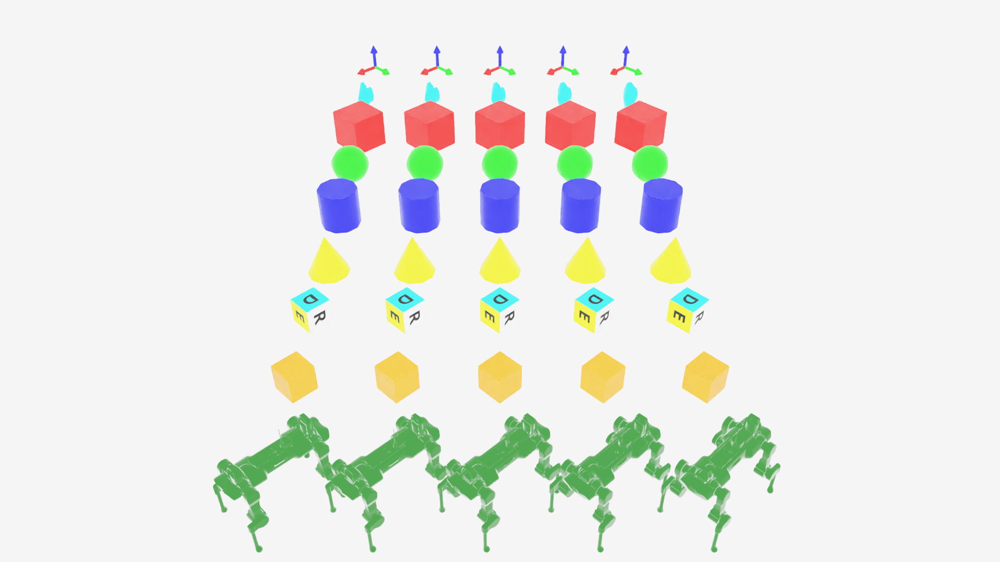

Creating Visualization Markers
==============================

.. currentmodule:: isaaclab

Visualization markers render debug geometry (frames, arrows, spheres, custom meshes) over the
scene through :class:`markers.VisualizationMarkers`. Markers are display-only: they carry no
physics and do not affect the simulation.

For plain points, lines, and splines, Isaac Sim's own :mod:`isaacsim.util.debug_draw` extension
is lighter-weight. Use ``VisualizationMarkers`` when you need more complex shapes.

Supported on Kit, Newton GL, Rerun, and Viser; not yet on Newton RTX. See
:doc:`/source/concepts/visualization` for enabling markers on a given visualizer.

Quick Start
-----------

This guide is accompanied by ``markers.py`` in ``IsaacLab/scripts/demos``.

.. tab-set::

   .. tab-item:: uv (Recommended)

      .. code-block:: bash

          uv run --extra isaacsim python scripts/demos/markers.py

   .. tab-item:: isaaclab.sh / isaaclab.bat

      .. code-block:: bash

          ./isaaclab.sh -p scripts/demos/markers.py

Pass ``--visualizer newton_gl`` (or another supported backend) to switch visualizers; defaults
to ``kit``.

   Every marker prototype from the demo script, arranged in a grid. Each column rotates in
   place and periodically rolls forward to the next prototype.

To stop, close the window or press ``Ctrl+C``.

.. dropdown:: Code for markers.py
   :icon: code

   .. literalinclude:: ../../../scripts/demos/markers.py
      :language: python
      :emphasize-lines: 48-96, 106-107, 146
      :linenos:

Configuring markers
--------------------

:class:`~markers.VisualizationMarkersCfg` takes:

- :attr:`~markers.VisualizationMarkersCfg.prim_path`: prim path where the marker
  ``UsdGeom.PointInstancer`` is created.
- :attr:`~markers.VisualizationMarkersCfg.markers`: a dict of marker prototypes. The key names
  the prototype; the value is its spawn config (any :class:`~isaaclab.sim.spawners.SpawnerCfg`,
  including USD file references).

.. note::

   Physics properties on a marker prototype's spawn config are stripped on creation, since
   markers are not simulated.

.. literalinclude:: ../../../scripts/demos/markers.py
   :language: python
   :lines: 50-96
   :dedent:

Drawing markers
-----------------

:meth:`~markers.VisualizationMarkers.visualize` sets marker poses and, optionally, which
prototype each marker instance uses via ``marker_indices``.

.. literalinclude:: ../../../scripts/demos/markers.py
   :language: python
   :lines: 144-146
   :dedent:

Arguments left as ``None`` keep their previous value. Passing a different number of rows than
the last call resizes the marker instance count. See
:meth:`~markers.VisualizationMarkers.visualize`'s docstring for the full argument list
(``translations``, ``orientations``, ``scales``, ``marker_indices``, ``environment_ids``).

Markers in practice
---------------------

Markers are commonly used to debug per-environment state during training, such as commanded vs.
current velocity, or contact events:

.. raw:: html

   
   

   Velocity command (green) and current velocity (blue) arrow markers on an AnymalD robot.

   
   

   Joint arrow markers on a Franka arm, with contact sensor markers on a cube.

See also
--------

- :doc:`/source/concepts/visualization`: enabling markers per visualizer, and other visualizer
  features
- :doc:`/source/features/record_video`: recording a marker-annotated scene to video
