Environments
============

.. note::

    The environments are currently under development. We will update the documentation as soon as
    they are ready. Please check the :ref:`development_roadmap` for more information.

Rigid-body manipulation
-----------------------

Each task poses different challenges for object reasoning, skill-learning and control. We use advanced
physics capabilities (such as SDF-based collision) to simulate contact rich interactions.

.. table::
    :widths: 25 17 30 28

    +-----------+-------------------+-----------------------+--------------+
    | World     | Task/Env.         | Description           | Metric       |
    +===========+===================+=======================+==============+
    | |reach|   | Reach             | Move the end-effector | Distance     |
    |           |                   | to sampled target     | between the  |
    |           |                   | pose                  | end-effector |
    |           |                   |                       | of the       |
    |           |                   |                       | robot and    |
    |           |                   |                       | the target   |
    |           |                   |                       | pose         |
    +-----------+-------------------+-----------------------+--------------+
    | |lift|    | Lift              | Lift a rigid cube     | Distance     |
    |           |                   | from the table to     | between the  |
    |           |                   | sampled target pose   | rigid        |
    |           |                   |                       | cube's       |
    |           |                   |                       | current and  |
    |           |                   |                       | target       |
    |           |                   |                       | poses        |
    +-----------+-------------------+-----------------------+--------------+
    | |peg|     | Peg in Hole       | Place blocks of       | Sum of       |
    |           |                   | different shapes into | distances    |
    |           |                   | their respective      | between      |
    |           |                   | holes                 | each block   |
    |           |                   |                       | and its      |
    |           |                   |                       | hole         |
    +-----------+-------------------+-----------------------+--------------+
    | |beat|    | Beat the Buzz     | Move the key from one | Total        |
    |           |                   | end to the other      | distance     |
    |           |                   | without touching the  | traveled     |
    |           |                   | pole                  | by the key   |
    |           |                   |                       | with a       |
    |           |                   |                       | penalty for  |
    |           |                   |                       | touching     |
    |           |                   |                       | the pole     |
    +-----------+-------------------+-----------------------+--------------+
    | |nut|     | Nut-Bolt          | Lift the nut from the | Distance     |
    |           | Tightening        | table and screw it    | between the  |
    |           |                   | onto a bolt           | nut's        |
    |           |                   |                       | current and  |
    |           |                   |                       | target       |
    |           |                   |                       | position on  |
    |           |                   |                       | the bolt     |
    +-----------+-------------------+-----------------------+--------------+
    | |cabinet| | Cabinet Opening   | Open cabinet's drawer | Distance     |
    |           |                   | to a certain desired  | between      |
    |           |                   | joint position        | cabinet's    |
    |           |                   |                       | current and  |
    |           |                   |                       | desired      |
    |           |                   |                       | joint state  |
    +-----------+-------------------+-----------------------+--------------+
    | |stack|   | Stack Pyramid     | Stack two pyramids    | Sum of       |
    |           |                   | from blocks of        | distances    |
    |           |                   | different colors      | between      |
    |           |                   |                       | each         |
    |           |                   |                       | block's      |
    |           |                   |                       | current and  |
    |           |                   |                       | desired      |
    |           |                   |                       | target       |
    |           |                   |                       | position in  |
    |           |                   |                       | the pyramid  |
    +-----------+-------------------+-----------------------+--------------+
    | |hockey|  | Hockey Playing    | Hit hockey puck with  | Shortest     |
    |           |                   | the stick into the    | distance     |
    |           |                   | net                   | between the  |
    |           |                   |                       | puck and     |
    |           |                   |                       | the inner    |
    |           |                   |                       | area of the  |
    |           |                   |                       | net          |
    +-----------+-------------------+-----------------------+--------------+
    | |jenga|   | Jenga Playing     | Remove given block    | Distance     |
    |           |                   | and place it on top   | between the  |
    |           |                   | without toppling the  | given        |
    |           |                   | tower                 | block's      |
    |           |                   |                       | current and  |
    |           |                   |                       | target       |
    |           |                   |                       | position     |
    |           |                   |                       | with         |
    |           |                   |                       | penalization |
    |           |                   |                       | if tower     |
    |           |                   |                       | topples      |
    +-----------+-------------------+-----------------------+--------------+
    | |inhand|  | In-Hand Reposing  | Repose an object to a | Difference   |
    |           |                   | target pose using     | between the  |
    |           |                   | dexterous hands       | pose of the  |
    |           |                   |                       | object and   |
    |           |                   |                       | the target   |
    |           |                   |                       | pose         |
    +-----------+-------------------+-----------------------+--------------+

Deformable-body manipulation
----------------------------

Using the PhysX SDK, we simulate deformable objects such as cloth and soft bodies. We provide
interfaces to procedurally generate meshes of specified shapes and sizes, and to deform them by
applying deformable body schemas on it.

.. table::
    :widths: 25 17 30 28

    +-----------+-------------------+-----------------------+-------------+
    | World     | Task/Env.         | Description           | Metric      |
    +===========+===================+=======================+=============+
    | |clift|   | Cloth Lifting     | Lift the cloth to the | Distance    |
    |           |                   | target position       | between a   |
    |           |                   |                       | key point   |
    |           |                   |                       | on the      |
    |           |                   |                       | cloth and   |
    |           |                   |                       | the target  |
    |           |                   |                       | position    |
    +-----------+-------------------+-----------------------+-------------+
    | |cfold|   | Cloth Folding     | Fold Cloth into a     | Sum of      |
    |           |                   | desired shape         | distances   |
    |           |                   |                       | between all |
    |           |                   |                       | pair of key |
    |           |                   |                       | points on   |
    |           |                   |                       | the cloth   |
    +-----------+-------------------+-----------------------+-------------+
    | |cspread| | Cloth Spreading   | Spread out the cloth  | Area        |
    |           |                   | and maximize the area | covered by  |
    |           |                   | that the cloth covers | the cloth   |
    |           |                   | from a top down view  | from a top  |
    |           |                   |                       | down view   |
    +-----------+-------------------+-----------------------+-------------+
    | |cdrop|   | Cloth Dropping    | Drop the cloth into a | Distance    |
    |           |                   | container             | between the |
    |           |                   |                       | key point   |
    |           |                   |                       | on the      |
    |           |                   |                       | cloth and   |
    |           |                   |                       | the center  |
    |           |                   |                       | of the      |
    |           |                   |                       | container   |
    +-----------+-------------------+-----------------------+-------------+
    | |flag|    | Flag Hoisting     | Hoist and spread the  | Distance    |
    |           |                   | flag                  | between the |
    |           |                   |                       | corner of   |
    |           |                   |                       | the flag    |
    |           |                   |                       | and a       |
    |           |                   |                       | desired     |
    |           |                   |                       | position    |
    +-----------+-------------------+-----------------------+-------------+
    | |slift|   | Soft Lifting      | Lift the soft object  | Distance    |
    |           |                   | to a target position  | between the |
    |           |                   |                       | pose of the |
    |           |                   |                       | soft object |
    |           |                   |                       | and the     |
    |           |                   |                       | goal pose   |
    +-----------+-------------------+-----------------------+-------------+
    | |sstack|  | Soft Stacking     | Stack one soft object | Distance    |
    |           |                   | on another soft       | between the |
    |           |                   | object                | two soft    |
    |           |                   |                       | objects     |
    |           |                   |                       | from a top  |
    |           |                   |                       | down view   |
    |           |                   |                       | with        |
    |           |                   |                       | penalty for |
    |           |                   |                       | wrong       |
    |           |                   |                       | orientation |
    +-----------+-------------------+-----------------------+-------------+
    | |splace|  | Soft Placing      | Place the soft object | Distance    |
    |           |                   | on a goal object at a | between the |
    |           |                   | target pose           | pose the    |
    |           |                   |                       | soft object |
    |           |                   |                       | and the     |
    |           |                   |                       | goal pose   |
    +-----------+-------------------+-----------------------+-------------+
    | |sdrop|   | Soft Dropping     | Drop the soft object  | Distance    |
    |           |                   | into the target       | between the |
    |           |                   | container             | soft object |
    |           |                   |                       | and the     |
    |           |                   |                       | center of   |
    |           |                   |                       | the         |
    |           |                   |                       | container   |
    +-----------+-------------------+-----------------------+-------------+
    | |shanoi|  | Tower of Hanoi    | Stack all soft torus  | Sum of      |
    |           |                   | around the target rod | distances   |
    |           |                   | in a decreasing-size  | between the |
    |           |                   | order so that the     | rod and the |
    |           |                   | smaller torus is      | center of   |
    |           |                   | always on the top     | torus from  |
    |           |                   |                       | a top down  |
    |           |                   |                       | view, and   |
    |           |                   |                       | relative    |
    |           |                   |                       | positions   |
    |           |                   |                       | between the |
    |           |                   |                       | torus based |
    |           |                   |                       | on their    |
    |           |                   |                       | sizes       |
    +-----------+-------------------+-----------------------+-------------+
    | |rope|    | Rope Reshaping    | Reshape the rope into | Sum of      |
    |           |                   | a desired shape       | distances   |
    |           |                   |                       | between the |
    |           |                   |                       | key points  |
    |           |                   |                       | on the rope |
    |           |                   |                       | and the key |
    |           |                   |                       | points on   |
    |           |                   |                       | the target  |
    |           |                   |                       | shape       |
    +-----------+-------------------+-----------------------+-------------+
    | |ftrans|  | Transport fluid   | Transport the         | Distance    |
    |           |                   | container filled with | between the |
    |           |                   | fluid to a target     | container   |
    |           |                   | position without      | and the     |
    |           |                   | spilling out the      | target      |
    |           |                   | fluid                 | position,   |
    |           |                   |                       | and the     |
    |           |                   |                       | amount of   |
    |           |                   |                       | fluid that  |
    |           |                   |                       | remained in |
    |           |                   |                       | the         |
    |           |                   |                       | container   |
    +-----------+-------------------+-----------------------+-------------+
    | |fpour|   | Pour fluid        | Pour the fluid in one | The amount  |
    |           |                   | container into a      | of fluid in |
    |           |                   | target container      | the target  |
    |           |                   |                       | container   |
    +-----------+-------------------+-----------------------+-------------+

Floating-base systems
---------------------

With rising interest in legged robots and mobile manipulators, we also include
a set of tasks that involve floating-base systems.

.. table::
    :widths: 25 17 30 28

    +-----------+-------------------+-----------------------+-------------+
    | World     | Task/Env.         | Description           | Metric      |
    +===========+===================+=======================+=============+
    | |mreach|  | Mobile Reach      | Move end-effector to  | Distance    |
    |           |                   | sampled target pose   | between the |
    |           |                   | while avoiding        | e           |
    |           |                   | obstacles             | nd-effector |
    |           |                   |                       | of the      |
    |           |                   |                       | robot and   |
    |           |                   |                       | the target  |
    |           |                   |                       | pose        |
    +-----------+-------------------+-----------------------+-------------+
    | |mcabint| | Mobile Cabinet    | Open cabinet's drawer | Distance    |
    |           |                   | to a certain desired  | between     |
    |           |                   | joint position with   | cabinet's   |
    |           |                   | whole-body control    | current and |
    |           |                   |                       | desired     |
    |           |                   |                       | joint state |
    +-----------+-------------------+-----------------------+-------------+
    | |velo|    | Legged Locomotion | Walk a legged robot   | Difference  |
    |           |                   | with a desired        | between the |
    |           |                   | velocity              | velocity of |
    |           |                   |                       | the legged  |
    |           |                   |                       | robot and   |
    |           |                   |                       | the desired |
    |           |                   |                       | velocity    |
    +-----------+-------------------+-----------------------+-------------+

.. |reach| image:: ../_static/tasks/rigid/reach.jpg
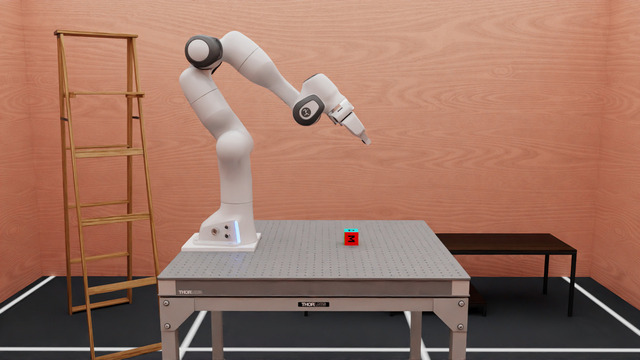
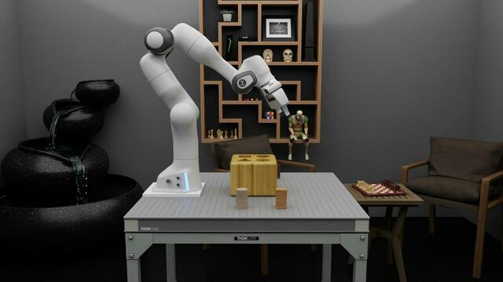
.. |beat| image:: ../_static/tasks/rigid/beat-the-buzz.jpg
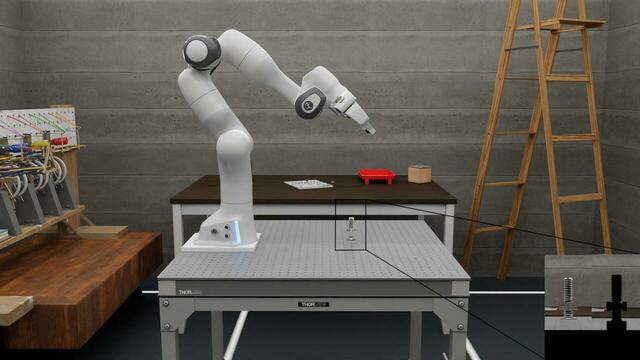
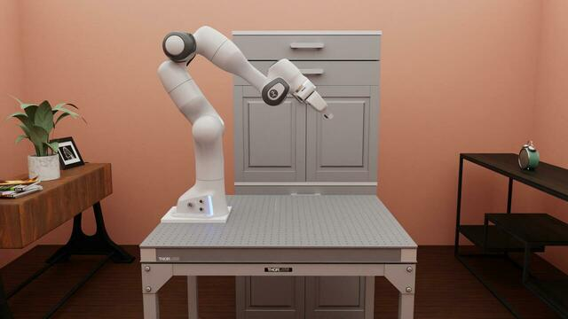
.. |stack| image:: ../_static/tasks/rigid/pyramid.jpg
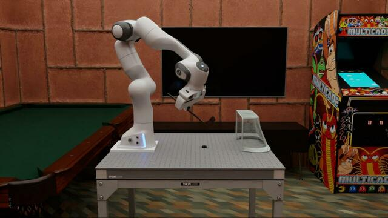
.. |jenga| image:: ../_static/tasks/rigid/jenga.jpg
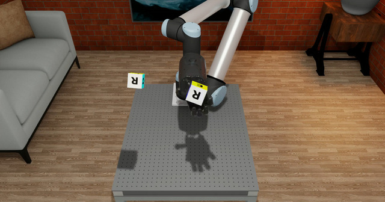

.. |clift| image:: ../_static/tasks/deformable/vest.jpg
.. |cfold| image:: ../_static/tasks/deformable/sweater.jpg
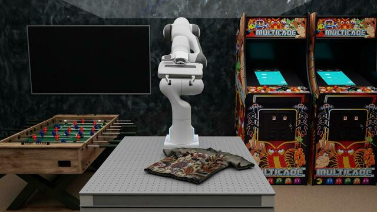
.. |cdrop| image:: ../_static/tasks/deformable/shirt-basket.jpg
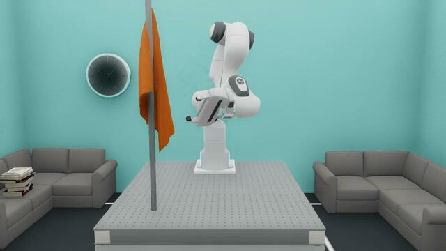
.. |slift| image:: ../_static/tasks/deformable/pick.jpg
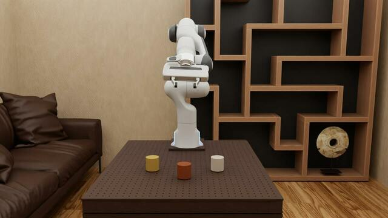
.. |splace| image:: ../_static/tasks/deformable/place.jpg
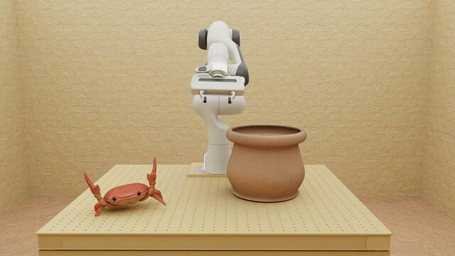
.. |shanoi| image:: ../_static/tasks/deformable/tower_of_hanoi.jpg
.. |rope| image:: ../_static/tasks/deformable/rope.jpg
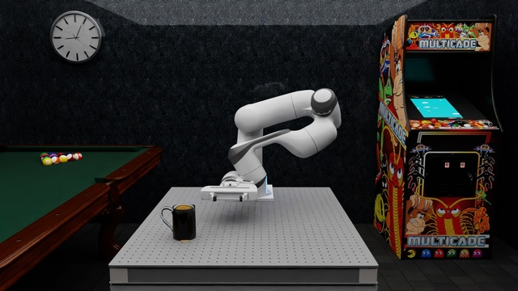
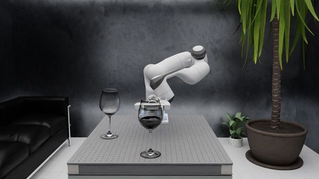

.. |mreach| image:: ../_static/tasks/rigid/mobile_reach.jpg
.. |mcabint| image:: ../_static/tasks/rigid/mobile_cabinet.jpg
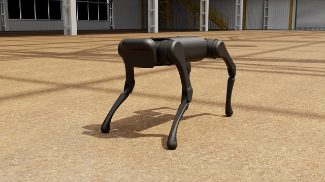
