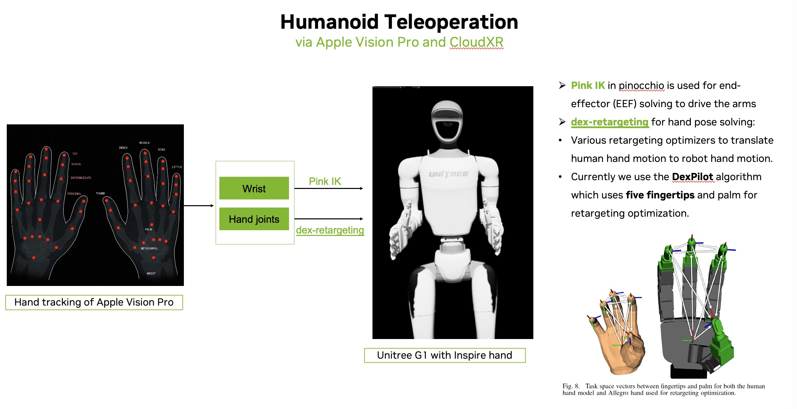
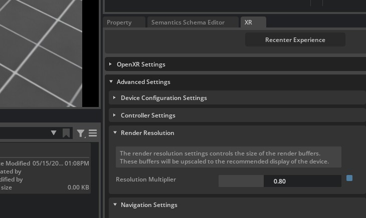
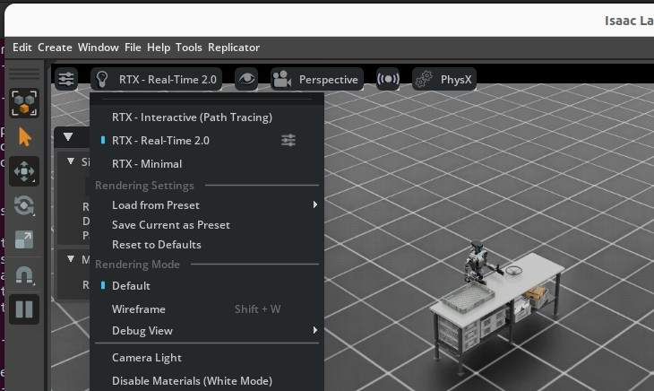
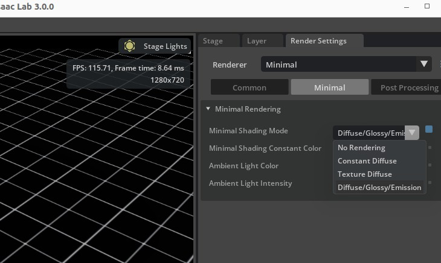

.. _isaac-teleop-deep-dive:

Isaac Teleop: Architecture Deep Dive
====================================

.. currentmodule:: isaaclab

This guide explains how Isaac Teleop integrates with Isaac Lab, including retargeting pipelines,
environment configuration, XR behavior, haptics, standalone devices, and performance tuning.

If you only want to start a teleoperation session, see :ref:`isaac-teleop-feature` and
:ref:`cloudxr-teleoperation`.

.. _isaac-teleop-architecture:

Architecture
------------

:class:`~isaaclab_teleop.IsaacTeleopDevice` is the main integration point between Isaac Teleop
and Isaac Lab. It coordinates three components:

* **XrAnchorManager** maps XR tracking coordinates into the simulation world.
* **TeleopSessionLifecycle** creates and advances the Isaac Teleop session and retargeting pipeline.
* **CommandHandler** handles start, stop, and reset callbacks.

Each call to ``advance()`` steps the teleoperation session and, when ready, returns the flattened
action tensor expected by the environment.

.. dropdown:: Session creation and lifecycle

   XR sessions use deferred creation. Before **Start XR** is activated in Isaac Sim,
   ``advance()`` retries session creation until the required OpenXR handles become available.

   Once connected, ``advance()`` returns a ``torch.Tensor`` on the configured device. It returns
   ``None`` while the session is unavailable or after it has been torn down.

   Standalone sessions do not depend on Kit XR handles and can start as soon as the CloudXR
   runtime is available. See :ref:`isaac-teleop-standalone`.

.. _isaac-teleop-retargeting:

Retargeting Pipeline
--------------------

Isaac Teleop uses a graph-based retargeting pipeline:

**input source → coordinate transform → retargeters → action tensor**

   Example hand-tracking pipeline for a dexterous humanoid. The same graph model is used for
   controller, hand-tracking, and external-device inputs.

Input Sources
~~~~~~~~~~~~~

The most common source nodes are:

* ``HandsSource`` — left and right hand tracking with 26 joints per hand.
* ``ControllersSource`` — controller grip pose, trigger, squeeze, thumbstick, and related inputs.

External devices can provide additional source nodes through Isaac Teleop plugins.

Retargeters
~~~~~~~~~~~

The built-in Isaac Lab environments primarily use the following retargeters:

.. list-table::
   :header-rows: 1
   :widths: 28 72

   * - Retargeter
     - Purpose
   * - ``Se3AbsRetargeter``
     - Maps hand or controller tracking to an absolute 7D end-effector pose.
   * - ``Se3RelRetargeter``
     - Maps tracking input to a 6D relative end-effector command.
   * - ``GripperRetargeter``
     - Produces a scalar gripper command from a controller trigger or hand pinch.
   * - ``DexHandRetargeter`` / ``DexBiManualRetargeter``
     - Maps full hand tracking to robot-specific dexterous-hand joint angles.
   * - ``TriHandMotionControllerRetargeter``
     - Maps controller trigger and squeeze inputs to G1 TriHand joints.
   * - ``LocomotionRootCmdRetargeter``
     - Maps controller thumbsticks to planar velocity, yaw rate, and hip height.
   * - ``TensorReorderer``
     - Flattens and reorders retargeter outputs into the environment action tensor.

.. note::

   ``DexHandRetargeter`` requires a robot hand URDF and retargeting configuration. Fingertip
   links should be located at the actual fingertips rather than mid-finger.

   .. figure:: ../../_static/teleop/hand_asset.jpg
      :align: center
      :figwidth: 90%
      :alt: Mid-finger and fingertip link comparison for dexterous retargeting

The complete set of retargeters is maintained in the
`Isaac Teleop <https://github.com/NVIDIA/IsaacTeleop>`_ repository.

.. _isaac-teleop-pipeline-builder:

Build a Retargeting Pipeline
----------------------------

A pipeline builder creates the retargeting graph and returns an ``OutputCombiner`` containing a
single ``"action"`` output.

The example below creates a controller-driven Franka pipeline with end-effector pose and gripper
control:

.. code-block:: python

   def _build_franka_stack_pipeline():
       from isaacteleop.retargeting_engine.deviceio_source_nodes import (
           ControllersSource,
           HandsSource,
       )
       from isaacteleop.retargeting_engine.interface import OutputCombiner, ValueInput
       from isaacteleop.retargeting_engine.tensor_types import TransformMatrix
       from isaacteleop.retargeters import (
           GripperRetargeter,
           GripperRetargeterConfig,
           Se3AbsRetargeter,
           Se3RetargeterConfig,
           TensorReorderer,
       )

       # Input sources
       controllers = ControllersSource(name="controllers")
       hands = HandsSource(name="hands")

       # Transform XR data into the simulation world frame
       transform_input = ValueInput("world_T_anchor", TransformMatrix())
       transformed_controllers = controllers.transformed(
           transform_input.output(ValueInput.VALUE)
       )

       # End-effector pose
       se3 = Se3AbsRetargeter(
           Se3RetargeterConfig(
               input_device=ControllersSource.RIGHT,
               target_offset_roll=90.0,
           ),
           name="ee_pose",
       )
       connected_se3 = se3.connect({
           ControllersSource.RIGHT:
               transformed_controllers.output(ControllersSource.RIGHT),
       })

       # Gripper
       gripper = GripperRetargeter(
           GripperRetargeterConfig(hand_side="right"),
           name="gripper",
       )
       connected_gripper = gripper.connect({
           ControllersSource.RIGHT:
               transformed_controllers.output(ControllersSource.RIGHT),
           HandsSource.RIGHT:
               hands.output(HandsSource.RIGHT),
       })

       # Environment action tensor
       ee_elements = [
           "pos_x", "pos_y", "pos_z",
           "quat_x", "quat_y", "quat_z", "quat_w",
       ]

       reorderer = TensorReorderer(
           input_config={
               "ee_pose": ee_elements,
               "gripper_command": ["gripper_value"],
           },
           output_order=ee_elements + ["gripper_value"],
           name="action_reorderer",
           input_types={
               "ee_pose": "array",
               "gripper_command": "scalar",
           },
       )

       connected_reorderer = reorderer.connect({
           "ee_pose": connected_se3.output("ee_pose"),
           "gripper_command": connected_gripper.output("gripper_command"),
       })

       return OutputCombiner({
           "action": connected_reorderer.output("output"),
       })

.. important::

   ``TensorReorderer.output_order`` must match the action space expected by the environment.

.. _isaac-teleop-switching-input-mode:

Switch Between Controllers and Hand Tracking
~~~~~~~~~~~~~~~~~~~~~~~~~~~~~~~~~~~~~~~~~~~~

Input mode is defined by the retargeting graph rather than by the environment itself.

To switch from controllers to hand tracking:

#. Replace ``ControllersSource`` with ``HandsSource``.
#. Point ``Se3RetargeterConfig.input_device`` to the corresponding hand.
#. Enable ``use_wrist_position`` and ``use_wrist_rotation``.
#. Adjust the end-effector orientation offset if needed.

For example:

.. code-block:: python

   se3_cfg = Se3RetargeterConfig(
       input_device=HandsSource.RIGHT,
       use_wrist_position=True,
       use_wrist_rotation=True,
       target_offset_roll=0.0,
   )

   transformed_hands = hands.transformed(
       transform_input.output(ValueInput.VALUE)
   )

   connected_se3 = se3.connect({
       HandsSource.RIGHT:
           transformed_hands.output(HandsSource.RIGHT),
   })

``GripperRetargeter`` can consume either source: controller input uses the trigger, while hand
tracking uses thumb-index pinch distance.

To switch back to controllers, use a ``ControllersSource`` input and disable the wrist-position
and wrist-rotation options.

.. note::

   Controller grip frames and hand wrist frames have different orientations, so
   ``target_offset_roll``, ``target_offset_pitch``, and ``target_offset_yaw`` may need adjustment.

.. _isaac-teleop-env-config:

Configure the Environment
-------------------------

Register the pipeline with :class:`~isaaclab_teleop.IsaacTeleopCfg`:

.. code-block:: python

   from isaaclab_teleop import IsaacTeleopCfg, XrCfg

   @configclass
   class MyTeleopEnvCfg(ManagerBasedRLEnvCfg):

       xr: XrCfg = XrCfg(anchor_pos=(0.5, 0.0, 0.5))

       def __post_init__(self):
           super().__post_init__()

           self.isaac_teleop = IsaacTeleopCfg(
               pipeline_builder=_build_my_pipeline,
               sim_device=self.sim.device,
               xr_cfg=self.xr,
           )

The most commonly used fields are:

.. list-table::
   :header-rows: 1
   :widths: 30 70

   * - Field
     - Purpose
   * - ``pipeline_builder``
     - Builds the retargeting pipeline and returns its ``"action"`` output.
   * - ``xr_cfg``
     - Configures the XR anchor and viewer relationship.
   * - ``xr_camera_feeds``
     - Selects task cameras to show as XR picture-in-picture feeds.
   * - ``xr_camera_feed_layout``
     - Controls placement and layout of XR camera panels.
   * - ``plugins``
     - Configures Isaac Teleop plugins such as Manus.
   * - ``sim_device``
     - Torch device used by teleoperation. Default: ``"cuda:0"``.
   * - ``retargeters_to_tune``
     - Exposes selected retargeters to the live tuning interface.
   * - ``retargeting_execution``
     - Configures synchronous or pipelined retargeting execution.

.. warning::

   ``pipeline_builder`` and ``retargeters_to_tune`` must be callables rather than pre-built graph
   objects. ``@configclass`` deep-copies mutable configuration attributes.

.. _isaac-teleop-control-states:

Control Start, Stop, and Reset
------------------------------

XR clients can send **start**, **stop**, and **reset** commands to Isaac Lab. These commands can
start or pause teleoperation, control demonstration recording, and reset the environment without
using the host workstation.

In application code, poll them once per frame:

.. code-block:: python

   from isaaclab_teleop import poll_control_events

   with IsaacTeleopDevice(cfg) as device:
       running = False

       while sim_app.is_running():
           action = device.advance()
           ctrl = poll_control_events(device)

           if ctrl.is_active is not None:
               running = ctrl.is_active

           if ctrl.should_reset:
               env.reset()

           if action is not None and running:
               env.step(action.repeat(num_envs, 1))
           else:
               env.sim.render()

:class:`~isaaclab_teleop.ControlEvents` exposes:

* ``is_active`` — ``True`` after start, ``False`` after stop, or ``None`` before either command.
* ``should_reset`` — ``True`` for one frame after a reset command.

The same state machine can be controlled locally with
:meth:`~isaaclab_teleop.IsaacTeleopDevice.request_start`,
:meth:`~isaaclab_teleop.IsaacTeleopDevice.request_stop`, and
:meth:`~isaaclab_teleop.IsaacTeleopDevice.reset`.

.. dropdown:: Control channel internals

   ``IsaacTeleopCfg`` enables a control channel by default using the UUID
   ``uuid5(NAMESPACE_DNS, "teleop_command")``.

   The XR client sends commands such as::

      {"type": "teleop_command", "message": {"command": "start teleop"}}
      {"type": "teleop_command", "message": {"command": "stop teleop"}}
      {"type": "teleop_command", "message": {"command": "reset teleop"}}

   ``TeleopMessageProcessor`` converts these messages into state-machine signals, and
   ``DefaultTeleopStateManager`` produces the resulting execution state and reset event.

   Execution events are also forwarded to retargeters through their ``ComputeContext``.

Disable the control channel by setting:

.. code-block:: python

   IsaacTeleopCfg(
       pipeline_builder=_build_my_pipeline,
       control_channel_uuid=None,
   )

A custom 16-byte UUID can also be supplied through ``control_channel_uuid``. The client must use
the same UUID.

.. _isaac-teleop-xr-anchor:

Configure the XR Anchor
-----------------------

:class:`~isaaclab_teleop.XrCfg` controls how the simulation is positioned relative to the XR
tracking space.

``anchor_pos`` / ``anchor_rot``
   Set a static anchor pose. For manipulation tasks, place the anchor near the floor beneath the
   robot.

``anchor_prim_path``
   Attach the anchor to a USD prim. This is useful for locomotion tasks where the viewer should
   follow the robot.

``anchor_rotation_mode``
   Controls how the anchor follows orientation:

   .. list-table::
      :header-rows: 1
      :widths: 30 70

      * - Mode
        - Behavior
      * - ``FIXED``
        - Uses ``anchor_rot`` and remains fixed.
      * - ``FOLLOW_PRIM``
        - Continuously follows the attached prim orientation.
      * - ``FOLLOW_PRIM_SMOOTHED``
        - Follows with slerp smoothing to reduce abrupt viewer rotation.
      * - ``CUSTOM``
        - Uses a custom ``anchor_rotation_custom_func``.

``fixed_anchor_height``
   Keeps the initial anchor height fixed. Enabled by default.

``near_plane``
   Sets the closest XR render distance. Default: ``0.15`` m.

For ``FOLLOW_PRIM_SMOOTHED``, ``anchor_rotation_smoothing_time`` controls smoothing duration and
defaults to 1 second.

.. note::

   On Apple Vision Pro, holding the digital crown can reset the local coordinate frame.

XR Camera Feedback
------------------

Isaac Teleop can display existing task cameras as picture-in-picture panels inside XR.

Tasks opt in by listing :class:`~isaaclab_teleop.XrCameraFeedCfg` entries:

.. code-block:: python

   from isaaclab_teleop import IsaacTeleopCfg, XrCameraFeedCfg

   self.isaac_teleop = IsaacTeleopCfg(
       pipeline_builder=_build_my_pipeline,
       xr_camera_feeds=[
           XrCameraFeedCfg(
               camera_name="left_wrist_camera",
               enable_dlss_ray_reconstruction=True,
               dlss_exec_mode="quality",
           ),
       ],
   )

The camera must already exist in the task scene. If the same camera is also configured as an
``mdp.image`` observation, the normal demonstration recorder stores the view shown to the operator.

PiP currently supports one environment instance. A task with enabled feeds therefore requires
``--num_envs 1``.

Camera Placement
~~~~~~~~~~~~~~~~

:class:`~isaaclab_teleop.XrCameraFeedLayoutCfg` supports three placement references:

.. list-table::
   :header-rows: 1
   :widths: 22 78

   * - Placement
     - Behavior
   * - ``viewer_start``
     - Places panels relative to the first valid headset pose, then keeps them fixed in the world.
   * - ``head_locked``
     - Keeps panels positioned relative to the current headset pose.
   * - ``world``
     - Uses an explicit pose in the Isaac Lab world frame.

Automatic layout modes include ``horizontal``, ``vertical``, and ``grid``:

.. code-block:: python

   from isaaclab_teleop import XrCameraFeedLayoutCfg

   self.isaac_teleop.xr_camera_feed_layout = XrCameraFeedLayoutCfg(
       placement="head_locked",
       mode="horizontal",
       distance_m=0.8,
   )

For fixed world placement:

.. code-block:: python

   self.isaac_teleop.xr_camera_feed_layout = XrCameraFeedLayoutCfg(
       placement="world",
       mode="grid",
       world_position_m=(0.0, 0.8, 1.6),
       world_orientation_xyzw=(0.7071067812, 0.0, 0.0, 0.7071067812),
       max_columns=2,
   )

``manual`` layout preserves each feed's individual offset. Automatic layouts arrange enabled
feeds around ``center_offset_m`` using ``panel_gap_m``.

Disable Camera Rendering
~~~~~~~~~~~~~~~~~~~~~~~~

Set ``enabled=False`` on an individual feed or use ``xr_camera_feeds=[]`` to disable PiP.

To remove external camera sensors entirely, pass:

.. code-block:: bash

   --disable_external_cameras

This reduces rendering cost but also removes camera observations and PiP feeds.

.. dropdown:: Rendering implementation details

   PiP uses Kit Scene UI and ``SpatialSource`` placement. Kit modules are imported only when an
   enabled feed is requested.

   If Scene UI is unavailable, the scripts warn and continue without PiP. Task-owned camera
   observations remain available.

   Selected feeds can request render-product-local DLSS Ray Reconstruction. On Isaac Sim 6.1 and
   newer, the session also enables the required responsive-denoising setting. Earlier versions
   fall back to classic DLSS.

.. _isaac-teleop-haptics:

Haptic Feedback
---------------

Isaac Teleop can send simulation-side contact information back to supported operator devices.

Two feedback modes are currently available:

* **Controller vibration** — maps total hand contact force to controller rumble.
* **Haptic gloves** — maps per-finger object contact forces to glove vibration.

The environment provides the contact signal, while the Isaac Teleop pipeline handles
device-specific output.

Controller Vibration
~~~~~~~~~~~~~~~~~~~~

Use :class:`~isaaclab_teleop.ControllerHapticFeedbackCfg` with contact sensors for each hand:

.. code-block:: python

   from isaaclab.sensors import ContactSensorCfg
   from isaaclab_teleop import ControllerHapticFeedbackCfg

   @configclass
   class MySceneCfg(InteractiveSceneCfg):
       left_hand_contact = ContactSensorCfg(
           prim_path="{ENV_REGEX_NS}/Robot/left_hand_.*_link",
           update_period=0.0,
           history_length=3,
       )
       right_hand_contact = ContactSensorCfg(
           prim_path="{ENV_REGEX_NS}/Robot/right_hand_.*_link",
           update_period=0.0,
           history_length=3,
       )

   self.scene.robot.spawn.activate_contact_sensors = True

   self.haptic_feedback = ControllerHapticFeedbackCfg(
       left_sensor_name="left_hand_contact",
       right_sensor_name="right_hand_contact",
   )

The default mapping is based on:

``amplitude = clamp(gain * (force - deadband), 0, saturation)``

Controller feedback is delivered through OpenXR and requires no additional CloudXR profile
configuration.

Haptic Gloves
~~~~~~~~~~~~~

Use :class:`~isaaclab_teleop.GloveHapticFeedbackCfg` for per-finger feedback.

Contact sensors should filter against the manipulated object so each finger reports only its
force on that object:

.. code-block:: python

   self.haptic_feedback = GloveHapticFeedbackCfg(
       left_sensor_name="left_hand_contact",
       right_sensor_name="right_hand_contact",
   )

The glove backend sends a Thumb-to-Pinky force vector to an external glove plugin.

.. note::

   Haptic gloves use a cross-process device plugin. Run the vendor plugin and enable external
   push devices with ``NV_CXR_ENABLE_PUSH_DEVICES=1`` in a custom CloudXR profile.

   Contact sensor patterns must match the robot's actual finger body names.

.. _isaac-teleop-standalone:

Standalone I/O
--------------

Isaac Teleop can also run without headset rendering. This is useful for non-XR hardware such as
physical leader arms.

The teleoperation scripts select the mode with ``--xr``:

* **With ``--xr``** — use Kit XR for headset rendering and XR tracking.
* **Without ``--xr``** — create a standalone OpenXR session for device I/O without headset
  rendering.

Standalone sessions start teleoperation locally because there is no headset to send a start
command.

When a Kit viewport is available, the following shortcuts can also control the session:

.. list-table::
   :header-rows: 1
   :widths: 15 85

   * - Key
     - Action
   * - ``B``
     - Start or resume teleoperation.
   * - ``P``
     - Pause teleoperation.
   * - ``R``
     - Reset the environment.

Standalone mode automatically uses
:data:`~isaaclab_teleop.CLOUDXR_STANDALONE_ENV` unless another profile is selected.

.. _isaac-teleop-so101-leader-example:

SO-101 Leader Arm Example
~~~~~~~~~~~~~~~~~~~~~~~~~

``IsaacContrib-Stack-Cube-SO101-Joint-Teleop-v0`` mirrors six joint values from a physical SO-101
leader directly onto the simulated follower:

``JointStateSource → JointStateRetargeter → TensorReorderer``

No inverse kinematics or XR headset is required.

The full hardware setup, build, calibration, and recording workflow is documented in
`Data Collection in Sim`_. The essential Isaac Lab workflow is summarized here.

Build the Plugin
^^^^^^^^^^^^^^^^

The ``so101_leader_plugin`` is built from the Isaac Teleop repository and is not included in the
``isaacteleop`` Python package.

Install build dependencies:

.. code-block:: bash

   sudo apt-get update
   sudo apt-get install -y \
       build-essential cmake libx11-dev clang-format-14 ccache patchelf

Build Isaac Teleop:

.. code-block:: bash

   git clone https://github.com/NVIDIA/IsaacTeleop.git
   cd IsaacTeleop

   cmake -B build
   cmake --build build --parallel
   cmake --install build

The plugin is installed at:

.. code-block:: text

   install/plugins/so101_leader/so101_leader_plugin

See `Build from Source`_ for additional build options.

Calibrate the Leader
^^^^^^^^^^^^^^^^^^^^

Find the serial port:

.. code-block:: bash

   uvx --from "lerobot[hardware]" lerobot-find-port

Then run the plugin calibration:

.. code-block:: bash

   ./install/plugins/so101_leader/so101_leader_plugin \
       calibrate /dev/ttyACM0 so101_leader.calib

The calibration process records the leader's usable joint range and writes the mapping to the
specified file.

Run Isaac Lab
^^^^^^^^^^^^^

Without a headset:

.. code-block:: bash

   uv run --extra teleop isaaclab teleop run \
       --task IsaacContrib-Stack-Cube-SO101-Joint-Teleop-v0 \
       --num_envs 1 \
       --visualizer kit

To monitor the simulation in XR, add ``--xr``.

Start the Plugin
^^^^^^^^^^^^^^^^

After Isaac Lab starts the CloudXR runtime, open another terminal:

.. code-block:: bash

   cd /path/to/IsaacTeleop
   source ~/.cloudxr/run/cloudxr.env

   ./install/plugins/so101_leader/so101_leader_plugin \
       /dev/ttyACM0 \
       so101_leader \
       so101_leader.calib

The arguments are:

``[device_path] [collection_id] [calibration_file]``

The collection ID must remain ``so101_leader`` for this task.

Running the plugin with no arguments produces a synthetic trajectory, which is useful for testing
the pipeline without hardware:

.. code-block:: bash

   ./install/plugins/so101_leader/so101_leader_plugin

See the `SO-101 plugin README`_ and `Data Collection in Sim`_ for the complete workflow.

.. note::

   For the stack task, fully open the gripper before ending the episode. The success condition
   requires the gripper to be fully open after placement.

.. _isaac-teleop-cloudxr-profiles:

CloudXR Profiles
----------------

Isaac Lab ships profiles for the primary CloudXR modes:

.. list-table::
   :header-rows: 1
   :widths: 32 28 20 20

   * - Constant
     - Device profile
     - Push devices
     - Typical use
   * - :data:`~isaaclab_teleop.CLOUDXR_JS_ENV`
     - ``auto-webrtc``
     - Disabled
     - Quest / Pico with CloudXR.js
   * - :data:`~isaaclab_teleop.CLOUDXR_AVP_ENV`
     - ``auto-native``
     - Disabled
     - Apple Vision Pro
   * - :data:`~isaaclab_teleop.CLOUDXR_STANDALONE_ENV`
     - ``quest3``
     - Disabled
     - Standalone device I/O

The scripts select the appropriate default based on whether ``--xr`` is enabled.

Override the profile with ``--cloudxr_env``:

.. code-block:: bash

   uv run --extra teleop isaaclab teleop run \
       --task IsaacContrib-PickPlace-GR1T2-WaistEnabled-Abs \
       --visualizer kit \
       --xr \
       --cloudxr_env avp

You can also pass a custom ``.env`` file.

For example, to enable an external push device such as Manus:

.. code-block:: bash

   cp $(uv run --extra teleop python -c \
       "from isaaclab_teleop import CLOUDXR_JS_ENV; print(CLOUDXR_JS_ENV)") \
       ~/my-cloudxr.env

Then set:

.. code-block:: text

   NV_CXR_ENABLE_PUSH_DEVICES=1

and launch with:

.. code-block:: bash

   --cloudxr_env ~/my-cloudxr.env

All shipped profiles also set ``NV_ENABLE_POSE_WAIT=0`` to avoid CloudXR throttling during
application frame-time spikes.

To manage CloudXR manually instead of auto-launching it, use:

.. code-block:: bash

   --no-auto_launch_cloudxr

or set:

.. code-block:: bash

   ISAACLAB_CXR_SKIP_AUTOLAUNCH=1

Use ``--cloudxr_env none`` to disable CloudXR entirely.

.. _isaac-teleop-imitation-learning:

Record Demonstrations
---------------------

For environments configured with ``isaac_teleop``, use:

.. code-block:: bash

   uv run --extra teleop isaaclab teleop record \
       --task IsaacContrib-PickPlace-Locomanipulation-G1-Abs \
       --visualizer kit \
       --xr

The recorder automatically creates the Isaac Teleop device from the environment configuration.

Legacy ``isaaclab.devices`` environments instead select a device explicitly:

.. code-block:: bash

   uv run isaaclab teleop record \
       --task IsaacContrib-Stack-Cube-Galbot-Left-Arm-Gripper-RmpFlow \
       --teleop_device keyboard

Recorded demonstrations are stored as HDF5 datasets and can be used with Isaac Lab Mimic or other
imitation-learning workflows.

For replay, augmentation, and policy training, see :ref:`teleoperation-imitation-learning`.

Extending Isaac Teleop
----------------------

.. _isaac-teleop-new-embodiment:

Add a New Robot
~~~~~~~~~~~~~~~

To support a new robot:

#. Choose an input and control scheme from :ref:`isaac-teleop-control-schemes`.
#. Build a retargeting pipeline whose output matches the environment action space.
#. Configure dexterous-hand assets if required.
#. Configure an XR anchor when using XR.
#. Register the pipeline with ``IsaacTeleopCfg``.

For most manipulators, an existing combination such as ``Se3AbsRetargeter`` +
``GripperRetargeter`` is sufficient.

.. _isaac-teleop-new-retargeter:

Add a New Retargeter
~~~~~~~~~~~~~~~~~~~~

If existing retargeters do not cover your control scheme:

#. Inherit from ``BaseRetargeter``.
#. Implement ``input_spec()``, ``output_spec()``, and ``compute()``.
#. Optionally expose live-tunable values through ``ParameterState``.
#. Connect the retargeter to existing or custom source nodes.

See the `Isaac Teleop repository <https://github.com/NVIDIA/IsaacTeleop>`_ and
`Contributing Guide <https://github.com/NVIDIA/IsaacTeleop/blob/main/CONTRIBUTING.md>`_.

.. _isaac-teleop-new-device:

Add a New Device
~~~~~~~~~~~~~~~~

There are two common integration paths:

**Isaac Teleop plugin**
   Use a C++ plugin when the hardware requires its own SDK or driver. Plugins publish device data
   through OpenXR tensor collections.

**Pipeline-only integration**
   If the device already appears as supported hand, controller, or tensor data, only the
   ``pipeline_builder`` needs to change.

See the
`Isaac Teleop plugins directory <https://github.com/NVIDIA/IsaacTeleop/tree/main/src/plugins/>`_
for examples.

Debugging
---------

.. _isaac-teleop-tracking-debug-visualization:

Visualize XR Tracking
~~~~~~~~~~~~~~~~~~~~~

Use ``--enable_debug_visualization`` to visualize raw XR tracking data:

.. code-block:: bash

   uv run --extra teleop isaaclab teleop run \
       --task IsaacContrib-PickPlace-Locomanipulation-G1-Abs \
       --visualizer kit \
       --xr \
       --enable_debug_visualization

The visualizer displays:

* red spheres for tracked hand joints;
* RGB axes for controller aim poses.

These markers are diagnostic only and do not affect the retargeting output.

.. note::

   Tracking markers require the Kit visualizer and appear only after valid tracking data has been
   received.

.. _isaac-teleop-performance:

Optimize XR Performance
-----------------------

Start with the changes that usually have the largest impact:

#. Match simulation and render rates to the workload.
#. Disable camera rendering when it is not needed.
#. Run without the local viewport when possible.
#. Lower XR render resolution if GPU-bound.
#. Use RTX - Minimal when additional rendering savings are needed.
#. Tune retargeting execution only if profiling shows it is significant.

Physics and Rendering Rate
~~~~~~~~~~~~~~~~~~~~~~~~~~

A common starting point is 90 Hz physics with rendering every second step:

.. code-block:: python

   self.sim.dt = 1.0 / 90
   self.sim.render_interval = 2

This produces 45 rendered frames per second while keeping physics at 90 Hz.

Smaller simulation time steps generally improve contact stability at higher computational cost.
Increase ``render_interval`` when rendering is the bottleneck but physics can keep up.

Disable External Cameras
~~~~~~~~~~~~~~~~~~~~~~~~

If camera observations and PiP are not required:

.. code-block:: bash

   uv run --extra teleop isaaclab teleop run \
       --task IsaacContrib-PickPlace-Locomanipulation-G1-Abs \
       --visualizer kit \
       --xr \
       --disable_external_cameras

This removes external camera rendering and suppresses configured XR camera feeds.

Run Without the Local Viewport
~~~~~~~~~~~~~~~~~~~~~~~~~~~~~~

The local Kit viewport consumes additional GPU resources. To render only for XR:

.. code-block:: bash

   uv run --extra teleop isaaclab teleop run \
       --task IsaacContrib-PickPlace-Locomanipulation-G1-Abs \
       --viz none \
       --xr

Headless XR starts automatically when a client connects.

.. note::

   The old ``--headless`` flag is no longer used. Headless is the default when no visualizer is
   selected.

Lower XR Resolution
~~~~~~~~~~~~~~~~~~~

In **XR → Advanced Settings → Render Resolution**, reduce **Resolution Multiplier**.

A value around ``0.8`` is a reasonable first step when the application is GPU-bound.

RTX - Minimal
~~~~~~~~~~~~~

The **RTX - Minimal** renderer can substantially reduce rendering cost.

.. important::

   Start the XR session with the default renderer first. Starting XR while RTX - Minimal is
   already active can prevent control input from being applied.

After teleoperation is working, select **RTX - Minimal** from the viewport renderer menu.

For best results, select **Diffuse/Glossy/Emission** under the Minimal render settings.

.. note::

   RTX - Minimal supports ``DistantLight`` for scene illumination. If a scene relies on a
   ``DomeLight``, add or replace it with a ``DistantLight``.

Retargeting Execution
~~~~~~~~~~~~~~~~~~~~~

Retargeting can run synchronously or on a pipelined worker.

The default pipelined configuration is:

.. code-block:: python

   retargeting_execution=RetargetingExecutionConfig(
       mode="pipelined",
       pacing=DeadlinePacingConfig(
           safety_margin_s=0.025,
       ),
   )

Use ``mode="sync"`` for lightweight, Python-heavy retargeting where worker-thread GIL contention
outweighs the benefit of overlap.

Use ``mode="pipelined"`` when retargeting contains enough native or expensive work to overlap with
simulation and rendering.

Increase ``safety_margin_s`` if retargeting occasionally misses its deadline.

CloudXR Frame Pacing
~~~~~~~~~~~~~~~~~~~~

Repeated application frame-time spikes can cause CloudXR to settle at a lower stable rate.

The shipped profiles set:

.. code-block:: text

   NV_ENABLE_POSE_WAIT=0

If you create a custom CloudXR profile, retain this setting unless you intentionally want
pose-wait smoothing.

.. _isaac-teleop-env-control-reference:

Teleoperation Environment Reference
-----------------------------------

The following tables summarize built-in teleoperation environments by input stack.

Isaac Teleop Environments
~~~~~~~~~~~~~~~~~~~~~~~~~

.. list-table::
   :header-rows: 1
   :widths: 38 18 44

   * - Task ID
     - Input
     - Control
   * - ``IsaacContrib-Stack-Cube-Franka-IK-Abs``
     - Right controller
     - End-effector pose + trigger gripper
   * - ``IsaacContrib-Stack-Cube-SO101-IK-Abs-v0``
     - Right controller
     - Absolute IK + analog trigger gripper
   * - ``IsaacContrib-PickPlace-GR1T2-Abs``
     - Both hands
     - Wrist-pose arm control + dexterous hand retargeting
   * - ``IsaacContrib-PickPlace-GR1T2-WaistEnabled-Abs``
     - Both hands
     - Same as GR1T2 pick-place with waist enabled
   * - ``IsaacContrib-NutPour-GR1T2-Pink-IK-Abs``
     - Both hands
     - GR1T2 hand-tracking pipeline
   * - ``IsaacContrib-ExhaustPipe-GR1T2-Pink-IK-Abs``
     - Both hands
     - GR1T2 hand-tracking pipeline
   * - ``IsaacContrib-PickPlace-G1-InspireFTP-Abs``
     - Both hands
     - Wrist-pose arms + Inspire hand retargeting
   * - ``IsaacContrib-PickPlace-FixedBaseUpperBodyIK-G1-Abs``
     - Both controllers
     - Arm pose + TriHand trigger/squeeze mapping
   * - ``IsaacContrib-PickPlace-Locomanipulation-G1-Abs``
     - Both controllers
     - Arm + TriHand + thumbstick locomotion

Legacy Device Environments
~~~~~~~~~~~~~~~~~~~~~~~~~~

Keyboard, SpaceMouse, and gamepad environments use ``isaaclab.devices`` rather than Isaac Teleop.

.. list-table::
   :header-rows: 1
   :widths: 45 20 35

   * - Task ID
     - Devices
     - Control
   * - ``IsaacContrib-Stack-Cube-Galbot-Left-Arm-Gripper-RmpFlow``
     - Keyboard, SpaceMouse
     - Left arm + gripper
   * - ``IsaacContrib-Stack-Cube-Galbot-Right-Arm-Suction-RmpFlow``
     - Keyboard, SpaceMouse
     - Right arm + suction
   * - ``IsaacContrib-Stack-Cube-Galbot-Left-Arm-Gripper-Visuomotor``
     - Keyboard, SpaceMouse
     - Left arm + gripper + camera observations
   * - ``IsaacContrib-Place-Mug-Agibot-Left-Arm-RmpFlow``
     - Keyboard, SpaceMouse
     - Left arm + gripper
   * - ``IsaacContrib-Place-Toy2Box-Agibot-Right-Arm-RmpFlow``
     - Keyboard, SpaceMouse
     - Right arm + gripper
   * - ``IsaacContrib-Stack-Cube-UR10-Long-Suction-IK-Rel``
     - Keyboard, SpaceMouse
     - Relative IK + suction
   * - ``IsaacContrib-Stack-Cube-UR10-Short-Suction-IK-Rel``
     - Keyboard, SpaceMouse
     - Relative IK + suction
   * - ``Isaac-Reach-Franka``
     - Keyboard, Gamepad, SpaceMouse
     - Relative IK; no gripper

For keyboard, SpaceMouse, and gamepad mappings, see the corresponding device documentation.

.. note::

   RMPFlow is preferred for humanoid arms such as Galbot and Agibot because it respects joint
   limits. An arm may stop moving when the requested target is unreachable; this is expected.

Leader-Arm Environments
~~~~~~~~~~~~~~~~~~~~~~~

.. list-table::
   :header-rows: 1
   :widths: 45 20 35

   * - Task ID
     - Device
     - Control
   * - ``IsaacContrib-Stack-Cube-SO101-Joint-Teleop-v0``
     - SO-101 leader arm
     - Direct six-joint mirroring through ``JointStateRetargeter``

.. _isaac-teleop-known-issues:

Known Issues
------------

``XR_ERROR_VALIDATION_FAILURE`` when stopping XR
   Caused by an exit-handler race and can generally be ignored.

``XR_ERROR_INSTANCE_LOST`` in ``xrPollEvent``
   Occurs when the CloudXR runtime exits before Isaac Lab. Restart the runtime.

``TF_PYTHON_EXCEPTION`` when starting or stopping XR
   Caused by an XR enter/exit race and can generally be ignored.

``Invalid version string in _ParseVersionString``
   Usually originates from shader assets authored with older USD versions and is typically safe
   to ignore.

XR connects but no video appears
   The selected GPU index may differ between the host and container. Set ``NV_GPU_INDEX`` to the
   GPU used by the runtime.

.. _isaac-teleop-api-ref:

API Reference
-------------

See :ref:`isaaclab_teleop-api` for the complete API.

Common entry points include:

* :class:`~isaaclab_teleop.IsaacTeleopCfg`
* :class:`~isaaclab_teleop.IsaacTeleopDevice`
* :func:`~isaaclab_teleop.create_isaac_teleop_device`
* :class:`~isaaclab_teleop.ControlEvents`
* :func:`~isaaclab_teleop.poll_control_events`
* :class:`~isaaclab_teleop.XrCfg`
* :class:`~isaaclab_teleop.XrCameraFeedCfg`
* :class:`~isaaclab_teleop.XrCameraFeedLayoutCfg`
* :class:`~isaaclab_teleop.HapticFeedbackCfg`
* :class:`~isaaclab_teleop.ControllerHapticFeedbackCfg`
* :class:`~isaaclab_teleop.GloveHapticFeedbackCfg`

..
   References

.. _`Isaac XR Teleop Sample Client`: https://github.com/isaac-sim/isaac-xr-teleop-sample-client-apple
.. _`SO-101 plugin README`: https://github.com/NVIDIA/IsaacTeleop/tree/main/src/plugins/so101_leader
.. _`Data Collection in Sim`: https://nvidia.github.io/IsaacTeleop/main/getting_started/lerobot/data_collection_sim.html
.. _`Build from Source`: https://nvidia.github.io/IsaacTeleop/main/getting_started/build_from_source/index.html
