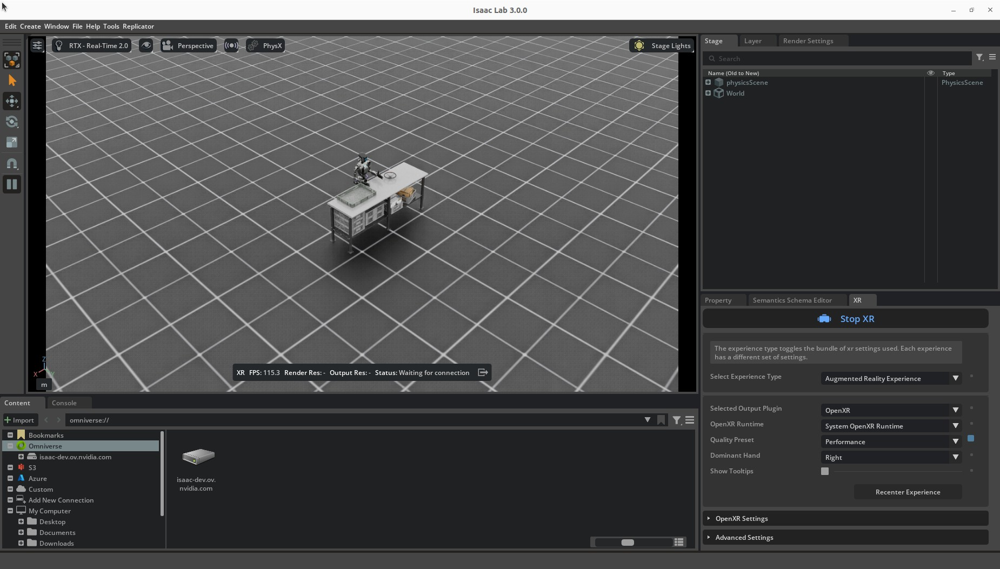

.. _cloudxr-teleoperation:

Set Up CloudXR Teleoperation
============================

.. currentmodule:: isaaclab

This guide walks you through setting up CloudXR teleoperation in Isaac Lab and connecting a
supported XR device.

If you are new to Isaac Teleop, start with :ref:`isaac-teleop-feature` for supported devices and
control schemes. For retargeting and architecture details, see :ref:`isaac-teleop-deep-dive`.

Prerequisites
-------------

You need:

* **Ubuntu 22.04 or 24.04** on an x86_64 workstation
* **NVIDIA GPU**
* **64 GB RAM** recommended
* **Python 3.12 or newer**
* **CUDA 12.8** recommended
* **NVIDIA driver 580.95.05** recommended
* **Wifi 6 capable router**, preferably dedicated to the XR connection
* An XR device and workstation that are IP-reachable from one another

For a target of 45 FPS with 120 Hz physics, we recommend an AMD Ryzen Threadripper 7960X or
equivalent and an RTX PRO 6000, RTX 5090, or better.

For additional GPU and driver requirements, see the
`Technical Requirements <https://docs.omniverse.nvidia.com/materials-and-rendering/latest/common/technical-requirements.html>`_
guide. For network recommendations, see the `CloudXR Network Setup`_ guide.

.. note::

   XR teleoperation is supported on **Linux x86_64 only** and is not currently supported on
   DGX Spark.

.. _teleop-workstation-capability-check:

Check Your Workstation
----------------------

When a teleoperation session starts, Isaac Lab automatically checks the workstation and reports
requirements that are not met. Warnings appear both in the terminal and as a dismissible banner
in the connected XR device.

The check is **advisory and does not block the session**.

.. list-table::
   :header-rows: 1
   :widths: 30 70

   * - Requirement
     - Threshold
   * - CPU single-thread
     - At least 80% of the reference CPU (AMD Ryzen Threadripper 7960X)
   * - CPU governor
     - ``performance``, unless single-thread performance already meets the threshold
   * - CPU boost clock
     - 4.0 GHz
   * - CPU physical cores
     - 8
   * - GPU memory
     - 24 GB
   * - GPU architecture
     - Compute capability 8.9 (Ada) or newer
   * - NVIDIA driver
     - 580 or newer
   * - System memory
     - 60 GiB
   * - CPU architecture
     - ``x86_64``

The check measures actual CPU single-thread performance rather than relying only on CPU model or
core count. Unavailable probes are reported as skipped, and on multi-GPU systems the GPU selected
with ``--device`` is checked.

To run the check independently:

.. code-block:: bash

   uv run --extra teleop python -c \
       "from isaaclab_teleop import check_system_requirements; print(check_system_requirements().format_table())"

.. _install-isaac-teleop:

Install Isaac Teleop
--------------------

The ``teleop`` extra installs Isaac Teleop, its CloudXR runtime, and the dependencies needed for
XR teleoperation.

#. Install the required system libraries:

   .. code-block:: bash

      sudo apt-get update
      sudo apt-get install -y libvulkan1 libbsd0

#. Set the CPU frequency governor to ``performance``:

   .. code-block:: bash

      sudo apt-get install -y linux-tools-common linux-tools-$(uname -r)
      sudo cpupower frequency-set -g performance

   Verify the setting:

   .. code-block:: bash

      cat /sys/devices/system/cpu/cpu0/cpufreq/scaling_governor

   Expected output:

   .. code-block:: text

      performance

   .. note::

      The governor setting does not survive a reboot unless you make it persistent. The workstation
      capability check reports it when needed.

#. Configure the firewall for your CloudXR client.

   **Meta Quest 3 / Pico 4 Ultra (CloudXR.js):**

   .. code-block:: bash

      sudo ufw allow 49100/tcp   # Signaling (WebRTC)
      sudo ufw allow 47998/udp   # Media stream
      sudo ufw allow 48322/tcp   # WSS proxy (HTTPS)

   **Apple Vision Pro (native CloudXR client):**

   .. code-block:: bash

      sudo ufw allow 48010/tcp   # Standard-mode signaling
      sudo ufw allow 48322/tcp   # Secure-mode signaling

      sudo ufw allow 47998/udp   # Video
      sudo ufw allow 48005/udp
      sudo ufw allow 48008/udp
      sudo ufw allow 48012/udp

      sudo ufw allow 47999/udp   # Input

      sudo ufw allow 48000/udp   # Audio
      sudo ufw allow 48002/udp

   For complete network requirements, see the `CloudXR Network Setup`_ documentation.

No separate Isaac Teleop installation is required: ``isaacteleop`` is included by the
``teleop`` extra.

.. note::

   Installing ``isaaclab_teleop`` by itself does **not** install ``isaacteleop``. For building
   Isaac Teleop from source or developing device plugins, see the
   `Isaac Teleop repository <https://github.com/NVIDIA/IsaacTeleop>`_.

.. note::

   ``teleop`` cannot be combined with ``ov`` or ``ovphysx`` in the same ``uv run`` command because
   of incompatible ``packaging`` version requirements. Install those runtimes separately when
   needed.

.. _run-isaac-lab-with-the-cloudxr-runtime:

Start a Teleoperation Session
-----------------------------

The CloudXR runtime starts automatically with the teleoperation command:

.. code-block:: bash

   uv run --extra teleop isaaclab teleop run \
       --task IsaacContrib-PickPlace-Locomanipulation-G1-Abs \
       --visualizer kit \
       --xr

.. attention::

   **First launch only:** Isaac Sim prompts you to accept the NVIDIA Omniverse License Agreement
   in the terminal. Enter ``Yes`` to continue.

To visualize incoming headset and controller tracking poses, add
``--enable_debug_visualization``. See :ref:`isaac-teleop-tracking-debug-visualization`.

Then, in Isaac Sim:

#. Open the **XR** panel.
#. Set **Selected Output Plugin** to **OpenXR**.
#. Set **OpenXR Runtime** to **System OpenXR Runtime**.

   .. figure:: ../../_static/setup/cloudxr_ar_panel.jpg
      :align: center
      :figwidth: 50%
      :alt: Isaac Sim UI: XR Panel

#. Click **Start XR**.

The viewport status bar displays **Waiting for connection** until a client connects.

Isaac Lab is now ready for a CloudXR client.

.. note::

   **Running headless:** omit ``--visualizer`` or use ``--visualizer none`` / ``--viz none``.
   In headless mode, XR starts automatically when a CloudXR client connects.

.. _connect-xr-device:

Connect an XR Device
--------------------

Choose the tab for your device.

.. tab-set::

   .. tab-item:: Meta Quest 3 / Pico 4 Ultra
      :selected:

      .. _connect-quest-pico:

      Meta Quest 3 and Pico 4 Ultra use the
      `CloudXR.js <https://docs.nvidia.com/cloudxr-sdk/latest/usr_guide/cloudxr_js/index.html>`_
      WebXR client.

      .. note::

         Pico 4 Ultra requires Pico OS 15.4.4U or later and HTTPS mode.

      #. Start Isaac Lab as described in
         :ref:`run-isaac-lab-with-the-cloudxr-runtime`.

      #. In the headset browser, open:

         `<https://nvidia.github.io/IsaacTeleop/client/release-1.4.x>`_

      #. Enter the IP address of the Isaac Lab workstation in **Server IP**.

      #. Accept the WSS proxy's self-signed certificate by selecting the
         **Click https://<ip>:48322/ to accept cert** link.

         .. image:: ../../_static/setup/cloudxr_accept_cert.jpg
            :alt: CloudXR.js certificate acceptance link
            :align: center
            :width: 400

         In the browser warning, select **Advanced**, then **Proceed to <ip> (unsafe)**.

         .. image:: ../../_static/setup/cloudxr_accept_cert_not_private.jpg
            :alt: Browser privacy warning for self-signed certificate
            :align: center
            :width: 500

         After the **Certificate Accepted** page appears, close that tab and return to CloudXR.js.

         .. image:: ../../_static/setup/cloudxr_accept_cert_accepted.jpg
            :alt: Certificate accepted confirmation page
            :align: center
            :width: 400

      #. Click **Connect**.

      .. note::

         The CloudXR.js client URL is versioned. The ``release-1.4.x`` client matches the
         ``isaacteleop~=1.4.0`` version currently used by Isaac Lab.

      For advanced configuration and troubleshooting, see the
      `CloudXR.js User Guide
      <https://docs.nvidia.com/cloudxr-sdk/latest/usr_guide/cloudxr_js/index.html>`_.

   .. tab-item:: Apple Vision Pro

      .. _use-apple-vision-pro:

      Apple Vision Pro connects through the native `Isaac XR Teleop Sample Client`_.

      It requires the ``auto-native`` CloudXR profile. Use the ``avp`` shorthand when launching
      the session:

      .. code-block:: bash

         uv run --extra teleop isaaclab teleop run \
             --task IsaacContrib-PickPlace-GR1T2-WaistEnabled-Abs \
             --visualizer kit \
             --xr \
             --cloudxr_env avp

      See :ref:`isaac-teleop-cloudxr-profiles` for CloudXR profile details.

      .. _build-apple-vision-pro:

      .. rubric:: Build the Client

      Requirements:

      * Apple Vision Pro with visionOS 26
      * Apple Silicon Mac with macOS Sequoia 15.6+ and Xcode 26.0

      On your Mac:

      #. Clone the client repository:

         .. code-block:: bash

            git clone git@github.com:isaac-sim/isaac-xr-teleop-sample-client-apple.git

      #. Check out the version that matches Isaac Lab:

         +-------------------+--------------------+
         | Isaac Lab Version | Client App Version |
         +===================+====================+
         | 3.0               | v3.0.0             |
         +-------------------+--------------------+
         | 2.3               | v2.3.0             |
         +-------------------+--------------------+

         .. code-block:: bash

            git checkout <client_app_version>

      #. Follow the repository README to build and install the app on Apple Vision Pro.

      .. _teleoperate-apple-vision-pro:

      .. rubric:: Connect and Teleoperate

      Before putting on the headset, you can verify connectivity from your Mac:

      .. code-block:: bash

         nc -vz <isaac-lab-ip> 48010

      Then, on Apple Vision Pro:

      #. Open the Isaac XR Teleop Sample Client.

         .. figure:: ../../_static/setup/cloudxr_avp_connect_ui.jpg
            :align: center
            :figwidth: 50%
            :alt: Apple Vision Pro connect UI

      #. Enter the IP address of the Isaac Lab workstation and select **Connect**.

      #. When the simulation appears, select **Play**.

         .. figure:: ../../_static/setup/cloudxr_avp_teleop_ui.jpg
            :align: center
            :figwidth: 50%
            :alt: Apple Vision Pro teleop UI

      #. Teleoperate the robot by moving your hands.

         .. figure:: https://download.isaacsim.omniverse.nvidia.com/isaaclab/images/cloudxr_bimanual_teleop.gif
            :align: center
            :alt: Bimanual dexterous teleoperation with CloudXR

      #. Select **Disconnect** when finished.

      .. tip::

         For bimanual tasks, visionOS Voice Control can provide hands-free access to **Play**,
         **Stop**, and **Reset**.

      .. note::

         If the IK solver fails, select **Reset** to return the robot to its initial pose.

         .. figure:: ../../_static/setup/cloudxr_avp_ik_error.jpg
            :align: center
            :figwidth: 80%
            :alt: IK error message in XR device

.. _manus-vive-handtracking:

Use Manus Gloves
----------------

Manus gloves provide high-fidelity finger tracking through the Manus SDK. Use them with a
hand-tracking task such as ``IsaacContrib-PickPlace-GR1T2-WaistEnabled-Abs``.

Requirements:

* Manus gloves
* Manus SDK license

The Manus plugin is included with ``isaacteleop`` and uses the same hand-tracking API and
retargeting pipelines as headset-based optical hand tracking.

External push-device peripherals such as Manus require
``NV_CXR_ENABLE_PUSH_DEVICES=1``. Create a custom CloudXR environment from a shipped profile:

.. code-block:: bash

   cp $(uv run --extra teleop python -c \
       "from isaaclab_teleop import CLOUDXR_JS_ENV; print(CLOUDXR_JS_ENV)") ~/manus.env

   sed -i \
       's/NV_CXR_ENABLE_PUSH_DEVICES=0/NV_CXR_ENABLE_PUSH_DEVICES=1/' \
       ~/manus.env

Then launch Isaac Lab with the custom profile:

.. code-block:: bash

   uv run --extra teleop isaaclab teleop run \
       --task IsaacContrib-PickPlace-GR1T2-WaistEnabled-Abs \
       --visualizer kit \
       --xr \
       --cloudxr_env ~/manus.env

See :ref:`isaac-teleop-cloudxr-profiles` for custom profile configuration and the
`Manus plugin documentation <https://nvidia.github.io/IsaacTeleop/main/device/manus.html>`_
for plugin details.

.. note::

   Manus support is now built into Isaac Teleop. The previous
   ``isaac-teleop-device-plugins`` repository and ``libsurvive``-based Vive tracker integration
   are no longer required.

Run with Docker
---------------

XR teleoperation runs in the same Isaac Lab container; a separate CloudXR container is not
required. The CloudXR runtime starts automatically with the teleoperation command.

Because Isaac Lab uses the host network, configure the same firewall rules from
:ref:`install-isaac-teleop` **on the host machine**.

.. attention::

   Isaac Lab Docker images 3.0.0-beta2 and later run as a non-root user with uid/gid ``1000``.
   Persistent volumes created by older root-based images may therefore be read-only.

   A permissions problem can appear as:

   .. code-block:: text

      PermissionError: [Errno 13] Permission denied: '/root/.local/share/ov/data/exts'

   For bind-mounted directories, make them writable by uid/gid ``1000`` before launching:

   .. code-block:: bash

      sudo chown -R 1000:1000 <directory>

   For named volumes created by an older Docker setup, either recreate the volume or change its
   ownership. See :ref:`deployment-docker` for details.

Run teleoperation normally inside the container. For example, to record demonstrations:

.. code-block:: bash

   uv run --extra teleop isaaclab teleop record \
       --task IsaacContrib-PickPlace-Locomanipulation-G1-Abs \
       --num_demos 5 \
       --dataset_file ./datasets/dataset.hdf5 \
       --xr \
       --visualizer kit

In the Isaac Sim UI, select **System OpenXR Runtime** and click **Start XR**.

For a headless session, use ``--visualizer none`` or ``--viz none`` instead.

Next Steps
----------

* **Architecture and retargeting:** :ref:`isaac-teleop-deep-dive`
* **Record demonstrations:** :ref:`teleoperation-imitation-learning`
* **API reference:** :ref:`isaaclab_teleop-api`

..
   References

.. _`Apple Vision Pro`: https://www.apple.com/apple-vision-pro/
.. _`NVIDIA CloudXR`: https://developer.nvidia.com/cloudxr-sdk
.. _`Isaac XR Teleop Sample Client`: https://github.com/isaac-sim/isaac-xr-teleop-sample-client-apple
.. _`CloudXR Network Setup`: https://docs.nvidia.com/cloudxr-sdk/latest/requirement/network_setup.html
.. _`CloudXR.js`: https://docs.nvidia.com/cloudxr-sdk/latest/usr_guide/cloudxr_js/index.html
