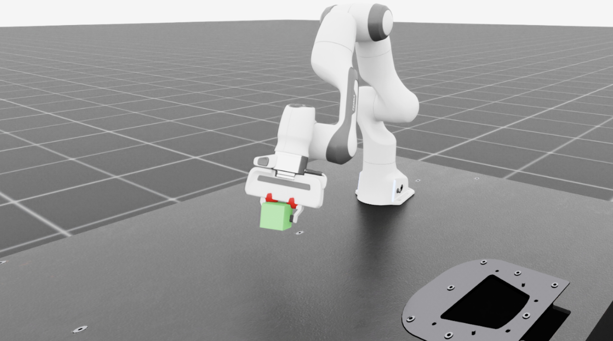

.. _haply-teleoperation:

Set Up Haply Teleoperation
==========================

.. currentmodule:: isaaclab

`Haply Devices`_ provide haptic input devices for robot teleoperation with directional force
feedback. Isaac Lab supports the Haply Inverse3 with VerseGrip for precise end-effector control
and force-feedback manipulation.

.. important::

   Haply uses a **separate device stack** (``isaaclab.devices.HaplyDevice``) and is not part of
   Isaac Teleop. It does not use the Isaac Teleop retargeting, control-state, camera, or haptics
   APIs. Currently, Haply support is limited to the demo described on this page.

.. _Haply Devices: https://haply.co/

.. _haply-system-requirements:

Requirements
------------

You need:

* **Isaac Lab workstation**

  * Ubuntu 22.04 or 24.04
  * 8-core Intel Core i7 / AMD Ryzen 7 or better
  * 32 GB RAM minimum; 64 GB recommended
  * RTX 3090 or better for the 200 Hz physics workload
  * Network access to the Haply devices

* **Haply hardware**

  * Haply Inverse3 for 3-DoF position tracking and force feedback
  * Haply VerseGrip for orientation sensing and button input

* **Software**

  * Isaac Lab; see :ref:`isaaclab-installation-root`
  * Haply SDK
  * Python 3.12 or newer

The ``websockets`` Python dependency is included with Isaac Lab.

.. _haply-installation:

Set Up the Devices
------------------

#. Install Isaac Lab by following :ref:`isaaclab-installation-root`.

#. Download and install the Haply SDK from the `Haply Devices`_ website.

#. Power on the Inverse3 and VerseGrip and verify that both appear as connected in the Haply
   Device Manager.

#. Place the Inverse3 on a stable surface, pair the VerseGrip, and keep the operating workspace
   clear.

#. Start the Haply SDK.

   By default, the SDK exposes device data over WebSocket at ``ws://localhost:10001`` and streams
   at 200 Hz.

.. _haply-device-setup:

Verify the Connection
---------------------

You can verify the WebSocket connection before launching Isaac Lab:

.. code-block:: python

   import asyncio
   import json

   import websockets

   async def test_haply():
       uri = "ws://localhost:10001"
       async with websockets.connect(uri) as ws:
           response = await ws.recv()
           data = json.loads(response)
           print("Inverse3:", data.get("inverse3", []))
           print("VerseGrip:", data.get("wireless_verse_grip", []))

   asyncio.run(test_haply())

You should see data streaming from both the Inverse3 and VerseGrip.

.. _haply-running-demo:

Run the Demo
------------

The Haply demo teleoperates a Franka Panda arm and streams simulated contact forces back to the
Inverse3.

   Haply Inverse3 and VerseGrip teleoperating a Franka Panda arm in Isaac Lab.

Make sure the Haply SDK is running, then launch:

.. code-block:: bash

   uv run python scripts/demos/haply_teleoperation.py \
       --websocket_uri ws://localhost:10001 \
       --pos_sensitivity 1.65

The demo maps the Inverse3 position to the robot end-effector, uses inverse kinematics to control
the Franka arm, and sends simulated contact forces back to the haptic device.

Controls
~~~~~~~~

* **Move Inverse3:** Move the robot end-effector
* **VerseGrip Button A:** Open the gripper
* **VerseGrip Button B:** Close the gripper
* **VerseGrip Button C:** Rotate the end-effector by 60 degrees

Customize the Demo
~~~~~~~~~~~~~~~~~~

Use a different WebSocket endpoint:

.. code-block:: bash

   uv run python scripts/demos/haply_teleoperation.py \
       --websocket_uri ws://192.168.1.100:10001

Adjust position sensitivity:

.. code-block:: bash

   uv run python scripts/demos/haply_teleoperation.py \
       --websocket_uri ws://localhost:10001 \
       --pos_sensitivity 2.0

.. _haply-physics-backends:

Choose a Physics and Visualizer Backend
~~~~~~~~~~~~~~~~~~~~~~~~~~~~~~~~~~~~~~~

The demo supports both Isaac Lab physics backends. Use ``--physics`` to select the backend and
``--visualizer`` when you want the Newton viewer instead of the default Kit viewport.

.. code-block:: bash

   # PhysX physics with the Kit viewer (default)
   uv run python scripts/demos/haply_teleoperation.py

   # Newton (MJWarp) physics with the Kit viewer
   uv run python scripts/demos/haply_teleoperation.py \
       --physics newton_mjwarp

   # Newton (MJWarp) physics with the Newton viewer
   uv run python scripts/demos/haply_teleoperation.py \
       --physics newton_mjwarp \
       --visualizer newton

.. _haply-troubleshooting:

Troubleshooting
---------------

No haptic feedback
~~~~~~~~~~~~~~~~~~

If the Inverse3 is not producing force feedback:

* Verify that the Inverse3 is active in the Haply SDK.
* Confirm that the robot is generating contact forces in simulation, for example by grasping
  the cube.
* Check that ``limit_force`` is not set too low. The default is ``2.0`` N.

Next Steps
----------

To build on the demo:

* Use :class:`~isaaclab.devices.HaplyDevice` in your own teleoperation script.
* Modify the workspace mapping, force limits, or VerseGrip button behavior.

See :class:`~isaaclab.devices.HaplyDevice` in the API documentation for the device interface.
