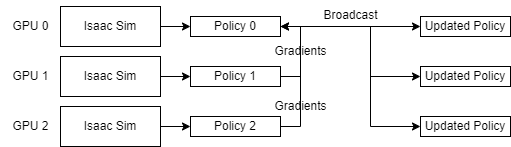

Multi-GPU and Multi-Node Training
=================================

.. currentmodule:: omni.isaac.lab

Isaac Lab supports multi-GPU and multi-node reinforcement learning on Linux.

Multi-GPU Training
------------------

For complex reinforcement learning environments, it may be desirable to scale up training across multiple GPUs.
This is possible in Isaac Lab with the ``rl_games`` RL library through the use of the
`PyTorch distributed <https://pytorch.org/docs/stable/distributed.html>`_ framework.
In this workflow, ``torch.distributed`` is used to launch multiple processes of training, where the number of
processes must be equal to or less than the number of GPUs available. Each process runs on
a dedicated GPU and launches its own instance of Isaac Sim and the Isaac Lab environment.
Each process collects its own rollouts during the training process and has its own copy of the policy
network. During training, gradients are aggregated across the processes and broadcasted back to the process
at the end of the epoch.

To train with multiple GPUs, use the following command, where ``--proc_per_node`` represents the number of available GPUs:

.. code-block:: shell

    python -m torch.distributed.run --nnodes=1 --nproc_per_node=2 source/standalone/workflows/rl_games/train.py --task=Isaac-Cartpole-v0 --headless --distributed

Due to limitations of NCCL on Windows, this feature is currently supported on Linux only.

Multi-Node Training
-------------------

To scale up training beyond multiple GPUs on a single machine, it is also possible to train across multiple nodes.
To train across multiple nodes/machines, it is required to launch an individual process on each node.
For the master node, use the following command, where ``--proc_per_node`` represents the number of available GPUs, and ``--nnodes`` represents the number of nodes:

.. code-block:: shell

    python -m torch.distributed.run --nproc_per_node=2 --nnodes=2 --node_rank=0 --rdzv_id=123 --rdzv_backend=c10d --rdzv_endpoint=localhost:5555 source/standalone/workflows/rl_games/train.py --task=Isaac-Cartpole-v0 --headless --distributed

Note that the port (``5555``) can be replaced with any other available port.

For non-master nodes, use the following command, replacing ``--node_rank`` with the index of each machine:

.. code-block:: shell

    python -m torch.distributed.run --nproc_per_node=2 --nnodes=2 --node_rank=1 --rdzv_id=123 --rdzv_backend=c10d --rdzv_endpoint=ip_of_master_machine:5555 source/standalone/workflows/rl_games/train.py --task=Isaac-Cartpole-v0 --headless --distributed

For more details on multi-node training with PyTorch, please visit the `PyTorch documentation <https://pytorch.org/tutorials/intermediate/ddp_series_multinode.html>`_. As mentioned in the PyTorch documentation, "multinode training is bottlenecked by inter-node communication latencies". When this latency is high, it is possible multi-node training will perform worse than running on a single node instance.

Due to limitations of NCCL on Windows, this feature is currently supported on Linux only.
