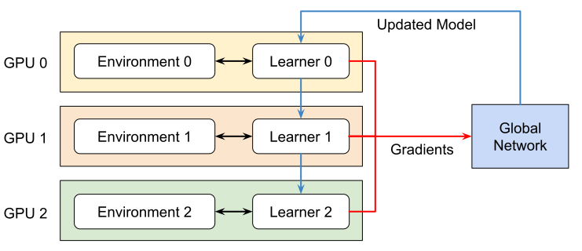
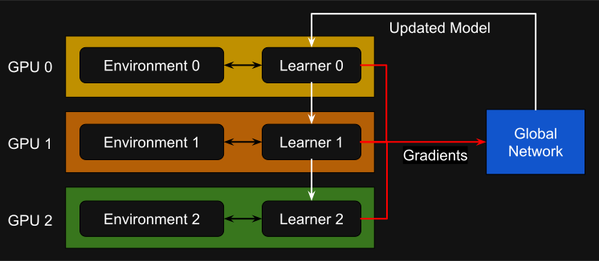

Multi-GPU and Multi-Node Training
=================================

.. currentmodule:: isaaclab

Isaac Lab supports multi-GPU and multi-node reinforcement learning. Currently, this feature is only
available for RL-Games, RSL-RL and skrl libraries workflows. We are working on extending this feature to
other workflows.

.. attention::

    Multi-GPU and multi-node training is only supported on Linux. Windows support is not available at this time.
    This is due to limitations of the NCCL library on Windows.

Multi-GPU Training
------------------

Isaac Lab supports the following multi-GPU training frameworks:

* `Torchrun <https://docs.pytorch.org/docs/stable/elastic/run.html>`_ through `PyTorch distributed <https://pytorch.org/docs/stable/distributed.html>`_
* `JAX distributed <https://jax.readthedocs.io/en/latest/jax.distributed.html>`_

Pytorch Torchrun Implementation
^^^^^^^^^^^^^^^^^^^^^^^^^^^^^^^

We are using `Pytorch Torchrun <https://docs.pytorch.org/docs/stable/elastic/run.html>`_ to manage multi-GPU
training. Torchrun manages the distributed training by:

* **Process Management**: Launching one process per GPU, where each process is assigned to a specific GPU.
* **Script Execution**: Running the same training script (e.g., RL Games trainer) on each process.
* **Environment Instances**: Each process creates its own instance of the Isaac Lab environment.
* **Gradient Synchronization**: Aggregating gradients across all processes and broadcasting the synchronized
  gradients back to each process after each training step.

.. tip::
    Check out this `3 minute youtube video from PyTorch <https://www.youtube.com/watch?v=Cvdhwx-OBBo&list=PL_lsbAsL_o2CSuhUhJIiW0IkdT5C2wGWj&index=2>`_
    to understand how Torchrun works.

The key components in this setup are:

* **Torchrun**: Handles process spawning, communication, and gradient synchronization.
* **RL Library**: The reinforcement learning library that runs the actual training algorithm.
* **Isaac Lab**: Provides the simulation environment that each process instantiates independently.

Under the hood, Torchrun uses the `DistributedDataParallel <https://docs.pytorch.org/docs/2.7/notes/ddp.html#internal-design>`_
module to manage the distributed training. When training with multiple GPUs using Torchrun, the following happens:

* Each GPU runs an independent process
* Each process executes the full training script
* Each process maintains its own:

  * Isaac Lab environment instance (with *n* parallel environments)
  * Policy network copy
  * Experience buffer for rollout collection

* All processes synchronize only for gradient updates

For a deeper dive into how Torchrun works, checkout
`PyTorch Docs: DistributedDataParallel - Internal Design <https://pytorch.org/docs/stable/notes/ddp.html#internal-design>`_.

Jax Implementation
^^^^^^^^^^^^^^^^^^

.. tip::
    JAX is only supported with the skrl library.

With JAX, we are using `skrl.utils.distributed.jax <https://skrl.readthedocs.io/en/latest/api/utils/distributed.html>`_
Since the ML framework doesn't automatically start multiple processes from a single program invocation,
the skrl library provides a module to start them.

|

Running Multi-GPU Training
^^^^^^^^^^^^^^^^^^^^^^^^^^

To train with multiple GPUs, use the following command, where ``--nproc_per_node`` represents the number of available GPUs:

.. tab-set::
    :sync-group: rl-train

    .. tab-item:: rl_games
        :sync: rl_games

        .. code-block:: shell

            python -m torch.distributed.run --nnodes=1 --nproc_per_node=2 scripts/reinforcement_learning/rl_games/train.py --task=Isaac-Cartpole-v0 --headless --distributed

    .. tab-item:: rsl_rl
        :sync: rsl_rl

        .. code-block:: shell

            python -m torch.distributed.run --nnodes=1 --nproc_per_node=2 scripts/reinforcement_learning/rsl_rl/train.py --task=Isaac-Cartpole-v0 --headless --distributed

    .. tab-item:: skrl
        :sync: skrl

        .. tab-set::

            .. tab-item:: PyTorch
                :sync: torch

                .. code-block:: shell

                    python -m torch.distributed.run --nnodes=1 --nproc_per_node=2 scripts/reinforcement_learning/skrl/train.py --task=Isaac-Cartpole-v0 --headless --distributed

            .. tab-item:: JAX
                :sync: jax

                .. code-block:: shell

                    python -m skrl.utils.distributed.jax --nnodes=1 --nproc_per_node=2 scripts/reinforcement_learning/skrl/train.py --task=Isaac-Cartpole-v0 --headless --distributed --ml_framework jax

Multi-Node Training
-------------------

To scale up training beyond multiple GPUs on a single machine, it is also possible to train across multiple nodes.
To train across multiple nodes/machines, it is required to launch an individual process on each node.

For the master node, use the following command, where ``--nproc_per_node`` represents the number of available GPUs, and
``--nnodes`` represents the number of nodes:

.. tab-set::
    :sync-group: rl-train

    .. tab-item:: rl_games
        :sync: rl_games

        .. code-block:: shell

            python -m torch.distributed.run --nproc_per_node=2 --nnodes=2 --node_rank=0 --master_addr=<ip_of_master> --master_port=5555 scripts/reinforcement_learning/rl_games/train.py --task=Isaac-Cartpole-v0 --headless --distributed

    .. tab-item:: rsl_rl
        :sync: rsl_rl

        .. code-block:: shell

            python -m torch.distributed.run --nproc_per_node=2 --nnodes=2 --node_rank=0 --master_addr=<ip_of_master> --master_port=5555 scripts/reinforcement_learning/rsl_rl/train.py --task=Isaac-Cartpole-v0 --headless --distributed

    .. tab-item:: skrl
        :sync: skrl

        .. tab-set::

            .. tab-item:: PyTorch
                :sync: torch

                .. code-block:: shell

                    python -m torch.distributed.run --nproc_per_node=2 --nnodes=2 --node_rank=0 --master_addr=<ip_of_master> --master_port=5555 scripts/reinforcement_learning/skrl/train.py --task=Isaac-Cartpole-v0 --headless --distributed

            .. tab-item:: JAX
                :sync: jax

                .. code-block:: shell

                    python -m skrl.utils.distributed.jax --nproc_per_node=2 --nnodes=2 --node_rank=0 --coordinator_address=ip_of_master_machine:5555 scripts/reinforcement_learning/skrl/train.py --task=Isaac-Cartpole-v0 --headless --distributed --ml_framework jax

Note that the port (``5555``) can be replaced with any other available port.

For non-master nodes, use the following command, replacing ``--node_rank`` with the index of each machine:

.. tab-set::
    :sync-group: rl-train

    .. tab-item:: rl_games
        :sync: rl_games

        .. code-block:: shell

            python -m torch.distributed.run --nproc_per_node=2 --nnodes=2 --node_rank=1 --master_addr=<ip_of_master> --master_port=5555 scripts/reinforcement_learning/rl_games/train.py --task=Isaac-Cartpole-v0 --headless --distributed

    .. tab-item:: rsl_rl
        :sync: rsl_rl

        .. code-block:: shell

            python -m torch.distributed.run --nproc_per_node=2 --nnodes=2 --node_rank=1 --master_addr=<ip_of_master> --master_port=5555 scripts/reinforcement_learning/rsl_rl/train.py --task=Isaac-Cartpole-v0 --headless --distributed

    .. tab-item:: skrl
        :sync: skrl

        .. tab-set::

            .. tab-item:: PyTorch
                :sync: torch

                .. code-block:: shell

                    python -m torch.distributed.run --nproc_per_node=2 --nnodes=2 --node_rank=1 --master_addr=<ip_of_master> --master_port=5555 scripts/reinforcement_learning/skrl/train.py --task=Isaac-Cartpole-v0 --headless --distributed

            .. tab-item:: JAX
                :sync: jax

                .. code-block:: shell

                    python -m skrl.utils.distributed.jax --nproc_per_node=2 --nnodes=2 --node_rank=1 --coordinator_address=ip_of_master_machine:5555 scripts/reinforcement_learning/skrl/train.py --task=Isaac-Cartpole-v0 --headless --distributed --ml_framework jax

For more details on multi-node training with PyTorch, please visit the
`PyTorch documentation <https://pytorch.org/tutorials/intermediate/ddp_series_multinode.html>`_.
For more details on multi-node training with JAX, please visit the
`skrl documentation <https://skrl.readthedocs.io/en/latest/api/utils/distributed.html>`_ and the
`JAX documentation <https://jax.readthedocs.io/en/latest/multi_process.html>`_.

.. note::

    As mentioned in the PyTorch documentation, "multi-node training is bottlenecked by inter-node communication
    latencies". When this latency is high, it is possible multi-node training will perform worse than running on
    a single node instance.
