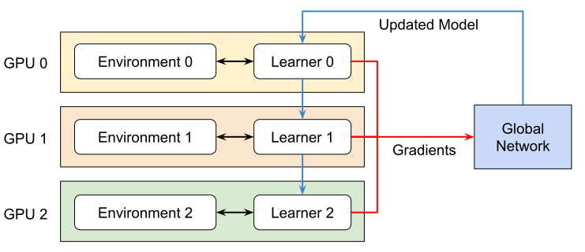
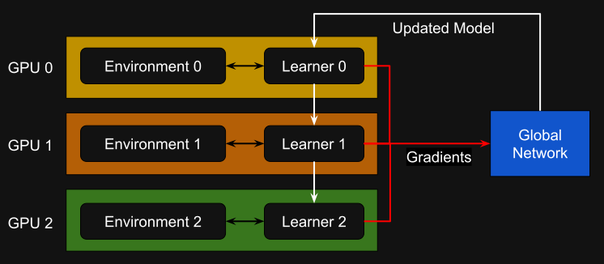

.. _train-multigpu-command:

Multi-GPU and Multi-Node Training
=================================

Scale one reinforcement learning job across the GPUs in a workstation or across
several nodes with ``train-multigpu``. Isaac Lab starts one training process per
GPU, gives each process its own simulation environments, and synchronizes policy
updates across the processes.

The same launcher model powers three multi-GPU benchmarks for measuring startup,
simulation, and end-to-end training performance.

.. attention::

   Multi-GPU and multi-node training requires Linux and NVIDIA NCCL. Windows is
   not supported.

.. warning::

   ``train-multigpu`` is experimental and may change in a future release.

Start a multi-GPU training run
------------------------------

First, verify that the task trains on one GPU. This separates task or
configuration problems from distributed-launch problems:

.. code-block:: bash

   uv run isaaclab train --task Isaac-Cartpole

Then run the same task on every visible GPU:

.. code-block:: bash

   uv run isaaclab train-multigpu --task Isaac-Cartpole

That is the complete transition from a single-GPU run. ``train-multigpu`` adds
``--distributed`` and selects the distributed launcher automatically. All other
arguments are the same arguments accepted by ``train``:

.. code-block:: bash

   uv run isaaclab train-multigpu \
      --task Isaac-Reorient-KukaAllegro \
      --num_envs 4096 \
      --max_iterations 100

``--num_envs`` is the number of environments **on each GPU**. With four GPUs and
``--num_envs 4096``, the job collects experience from 16,384 environments in
total.

.. tip::

   Add ``--dry_run`` to print the resolved launcher command without starting
   training. This is useful when checking GPU counts, rendezvous options, or
   forwarded training arguments.

Choose the GPUs
~~~~~~~~~~~~~~~

By default, the launcher uses every visible GPU. Set ``--num_gpus`` when you want
a specific worker count:

.. code-block:: bash

   uv run isaaclab train-multigpu --num_gpus 2 --task Isaac-Cartpole

Use ``CUDA_VISIBLE_DEVICES`` to choose the physical devices. The launcher sees
only the devices in that list:

.. code-block:: bash

   CUDA_VISIBLE_DEVICES=1,3 uv run isaaclab train-multigpu \
      --num_gpus 2 --task Isaac-Cartpole

Run ``nvidia-smi`` before launching to confirm that the expected devices are
available and have enough free memory.

Choose an RL library
~~~~~~~~~~~~~~~~~~~~

Multi-GPU training supports RSL-RL, RL-Games, and skrl. RSL-RL is the default
for most core tasks.

.. list-table::
   :header-rows: 1
   :widths: 18 22 60

   * - Library
     - Distributed backend
     - Command
   * - RSL-RL
     - PyTorch
     - ``uv run isaaclab train-multigpu --rl_library rsl_rl ...``
   * - RL-Games
     - PyTorch
     - ``uv run --extra rl-games isaaclab train-multigpu --rl_library rl_games ...``
   * - skrl
     - PyTorch
     - ``uv run --extra skrl isaaclab train-multigpu --rl_library skrl ...``
   * - skrl
     - JAX
     - ``uv run --extra skrl isaaclab train-multigpu --rl_library skrl --ml_framework jax ...``

skrl with JAX uses skrl's distributed launcher instead of ``torchrun``. Pass an
integer ``--num_gpus`` and use ``--coordinator_address`` to configure its
coordinator:

.. code-block:: bash

   uv run --extra skrl isaaclab train-multigpu \
      --rl_library skrl --ml_framework jax --num_gpus 4 \
      --coordinator_address localhost:5000 \
      --task Isaac-Cartpole

Measure scaling with the three multi-GPU benchmarks
---------------------------------------------------

Use the benchmark commands when the goal is to measure performance rather than
train a policy for later use. Isaac Lab provides three multi-GPU workflows:

.. list-table::
   :header-rows: 1
   :widths: 24 38 38

   * - Benchmark
     - What it measures
     - Use it to answer
   * - ``startup-multigpu``
     - Startup time for rank 0 while every GPU starts the same workload.
     - How does a fully occupied node affect startup?
   * - ``runtime-multigpu``
     - Simulation throughput for rank 0 while every GPU runs independently.
     - How does host contention affect environment stepping?
   * - ``training-multigpu``
     - Global, synchronized training throughput across every rank.
     - How well does end-to-end learning scale across GPUs?

Run each benchmark with the same launcher options used by ``train-multigpu``:

.. code-block:: bash

   uv run isaaclab benchmark startup-multigpu \
      --num_gpus 2 --task Isaac-Cartpole

   uv run isaaclab benchmark runtime-multigpu \
      --num_gpus 2 --task Isaac-Cartpole --num_envs 4096

   uv run isaaclab benchmark training-multigpu \
      --rl_library rsl_rl --num_gpus 2 \
      --task Isaac-Cartpole --num_envs 4096 --max_iterations 100

``training-multigpu`` supports RSL-RL, RL-Games, and skrl with PyTorch. The
startup and runtime results describe rank 0 under full-node contention; they are
not aggregate throughput. The training result is global because all ranks train
in lockstep.

When comparing one GPU with multiple GPUs, keep ``--num_envs`` constant **per
rank** and compare global training throughput. An N-GPU job processes N times as
many environments as the one-GPU job at the same per-rank setting.

See :ref:`testing_benchmarks_multigpu` for output fields, measurement scope, and
comparison guidance.

How multi-GPU training works
----------------------------

For PyTorch workflows, ``train-multigpu`` wraps
`torchrun <https://docs.pytorch.org/docs/stable/elastic/run.html>`_. It launches
one process per GPU. Each process owns:

* one Isaac Lab application and its vectorized environments,
* one copy of the policy,
* one rollout buffer, and
* one GPU selected by its local rank.

The processes collect experience independently and synchronize gradients during
policy updates with
`DistributedDataParallel <https://docs.pytorch.org/docs/stable/notes/ddp.html>`_.
Simulation does not move between GPUs, so available host CPU, RAM, and I/O can
become limiting factors as the GPU count grows.

Read logs from distributed runs
~~~~~~~~~~~~~~~~~~~~~~~~~~~~~~~

Every rank produces similar startup messages, warnings, and model summaries.
The launcher shows local rank 0 by default so the console remains readable.
Training metrics already come from global rank 0, and a crash on any hidden rank
still reports the failing rank and its traceback.

Show output from every rank when processes appear to disagree:

.. code-block:: bash

   uv run isaaclab train-multigpu \
      --task Isaac-Cartpole --log_all_ranks

For a clean console and complete per-rank logs on disk, use ``torchrun`` log
redirection:

.. code-block:: bash

   uv run isaaclab train-multigpu \
      --task Isaac-Cartpole --tee 3 --log_dir /tmp/isaaclab-rank-logs

The log filtering options apply to PyTorch workflows. skrl with JAX writes every
rank to the console.

Train across multiple nodes
---------------------------

Every node must have the same Isaac Lab checkout, dependencies, task
configuration, and access to training assets. The nodes must also be able to
reach one another on the rendezvous port.

Choose one node as the rendezvous host. For a two-node PyTorch job with four GPUs
per node, run the following on the first node:

.. code-block:: bash

   uv run isaaclab train-multigpu \
      --nnodes 2 --node_rank 0 --num_gpus 4 \
      --master_addr 10.0.0.10 --master_port 29500 \
      --task Isaac-Cartpole

Run the same command on the second node with its own rank:

.. code-block:: bash

   uv run isaaclab train-multigpu \
      --nnodes 2 --node_rank 1 --num_gpus 4 \
      --master_addr 10.0.0.10 --master_port 29500 \
      --task Isaac-Cartpole

The total world size is ``nnodes * num_gpus``: eight ranks in this example. You
can also use ``--rdzv_backend``, ``--rdzv_endpoint``, and ``--rdzv_id`` for an
elastic ``torchrun`` rendezvous. Add ``--dry_run`` first to verify the command on
each node.

For skrl with JAX, pass ``--nnodes``, ``--node_rank``, an integer
``--num_gpus``, and the same ``--coordinator_address`` on every node. Do not pass
the PyTorch rendezvous options to a JAX launch.

Multi-node scaling depends heavily on the network between nodes. A multi-node
job can be slower than a single-node job when gradient synchronization dominates
the training iteration.

Troubleshoot distributed training
---------------------------------

Start with the smallest useful diagnosis:

#. Confirm that the same task, backend, and training arguments work with
   ``isaaclab train`` on one GPU.
#. Add ``--dry_run`` and check the selected GPU and node counts.
#. Retry at world sizes 2, 3, and 4. A failure at only one world size often
   points to the communication transport rather than the task.
#. Check GPU placement and interconnects with ``nvidia-smi topo -m``.
#. Set ``NCCL_DEBUG=INFO`` to see which NCCL transport was selected.
#. Apply one workaround at a time and verify that the failure returns when the
   workaround is removed.

.. _multi-gpu-nccl-troubleshooting:

NCCL hangs and errors
~~~~~~~~~~~~~~~~~~~~~

A run that stops without a traceback while every participating GPU remains at
100% utilization is usually stalled in an NCCL collective. The following
workarounds address known system-specific transport problems:

.. list-table::
   :header-rows: 1
   :widths: 55 45

   * - Symptom
     - Try
   * - World size 2 hangs on a PCIe system without NVLink.
     - ``NCCL_P2P_DISABLE=1``
   * - ``illegal memory access`` appears in ``ProcessGroupNCCL``.
     - ``NCCL_SHM_DISABLE=1``
   * - A rendered job times out across NUMA nodes during ``BROADCAST`` or
       ``ALLREDUCE``.
     - ``NCCL_CUMEM_HOST_ENABLE=0``; if needed, try ``NCCL_CUMEM_ENABLE=0``.
   * - Communicator initialization or transport failures persist.
     - ``NCCL_IB_DISABLE=1`` or ``NCCL_ALGO=Ring``.

For example, test the first workaround without changing a shared configuration:

.. code-block:: bash

   NCCL_P2P_DISABLE=1 uv run isaaclab train-multigpu \
      --num_gpus 2 --task Isaac-Cartpole

These variables can reduce communication performance and should be scoped to
the affected machine. In particular, disabling P2P routes GPU traffic through
host memory. Do not commit a workaround into a task or launcher unless it is
required by every supported system.

.. dropdown:: Isolate a hang from Isaac Lab

   Run a minimal NCCL collective at the world size that hangs. Save this as
   ``nccl_probe.py``:

   .. code-block:: python

      import os

      import torch
      import torch.distributed as dist

      local_rank = int(os.environ["LOCAL_RANK"])
      torch.cuda.set_device(local_rank)
      dist.init_process_group("nccl")
      tensor = torch.ones(1024, device=f"cuda:{local_rank}")
      dist.all_reduce(tensor)
      torch.cuda.synchronize()
      print(f"rank {dist.get_rank()} ok", flush=True)
      dist.destroy_process_group()

   Launch the probe with the same rank count:

   .. code-block:: bash

      uv run python -m torch.distributed.run --nproc_per_node 2 nccl_probe.py

   If this probe also hangs, the problem is in NCCL or the system topology, not
   in Isaac Lab, the task, or the RL library.

The previous ``train_multigpu`` spelling remains available as a deprecated alias
for migration. New commands, scripts, and documentation should use
``train-multigpu``.
