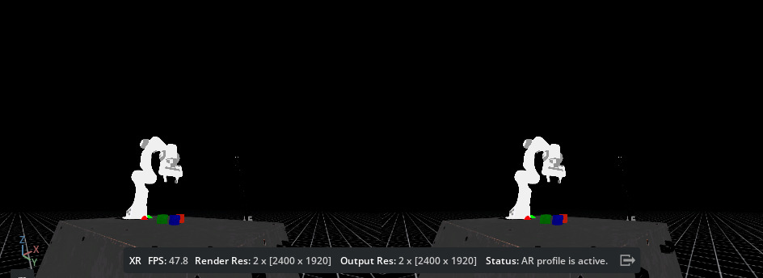

.. _cloudxr-teleoperation:

Setting up CloudXR Teleoperation
================================

.. currentmodule:: isaaclab

`NVIDIA CloudXR`_ enables seamless, high-fidelity immersive streaming to extended reality (XR)
devices over any network.

Isaac Lab developers can use CloudXR with Isaac Lab to build teleoperation workflows that require
immersive XR rendering for increased spatial acuity and/or hand tracking for teleoperation of
dextrous robots.

In these workflows, Isaac Lab renders and submits stereo views of the robot simulation to CloudXR,
which then encodes and streams the rendered views to a compatible XR device in realtime using a
low-latency, GPU-accelerated pipeline. Control inputs such as hand tracking data are sent from the
XR device back to Isaac Lab through CloudXR, where they can be used to control the robot.

This guide explains how to use CloudXR and `Apple Vision Pro`_ for immersive streaming and
teleoperation in Isaac Lab.

.. note::

   Support for additional devices is planned for future releases.

Overview
--------

Using CloudXR with Isaac Lab involves the following components:

* **Isaac Lab** is used to simulate the robot environment and apply control data received from the
  teleoperator.

* The **NVIDIA CloudXR Runtime** runs on the Isaac Lab workstation in a Docker container, and streams
  the virtual simulation from Isaac Lab to compatible XR devices.

* The **Isaac XR Teleop Sample Client** is a sample app for Apple Vision Pro which enables
  immersive streaming and teleoperation of an Isaac Lab simulation using CloudXR.

This guide will walk you through how to:

* :ref:`run-isaac-lab-with-the-cloudxr-runtime`

* :ref:`use-apple-vision-pro`, including how to :ref:`build-apple-vision-pro` and
  :ref:`teleoperate-apple-vision-pro`.

* :ref:`develop-xr-isaac-lab`, including how to :ref:`run-isaac-lab-with-xr`,
  :ref:`configure-scene-placement`, and :ref:`optimize-xr-performance`.

As well as :ref:`xr-known-issues`.

System Requirements
-------------------

Prior to using CloudXR with Isaac Lab, please review the following recommended system requirements:

  * Isaac Lab workstation (Linux)

    * Ubuntu 22.04
    * `Docker`_ 26.0.0+, `Docker Compose`_ 2.25.0+, and the `NVIDIA Container Toolkit`_. Refer to
      the Isaac Lab :ref:`deployment-docker` for how to install.
    * NVIDIA Driver version 550 or greater
    * For best performance: 16 cores Intel Core i9, X-series or higher AMD Ryzen 9, Threadripper or
      higher
    * For best performance: 64GB RAM
    * For best performance: 2x RTX 6000 Ada GPUs (or equivalent)

  * Apple Vision Pro

    * visionOS 2.0+
    * Apple M3 Pro chip with an 11-core CPU with at least 5 performance cores and 6 efficiency cores
    * 16GB unified memory
    * 256 GB SSD

  * Apple Silicon based Mac (for building the Isaac XR Teleop Sample Client App for Apple Vision Pro
    with Xcode)

    * macOS Sonoma 14.5 or later

  * Wifi 6 capable router

    * The Apple Vision Pro and Isaac Lab workstation must be IP-reachable from one another

.. _run-isaac-lab-with-the-cloudxr-runtime:

Run Isaac Lab with the CloudXR Runtime
--------------------------------------

The CloudXR Runtime runs in a Docker container on your Isaac Lab workstation, and is responsible for
streaming the Isaac Lab simulation to a compatible XR device.

Ensure that `Docker`_, `Docker Compose`_, and the `NVIDIA Container Toolkit`_ are installed on your
Isaac Lab workstation as described in the Isaac Lab :ref:`deployment-docker`.

Also ensure that your firewall allows connections to the ports used by CloudXR by running:

.. code:: bash

   sudo ufw allow 47998:48000,48005,48008,48012/udp
   sudo ufw allow 48010/tcp

There are two options to run the CloudXR Runtime Docker container:

.. dropdown:: Option 1 (Recommended): Use Docker Compose to run the Isaac Lab and CloudXR Runtime
              containers together
   :open:

   On your Isaac Lab workstation:

   #. From the root of the Isaac Lab repository, start the Isaac Lab and CloudXR Runtime containers
      using the Isaac Lab ``container.py`` script

      .. code:: bash

         ./docker/container.py start \
             --files docker-compose.cloudxr-runtime.patch.yaml \
             --env-file .env.cloudxr-runtime

      If prompted, elect to activate X11 forwarding, which is necessary to see the Isaac Lab UI.

      .. note::

         The ``container.py`` script is a thin wrapper around Docker Compose. The additional
         ``--files`` and ``--env-file`` arguments augment the base Docker Compose configuration to
         additionally run the CloudXR Runtime

         For more details on ``container.py`` and running Isaac Lab with Docker Compose, see the
         :ref:`deployment-docker`.

   #. Enter the Isaac Lab base container with:

      .. code:: bash

         ./docker/container.py enter base

      From within the Isaac Lab base container, you can run Isaac Lab scripts that use XR.

   #. Run an example teleop task with:

      .. code:: bash

         ./isaaclab.sh -p scripts/environments/teleoperation/teleop_se3_agent.py \
             --xr \
             --task Isaac-Lift-Cube-Franka-IK-Abs-v0 \
             --num_envs 1 \
             --device cpu \
             --teleop_device handtracking_abs

   #. You'll want to leave the container running for the next steps. But once you are finished, you can
      stop the containers with:

      .. code:: bash

         ./docker/container.py stop \
             --files docker-compose.cloudxr-runtime.patch.yaml \
             --env-file .env.cloudxr-runtime

.. dropdown:: Option 2: Run Isaac Lab as a local process and CloudXR Runtime container with Docker

   Isaac Lab can be run as a local process that connects to the CloudXR Runtime Docker container.
   However, this method requires manually specifying a shared directory for communication between
   the Isaac Lab instance and the CloudXR Runtime.

   On your Isaac Lab workstation:

   #. From the root of the Isaac Lab repository, create a local folder for temporary cache files:

      .. code:: bash

         mkdir -p $(pwd)/openxr

   #. Start the CloudXR Runtime, mounting the directory created above to the ``/openxr`` directory in
      the container:

      .. code:: bash

         docker run -it --rm --name cloudxr-runtime \
             --user $(id -u):$(id -g) \
             --runtime=nvidia \
             -e "ACCEPT_EULA=Y" \
             -v $(pwd)/openxr:/openxr \
             -p 48010:48010 \
             -p 47998:47998/udp \
             -p 47999:47999/udp \
             -p 48000:48000/udp \
             -p 48005:48005/udp \
             -p 48008:48008/udp \
             -p 48012:48012/udp \
             nvcr.io/nvidia/cloudxr-runtime:0.1.0-isaac

   #. In a new terminal where you intend to run Isaac Lab, export the following environment
      variables, which reference the directory created above:

      .. code:: bash

         export XDG_RUNTIME_DIR=$(pwd)/openxr/run
         export XR_RUNTIME_JSON=$(pwd)/openxr/share/openxr/1/openxr_cloudxr.json

      You can now run Isaac Lab scripts that use XR.

   #. Run an example teleop task with:

      .. code:: bash

         ./isaaclab.sh -p scripts/environments/teleoperation/teleop_se3_agent.py \
             --xr \
             --task Isaac-Lift-Cube-Franka-IK-Abs-v0 \
             --num_envs 1 \
             --device cpu \
             --teleop_device handtracking_abs

With Isaac Lab and the CloudXR Runtime running:

#. In the Isaac Lab UI: locate the Panel named **AR**.

   .. figure:: ../_static/setup/cloudxr_ar_panel.jpg
      :align: center
      :figwidth: 50%
      :alt: Isaac Lab UI: AR Panel

#. Click **Start AR**.

The Viewport should show two eyes being rendered, and you should see the status "AR profile is
active".

Isaac Lab is now ready to receive connections from a CloudXR client. The next sections will walk
you through building and connecting a CloudXR client.

.. admonition:: Learn More about Teleoperation and Imitation Learning in Isaac Lab

   To learn more about the Isaac Lab teleoperation scripts, and how to build new teleoperation and
   imitation learning workflows in Isaac Lab, see :ref:`teleoperation-imitation-learning`.

.. _use-apple-vision-pro:

Use Apple Vision Pro for Teleoperation
--------------------------------------

This section will walk you through building and installing the Isaac XR Teleop Sample Client for
Apple Vision Pro, connecting to Isaac Lab, and teleoperating a simulated robot.

.. _build-apple-vision-pro:

Build and Install the Isaac XR Teleop Sample Client App for Apple Vision Pro
~~~~~~~~~~~~~~~~~~~~~~~~~~~~~~~~~~~~~~~~~~~~~~~~~~~~~~~~~~~~~~~~~~~~~~~~~~~~

On your Mac:

#. Clone the `Isaac XR Teleop Sample Client`_ GitHub repository:

   .. code-block:: bash

      git clone git@github.com:isaac-sim/isaac-xr-teleop-sample-client-apple.git

#. Follow the README in the repository to build and install the app on your Apple Vision Pro.

.. _teleoperate-apple-vision-pro:

Teleoperate an Isaac Lab Robot with Apple Vision Pro
~~~~~~~~~~~~~~~~~~~~~~~~~~~~~~~~~~~~~~~~~~~~~~~~~~~~

With the Isaac XR Teleop Sample Client installed on your Apple Vision Pro, you are ready to connect
to Isaac Lab.

On your Isaac Lab workstation:

#. Ensure that Isaac Lab and CloudXR are both running as described in
   :ref:`run-isaac-lab-with-the-cloudxr-runtime`, including starting Isaac Lab with a script that
   supports teleoperation. For example:

   .. code-block:: bash

      ./isaaclab.sh -p scripts/environments/teleoperation/teleop_se3_agent.py \
          --xr \
          --task Isaac-Lift-Cube-Franka-IK-Abs-v0 \
          --num_envs 1 \
          --device cpu \
          --teleop_device handtracking_abs

   .. note::
      Recall that the script above should either be run within the Isaac Lab Docker container
      (Option 1, recommended), or with environment variables configured to a directory shared by a
      running CloudXR Runtime Docker container (Option 2).

#. Locate the Panel named **AR**.

#. Click **Start AR** and ensure that the Viewport shows two eyes being rendered.

Back on your Apple Vision Pro:

#. Open the Isaac XR Teleop Sample Client. You should see a UI window:

   .. figure:: ../_static/setup/cloudxr_avp_connect_ui.jpg
      :align: center
      :figwidth: 50%
      :alt: Isaacl Lab UI: AR Panel

#. Enter the IP address of your Isaac Lab workstation.

   .. note::
      The Apple Vision Pro and Isaac Lab machine must be IP-reachable from one another.

      We recommend using a dedicated Wifi 6 router for this process, as many institutional wireless
      networks will prevent devices from reaching each other, resulting in the Apple Vision Pro
      being unable to find the Isaac Lab workstation on the network.

#. Click **Connect**.

   The first time you attempt to connect, you may need to allow the application access to
   permissions such as hand tracking and local network usage, and then connect again.

#. After a brief period, you should see the Isaac Lab simulation rendered in the Apple Vision Pro,
   as well as a set of controls for teleoperation.

   .. figure:: ../_static/setup/cloudxr_avp_teleop_ui.jpg
      :align: center
      :figwidth: 50%
      :alt: Isaac Lab UI: AR Panel

#. Click **Play** to begin teleoperating the simulated robot. The robot motion should now be
   directed by your hand movements.

   You may repeatedly **Play**, **Stop**, and **Reset** the teleoperation session using the UI
   controls.

   .. tip::
      For teleoperation tasks that require bimanual manipulation, visionOS accessibility features
      can be used to control teleoperation without the use of hand gestures. For example, in order
      to enable voice control of the UI:

      #. In **Settings** > **Accessibility** > **Voice Control**, Turn on **Voice Control**

      #. In **Settings** > **Accessibility** > **Voice Control** > **Commands** > **Basic
         Navigation** > Turn on **<item name>**

      #. Now you can say "Play", "Stop", and "Reset" to control teleoperation while the app is
         connected.

#. Teleoperate the simulated robot by moving your hands.

   .. note::

      See :ref:`teleoperation-imitation-learning` to learn how to record teleoperated demonstrations
      and build teleoperation and imitation learning workflows with Isaac Lab.

#. When you are finished with the example, click **Disconnect** to disconnect from Isaac Lab.

.. _develop-xr-isaac-lab:

Develop for XR in Isaac Lab
----------------------------

This section will walk you through how to develop XR environments in Isaac Lab for building
teleoperation workflows.

.. _run-isaac-lab-with-xr:

Run Isaac Lab with XR Extensions Enabled
~~~~~~~~~~~~~~~~~~~~~~~~~~~~~~~~~~~~~~~~

In order to enable extensions necessary for XR, and to see the AR Panel in the UI, Isaac Lab must be
loaded with an XR experience file. This can be done automatically by passing the ``--xr`` flag to
any Isaac Lab script that uses :class:`app.AppLauncher`.

For example: you can enable and use XR in any of the :ref:`tutorials` by invoking them with the
additional ``--xr`` flag.

.. _configure-scene-placement:

Configure XR Scene Placement
~~~~~~~~~~~~~~~~~~~~~~~~~~~~

Placement of the robot simulation within the XR device's local coordinate frame can be achieved
using an XR anchor, and is configurable using the ``xr`` field (type :class:`openxr.XrCfg`) in the
environment configuration.

Specifically: the pose specified by the ``anchor_pos`` and ``anchor_rot`` fields of the
:class:`openxr.XrCfg` will appear at the origin of the XR device's local coordinate frame, which
should be on the floor.

.. note::

   On Apple Vision Pro, the local coordinate frame can be reset to a point on the floor beneath the
   user by holding the digital crown.

For example: if a robot should appear at the position of the user, the ``anchor_pos`` and
``anchor_rot`` properties should be set to a pose on the floor directly beneath the robot.

.. note::

   The XR anchor configuration is applied in :class:`openxr.OpenXRDevice` by creating a prim at the
   position of the anchor, and modifying the ``xr/profile/ar/anchorMode`` and
   ``/xrstage/profile/ar/customAnchor`` settings.

   If you are running a script that does not use :class:`openxr.OpenXRDevice`, you will need to do
   this explicitly.

.. _optimize-xr-performance:

Optimize XR Performance
~~~~~~~~~~~~~~~~~~~~~~~

.. dropdown:: Configure the physics and render time step
   :open:

   In order to provide a high-fidelity immersive experience, it is recommended to ensure that the
   simulation render time step roughly matches the XR device display time step.

   It is also important to ensure that this time step can be simulated and rendered in real time.

   The Apple Vision Pro display runs at 90Hz, but many Isaac Lab simulations will not achieve 90Hz
   performance when rendering stereo views for XR; so for best experience on Apple Vision Pro, we
   suggest running with a simulation dt of 90Hz and a render interval of 2, meaning that the
   simulation is rendered once for every two simulation steps, or at 45Hz, if performance allows.

   You can still set the simulation dt lower or higher depending on your requirements, but this may
   result in the simulation appearing faster or slower when rendered in XR.

   Overriding the time step configuration for an environment can be done by modifying the
   :class:`sim.SimulationCfg` in the environment's ``__post_init__`` function. For instance:

   .. code-block:: python

      @configclass
      class XrTeleopEnvCfg(ManagerBasedRLEnvCfg):

          def __post_init__(self):
              self.sim.dt = 1.0 / 90
              self.sim.render_interval = 2

   Also note that by default the CloudXR Runtime attempts to dynamically adjust its pacing based on
   how long Isaac Lab takes to render. If render times are highly variable, this can lead to the
   simulation appearing to speed up or slow down when rendered in XR. If this is an issue, the
   CloudXR Runtime can be configured to use a fixed time step by setting the environment variable
   ``NV_PACER_FIXED_TIME_STEP_MS`` to an integer quantity when starting the CloudXR Runtime Docker
   containere.

.. dropdown:: Try running physics on CPU
   :open:

   It is currently recommended to try running Isaac Lab teleoperation scripts with the ``--device
   cpu`` flag. This will cause Physics calculations to be done on the CPU, which may be reduce
   latency when only a single environment is present in the simulation.

.. _xr-known-issues:

Known Issues
------------

* ``[omni.kit.xr.system.openxr.plugin] Message received from CloudXR does not have a field called 'type'``

  This error message can be safely ignored. It is caused by a deprecated, non-backwards-compatible
  data message sent by the CloudXR Framework from Apple Vision Pro, and will be fixed in future
  CloudXR Framework versions.

* ``XR_ERROR_VALIDATION_FAILURE: xrWaitFrame(frameState->type == 0)`` when stopping AR Mode

  This error message can be safely ignored. It is caused by a race condition in the exit handler for
  AR Mode.

..
  References
.. _`Apple Vision Pro`: https://www.apple.com/apple-vision-pro/
.. _`Docker Compose`: https://docs.docker.com/compose/install/linux/#install-using-the-repository
.. _`Docker`: https://docs.docker.com/desktop/install/linux-install/
.. _`NVIDIA CloudXR`: https://developer.nvidia.com/cloudxr-sdk
.. _`NVIDIA Container Toolkit`: https://github.com/NVIDIA/nvidia-container-toolkit
.. _`Isaac XR Teleop Sample Client`: https://github.com/isaac-sim/isaac-xr-teleop-sample-client-apple
