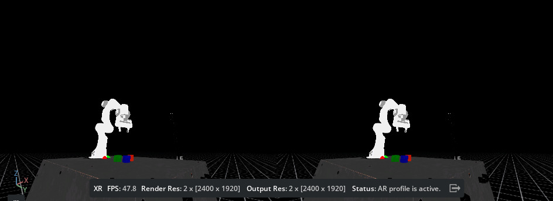

.. _cloudxr-teleoperation:

Setting up Isaac Teleop with CloudXR
=====================================

.. currentmodule:: isaaclab

`Isaac Teleop <https://github.com/NVIDIA/IsaacTeleop>`_ is the unified framework for high-fidelity
teleoperation in Isaac Lab. It provides standardized device interfaces, a flexible retargeting
pipeline, and bundled `NVIDIA CloudXR`_ streaming for immersive XR-based teleoperation.

This guide walks you through installing Isaac Teleop, starting the CloudXR runtime, connecting an
XR device, and running your first teleoperation session.

.. tip::

   For architecture details, retargeting pipelines, control scheme recommendations, and how to
   add new embodiments or devices, see the :ref:`isaac-teleop-feature` page.

Prerequisites
-------------

* **Isaac Lab** installed and working (see :ref:`isaaclab-installation-root`).

* **Isaac Lab workstation**

  * Ubuntu 22.04 or Ubuntu 24.04
  * CPU: x86_64 (ARM support coming soon)
  * GPU: NVIDIA GPU required. For 45 FPS with 120 Hz physics:

    * CPU: AMD Ryzen Threadripper 7960x or higher
    * GPU: 1x RTX PRO 6000 (or equivalent, e.g. 1x RTX 5090) or higher
    * Memory: 64 GB RAM

  * For driver requirements see the `Technical Requirements <https://docs.omniverse.nvidia.com/materials-and-rendering/latest/common/technical-requirements.html>`_ guide.
  * Python 3.11 or newer
  * CUDA 12.8 (recommended)
  * NVIDIA Driver 580.95.05 (recommended)

* **Wifi 6 capable router**

  * A strong wireless connection is essential for a high-quality streaming experience. Refer to
    the requirements of `Omniverse Spatial Streaming`_ for more details.
  * We recommend a dedicated router; concurrent usage will degrade quality.
  * The XR device and Isaac Lab workstation must be IP-reachable from one another. Many
    institutional wireless networks prevent device-to-device connectivity.

.. note::

   If you are using DGX Spark, check :ref:`dgx-spark-limitations` for compatibility.

.. _install-isaac-teleop:

Install Isaac Teleop
--------------------

#. Clone the Isaac Teleop repository:

   .. code-block:: bash

      git clone git@github.com:NVIDIA/IsaacTeleop.git
      cd isaacteleop/

#. **(Optional -- Hand Tracking)** If you plan to use optical hand tracking from the XR
   device, create a CloudXR environment file:

   .. code-block:: bash

      echo "NV_CXR_ENABLE_PUSH_DEVICES=0" > deps/cloudxr/cxr.env

#. Activate the **same** virtual environment you use for Isaac Lab, then install the
   ``isaacteleop`` package:

   .. code-block:: bash

      pip install isaacteleop~=1.0 --extra-index-url https://pypi.nvidia.com

.. _start-cloudxr-runtime:

Start the CloudXR Runtime
-------------------------

From the ``isaacteleop/`` directory, start the CloudXR runtime in a dedicated terminal:

.. code-block:: bash

   ./scripts/run_cloudxr.sh

.. _run-isaac-lab-with-the-cloudxr-runtime:

Run Isaac Lab with CloudXR
--------------------------

Open a **new** terminal where Isaac Lab will run and set up the CloudXR environment:

.. code-block:: bash

   # Activate the Isaac Lab virtual environment (conda or uv)
   cd <path-to-isaacteleop>/isaacteleop/
   source scripts/setup_cloudxr_env.sh

With the CloudXR runtime running in a separate terminal, launch an Isaac Lab teleoperation script:

.. code-block:: bash

   ./isaaclab.sh -p scripts/environments/teleoperation/teleop_se3_agent.py \
       --task Isaac-PickPlace-GR1T2-Abs-v0

Then in the Isaac Sim UI:

#. Locate the panel named **AR** and choose the following options:

   * Selected Output Plugin: **OpenXR**
   * OpenXR Runtime: **System OpenXR Runtime**

   .. figure:: ../_static/setup/cloudxr_ar_panel.jpg
      :align: center
      :figwidth: 50%
      :alt: Isaac Sim UI: AR Panel

#. Click **Start AR**.

The viewport should show two eyes being rendered and the status "AR profile is active".

Isaac Lab is now ready to receive connections from a CloudXR client.

.. _use-apple-vision-pro:

Connect Apple Vision Pro
------------------------

Apple Vision Pro connects to Isaac Lab via the native `Isaac XR Teleop Sample Client`_ app.

.. _build-apple-vision-pro:

Build and Install the Client App
~~~~~~~~~~~~~~~~~~~~~~~~~~~~~~~~

Requirements:

* Apple Vision Pro with visionOS 26, Apple M3 Pro chip (11-core CPU), 16 GB unified memory
* Apple Silicon Mac with macOS Sequoia 15.6+ and Xcode 26.0

On your Mac:

#. Clone the `Isaac XR Teleop Sample Client`_ repository:

   .. code-block:: bash

      git clone git@github.com:isaac-sim/isaac-xr-teleop-sample-client-apple.git

#. Check out the version that matches your Isaac Lab version:

   +-------------------+---------------------+
   | Isaac Lab Version | Client App Version  |
   +-------------------+---------------------+
   | 3.0               | v3.0.0              |
   +-------------------+---------------------+
   | 2.3               | v2.3.0              |
   +-------------------+---------------------+

   .. code-block:: bash

      git checkout <client_app_version>

#. Follow the README in the repository to build and install the app on your Apple Vision Pro.

.. _teleoperate-apple-vision-pro:

Teleoperate with Apple Vision Pro
~~~~~~~~~~~~~~~~~~~~~~~~~~~~~~~~~

.. tip::

   **Before wearing the headset**, verify connectivity from your Mac:

   .. code:: bash

      nc -vz <isaac-lab-ip> 48010

   Expected output: ``Connection to <ip> port 48010 [tcp/*] succeeded!``

On your Isaac Lab workstation, ensure Isaac Lab and CloudXR are running as described in
:ref:`run-isaac-lab-with-the-cloudxr-runtime`.

On your Apple Vision Pro:

#. Open the Isaac XR Teleop Sample Client.

   .. figure:: ../_static/setup/cloudxr_avp_connect_ui.jpg
      :align: center
      :figwidth: 50%
      :alt: Apple Vision Pro connect UI

#. Enter the IP address of your Isaac Lab workstation and click **Connect**.

   .. note::

      The Apple Vision Pro and workstation must be IP-reachable from one another. We recommend a
      dedicated Wifi 6 router.

#. After a brief period you should see the simulation rendered in the headset along with
   teleoperation controls.

   .. figure:: ../_static/setup/cloudxr_avp_teleop_ui.jpg
      :align: center
      :figwidth: 50%
      :alt: Apple Vision Pro teleop UI

#. Click **Play** to begin teleoperating. Use **Play**, **Stop**, and **Reset** to control the
   session.

   .. tip::

      For bimanual tasks, visionOS voice control enables hands-free UI:

      #. **Settings** > **Accessibility** > **Voice Control** > Turn on **Voice Control**
      #. Enable **<item name>** under **Commands** > **Basic Navigation**
      #. Say "Play", "Stop", or "Reset" while the app is connected.

#. Teleoperate the robot by moving your hands.

   .. figure:: https://download.isaacsim.omniverse.nvidia.com/isaaclab/images/cloudxr_bimanual_teleop.gif
      :align: center
      :alt: Bimanual dexterous teleoperation with CloudXR

   .. note::

      If the IK solver fails, an error message appears in the headset. Click **Reset** to return
      the robot to its original pose and continue.

      .. figure:: ../_static/setup/cloudxr_avp_ik_error.jpg
         :align: center
         :figwidth: 80%
         :alt: IK error message in XR device

#. Click **Disconnect** when finished.

.. _connect-quest-pico:

Connect Meta Quest 3 or Pico 4 Ultra
-------------------------------------

Meta Quest 3 and Pico 4 Ultra connect to Isaac Lab via the CloudXR.js WebXR client, which is
served by Docker containers included with Isaac Teleop.

.. note::

   Pico 4 Ultra requires Pico OS 15.4.4U or later and must use HTTPS mode.

#. Download the CloudXR Web SDK. From the ``isaacteleop/`` directory:

   .. code-block:: bash

      ./scripts/download_cloudxr_sdk.sh

   Alternatively, place a local tarball in ``deps/cloudxr/``:
   ``cloudxr-web-sdk-<version>.tar.gz``. The expected version is defined by
   ``CXR_WEB_SDK_VERSION`` in ``deps/cloudxr/.env.default``.

#. Ensure the CloudXR runtime is running (see :ref:`start-cloudxr-runtime`).

#. Open the browser on your headset and navigate to:

   * HTTPS (recommended): ``https://<server-ip>:8443``
   * HTTP: ``http://<server-ip>:8080``

   .. tip::

      For rapid development, test the CloudXR.js client on a desktop browser before deploying to
      headsets.

#. Follow the on-screen instructions to connect and begin teleoperation.

.. _manus-vive-handtracking:

Manus Gloves
------------

Manus gloves provide high-fidelity finger tracking via the Manus SDK. This is useful when optical
hand tracking from the headset is occluded or when higher-precision finger data is needed.

.. note::

   Manus glove support has been migrated into Isaac Teleop as a native plugin. The previous
   ``isaac-teleop-device-plugins`` repository and the ``libsurvive``-based Vive tracker integration
   are no longer required.

Requirements:

* Manus gloves with a Manus SDK license

The Manus plugin is included in the ``isaacteleop`` package and activated automatically when
configured in the environment's retargeting pipeline. Manus tracking data flows through the same
API as headset-based optical hand tracking in Isaac Teleop, so the same retargeters and pipelines
work with both input sources.

For plugin configuration details, see the `Manus plugin documentation
<https://github.com/NVIDIA/IsaacTeleop/blob/main/src/plugins/manus/README.md>`_.

The recommended workflow:

#. Start Isaac Lab and click **Start AR**.
#. Put on the Manus gloves and headset.
#. Use voice commands to launch the Isaac XR Teleop Sample Client and connect to Isaac Lab.

Kubernetes Deployment
---------------------

For deploying XR teleoperation on a Kubernetes cluster, see :ref:`cloudxr-teleoperation-cluster`.

.. admonition:: Next Steps

   * **Architecture, retargeting, and control schemes**: :ref:`isaac-teleop-feature`
   * **Teleoperation for imitation learning**: :ref:`teleoperation-imitation-learning`
   * **API reference**: :ref:`isaaclab_teleop-api`

..
  References
.. _`Apple Vision Pro`: https://www.apple.com/apple-vision-pro/
.. _`Docker Compose`: https://docs.docker.com/compose/install/linux/#install-using-the-repository
.. _`Docker`: https://docs.docker.com/desktop/install/linux-install/
.. _`NVIDIA CloudXR`: https://developer.nvidia.com/cloudxr-sdk
.. _`NVIDIA Container Toolkit`: https://github.com/NVIDIA/nvidia-container-toolkit
.. _`Isaac XR Teleop Sample Client`: https://github.com/isaac-sim/isaac-xr-teleop-sample-client-apple
.. _`Omniverse Spatial Streaming`: https://docs.omniverse.nvidia.com/avp/latest/setup-network.html
