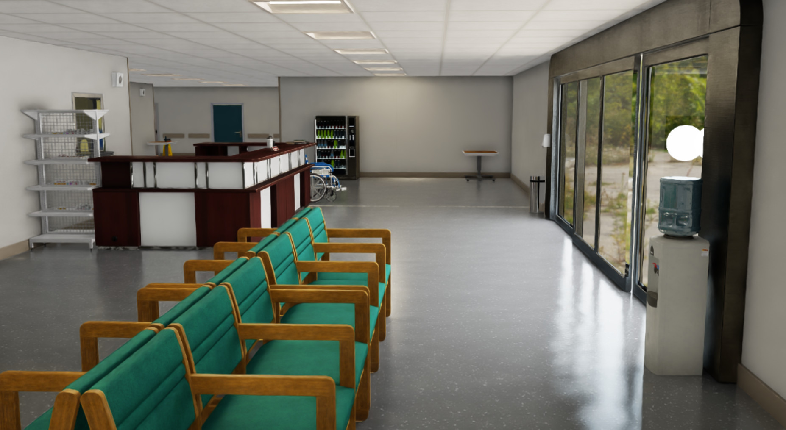

Configuring RTX Rendering Settings
====================================

.. note::

   This guide covers the **RTX renderer** settings, which are used when running Isaac Lab with
   Isaac Sim. The RTX renderer is based on NVIDIA's Omniverse RTX rendering pipeline and is
   available for all camera sensors in the PhysX backend.

   For the **Newton renderer** (used with the Newton backend or in kit-less mode), see
   :ref:`overview_renderers` for the pluggable renderer architecture and available backends.

Isaac Lab's RTX renderer applies a set of high-fidelity rendering defaults out-of-the-box, so that
camera sensors produce high-quality imagery without additional configuration. Individual settings can
be customized via :class:`~sim.RenderCfg`, as described below.

.. note::

   Isaac Lab previously shipped three preset rendering modes (``performance``, ``balanced``, and
   ``quality``), selectable via ``--rendering_mode`` or ``RenderCfg.rendering_mode``. These presets
   have been **removed**. The high-fidelity defaults applied today match the former ``quality`` preset.

   If you require **high-performance rendering**, use the **RTX Minimal** renderer instead of tuning
   these RTX settings. See :ref:`overview_renderers` for the available renderers and how to select them.

The high-fidelity defaults are applied automatically whenever RTX rendering is active (for example, when
launching with ``--enable_cameras``).

Overwriting Specific Rendering Settings
---------------------------------------

The high-fidelity rendering defaults can be overwritten via the :class:`~sim.RenderCfg` class.

There are 2 ways to provide settings that overwrite the defaults.

1. :class:`~sim.RenderCfg` supports overwriting specific settings via user-friendly setting names that map to underlying RTX settings.
   For example:

   .. code-block:: python

      render_cfg = sim_utils.RenderCfg(
         # user friendly setting overwrites
         enable_translucency=True,  # render glass / transmissive surfaces
         enable_reflections=True,  # render reflections
         dlss_mode=3,  # 0 (Performance), 1 (Balanced), 2 (Quality, the default), 3 (Auto)
      )

   List of user-friendly settings.

   .. table::
      :widths: 25 75

      +----------------------------+--------------------------------------------------------------------------+
      | enable_translucency        | Bool. Enables translucency for specular transmissive surfaces such as    |
      |                            | glass at the cost of some performance.                                   |
      +----------------------------+--------------------------------------------------------------------------+
      | enable_reflections         | Bool. Enables reflections at the cost of some performance.               |
      +----------------------------+--------------------------------------------------------------------------+
      | enable_global_illumination | Bool. Enables Diffused Global Illumination at the cost of some           |
      |                            | performance.                                                             |
      +----------------------------+--------------------------------------------------------------------------+
      | antialiasing_mode          | Literal["Off", "FXAA", "DLSS", "TAA", "DLAA"].                           |
      |                            |                                                                          |
      |                            | DLSS: Boosts performance by using AI to output higher resolution frames  |
      |                            | from a lower resolution input. DLSS samples multiple lower resolution    |
      |                            | images and uses motion data and feedback from prior frames to reconstruct|
      |                            | native quality images.                                                   |
      |                            | DLAA: Provides higher image quality with an AI-based anti-aliasing       |
      |                            | technique. DLAA uses the same Super Resolution technology developed for  |
      |                            | DLSS, reconstructing a native resolution image to maximize image quality.|
      +----------------------------+--------------------------------------------------------------------------+
      | enable_dlssg               | Bool. Enables the use of DLSS-G. DLSS Frame Generation boosts performance|
      |                            | by using AI to generate more frames. This feature requires an Ada        |
      |                            | Lovelace architecture GPU and can hurt performance due to additional     |
      |                            | thread-related activities.                                               |
      +----------------------------+--------------------------------------------------------------------------+
      | enable_dl_denoiser         | Bool. Enables the use of a DL denoiser, which improves the quality of    |
      |                            | renders at the cost of performance.                                      |
      +----------------------------+--------------------------------------------------------------------------+
      | dlss_mode                  | Literal[0, 1, 2, 3]. For DLSS anti-aliasing, selects the performance/    |
      |                            | quality tradeoff mode. Valid values are 0 (Performance), 1 (Balanced),   |
      |                            | 2 (Quality), or 3 (Auto).                                                |
      +----------------------------+--------------------------------------------------------------------------+
      | enable_direct_lighting     | Bool. Enable direct light contributions from lights.                     |
      +----------------------------+--------------------------------------------------------------------------+
      | samples_per_pixel          | Int. Defines the Direct Lighting samples per pixel. Higher values        |
      |                            | increase the direct lighting quality at the cost of performance.         |
      +----------------------------+--------------------------------------------------------------------------+
      | enable_shadows             | Bool. Enables shadows at the cost of performance. When disabled, lights  |
      |                            | will not cast shadows.                                                   |
      +----------------------------+--------------------------------------------------------------------------+
      | enable_ambient_occlusion   | Bool. Enables ambient occlusion at the cost of some performance.         |
      +----------------------------+--------------------------------------------------------------------------+

2. For more control, :class:`~sim.RenderCfg` allows you to overwrite any RTX setting by using the ``carb_settings`` argument.

   The full NVIDIA RTX renderer documentation can be found at
   https://docs.omniverse.nvidia.com/materials-and-rendering/latest/rtx-renderer.html.

   An example usage of ``carb_settings``.

   .. code-block:: python

      render_cfg = sim_utils.RenderCfg(
         # carb setting overwrites
         carb_settings={
            "rtx.translucency.enabled": False,
            "rtx.reflections.enabled": False,
            "rtx.domeLight.upperLowerStrategy": 3,
         }
      )

Current Limitations
-------------------

For performance reasons, we default to using DLSS for denoising, which generally provides better performance.
This may result in renders of lower quality, which may be especially evident at lower resolutions.
Due to this, we recommend using per-tile or per-camera resolution of at least 100 x 100.
For renders at lower resolutions, we advice setting the ``antialiasing_mode`` attribute in :class:`~sim.RenderCfg` to
``DLAA``, and also potentially enabling ``enable_dl_denoiser``. Both of these settings should help improve render
quality, but also comes at a cost of performance. Additional rendering parameters can also be specified in :class:`~sim.RenderCfg`.

If you observe visual artifacts such as ghosting or disocclusion issues when using tiled rendering, you can try
adjusting the ``disocclusionScale`` parameter. This setting controls how aggressively the renderer handles
areas that become newly visible between frames:

.. code-block:: python

   render_cfg = sim_utils.RenderCfg(
      carb_settings={
         "/rtx/aovConverter/disocclusionScale": 10000,
      }
   )

.. note::

   This parameter is not commonly exposed as it may have side effects in certain scenarios.
   Only use it as a last resort if other quality settings do not resolve the visual artifacts.
   The value can be adjusted to a very high value to reduce disocclusion artifacts.

Rendering UsdVol 3D Gaussian Scenes in Multiple Environments
------------------------------------------------------------

When using UsdVol volumes with 3D Gaussian particles (e.g. exported from
`3DGRUT <https://github.com/nv-tlabs/3dgrut?tab=readme-ov-file#exporting-usdz-for-use-in-omniverse-and-isaac-sim>`_)
in **multiple environments**, you must set the following so the renderer uses the correct compositing path:

.. code-block:: python

   render_cfg = sim_utils.RenderCfg(
      carb_settings={
         "omni.rtx.nre.compositing.rendererHints": 3,
      }
   )

.. warning::

   With multiple environments, each environment holds its own copy of the scene, increasing device memory use,
   and environments are rendered one after another, which can substantially slow down rendering.
