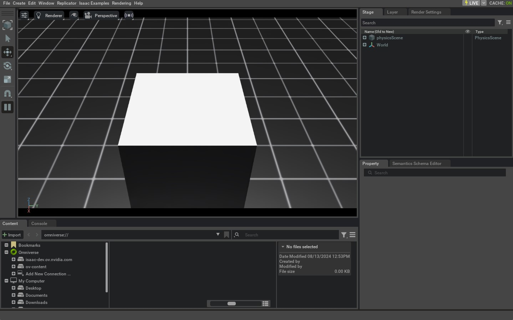

:orphan:

Deep-dive into the simulation launcher
======================================

.. currentmodule:: isaaclab

In this tutorial, we will dive into how a standalone script launches the simulator and configures it using
CLI arguments and environment variables (envars). Particularly, we will demonstrate how to use
:func:`app.add_launcher_args` and :func:`app.launch_simulation` to enable livestreaming and to configure
the :class:`isaacsim.simulation_app.SimulationApp` instance that runs Isaac Sim, while also allowing
user-provided options.

Launching is split into two steps. First, :func:`app.add_launcher_args` appends the launch-related options
to the script's own :class:`argparse.ArgumentParser`. Then, the :func:`app.launch_simulation` context manager
takes the simulation configuration and the parsed arguments, and starts only the runtime that they need.
The default PhysX physics backend, Kit-based RTX cameras, the Kit visualizer (``--visualizer kit``) and
livestreaming all run inside Isaac Sim (Kit), so for these :func:`~app.launch_simulation` starts a
:class:`~isaacsim.simulation_app.SimulationApp`. A kitless configuration, for example Newton physics
without a Kit visualizer, starts no Isaac Sim at all. The runtime is closed automatically when the
``with`` block exits.

The :class:`~isaacsim.simulation_app.SimulationApp` has many extensions that must be loaded to enable
different capabilities, and some of these extensions are order- and inter-dependent. Additionally, there are
startup options such as ``headless`` which must be set at instantiation time, and which have an implied
relationship with some extensions, e.g. the livestreaming extensions. The launcher handles these extensions
and startup options in a portable manner across a variety of use cases. To achieve this, we offer CLI and
envar flags which can be merged with user-defined CLI args, while passing forward arguments intended
for :class:`~isaacsim.simulation_app.SimulationApp`.

The Code
--------

The tutorial corresponds to the ``launch_app.py`` script in the
``scripts/tutorials/00_sim`` directory.

.. dropdown:: Code for launch_app.py
   :icon: code

   .. literalinclude:: ../../../scripts/tutorials/00_sim/launch_app.py
      :language: python
      :emphasize-lines: 19-37, 69-75
      :linenos:

The Code Explained
------------------

Adding arguments to the argparser
^^^^^^^^^^^^^^^^^^^^^^^^^^^^^^^^^

The launcher is designed to be compatible with custom CLI args that users need for
their own scripts, while still providing a portable CLI interface.

In this tutorial, a standard :class:`argparse.ArgumentParser` is instantiated and given the
script-specific ``--size`` argument, as well as the arguments ``--height`` and ``--width``.
The latter are ingested by :class:`~isaacsim.simulation_app.SimulationApp`.

The argument ``--size`` is not used by the launcher, but merges seamlessly with the launcher
interface. In-script arguments are merged with the launcher interface via the
:func:`~app.add_launcher_args` function, which appends the launcher arguments to the given
:class:`~argparse.ArgumentParser`. This can then be processed into an :class:`argparse.Namespace` using the
standard :meth:`argparse.ArgumentParser.parse_args` method.

.. literalinclude::  ../../../scripts/tutorials/00_sim/launch_app.py
   :language: python
   :start-at: import argparse
   :end-at: args_cli = parser.parse_args()

Launching the simulator
^^^^^^^^^^^^^^^^^^^^^^^

The parsed arguments are passed, together with the simulation configuration, to
:func:`~app.launch_simulation`. The configuration tells it which runtime is needed (here, the default
PhysX physics backend, which runs inside Isaac Sim), and the arguments configure that runtime.
Everything that uses the simulator runs inside the ``with`` block.

.. literalinclude::  ../../../scripts/tutorials/00_sim/launch_app.py
   :language: python
   :start-at: # Configure the simulation
   :end-at: sim = sim_utils.SimulationContext(sim_cfg)

Understanding the output of --help
^^^^^^^^^^^^^^^^^^^^^^^^^^^^^^^^^^

While executing the script, we can pass the ``--help`` argument and see the combined outputs of the
custom arguments and the launcher options (abbreviated below).

.. tab-set::

   .. tab-item:: uv (Recommended)

      .. code-block:: console

         uv run python scripts/tutorials/00_sim/launch_app.py --help

         usage: launch_app.py [-h] [--size SIZE] [--width WIDTH] [--height HEIGHT] [--livestream {0,1,2}] [--xr]
                              [--device DEVICE] [--visualizer VISUALIZER] [--verbose] [--info] [--experience EXPERIENCE]
                              ...

         Tutorial on configuring the simulator launch.

         options:
           -h, --help            show this help message and exit
           --size SIZE           Side-length of cuboid
           --width WIDTH         Width of the viewport and generated images. Defaults to 1280
           --height HEIGHT       Height of the viewport and generated images. Defaults to 720

         launcher arguments:
           Arguments for the KitLauncher. For more details, please check the documentation.

           --livestream {0,1,2}  Force enable livestreaming. Mapping corresponds to that for the `LIVESTREAM` environment
                                 variable.
           --xr                  Enable XR mode for VR/AR applications.
           --device DEVICE       The device to run the simulation on. Can be "cpu", "cuda", "cuda:N", where N is the device ID
           --visualizer VISUALIZER, --viz VISUALIZER
                                 Visualizer backends to enable as CSV (e.g., kit,newton,rerun,viser).
           --verbose             Enable verbose-level log output from the SimulationApp.
           --info                Enable info-level log output from the SimulationApp.
           --experience EXPERIENCE
                                 The experience file to load when launching the SimulationApp. If an empty string is provided,
                                 the experience file is determined from the resolved visualizer and XR settings. If a relative
                                 path is provided, it is resolved relative to the `apps` folder in Isaac Sim and Isaac Lab (in
                                 that order).
           ...

This readout details the ``--size``, ``--height``, and ``--width`` arguments defined in the script directly,
as well as the launcher arguments.

Script arguments whose name and type match an argument of
:class:`~isaacsim.simulation_app.SimulationApp`, in this case ``--height`` and ``--width``, are forwarded
to the :class:`~isaacsim.simulation_app.SimulationApp` instance when :func:`~app.launch_simulation`
starts Isaac Sim. Please refer to the `specification`_ for such arguments for more examples.

Using environment variables
^^^^^^^^^^^^^^^^^^^^^^^^^^^

As noted in the help message, launcher arguments such as ``--livestream``
have corresponding environment variables (envar) as well. These are detailed in :mod:`isaaclab.app`
documentation. Providing any of these arguments through CLI is equivalent to running the script in a shell
environment where the corresponding envar is set.

The support for launcher envars is simply a convenience to provide session-persistent
configurations, and can be set in the user's ``${HOME}/.bashrc`` for persistent settings between sessions.
In the case where these arguments are provided from the CLI, they will override their corresponding envar,
as we will demonstrate later in this tutorial.

These arguments can be used with any script that starts the simulation using :func:`~app.launch_simulation`.
Camera and offscreen rendering support is configured automatically.

The Code Execution
------------------

We will now run the example script:

.. tab-set::
   :sync-group: os

   .. tab-item:: :icon:`fa-brands fa-linux` Linux x86_64
      :sync: linux-x86_64

      .. tab-set::

         .. tab-item:: uv (Recommended)

            .. code-block:: console

               LIVESTREAM=2 uv run python scripts/tutorials/00_sim/launch_app.py --size 0.5

   .. tab-item:: :icon:`fa-brands fa-linux` Linux aarch64 (DGX Spark)
      :sync: linux-aarch64

      .. tab-set::

         .. tab-item:: uv (Recommended)

            .. code-block:: console

               LIVESTREAM=2 LD_PRELOAD=/lib/aarch64-linux-gnu/libgomp.so.1 uv run python scripts/tutorials/00_sim/launch_app.py --size 0.5

      .. note::

         Direct Python commands that import Isaac Sim on aarch64 require the
         ``LD_PRELOAD=/lib/aarch64-linux-gnu/libgomp.so.1`` prefix shown above. See
         :ref:`installation-method-uv`.

   .. tab-item:: :icon:`fa-brands fa-windows` Windows
      :sync: windows

      .. tab-set::

         .. tab-item:: uv (Recommended)

            .. code-block:: powershell

               $env:LIVESTREAM = "2"
               uv run python scripts\tutorials\00_sim\launch_app.py --size 0.5

This will spawn a 0.5m\ :sup:`3` volume cuboid in the simulation. No GUI will appear, equivalent
to omitting ``--visualizer`` in this setup because headlessness is implied by our ``LIVESTREAM``
envar. If a visualization is desired, we could get one via Isaac's `WebRTC Livestreaming`_. Streaming
is currently the only supported method of visualization from within the container. The
process can be killed by pressing ``Ctrl+C`` in the launching terminal.

Now, let's look at how the launcher handles conflicting commands:

.. tab-set::
   :sync-group: os

   .. tab-item:: :icon:`fa-brands fa-linux` Linux x86_64
      :sync: linux-x86_64

      .. tab-set::

         .. tab-item:: uv (Recommended)

            .. code-block:: console

               LIVESTREAM=0 uv run python scripts/tutorials/00_sim/launch_app.py --size 0.5 --livestream 2

   .. tab-item:: :icon:`fa-brands fa-linux` Linux aarch64 (DGX Spark)
      :sync: linux-aarch64

      .. tab-set::

         .. tab-item:: uv (Recommended)

            .. code-block:: console

               LIVESTREAM=0 LD_PRELOAD=/lib/aarch64-linux-gnu/libgomp.so.1 uv run python scripts/tutorials/00_sim/launch_app.py --size 0.5 --livestream 2

      .. note::

         Direct Python commands that import Isaac Sim on aarch64 require the
         ``LD_PRELOAD=/lib/aarch64-linux-gnu/libgomp.so.1`` prefix shown above. See
         :ref:`installation-method-uv`.

   .. tab-item:: :icon:`fa-brands fa-windows` Windows
      :sync: windows

      .. tab-set::

         .. tab-item:: uv (Recommended)

            .. code-block:: powershell

               $env:LIVESTREAM = "0"
               uv run python scripts\tutorials\00_sim\launch_app.py --size 0.5 --livestream 2

This will cause the same behavior as in the previous run, because although we have set ``LIVESTREAM=0``
in our envars, CLI args such as ``--livestream`` take precedence in determining behavior. The process can
be killed by pressing ``Ctrl+C`` in the launching terminal.

Finally, we will examine passing arguments to :class:`~isaacsim.simulation_app.SimulationApp` through
:func:`~app.launch_simulation`:

.. tab-set::
   :sync-group: os

   .. tab-item:: :icon:`fa-brands fa-linux` Linux x86_64
      :sync: linux-x86_64

      .. tab-set::

         .. tab-item:: uv (Recommended)

            .. code-block:: console

               LIVESTREAM=2 uv run python scripts/tutorials/00_sim/launch_app.py --size 0.5 --width 1920 --height 1080

   .. tab-item:: :icon:`fa-brands fa-linux` Linux aarch64 (DGX Spark)
      :sync: linux-aarch64

      .. tab-set::

         .. tab-item:: uv (Recommended)

            .. code-block:: console

               LIVESTREAM=2 LD_PRELOAD=/lib/aarch64-linux-gnu/libgomp.so.1 uv run python scripts/tutorials/00_sim/launch_app.py --size 0.5 --width 1920 --height 1080

      .. note::

         Direct Python commands that import Isaac Sim on aarch64 require the
         ``LD_PRELOAD=/lib/aarch64-linux-gnu/libgomp.so.1`` prefix shown above. See
         :ref:`installation-method-uv`.

   .. tab-item:: :icon:`fa-brands fa-windows` Windows
      :sync: windows

      .. tab-set::

         .. tab-item:: uv (Recommended)

            .. code-block:: powershell

               $env:LIVESTREAM = "2"
               uv run python scripts\tutorials\00_sim\launch_app.py --size 0.5 --width 1920 --height 1080

This will cause the same behavior as before, but now the viewport will be rendered at 1920x1080p resolution.
This can be useful when we want to gather high-resolution video, or we can specify a lower resolution if we
want our simulation to be more performant. The process can be killed by pressing ``Ctrl+C`` in the launching
terminal.

For more details on headless mode and launching visualizers, see
:doc:`/source/migration/migrating_to_isaaclab_3-0`.

.. _specification: https://docs.isaacsim.omniverse.nvidia.com/latest/py/source/extensions/isaacsim.simulation_app/docs/api.html#isaacsim.simulation_app.SimulationApp.DEFAULT_LAUNCHER_CONFIG
.. _WebRTC Livestreaming: https://docs.isaacsim.omniverse.nvidia.com/latest/installation/manual_livestream_clients.html#isaac-sim-short-webrtc-streaming-client
