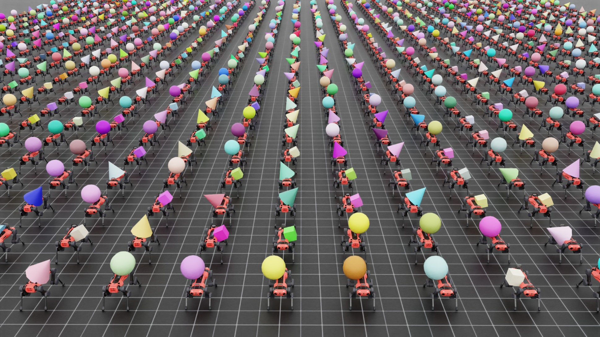

Spawning Multiple Assets
========================

.. currentmodule:: isaaclab

Typical spawning configurations (introduced in the :ref:`tutorial-spawn-prims` tutorial) copy the same
asset (or USD primitive) across the different resolved prim paths from the expressions.
For instance, if the user specifies to spawn the asset at "/World/Table\_.*/Object", the same
asset is created at the paths "/World/Table_0/Object", "/World/Table_1/Object" and so on.

However, we also support multi-asset spawning with two mechanisms:

1. Rigid object collections. This allows the user to spawn multiple rigid objects in each environment and access/modify
   them with a unified API, improving performance.

2. Spawning different assets under the same prim path. This allows the user to create diverse simulations, where each
   environment has a different asset.

This guide describes how to use these two mechanisms.

The sample script ``multi_asset.py`` is used as a reference, located in the
``IsaacLab/scripts/demos`` directory.

.. dropdown:: Code for multi_asset.py
   :icon: code

   .. literalinclude:: ../../../scripts/demos/multi_asset.py
      :language: python
      :emphasize-lines: 109-131, 135-179, 184-203
      :linenos:

This script creates multiple environments, where each environment has:

* a rigid object collection containing a cone, a cube, and a sphere
* a rigid object that is either a cone, a cube, or a sphere, chosen at random
* an articulation that is either the ANYmal-C or ANYmal-D robot, chosen at random

Rigid Object Collections
------------------------

Multiple rigid objects can be spawned in each environment and accessed/modified with a unified ``(env_ids, obj_ids)`` API.
While the user could also create multiple rigid objects by spawning them individually, the API is more user-friendly and
more efficient since it uses a single physics view under the hood to handle all the objects.

.. literalinclude:: ../../../scripts/demos/multi_asset.py
   :language: python
   :lines: 135-179
   :dedent:

The configuration :class:`~assets.RigidObjectCollectionCfg` is used to create the collection. It's attribute :attr:`~assets.RigidObjectCollectionCfg.rigid_objects`
is a dictionary containing :class:`~assets.RigidObjectCfg` objects. The keys serve as unique identifiers for each
rigid object in the collection.

Spawning different assets under the same prim path
--------------------------------------------------

It is possible to spawn different assets and USDs under the same prim path in each environment using the spawners
:class:`~sim.spawners.wrappers.MultiAssetSpawnerCfg` and :class:`~sim.spawners.wrappers.MultiUsdFileCfg`:

* We set the spawn configuration in :class:`~assets.RigidObjectCfg` to be
  :class:`~sim.spawners.wrappers.MultiAssetSpawnerCfg`:

  .. literalinclude:: ../../../scripts/demos/multi_asset.py
     :language: python
     :lines: 107-133
     :dedent:

  This function allows you to define a list of different assets that can be spawned as rigid objects.
  When :attr:`~sim.spawners.wrappers.MultiAssetSpawnerCfg.random_choice` is set to True, one asset from the list
  is randomly selected and spawned at the specified prim path.

* Similarly, we set the spawn configuration in :class:`~assets.ArticulationCfg` to be
  :class:`~sim.spawners.wrappers.MultiUsdFileCfg`:

  .. literalinclude:: ../../../scripts/demos/multi_asset.py
     :language: python
     :lines: 182-215
     :dedent:

  Similar to before, this configuration allows the selection of different USD files representing articulated assets.

Things to Note
~~~~~~~~~~~~~~

Similar asset structuring
~~~~~~~~~~~~~~~~~~~~~~~~~

While spawning and handling multiple assets using the same physics interface (the rigid object or articulation classes),
it is essential to have the assets at all the prim locations follow a similar structure. In case of an articulation,
this means that they all must have the same number of links and joints, the same number of collision bodies and
the same names for them. If that is not the case, the physics parsing of the prims can get affected and fail.

The main purpose of this functionality is to enable the user to create randomized versions of the same asset,
for example robots with different link lengths, or rigid objects with different collider shapes.

Disabling physics replication in interactive scene
~~~~~~~~~~~~~~~~~~~~~~~~~~~~~~~~~~~~~~~~~~~~~~~~~~

By default, the flag :attr:`scene.InteractiveScene.replicate_physics` is set to True. This flag informs the physics
engine that the simulation environments are copies of one another so it just needs to parse the first environment
to understand the entire simulation scene. This helps speed up the simulation scene parsing.

However, in the case of spawning different assets in different environments, this assumption does not hold
anymore. Hence the flag :attr:`scene.InteractiveScene.replicate_physics` must be disabled.

.. literalinclude:: ../../../scripts/demos/multi_asset.py
   :language: python
   :lines: 280-283
   :dedent:

The Code Execution
------------------

To execute the script with multiple environments and randomized assets, use the following command:

.. code-block:: bash

  ./isaaclab.sh -p scripts/demos/multi_asset.py --num_envs 2048

This command runs the simulation with 2048 environments, each with randomly selected assets.
To stop the simulation, you can close the window, or press ``Ctrl+C`` in the terminal.
