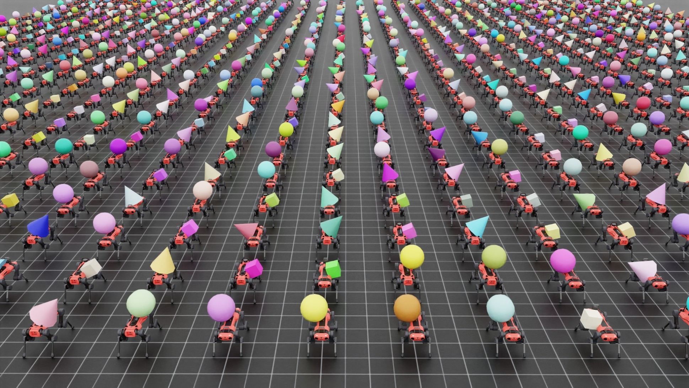

Spawning Multiple Assets
========================

.. currentmodule:: isaaclab

Typical spawning configurations (introduced in the :ref:`tutorial-spawn-prims` tutorial) copy one asset across all
prim paths resolved from an expression. Multi-asset workflows cover two related composition needs:

1. A rigid object collection batches several rigid objects in every environment behind one data and command API.
2. A multi-asset spawner declares several variants for one scene asset binding, allowing environments to contain
   different geometry or robot variants.

This guide demonstrates both mechanisms and explains how their execution differs between PhysX and Newton.

The sample script ``multi_asset.py`` is used as a reference, located in the
``IsaacLab/scripts/demos`` directory.

.. dropdown:: Code for multi_asset.py
   :icon: code

   .. literalinclude:: ../../../scripts/demos/multi_asset.py
      :language: python
      :linenos:

With the default PhysX configuration, this script creates multiple environments containing:

* a rigid object collection containing a sphere, a cube, and a cylinder
* a rigid object selected from nine geometry and material variants by the clone plan
* an articulation selected from the ANYmal-C and ANYmal-D variants by the clone plan

Rigid object collections
------------------------

Use a rigid object collection when every environment contains the same set of independently moving rigid bodies and you
want to access them as one batch. The collection exposes data with an ``(env, object, ...)`` layout and accepts
``(env_ids, obj_ids)`` selections for commands. Compared with managing each object separately, the collection uses one
batched physics view.

.. literalinclude:: ../../../scripts/demos/multi_asset.py
   :language: python
   :start-at: object_collection: RigidObjectCollectionCfg = RigidObjectCollectionCfg(
   :end-before: # articulation
   :dedent: 4

The :class:`~assets.RigidObjectCollectionCfg` configuration owns a dictionary of :class:`~assets.RigidObjectCfg`
instances. Each dictionary key is the object's stable identifier within the collection.

The demo resets all collection members through the same API used by both physics backends:

.. literalinclude:: ../../../scripts/demos/multi_asset.py
   :language: python
   :start-at: default_pose_w = rigid_object_collection.data.default_body_pose.torch.clone()
   :end-at: rigid_object_collection.write_body_com_velocity_to_sim_index(body_velocities=default_vel_w)
   :dedent: 12

Spawning variants for one scene asset
-------------------------------------

Use :class:`~sim.spawners.wrappers.MultiAssetSpawnerCfg` and :class:`~sim.spawners.wrappers.MultiUsdFileCfg` to declare
the available variants for one scene asset binding. :class:`~scene.InteractiveScene` includes these variants in its clone
plan and assigns one valid prototype combination to each environment.

For configuration-based assets, assign :class:`~sim.spawners.wrappers.MultiAssetSpawnerCfg` to the
:class:`~assets.RigidObjectCfg` spawn configuration:

.. literalinclude:: ../../../scripts/demos/multi_asset.py
   :language: python
   :start-at: object: RigidObjectCfg = RigidObjectCfg(
   :end-before: # object collection
   :dedent: 4

The ``assets_cfg`` list defines the prototypes available to the clone plan. Variant assignment is controlled by
:attr:`~cloner.CloneCfg.clone_strategy`; the default :func:`~cloner.sequential` strategy assigns combinations in
round-robin order. To sample combinations randomly instead, set the strategy before constructing the scene:

.. code-block:: python

   from isaaclab import cloner

   scene_cfg.clone_cfg.clone_strategy = cloner.random

For USD assets, assign :class:`~sim.spawners.wrappers.MultiUsdFileCfg` to the
:class:`~assets.ArticulationCfg` spawn configuration:

.. literalinclude:: ../../../scripts/demos/multi_asset.py
   :language: python
   :start-at: robot: ArticulationCfg = ArticulationCfg(
   :end-before: ##
   :dedent: 4

Variant compatibility
~~~~~~~~~~~~~~~~~~~~~

All variants behind one batched asset interface must have a compatible structure. Articulation variants must have the
same links, joints, collision-body count, and names. Rigid object variants can differ in geometry and material while
retaining a compatible rigid-body layout. Model structurally different assets as separate scene bindings.

Clone planning and physics replication
~~~~~~~~~~~~~~~~~~~~~~~~~~~~~~~~~~~~~~

:class:`~scene.InteractiveScene` represents multi-asset variants as clone-plan prototypes. It can therefore keep
:attr:`~scene.InteractiveSceneCfg.replicate_physics` enabled and replicate each prototype only to its assigned
environments. Do not disable physics replication merely because a scene uses a multi-asset spawner. Reserve
``replicate_physics=False`` for per-environment stage differences that cannot be represented as clone variants; that
mode is not supported by the Newton backend.

The demo keeps physics replication enabled. For Newton, it also narrows the standalone object and articulation to one
variant because their batched Newton views currently require a uniform body layout across worlds:

.. literalinclude:: ../../../scripts/demos/multi_asset.py
   :language: python
   :start-at: scene_cfg = MultiObjectSceneCfg(num_envs=args_cli.num_envs
   :end-at: scene_cfg.robot.spawn.usd_path = scene_cfg.robot.spawn.usd_path[0]
   :dedent: 8

For more detail on prototype assignment and replication, see :doc:`cloning`.

Run the demo
------------

The physics backend and visualizer are selected independently. Run one of these commands from the repository root:

.. tab-set::

   .. tab-item:: PhysX with Kit

      .. code-block:: bash

         uv run --extra isaacsim python scripts/demos/multi_asset.py --num_envs 2048

   .. tab-item:: Newton MJWarp with Kit

      .. code-block:: bash

         uv run --extra isaacsim python scripts/demos/multi_asset.py \
             --physics newton_mjwarp --num_envs 2048

   .. tab-item:: Newton MJWarp with Newton GL

      .. code-block:: bash

         uv run python scripts/demos/multi_asset.py \
             --physics newton_mjwarp --visualizer newton_gl --num_envs 2048

The Newton commands exercise the same :class:`~assets.RigidObjectCollectionCfg` and ``(env_ids, obj_ids)`` APIs as the
PhysX command. They do not demonstrate per-environment object or articulation variants because of the uniform-layout
restriction described above; use the PhysX command to inspect that part of the example. See the
:ref:`Isaac Lab installation guide <isaaclab-installation-root>` before running the kitless command.

To stop the simulation, you can close the window, or press ``Ctrl+C`` in the terminal.
