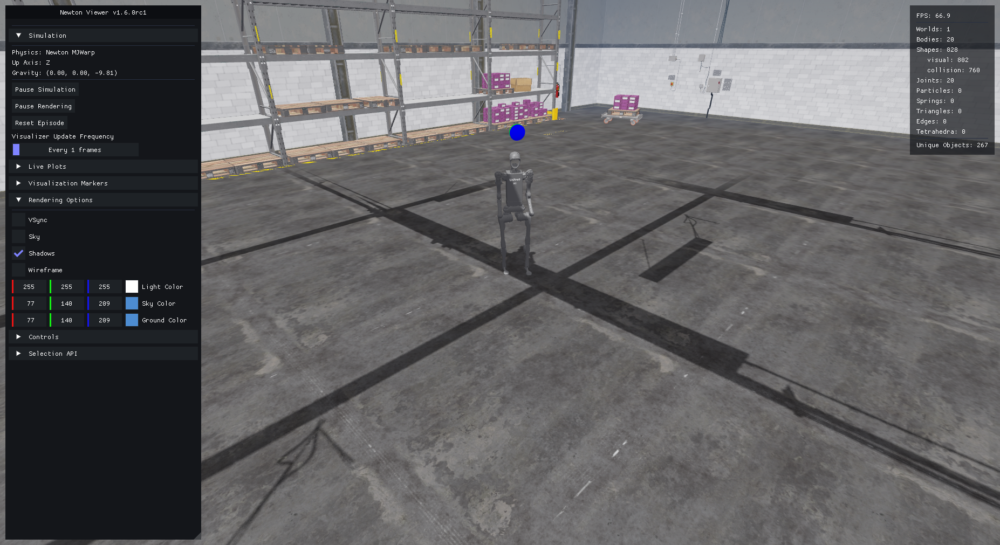

:orphan:

.. _tutorial-policy-inference-in-usd:

Policy Inference in USD Environment
===================================

.. currentmodule:: isaaclab

This deployment example runs a trained policy in a prebuilt USD scene using the training task's
observations, actions, and robot configuration.

In this tutorial, we will use the RSL RL library and the trained policy from the Humanoid Rough Terrain ``Isaac-Velocity-Rough-H1`` task in a simple warehouse USD.

The Tutorial Code
~~~~~~~~~~~~~~~~~

For this tutorial, we use the trained policy's checkpoint exported as jit (which is an offline version of the policy).

The script resolves ``H1RoughEnvCfg`` with ``parse_env_cfg``, including any physics preset passed
on the command line. Calling its ``play_mode`` method applies the play/inference overrides
(such as a reduced number of environments and disabled observation noise) on top of the training configuration.

In order to use a prebuilt USD environment instead of the terrain generator specified, we make the
following changes to the config before passing it to the ``ManagerBasedRLEnv``.

.. dropdown:: Code for policy_inference_in_usd.py
   :icon: code

   .. literalinclude:: ../../../scripts/tutorials/03_envs/policy_inference_in_usd.py
      :language: python
      :linenos:
      :emphasize-lines: 53-60

The script uses ``--device`` for both policy loading and simulation. It disables Fabric only
when ``--device cpu`` is explicitly selected.
The height scanner starts below the warehouse roof so its downward rays measure the floor.

Keep the same physics preset for training, export, and inference. The commands below use
Newton MJWarp with the ``newton_gl`` visualizer and do not require Isaac Sim. For a PhysX
checkpoint trained with Isaac Sim, use ``physics=isaacsim_physx`` throughout and install Isaac Sim;
the Newton GL viewer can still be used.
Cross-backend policy transfer needs additional validation; see
:doc:`transfer_policies_between_physx_and_newton`.

The Code Execution
~~~~~~~~~~~~~~~~~~

First, we need to train the ``Isaac-Velocity-Rough-H1`` task by running the following:

.. tab-set::

   .. tab-item:: uv (Recommended)

      .. code-block:: bash

        uv run isaaclab train --rl_library rsl_rl --task Isaac-Velocity-Rough-H1 physics=newton_mjwarp

   .. tab-item:: isaaclab.sh / isaaclab.bat

      .. code-block:: bash

        ./isaaclab.sh train --rl_library rsl_rl --task Isaac-Velocity-Rough-H1 physics=newton_mjwarp

When the training is finished, we can visualize the result with the following command.
To stop the simulation, you can either close the window, or press ``Ctrl+C`` in the terminal
where you started the simulation.

.. tab-set::

   .. tab-item:: uv (Recommended)

      .. code-block:: bash

        uv run isaaclab play --rl_library rsl_rl --task Isaac-Velocity-Rough-H1 physics=newton_mjwarp --num_envs 64 --checkpoint logs/rsl_rl/h1_rough/EXPERIMENT_NAME/POLICY_FILE.pt --viz newton_gl

   .. tab-item:: isaaclab.sh / isaaclab.bat

      .. code-block:: bash

        ./isaaclab.sh play --rl_library rsl_rl --task Isaac-Velocity-Rough-H1 physics=newton_mjwarp --num_envs 64 --checkpoint logs/rsl_rl/h1_rough/EXPERIMENT_NAME/POLICY_FILE.pt --viz newton_gl

After running the play script, the policy will be exported to jit and onnx files under the experiment logs directory.
Note that not all learning libraries support exporting the policy to a jit or onnx file.
For libraries that don't currently support this functionality, please refer to the corresponding ``play.py`` script for the library
to learn about how to initialize the policy.

We can then load the warehouse asset and run inference on the H1 robot using the exported jit policy
(``policy.pt`` file in the ``exported/`` directory).

.. tab-set::

   .. tab-item:: uv (Recommended)

      .. code-block:: bash

        uv run python scripts/tutorials/03_envs/policy_inference_in_usd.py --checkpoint logs/rsl_rl/h1_rough/EXPERIMENT_NAME/exported/policy.pt physics=newton_mjwarp --viz newton_gl

   .. tab-item:: isaaclab.sh / isaaclab.bat

      .. code-block:: bash

        ./isaaclab.sh -p scripts/tutorials/03_envs/policy_inference_in_usd.py --checkpoint logs/rsl_rl/h1_rough/EXPERIMENT_NAME/exported/policy.pt physics=newton_mjwarp --viz newton_gl

In this tutorial, we learnt how to make minor modifications to an existing environment config to run policy inference in a prebuilt usd environment.
