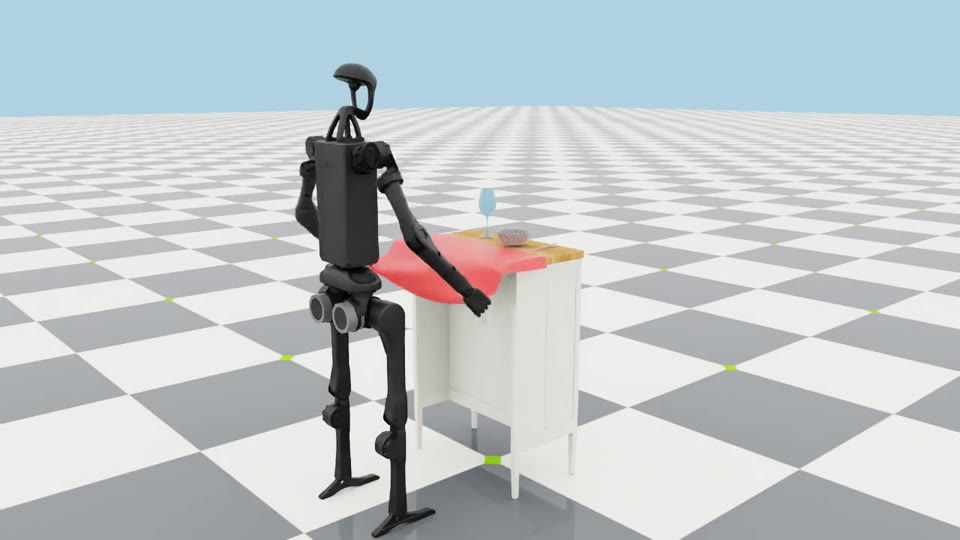

:orphan:

.. _run-scripted-state-machines:

Run Scripted State Machines
===========================

Isaac Lab includes hand-written state-machine examples for inspecting an
environment's observations and action interface without training a policy. The
state transitions run in parallel across environments as Warp kernels, which
keeps the examples efficient at larger environment counts.

Run these commands from the Isaac Lab repository root. Use ``--num_envs`` to
change the number of parallel environments and ``--viz`` to select a
visualizer.

Pick and lift a rigid cube
--------------------------

This example approaches a cube, closes the gripper, and lifts the cube to its
goal pose:

.. code-block:: bash

   uv run python scripts/environments/state_machine/lift_cube_sm.py \
      --num_envs 32 --viz kit

Lift a deformable object
------------------------

This example uses the Newton backend to grasp and lift a soft object. The
Newton visualizer opens by default:

.. code-block:: bash

   uv run --extra tetrahedralization python scripts/environments/state_machine/lift_franka_soft.py \
      --num_envs 1

Open a cabinet drawer
---------------------

This example approaches the drawer handle, grasps it, pulls the drawer open,
and releases it:

.. code-block:: bash

   uv run python scripts/environments/state_machine/open_cabinet_sm.py \
      --num_envs 32 --viz kit

.. _tablecloth-h1-expert:

Pull a tablecloth with H1
-------------------------

This example runs a bimanual Warp state machine against the manager-based
``IsaacContrib-Tablecloth-H1`` task. It uses Newton VBD for the cloth and rigid
tableware, Newton IK for the hands, and a downloaded H1 asset. The Newton GL
visualizer opens by default; the SimReady table and tableware require asset
access.

   The H1 tablecloth task with its scripted bimanual expert, rendered with Kit.

The pelvis is fixed and the leg actuators hold a grounded standing pose; this
example demonstrates manipulation, not humanoid balance. Absolute hand and
torso pose targets are expressed in the robot root frame, while the fingers
receive joint-position targets.

The expert lifts the cloth's overhanging corners before pinching, then follows a
constant-attitude arc reachable by H1's five-DOF arms, accelerating and braking
to rest. The grasp is calibrated for the task's cloth resolution; changing
the mesh or hand asset requires revalidating acquisition and retention.

.. code-block:: bash

   uv run --extra importers isaaclab example tablecloth-h1 \
      --max_steps 312

The reusable task lives in
``source/isaaclab_tasks/isaaclab_tasks/contrib/tablecloth/``. Its ``expert.py``
contains the Warp controller and grasp calibration; ``examples/tablecloth_h1.py``
is only a launcher for that task and expert. Both ship in the Isaac Lab wheel.
The task appears in the :ref:`environment browser <environment-browser>` as
``IsaacContrib-Tablecloth-H1``.
For the five-speed standalone comparison, see :ref:`newton-using-vbd`.

Start with ``lift_cube_sm.py`` for a self-contained state-machine example.
The H1 example shows how to keep scene, observations, rewards, and terminations
in a reusable task while the scripted expert supplies only actions.
