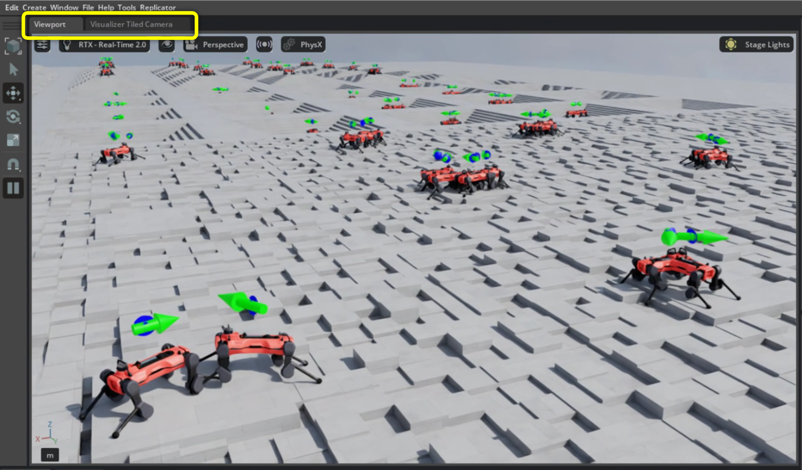
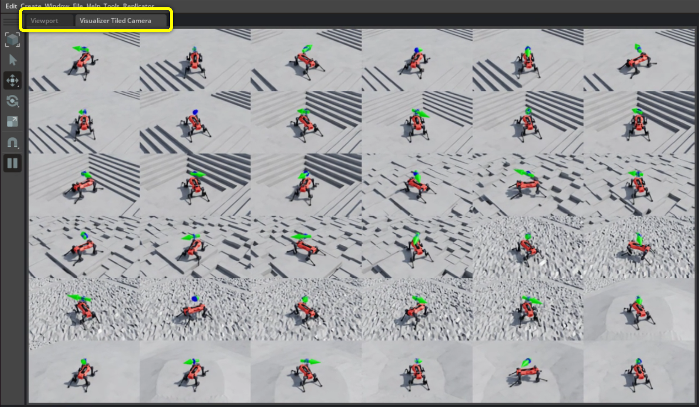

.. _how-to-visualizer-tiled-camera:

Using Visualizer Tiled Cameras
==============================

.. currentmodule:: isaaclab

This guide is accompanied by the ``run_tiled_camera_visualizer.py`` script in the
``IsaacLab/scripts/tutorials/07_visualizers`` directory.

For general visualizer documentation, see :doc:`/source/overview/core-concepts/visualization`.

The visualizer tiled camera view is a live monitoring and debugging tool. It opens a
non-interactive panel in the Kit or Newton visualizer and streams tiled camera views
across all selected environments. Note, this is separate from tiled camera observations
used by policies.

The visualizer tiled cameras are currently supported by Kit and Newton visualizers.

This guide shows two tiled camera use cases:

- configured tiled cameras pointed at and following moving Anymal-D robots shown in Kit visualizer
- streaming from existing wrist-mounted robot cameras shown in Newton visualizer

.. dropdown:: Code for run_tiled_camera_visualizer.py
   :icon: code

   .. literalinclude:: ../../../scripts/tutorials/07_visualizers/run_tiled_camera_visualizer.py
      :language: python
      :emphasize-lines: 65-77,81-90
      :linenos:

Example One: Following Anymal-D Robots in Kit Visualizer
--------------------------------------------------------

The Kit Visualizer shows the tiled camera view in a separate tab inside the main
Viewport window. The highlighted tab area in the figures below shows where to
toggle between the interactive viewport and the visualizer tiled camera view.
You can also display the main visualizer camera and the tiled camera view side by
side for dual monitoring.

To run the tutorial with the args for this example, use:

.. code-block:: bash

   ./isaaclab.sh -p scripts/tutorials/07_visualizers/run_tiled_camera_visualizer.py \
     --enable_cameras \
     --task Isaac-Velocity-Rough-Anymal-D-v0 \
     --num_envs 256 \
     --viz kit

Within the script, you’ll find the ``KitVisualizerCfg`` configuration used to
generate this example. You can use this config as a template for your own use
cases.

In this example, a set of cameras is created to point toward each robot's base
prim and follow its motion. The camera's position, relative to the prim, is set
by the ``tiled_cam_eye`` field of ``KitVisualizerCfg``. For this demo, the
camera is offset by ``(3.0, 3.0, 3.0)`` from each robot base. These cameras
stream automatically to the tiled visualizer panel.
If you change ``tiled_cam_eye`` (for example, to ``(0, 0, 5)``), the panel will
show a top-down view instead.

Note, there are 256 total environments and we randomly sample 36 to stream to the
tiled camera view.

Also note that the Kit visualizer tiled camera view requires the
``--enable_cameras`` CLI arg.

   Kit visualizer showing the interactive viewport. The highlighted tab area is
   where you can switch to the visualizer tiled camera view.

   Kit visualizer showing the tiled camera view generated for selected Anymal-D
   robots.

Example Two: Streaming from Existing Robot-Mounted Cameras in Newton Visualizer
-------------------------------------------------------------------------------

The Newton visualizer provides a tiled camera view in a lightweight OpenGL window.
In this example, we use the Galbot cube stacking environment, which comes with
built-in wrist-mounted cameras. This setup provides an egocentric view of the
gripper, table, and cubes in each selected environment.

To launch this example, run:

.. code-block:: bash

   ./isaaclab.sh -p scripts/tutorials/07_visualizers/run_tiled_camera_visualizer.py \
     --task Isaac-Stack-Cube-Galbot-Left-Arm-Gripper-Visuomotor-v0 \
     --num_envs 64 \
     --viz newton

Within the script, the ``NewtonVisualizerCfg`` is configured to stream images from the
existing camera sensor located at
``/World/envs/env_.*/Robot/right_arm_camera_sim_view_frame/right_camera``. This path
points to the right-arm wrist camera, but you can edit the ``tiled_cam_prim_path``
field of ``NewtonVisualizerCfg`` in the script to show a different existing camera if
needed. To change how many environment tiles are displayed, adjust the
``tiled_cam_num`` field.

In this demo, 25 environments are simulated, and 12 camera feeds are shown in the tiled panel by default.

To show or hide the tiled camera panel, use the highlighted ``Tiled Camera View``
dropdown in the left-hand sidebar of the Newton visualizer window.

   Newton visualizer showing the interactive view. The highlighted dropdown is
   where you can select the visualizer tiled camera panel.

   Newton visualizer showing the selected Galbot wrist-camera feeds in the tiled
   camera panel.

Configuration notes
-------------------

To customize tiled camera behavior, edit the highlighted ``VisualizerCfg`` fields in
``run_tiled_camera_visualizer.py``:

* For generated cameras, ``tiled_cam_target_prim_path`` chooses the followed prim and
  ``tiled_cam_eye`` sets the camera offset from that prim.
* For existing scene cameras, ``tiled_cam_prim_path`` must match an Isaac Lab
  :class:`~isaaclab.sensors.Camera` sensor in the selected task.
* ``tiled_cam_num`` controls how many environment tiles are shown.

Troubleshooting
---------------

* If a generated view fails with a missing prim error, check that
  ``tiled_cam_target_prim_path`` resolves in each selected environment. Common template
  forms include ``/World/envs/*/...`` and ``/World/envs/env_.*/...``.
* If an existing-camera view reports that no Isaac Lab camera owns the prim, check that
  ``tiled_cam_prim_path`` matches a :class:`~isaaclab.sensors.Camera` sensor in the task.
* If ``rerun`` or ``viser`` is selected, use ``--viz kit`` or ``--viz newton`` instead.
  The tiled camera panel is currently implemented for Kit and Newton.
* If the view is too expensive, reduce ``tiled_cam_num``, ``--num_envs``, or the camera
  resolution. The visualizer caps the tiled panel at 100 tiles.

See also
--------

* :doc:`/source/overview/core-concepts/visualization` - visualizer configuration and UI controls.
* :doc:`/source/how-to/configure_rendering` - selecting rendering presets and quality modes.
