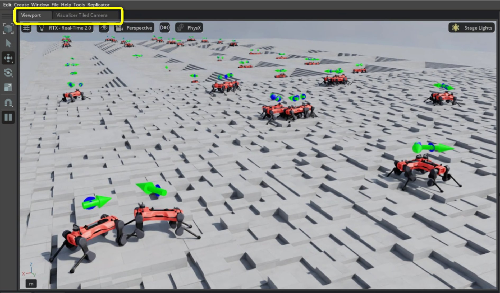
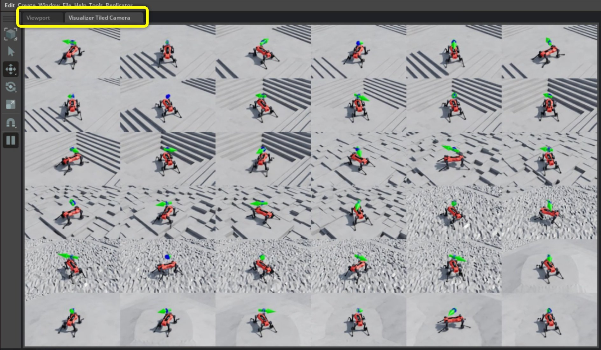
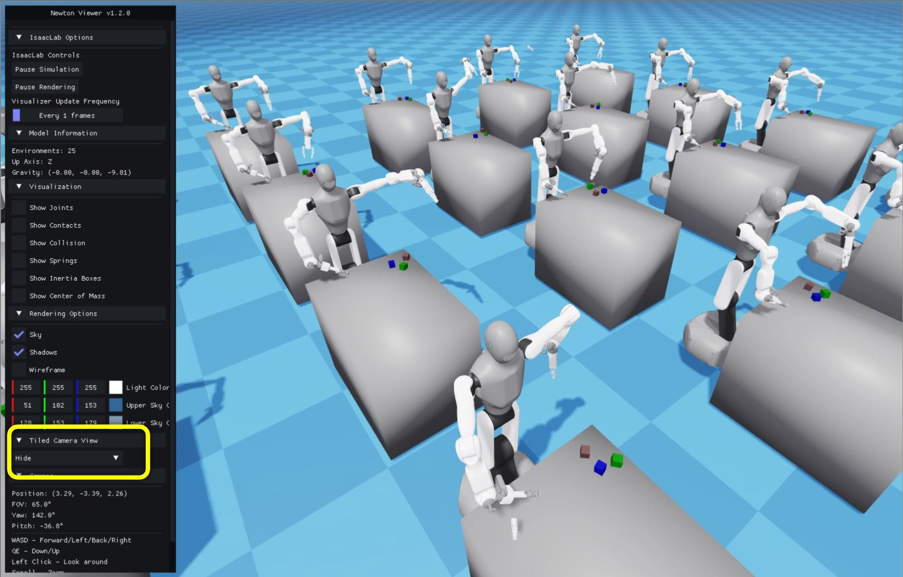
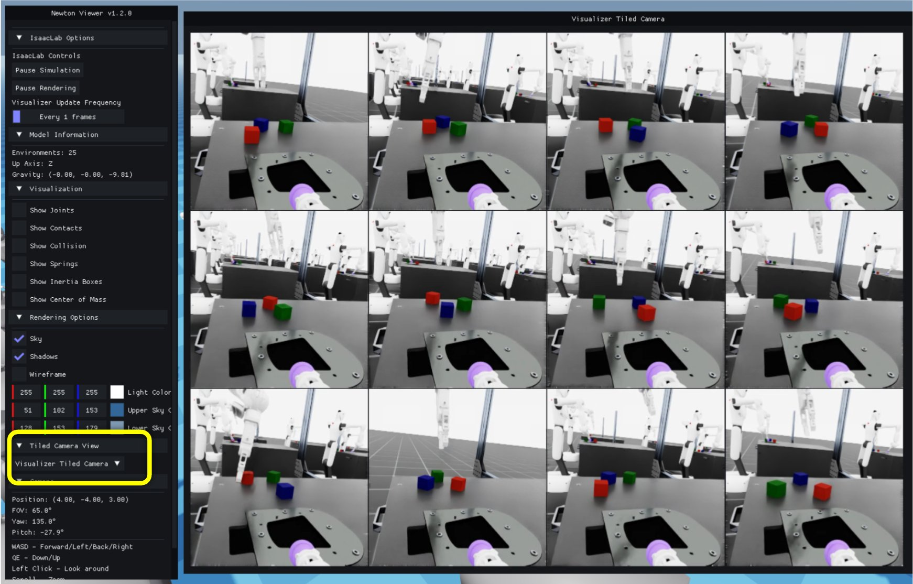

.. _how-to-visualizer-tiled-camera:

Using the Visualizer Streaming Camera View
==========================================

.. currentmodule:: isaaclab

For general visualizer documentation, see :doc:`/source/overview/core-concepts/visualization`.

The visualizer streaming camera view is a live monitoring and debugging tool. It composites
per-environment ground-truth camera frames — RGB, depth, segmentation, or surface normals —
into a single panel that updates every step. The panel can display cameras that follow the
robots automatically, or stream from existing scene camera sensors.

This guide is accompanied by the ``run_tiled_camera_visualizer.py`` script in the
``IsaacLab/scripts/tutorials/07_visualizers`` directory.

Running this script demonstrates two ways to use the streaming camera view:

- auto-created cameras pointed at and following moving AnymalD robots shown in the Kit visualizer
- streaming from existing wrist-mounted robot cameras shown in the Newton visualizer

.. note::

   The streaming camera view is supported in the Kit, Newton GL, Rerun, and Viser visualizers.
   The Newton RTX visualizer accepts the configuration but does not display the panel (experimental).

.. dropdown:: Code for run_tiled_camera_visualizer.py
   :icon: code

   .. literalinclude:: ../../../scripts/tutorials/07_visualizers/run_tiled_camera_visualizer.py
      :language: python
      :emphasize-lines: 72-78,81-83,89-96,107-109
      :linenos:

Example One: Following AnymalD Robots
--------------------------------------

The Kit Visualizer shows the streaming camera view in a separate tab inside the main
Viewport window, labelled **Streaming View**. The highlighted tab area in the figures
below shows where to toggle between the interactive viewport and the streaming camera view.

   Kit visualizer showing the default interactive viewport.

   Kit visualizer showing the streaming camera view generated for selected AnymalD
   robots.

Note, you can also display the main visualizer camera and the streaming camera view side by
side for dual monitoring.

To run the tutorial with the args for this example, use:

.. code-block:: bash

   uv run python scripts/tutorials/07_visualizers/run_tiled_camera_visualizer.py \
       --task Isaac-Velocity-Rough-AnymalD --num_envs 256 --viz kit

Within the script, you'll find the ``KitVisualizerCfg`` configuration used to
generate this example. You can use this config as a template for your own use
cases.

In this example, a set of cameras is created to point toward each robot's base
prim and follow its motion. The camera's position, relative to the prim, is set
by the ``streaming_cam_eye`` field of ``KitVisualizerCfg``. For this demo, the
camera is offset by ``(3.0, 3.0, 3.0)`` from each robot base. If you change
``streaming_cam_eye`` (for example, to ``(0, 0, 5)``), the panel will show a
top-down view instead.

In this example, there are 256 total environments, and we randomly sample 36 to stream to the
camera view.

The Kit visualizer streaming camera view does not require an additional camera option.

Example Two: Streaming from Robot-Mounted Cameras
-------------------------------------------------

The Newton visualizer provides a streaming camera view in a lightweight OpenGL window.
The panel is hidden by default. To open it, expand the **Streaming View** section in the
left-hand sidebar and change the toggle from **Hide** to **Open**.

   Newton visualizer showing the default interactive viewport.

   Newton visualizer showing the selected Galbot head-camera feeds in the streaming
   camera panel.

In this example, we use the Galbot cube stacking environment, which comes with
built-in wrist-mounted cameras. This setup provides an egocentric view of the
gripper, table, and cubes in each selected environment.

To launch this example, run:

.. code-block:: bash

   uv run python scripts/tutorials/07_visualizers/run_tiled_camera_visualizer.py \
       --task IsaacContrib-Stack-Cube-Galbot-Left-Arm-Gripper-Visuomotor --num_envs 25 --viz newton_gl

Within the script, the ``NewtonGLVisualizerCfg`` is configured to stream images from the
existing camera sensor located at
``/World/envs/env_.*/Robot/head_camera_sim_view_frame/head_camera``. This path
points to the head camera, but you can edit the ``streaming_sensor_prim_path``
field of ``NewtonGLVisualizerCfg`` in the script to show a different existing camera if
needed.

In this demo, 25 environments are simulated, and 12 camera feeds are shown in the panel by default.

Configuration notes
-------------------

To customize streaming camera behavior, edit the highlighted ``VisualizerCfg`` fields in
``run_tiled_camera_visualizer.py``:

* For auto-created cameras, ``streaming_cam_target_prim_path`` chooses the followed prim and
  ``streaming_cam_eye`` sets the camera offset from that prim.  Defaults to ``None``, which
  causes the visualizer to adopt the first scene camera it discovers at init — no explicit path
  is needed when a ``TiledCamera`` sensor is already in the scene.
* For existing scene cameras, ``streaming_sensor_prim_path`` must match an Isaac Lab
  :class:`~isaaclab.sensors.Camera` sensor prim path in the selected task.
* ``streaming_envs`` controls how many environment tiles are shown. Pass an ``int`` to randomly
  sample that many environments, or a ``list[int]`` to pin specific environment indices.
* ``streaming_gt_types`` selects which ground-truth types are shown — e.g.
  ``["rgb", "depth", "segmentation"]``.
* ``streaming_depth_min`` / ``streaming_depth_max`` set the depth colormap range in metres.

See :ref:`streaming-camera-view` for the full field reference.

Troubleshooting
---------------

* If a generated view fails with a missing prim error, verify that
  ``streaming_cam_target_prim_path`` resolves in each selected environment (common template
  forms: ``/World/envs/*/...``, ``/World/envs/env_.*/...``).  In most cases you can leave
  it as ``None`` and let the visualizer adopt an existing scene camera automatically.
* If an existing-camera view reports that no Isaac Lab camera owns the prim, check that
  ``streaming_sensor_prim_path`` matches a :class:`~isaaclab.sensors.Camera` sensor in the task.
* If the depth panel shows a flat color, adjust ``streaming_depth_min`` and
  ``streaming_depth_max`` to bracket the expected depth range in your scene.
* If the view is too expensive, reduce ``streaming_envs``, ``--num_envs``, or the camera
  resolution.

See also
--------

* :doc:`/source/overview/core-concepts/visualization` - visualizer configuration and UI controls.
* :doc:`/source/how-to/configure_rendering` - customizing RTX rendering settings.
