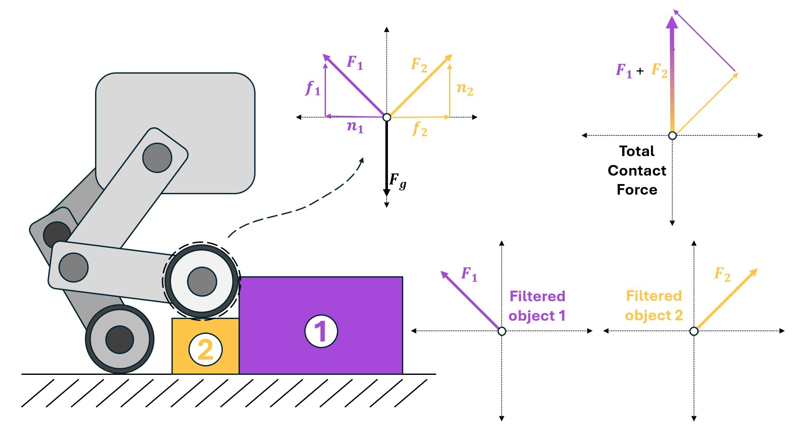
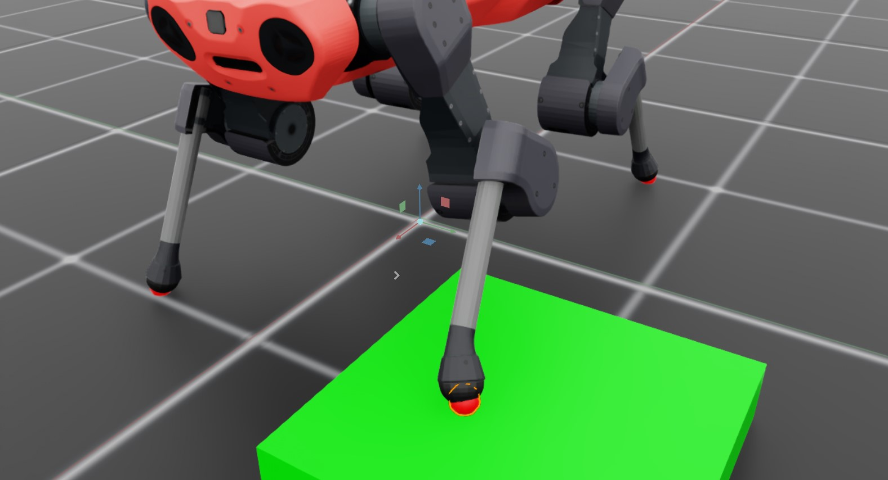

.. _overview_sensors_contact:

.. currentmodule:: isaaclab

Contact Sensor
==============

The contact sensor is designed to return the net contact force acting on a given ridgid body. The sensor is written to behave as a physical object, and so the "scope" of the contact sensor is limited to the body (or bodies) that defines it. There are multiple ways to define this scope, depending on your need to filter the forces coming from the contact.

By default, the reported force is the total contact force, but your application may only care about contact forces due to specific objects. Retrieving contact forces from specific objects requires filtering, and this can only be done in a "many-to-one" way. A multi-legged robot that needs filterable contact information for its feet would require one sensor per foot to be defined in the environment, but a robotic hand with contact sensors on the tips of each finger can be defined with a single sensor.

Consider a simple environment with an Anymal Quadruped and a block

.. literalinclude:: ../../../../../scripts/demos/sensors/contact_sensor.py
    :language: python
    :lines: 40-90

We define the sensors on the feet of the robot in two different ways.  The front feet are independent sensors (one sensor body per foot) and the "Cube" is placed under the left foot.  The hind feet are defined as a single sensor with multiple bodies.

We can then run the scene and print the data from the sensors

.. code-block:: python

  def run_simulator(sim: sim_utils.SimulationContext, scene: InteractiveScene):
    .
    .
    .
    # Simulate physics
    while simulation_app.is_running():
      .
      .
      .
      # print information from the sensors
      print("-------------------------------")
      print(scene["contact_forces_LF"])
      print("Received force matrix of: ", scene["contact_forces_LF"].data.force_matrix_w)
      print("Received contact force of: ", scene["contact_forces_LF"].data.net_forces_w)
      print("-------------------------------")
      print(scene["contact_forces_RF"])
      print("Received force matrix of: ", scene["contact_forces_RF"].data.force_matrix_w)
      print("Received contact force of: ", scene["contact_forces_RF"].data.net_forces_w)
      print("-------------------------------")
      print(scene["contact_forces_H"])
      print("Received force matrix of: ", scene["contact_forces_H"].data.force_matrix_w)
      print("Received contact force of: ", scene["contact_forces_H"].data.net_forces_w)

Here, we print both the net contact force and the filtered force matrix for each contact sensor defined in the scene. The front left and front right feet report the following

.. code-block:: bash

  -------------------------------
  Contact sensor @ '/World/envs/env_.*/Robot/LF_FOOT':
          view type         : <class 'omni.physics.tensors.impl.api.RigidBodyView'>
          update period (s) : 0.0
          number of bodies  : 1
          body names        : ['LF_FOOT']

  Received force matrix of:  tensor([[[[-1.3923e-05,  1.5727e-04,  1.1032e+02]]]], device='cuda:0')
  Received contact force of:  tensor([[[-1.3923e-05,  1.5727e-04,  1.1032e+02]]], device='cuda:0')
  -------------------------------
  Contact sensor @ '/World/envs/env_.*/Robot/RF_FOOT':
          view type         : <class 'omni.physics.tensors.impl.api.RigidBodyView'>
          update period (s) : 0.0
          number of bodies  : 1
          body names        : ['RF_FOOT']

  Received force matrix of:  tensor([[[[0., 0., 0.]]]], device='cuda:0')
  Received contact force of:  tensor([[[1.3529e-05, 0.0000e+00, 1.0069e+02]]], device='cuda:0')

Notice that even with filtering, both sensors report the net contact force acting on the foot. However, the "force matrix" on the right foot is zero because that foot isn't in contact with the filtered body, ``/World/envs/env_.*/Cube``. Now, checkout the data coming from the hind feet!

.. code-block:: bash

  -------------------------------
  Contact sensor @ '/World/envs/env_.*/Robot/.*H_FOOT':
          view type         : <class 'omni.physics.tensors.impl.api.RigidBodyView'>
          update period (s) : 0.0
          number of bodies  : 2
          body names        : ['LH_FOOT', 'RH_FOOT']

  Received force matrix of:  None
  Received contact force of:  tensor([[[9.7227e-06, 0.0000e+00, 7.2364e+01],
          [2.4322e-05, 0.0000e+00, 1.8102e+02]]], device='cuda:0')

In this case, the contact sensor has two bodies: the left and right hind feet.  When the force matrix is queried, the result is ``None`` because this is a many body sensor, and presently Isaac Lab only supports "many to one" contact force filtering. Unlike the single body contact sensor, the reported force tensor has multiple entries, with each "row" corresponding to the contact force on a single body of the sensor (matching the ordering at construction).

.. dropdown:: Code for contact_sensor.py
   :icon: code

   .. literalinclude:: ../../../../../scripts/demos/sensors/contact_sensor.py
      :language: python
      :linenos:
