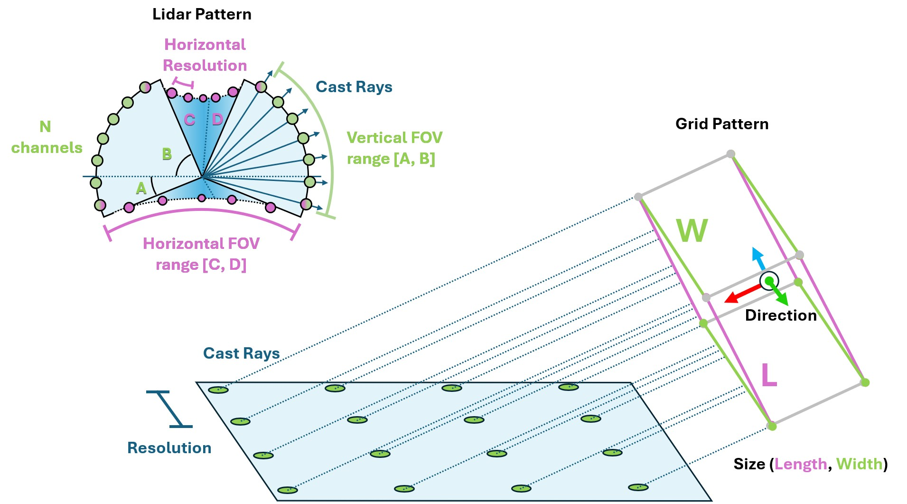
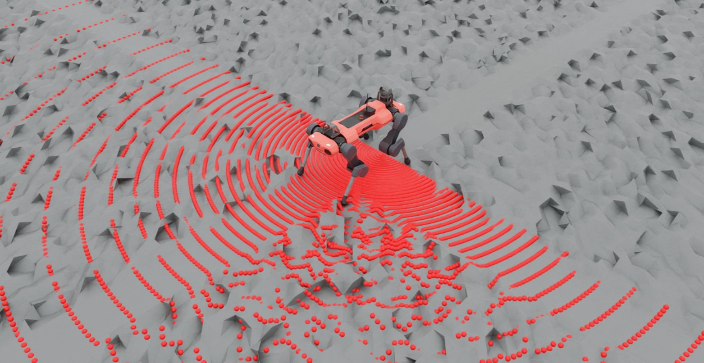

.. _overview_sensors_ray_caster:

.. currentmodule:: isaaclab

Ray Caster
=============

The Ray Caster sensor (and the ray caster camera) are similar to RTX based rendering in that they both involve casting rays.  The difference here is that the rays cast by the Ray Caster sensor return strictly collision information along the cast, and the direction of each individual ray can be specified.  They do not bounce, nor are they affected by things like materials or opacity. For each ray specified by the sensor, a line is traced along the path of the ray and the location of first collision with the specified mesh is returned. This is the method used by some of our quadruped examples to measure the local height field.

To keep the sensor performant when there are many cloned environments, the line tracing is done directly in `Warp <https://nvidia.github.io/warp/>`_. This is the reason why specific meshes need to be identified to cast against: that mesh data is loaded onto the device by warp when the sensor is initialized.

The sensor supports both **static meshes** (fixed geometry) and **dynamic meshes** (moving objects). Static meshes are loaded once at initialization, while dynamic meshes have their transforms updated before each raycast operation. This enables raycasting against moving obstacles, dynamic platforms, or other robots in multi-agent scenarios.

Using a ray caster sensor requires a **pattern** and a parent xform to be attached to.  The pattern defines how the rays are cast, while the prim properties defines the orientation and position of the sensor (additional offsets can be specified for more exact placement).  Isaac Lab supports a number of ray casting pattern configurations, including a generic LIDAR and grid pattern.

.. literalinclude:: ../../../../../scripts/demos/sensors/raycaster_sensor.py
    :language: python
    :lines: 40-71

Notice that the units on the pattern config is in degrees! Also, we enable visualization here to explicitly show the pattern in the rendering, but this is not required and should be disabled for performance tuning.

Querying the sensor for data can be done at simulation run time like any other sensor.

.. code-block:: python

  def run_simulator(sim: sim_utils.SimulationContext, scene: InteractiveScene):
    .
    .
    .
    # Simulate physics
    while simulation_app.is_running():
      .
      .
      .
      # print information from the sensors
        print("-------------------------------")
        print(scene["ray_caster"])
        print("Ray cast hit results: ", scene["ray_caster"].data.ray_hits_w)

.. code-block:: bash

    -------------------------------
    Ray-caster @ '/World/envs/env_.*/Robot/base/lidar_cage':
            view type            : <class 'isaacsim.core.prims.xform_prim.XFormPrim'>
            update period (s)    : 0.016666666666666666
            number of meshes     : 1
            number of sensors    : 1
            number of rays/sensor: 18000
            total number of rays : 18000
    Ray cast hit results:  tensor([[[-0.3698,  0.0357,  0.0000],
            [-0.3698,  0.0357,  0.0000],
            [-0.3698,  0.0357,  0.0000],
            ...,
            [    inf,     inf,     inf],
            [    inf,     inf,     inf],
            [    inf,     inf,     inf]]], device='cuda:0')
    -------------------------------

Here we can see the data returned by the sensor itself.  Notice first that there are 3 closed brackets at the beginning and the end: this is because the data returned is batched by the number of sensors. The ray cast pattern itself has also been flattened, and so the dimensions of the array are ``[N, B, 3]`` where ``N`` is the number of sensors, ``B`` is the number of cast rays in the pattern, and 3 is the dimension of the casting space. Finally, notice that the first several values in this casting pattern are the same: this is because the lidar pattern is spherical and we have specified our FOV  to be hemispherical, which includes the poles. In this configuration, the "flattening pattern" becomes apparent: the first 180 entries will be the same because it's the bottom pole of this hemisphere, and there will be 180 of them because our horizontal FOV is 180 degrees with a resolution of 1 degree.

You can use this script to experiment with pattern configurations and build an intuition about how the data is stored by altering the ``triggered`` variable on line 81.

.. dropdown:: Code for raycaster_sensor.py
   :icon: code

   .. literalinclude:: ../../../../../scripts/demos/sensors/raycaster_sensor.py
      :language: python
      :linenos:

Dynamic Meshes
--------------

The Ray Caster sensor supports raycasting against dynamic (moving) meshes in addition to static meshes. This is useful for:

* Detecting moving obstacles
* Multi-agent collision avoidance
* Dynamic platform navigation
* Reactive behavior in changing environments

To use dynamic meshes, specify which mesh paths are dynamic using the ``dynamic_mesh_prim_paths`` parameter:

.. code-block:: python

    from isaaclab.sensors.ray_caster import RayCasterCfg, patterns

    ray_caster_cfg = RayCasterCfg(
        prim_path="/World/envs/env_.*/Robot/lidar",
        mesh_prim_paths=[
            "/World/envs/env_.*/ground_plane",  # Static mesh
            "/World/envs/env_.*/obstacle",       # Dynamic mesh
        ],
        dynamic_mesh_prim_paths=[
            "/World/envs/env_.*/obstacle",  # Mark obstacle as dynamic
        ],
        pattern_cfg=patterns.LidarPatternCfg(
            channels=16,
            vertical_fov_range=(-15.0, 15.0),
            horizontal_fov_range=(0.0, 360.0),
            horizontal_res=1.0,
        ),
        debug_vis=False,
    )

.. note::
**Environment Origins Required**: The raycaster requires environment origins to correctly transform mesh coordinates from world space to environment-local space. You must call ``raycaster.set_env_origins(env_origins)`` after creating the sensor, typically in your environment's ``__init__`` method. This is required for both static and dynamic meshes.

Dynamic Mesh Performance
^^^^^^^^^^^^^^^^^^^^^^^^

Dynamic meshes have a small computational overhead for updating their transforms. The sensor uses PhysX RigidBodyView for fast batched transform queries when possible:

* **Static meshes only**: ~0.2-0.5 ms raycast time
* **With dynamic meshes (PhysX views)**: +0.5-2 ms overhead (5-10x faster than USD queries)
* **With dynamic meshes (USD fallback)**: +5-15 ms overhead (used when meshes lack RigidBodyAPI)

To optimize performance with many dynamic meshes:

1. **Ensure dynamic meshes have** ``UsdPhysics.RigidBodyAPI`` **applied** (enables fast PhysX views)
2. **Use the** ``dynamic_mesh_update_decimation`` **parameter to update less frequently:**

.. code-block:: python

    ray_caster_cfg = RayCasterCfg(
        # ... other parameters
        dynamic_mesh_update_decimation=2,  # Update every 2 frames (50% faster)
    )

3. **Simplify mesh geometry** for raycasting (fewer vertices = faster updates)

Profiling Dynamic Mesh Performance
^^^^^^^^^^^^^^^^^^^^^^^^^^^^^^^^^^^

To measure the performance impact of dynamic meshes, enable built-in profiling:

.. code-block:: python

    # Enable profiling on the sensor
    raycaster = scene["lidar"]
    raycaster.enable_profiling = True

    # Run simulation...
    for _ in range(500):
        env.step(action)

    # Print statistics
    raycaster.print_profile_stats()

This will output detailed timing statistics:

.. code-block:: text

    ============================================================
    RayCaster Performance Statistics
    ============================================================
    Number of dynamic meshes: 35
    Total meshes: 35
    ------------------------------------------------------------

    Dynamic Mesh Update:
      Mean:  1.2345 ms
      Std:   0.1234 ms
      Min:   1.0123 ms
      Max:   1.5678 ms
      Count: 500

    Raycast:
      Mean:  0.2345 ms
      Std:   0.0234 ms
      Min:   0.2123 ms
      Max:   0.3456 ms
      Count: 500

    Total Update:
      Mean:  2.3456 ms
      Std:   0.2345 ms
      Min:   2.1234 ms
      Max:   3.4567 ms
      Count: 500

    ------------------------------------------------------------
    Time Breakdown:
      Dynamic Mesh Updates: 52.6%
      Raycasting:          10.0%
      Other:               37.4%
    ============================================================
