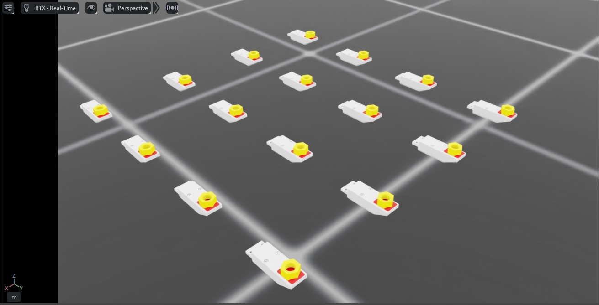

.. _overview_sensors_tactile:

.. currentmodule:: isaaclab

Visuo-Tactile Sensor
====================

The visuo-tactile sensor in Isaac Lab provides realistic tactile feedback through integration with TacSL (Tactile Sensor Learning) [Akinola2025]_. It is designed to simulate high-fidelity tactile interactions, generating both visual and force-based data that mirror real-world tactile sensors like GelSight devices. The sensor can provide tactile RGB images, force field distributions, and other intermediate tactile measurements essential for robotic manipulation tasks requiring fine tactile feedback.

Configuration
~~~~~~~~~~~~~

Tactile sensors require specific configuration parameters to define their behavior and data collection properties. The sensor can be configured with various parameters including sensor resolution, force sensitivity, and output data types.

.. code-block:: python

    from isaaclab.sensors import TiledCameraCfg
    from isaaclab_assets.sensors import GELSIGHT_R15_CFG
    import isaaclab.sim as sim_utils

    from isaaclab_contrib.sensors.tacsl_sensor import VisuoTactileSensorCfg

    # Tactile sensor configuration
    tactile_sensor = VisuoTactileSensorCfg(
        prim_path="{ENV_REGEX_NS}/Robot/elastomer/tactile_sensor",
        ## Sensor configuration
        render_cfg=GELSIGHT_R15_CFG,
        enable_camera_tactile=True,
        enable_force_field=True,
        ## Elastomer configuration
        tactile_array_size=(20, 25),
        tactile_margin=0.003,
        ## Contact object configuration
        contact_object_prim_path_expr="{ENV_REGEX_NS}/contact_object",
        ## Force field physics parameters
        normal_contact_stiffness=1.0,
        friction_coefficient=2.0,
        tangential_stiffness=0.1,
        ## Camera configuration
        camera_cfg=TiledCameraCfg(
            prim_path="{ENV_REGEX_NS}/Robot/elastomer_tip/cam",
            update_period=1 / 60,  # 60 Hz
            height=320,
            width=240,
            data_types=["distance_to_image_plane"],
            spawn=None,  # camera already spawned in USD file
        ),
    )

The configuration supports customization of:

* **Render Configuration**: Specify the GelSight sensor rendering parameters using predefined configs
  (e.g., ``GELSIGHT_R15_CFG``, ``GELSIGHT_MINI_CFG`` from ``isaaclab_assets.sensors``)
* **Tactile Modalities**:
    * ``enable_camera_tactile`` - Enable tactile RGB imaging through camera sensors
    * ``enable_force_field`` - Enable force field computation and visualization
* **Force Field Grid**: Set tactile grid dimensions (``tactile_array_size``) and margins, which directly affects the spatial resolution of the computed force field
* **Contact Object Configuration**: Define properties of interacting objects using prim path expressions to locate objects with SDF collision meshes
* **Physics Parameters**: Control the sensor's force field computation:
    * ``normal_contact_stiffness``, ``friction_coefficient``, ``tangential_stiffness`` - Normal stiffness, friction coefficient, and tangential stiffness
* **Camera Settings**: Configure resolution, update rates, and data types, currently only ``distance_to_image_plane`` (alias for ``depth``) is supported.
    ``spawn`` is set to ``None`` by default, which means that the camera is already spawned in the USD file.
    If you want to spawn the camera yourself and set focal length, etc., you can set the spawn configuration to a valid spawn configuration.

Configuration Requirements
~~~~~~~~~~~~~~~~~~~~~~~~~~

.. important::
   The following requirements must be satisfied for proper sensor operation:

   **Camera Tactile Imaging**
      If ``enable_camera_tactile=True``, a valid ``camera_cfg`` (TiledCameraCfg) must be provided with appropriate camera parameters.

   **Force Field Computation**
      If ``enable_force_field=True``, the following parameters are required:

      * ``contact_object_prim_path_expr`` - Prim path expression to locate contact objects with SDF collision meshes

   **SDF Computation**
      When force field computation is enabled, penalty-based normal and shear forces are computed using Signed Distance Field (SDF) queries. To achieve GPU acceleration:

      * Interacting objects should have SDF collision meshes
      * An SDFView must be defined during initialization, therefore interacting objects should be specified before simulation.

   **Elastomer Configuration**
      The sensor's ``prim_path`` must be configured as a child of the elastomer prim in the USD hierarchy.
      The query points for the force field computation is computed from the surface of the elastomer mesh, which is searched for under the prim path of the elastomer.

   **Physics Materials**
      The sensor uses physics materials to configure the compliant contact properties of the elastomer.
      By default, physics material properties are pre-configured in the USD asset. However, you can override
      these properties by specifying the following parameters in ``UsdFileWithCompliantContactCfg`` when
      spawning the robot:

      * ``compliant_contact_stiffness`` - Contact stiffness for the elastomer surface
      * ``compliant_contact_damping`` - Contact damping for the elastomer surface
      * ``physics_material_prim_path`` - Prim path where physics material is applied (typically ``"elastomer"``)

      If any parameter is set to ``None``, the corresponding property from the USD asset will be retained.

Usage Example
~~~~~~~~~~~~~

To use the tactile sensor in a simulation environment, run the demo:

.. code-block:: bash

    cd scripts/demos/sensors
    python tacsl_sensor.py --use_tactile_rgb --use_tactile_ff --tactile_compliance_stiffness 100.0 --tactile_compliant_damping 1.0 --contact_object_type nut --num_envs 16 --save_viz --enable_cameras

Available command-line options include:

* ``--use_tactile_rgb``: Enable camera-based tactile sensing
* ``--use_tactile_ff``: Enable force field tactile sensing
* ``--contact_object_type``: Specify the type of contact object (nut, cube, etc.)
* ``--num_envs``: Number of parallel environments
* ``--save_viz``: Save visualization outputs for analysis
* ``--tactile_compliance_stiffness``: Override compliant contact stiffness (default: use USD asset values)
* ``--tactile_compliant_damping``: Override compliant contact damping (default: use USD asset values)
* ``--normal_contact_stiffness``: Normal contact stiffness for force field computation
* ``--tangential_stiffness``: Tangential stiffness for shear forces
* ``--friction_coefficient``: Friction coefficient for shear forces
* ``--debug_sdf_closest_pts``: Visualize closest SDF points for debugging
* ``--debug_tactile_sensor_pts``: Visualize tactile sensor points for debugging
* ``--trimesh_vis_tactile_points``: Enable trimesh-based visualization of tactile points

For a complete list of available options:

.. code-block:: bash

    python tacsl_sensor.py -h

.. note::
   The demo examples are based on the Gelsight R1.5, which is a prototype sensor that is now discontinued. The same procedure can be adapted for other visuotactile sensors.

The tactile sensor supports multiple data modalities that provide comprehensive information about contact interactions:

Output Tactile Data
~~~~~~~~~~~~~~~~~~~
**RGB Tactile Images**
    Real-time generation of tactile RGB images as objects make contact with the sensor surface. These images show deformation patterns and contact geometry similar to gel-based tactile sensors [Si2022]_

**Force Fields**
    Detailed contact force field and pressure distributions across the sensor surface, including normal and shear components.

.. list-table::
   :widths: 50 50
   :class: borderless

   * - .. figure:: ../../../_static/overview/sensors/tacsl_taxim_example.jpg
          :align: center
          :figwidth: 80%
          :alt: Tactile output with RGB visualization

     - .. figure:: ../../../_static/overview/sensors/tacsl_force_field_example.jpg
          :align: center
          :figwidth: 80%
          :alt: Tactile output with force field visualization

Integration with Learning Frameworks
~~~~~~~~~~~~~~~~~~~~~~~~~~~~~~~~~~~~

The tactile sensor is designed to integrate seamlessly with reinforcement learning and imitation learning frameworks. The structured tensor outputs can be directly used as observations in learning algorithms:

.. code-block:: python

    def get_tactile_observations(self):
        """Extract tactile observations for learning."""
        tactile_data = self.scene["tactile_sensor"].data

        # tactile RGB image
        tactile_rgb = tactile_data.tactile_rgb_image

        # tactile depth image
        tactile_depth = tactile_data.tactile_depth_image

        # force field
        tactile_normal_force = tactile_data.tactile_normal_force
        tactile_shear_force = tactile_data.tactile_shear_force

        return [tactile_rgb, tactile_depth, tactile_normal_force, tactile_shear_force]

References
~~~~~~~~~~

.. [Akinola2025] Akinola, I., Xu, J., Carius, J., Fox, D., & Narang, Y. (2025). TacSL: A library for visuotactile sensor simulation and learning. *IEEE Transactions on Robotics*.
.. [Si2022] Si, Z., & Yuan, W. (2022). Taxim: An example-based simulation model for GelSight tactile sensors. *IEEE Robotics and Automation Letters*, 7(2), 2361-2368.
