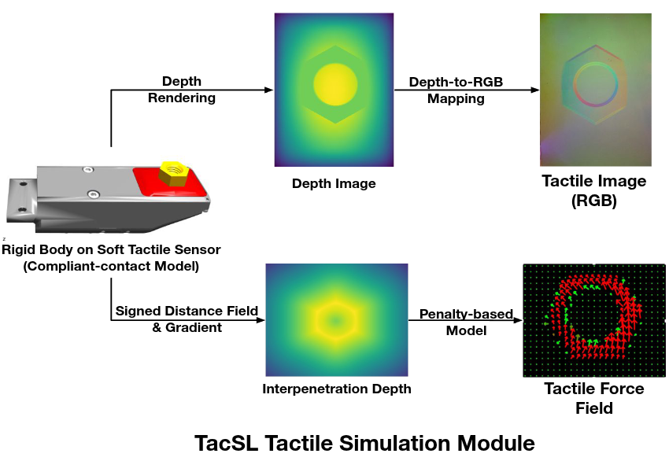
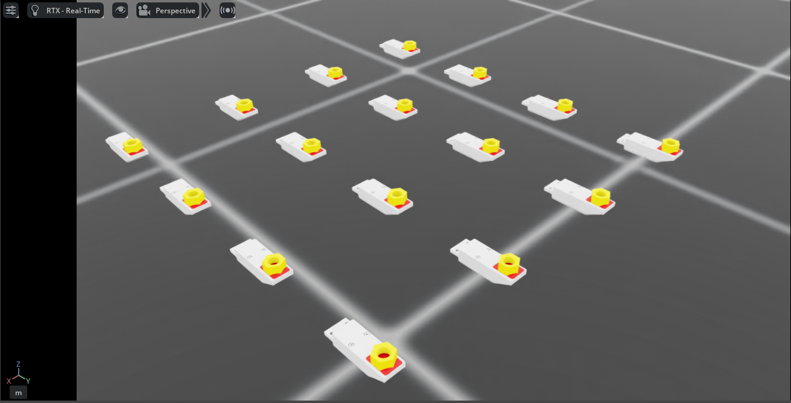

.. _overview_sensors_tactile:

.. currentmodule:: isaaclab

Visuo-Tactile Sensor
====================

The visuo-tactile sensor in Isaac Lab provides realistic tactile feedback through integration with TacSL (Tactile Sensor Learning) [Akinola2025]_. It is designed to simulate high-fidelity tactile interactions, generating both visual and force-based data that mirror real-world tactile sensors like GelSight devices. The sensor can provide tactile RGB images, force field distributions, and other intermediate tactile measurements essential for robotic manipulation tasks requiring fine tactile feedback.

Configuration
~~~~~~~~~~~~~

Tactile sensors require specific configuration parameters to define their behavior and data collection properties. The sensor can be configured with various parameters including sensor resolution, force sensitivity, and output data types.

.. code-block:: python

    from isaaclab.sensors.tacsl_sensor import VisuoTactileSensorCfg

    tactile_sensor = VisuoTactileSensorCfg(
        prim_path="{ENV_REGEX_NS}/Robot/tactile_sensor",
        ## Sensor configuration
        sensor_type="gelsight_r15",
        enable_camera_tactile=True,
        enable_force_field=True,
        ## Elastomer configuration
        elastomer_rigid_body="elastomer",
        elastomer_tactile_mesh="elastomer/visuals",
        elastomer_tip_link_name="elastomer_tip",
        # Force field configuration
        num_tactile_rows=20,
        num_tactile_cols=25,
        tactile_margin=0.003,
        ## Indenter configuration (will be set based on indenter type)
        indenter_rigid_body="indenter",
        indenter_sdf_mesh="factory_nut_loose/collisions",
        ## Force field physics parameters
        tactile_kn=1.0,
        tactile_mu=2.0,
        tactile_kt=0.1,
        ## Compliant dynamics
        compliance_stiffness=150.0,
        compliant_damping=1.0,
        ## Camera configuration
        camera_cfg=TiledCameraCfg(
            prim_path="{ENV_REGEX_NS}/Robot/elastomer_tip/tactile_cam",
            update_period=1 / 60,  # 60 Hz
            height=320,
            width=240,
            data_types=["distance_to_image_plane"],
            spawn=sim_utils.PinholeCameraCfg(
                focal_length=0.020342857142857145 * 100,
                focus_distance=400.0 / 1000,
                horizontal_aperture=0.0119885 * 2 * 100,
                clipping_range=(0.0001, 1.0e5),
            ),
            offset=TiledCameraCfg.OffsetCfg(
                pos=(0.0, 0.0, -0.020342857142857145 + 0.00175), rot=(0.5, 0.5, -0.5, 0.5), convention="world"
            ),
        ),

    )

The configuration supports customization of:

* **Sensor Type**: Specify the tactile sensor model (e.g., ``"gelsight_r15"``)
* **Tactile Modalities**:
    * ``enable_camera_tactile`` - Enable tactile RGB imaging through camera sensors
    * ``enable_force_field`` - Enable force field computation and visualization
* **Elastomer Properties**: Configure elastomer links and tip components that define the sensor's deformable surface
* **Force Field Grid**: Set tactile grid dimensions (``num_tactile_rows``, ``num_tactile_cols``) and margins, which directly affects the spatial resolution of the computed force field
* **Indenter Configuration**: Define properties of interacting objects including rigid body name, and collision mesh
* **Physics Parameters**: Control the sensor's physical behavior:
    * ``tactile_kn``, ``tactile_mu``, ``tactile_kt`` - Normal, friction, and tangential stiffness
    * ``compliance_stiffness``, ``compliant_damping`` - Compliant dynamics parameters
* **Camera Settings**: Configure resolution, focal length, update rates, and 6-DOF positioning relative to the sensor

Configuration Requirements
~~~~~~~~~~~~~~~~~~~~~~~~~~

.. important::
   The following requirements must be satisfied for proper sensor operation:

   **Camera Tactile Imaging**
      If ``enable_camera_tactile=True``, a valid ``camera_cfg`` (TiledCameraCfg) must be provided with appropriate camera parameters.

   **Force Field Computation**
      If ``enable_force_field=True``, the following parameters are required:

      * ``indenter_rigid_body`` - Specific rigid body within the actor
      * ``indenter_sdf_mesh`` - Collision mesh for SDF computation

   **SDF Computation**
      When force field computation is enabled, penalty-based normal and shear forces are computed using Signed Distance Field (SDF) queries. To achieve GPU acceleration:

      * Interacting objects should have SDF collision meshes
      * An SDFView must be defined during initialization, therefore interacting objects should be specified before simulation.

   **Elastomer Configuration**
      Elastomer properties (``elastomer_rigid_body``, ``elastomer_tip_link_name``) must match the robot model where the sensor is attached.

Usage Example
~~~~~~~~~~~~~

To use the tactile sensor in a simulation environment, first ensure the required dependencies are installed:

.. code-block:: bash

    conda activate env_isaaclab
    pip install opencv-python==4.11.0 trimesh==4.5.1 imageio==2.37.0

Download the required assets and place them in the appropriate assets folder.

Then run the demo:

.. code-block:: bash

    cd scripts/demos/sensors/tacsl
    python tacsl_example.py --enable_cameras --indenter nut --num_envs 16 --use_tactile_taxim --use_tactile_ff --save_viz

Available command-line options include:

* ``--enable_cameras``: Enable camera rendering for visualization
* ``--indenter``: Specify the type of indenter object (nut, cube, etc.)
* ``--num_envs``: Number of parallel environments
* ``--use_tactile_taxim``: Enable RGB tactile imaging
* ``--use_tactile_ff``: Enable force field computation
* ``--save_viz``: Save visualization outputs for analysis

For a complete list of available options:

.. code-block:: bash

    python tacsl_example.py -h

.. note::
   The demo examples are based on the Gelsight R1.5, which is a prototype sensor that is now discontinued. The same procedure can be adapted for other visuotactile sensors.

The tactile sensor supports multiple data modalities that provide comprehensive information about contact interactions:

Output Tactile Data
~~~~~~~~~~~~~~~~~~~
**RGB Tactile Images**
    Real-time generation of tactile RGB images as objects make contact with the sensor surface. These images show deformation patterns and contact geometry similar to gel-based tactile sensors [Si2022]_

**Force Fields**
    Detailed contact force field and pressure distributions across the sensor surface, including normal and shear components.

.. list-table::
   :widths: 50 50
   :class: borderless

   * - .. figure:: ../../../_static/overview/sensors/tacsl_taxim_example.png
          :align: center
          :figwidth: 80%
          :alt: Tactile output with RGB visualization

     - .. figure:: ../../../_static/overview/sensors/tacsl_force_field_example.png
          :align: center
          :figwidth: 80%
          :alt: Tactile output with force field visualization

Integration with Learning Frameworks
~~~~~~~~~~~~~~~~~~~~~~~~~~~~~~~~~~~~

The tactile sensor is designed to integrate seamlessly with reinforcement learning and imitation learning frameworks. The structured tensor outputs can be directly used as observations in learning algorithms:

.. code-block:: python

    def get_tactile_observations(self):
        """Extract tactile observations for learning."""
        tactile_data = self.scene["tactile_sensor"].data

        # tactile RGB image
        tactile_rgb = tactile_data.taxim_tactile

        # force field
        tactile_normal_force = tactile_data.tactile_normal_force
        tactile_shear_force = tactile_data.tactile_shear_force

        return [tactile_rgb, tactile_normal_force, tactile_shear_force]

References
~~~~~~~~~~

.. [Akinola2025] Akinola, I., Xu, J., Carius, J., Fox, D., & Narang, Y. (2025). TacSL: A library for visuotactile sensor simulation and learning. *IEEE Transactions on Robotics*.
.. [Si2022] Si, Z., & Yuan, W. (2022). Taxim: An example-based simulation model for GelSight tactile sensors. *IEEE Robotics and Automation Letters*, 7(2), 2361-2368.
