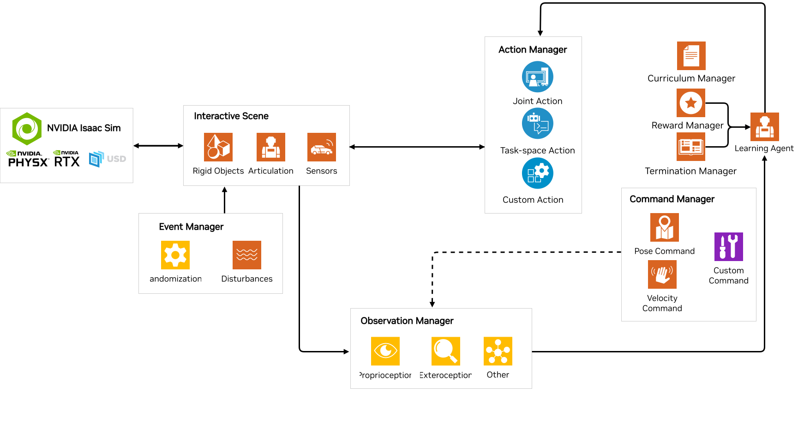
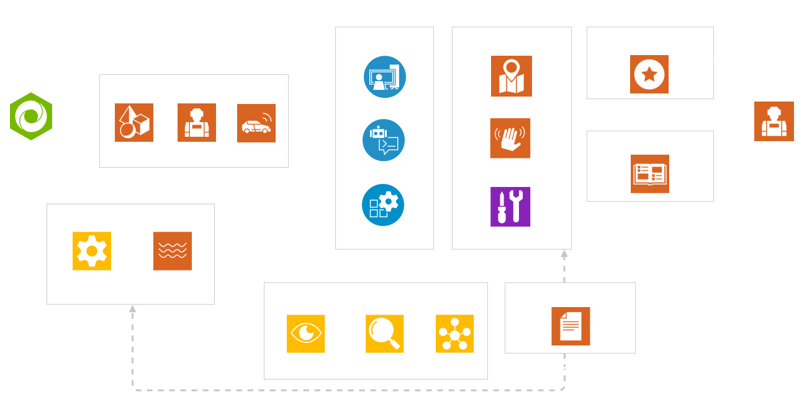
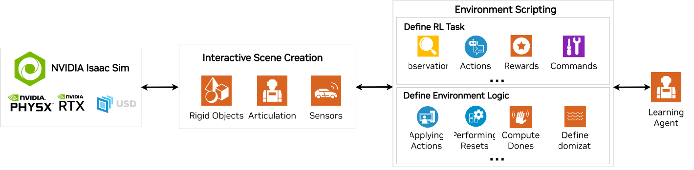
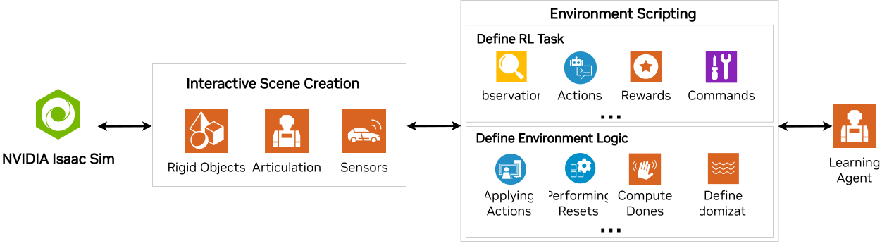

.. _feature-workflows:

Task Design Workflows
=====================

.. currentmodule:: omni.isaac.lab

Environments define the interface between the agent and the simulation. In the simplest case, the environment provides
the agent with the current observations and executes the actions provided by the agent. In a Markov Decision Process
(MDP) formulation, the environment can also provide additional information such as the current reward, done flag, and
information about the current episode.

While the environment interface is simple to understand, its implementation can vary significantly depending on the
complexity of the task. In the context of reinforcement learning (RL), the environment implementation can be broken down
into several components, such as the reward function, observation function, termination function, and reset function.
Each of these components can be implemented in different ways depending on the complexity of the task and the desired
level of modularity.

We provide two different workflows for designing environments with the framework:

* **Manager-based**: The environment is decomposed into individual components (or managers) that handle different
  aspects of the environment (such as computing observations, applying actions, and applying randomization). The
  user defines configuration classes for each component and the environment is responsible for coordinating the
  managers and calling their functions.
* **Direct**: The user defines a single class that implements the entire environment directly without the need for
  separate managers. This class is responsible for computing observations, applying actions, and computing rewards.

Both workflows have their own advantages and disadvantages. The manager-based workflow is more modular and allows
different components of the environment to be swapped out easily. This is useful when prototyping the environment
and experimenting with different configurations. On the other hand, the direct workflow is more efficient and allows
for more fine-grained control over the environment logic. This is useful when optimizing the environment for performance
or when implementing complex logic that is difficult to decompose into separate components.

Manager-Based Environments
--------------------------

A majority of environment implementations follow a similar structure. The environment processes the input actions,
steps through the simulation, computes observations and reward signals, applies randomization, and resets the terminated
environments. Motivated by this, the environment can be decomposed into individual components that handle each of these tasks.
For example, the observation manager is responsible for computing the observations, the reward manager is responsible for
computing the rewards, and the termination manager is responsible for computing the termination signal. This approach
is known as the manager-based environment design in the framework.

Manager-based environments promote modular implementations of tasks by decomposing the task into individual
components that are managed by separate classes. Each component of the task, such as rewards, observations,
termination can all be specified as individual configuration classes that are then passed to the corresponding
manager classes. The manager is then responsible for parsing the configurations and processing the contents specified
in its configuration.

The coordination between the different managers is orchestrated by the class :class:`envs.ManagerBasedRLEnv`.
It takes in a task configuration class instance (:class:`envs.ManagerBasedRLEnvCfg`) that contains the configurations
for each of the components of the task. Based on the configurations, the scene is set up and the task is initialized.
Afterwards, while stepping through the environment, all the managers are called sequentially to perform the necessary
operations.

For their own tasks, we expect the user to mainly define the task configuration class and use the existing
:class:`envs.ManagerBasedRLEnv` class for the task implementation. The task configuration class should inherit from
the base class :class:`envs.ManagerBasedRLEnvCfg` and contain variables assigned to various configuration classes
for each component (such as the ``ObservationCfg`` and ``RewardCfg``).

.. dropdown:: Example for defining the reward function for the Cartpole task using the manager-style
    :icon: plus

    The following class is a part of the Cartpole environment configuration class. The :class:`RewardsCfg` class
    defines individual terms that compose the reward function. Each reward term is defined by its function
    implementation, weight and additional parameters to be passed to the function. Users can define multiple
    reward terms and their weights to be used in the reward function.

    .. literalinclude:: ../../../../source/extensions/omni.isaac.lab_tasks/omni/isaac/lab_tasks/manager_based/classic/cartpole/cartpole_env_cfg.py
        :language: python
        :pyobject: RewardsCfg

Through this approach, it is possible to easily vary the implementations of the task by switching some components
while leaving the remaining of the code intact. This flexibility is desirable when prototyping the environment and
experimenting with different configurations. It also allows for easy collaborating with others on implementing an
environment, since contributors may choose to use different combinations of configurations for their own task
specifications.

.. seealso::

    We provide a more detailed tutorial for setting up an environment using the manager-based workflow at
    :ref:`tutorial-create-manager-rl-env`.

Direct Environments
-------------------

The direct-style environment aligns more closely with traditional implementations of environments,
where a single script directly implements the reward function, observation function, resets, and all the other components
of the environment. This approach does not require the manager classes. Instead, users are provided the complete freedom
to implement their task through the APIs from the base classes :class:`envs.DirectRLEnv` or :class:`envs.DirectMARLEnv`.
For users migrating from the `IsaacGymEnvs`_ and `OmniIsaacGymEnvs`_ framework, this workflow may be more familiar.

When defining an environment with the direct-style implementation, we expect the user define a single class that
implements the entire environment. The task class should inherit from the base classes :class:`envs.DirectRLEnv` or
:class:`envs.DirectMARLEnv` and should have its corresponding configuration class that inherits from
:class:`envs.DirectRLEnvCfg` or :class:`envs.DirectMARLEnvCfg` respectively. The task class is responsible
for setting up the scene, processing the actions, computing the rewards, observations, resets, and termination signals.

.. dropdown:: Example for defining the reward function for the Cartpole task using the direct-style
    :icon: plus

    The following function is a part of the Cartpole environment class and is responsible for computing the rewards.

    .. literalinclude:: ../../../../source/extensions/omni.isaac.lab_tasks/omni/isaac/lab_tasks/direct/cartpole/cartpole_env.py
        :language: python
        :pyobject: CartpoleEnv._get_rewards
        :dedent: 4

    It calls the :meth:`compute_rewards` function which is Torch JIT compiled for performance benefits.

    .. literalinclude:: ../../../../source/extensions/omni.isaac.lab_tasks/omni/isaac/lab_tasks/direct/cartpole/cartpole_env.py
        :language: python
        :pyobject: compute_rewards

This approach provides more transparency in the implementations of the environments, as logic is defined within the task
class instead of abstracted with the use of managers. This may be beneficial when implementing complex logic that is
difficult to decompose into separate components. Additionally, the direct-style implementation may bring more performance
benefits for the environment, as it allows implementing large chunks of logic with optimized frameworks such as
`PyTorch JIT`_ or `Warp`_. This may be valuable when scaling up training tremendously which requires optimizing individual
operations in the environment.

.. seealso::

    We provide a more detailed tutorial for setting up a RL environment using the direct workflow at
    :ref:`tutorial-create-direct-rl-env`.

.. _IsaacGymEnvs: https://github.com/isaac-sim/IsaacGymEnvs
.. _OmniIsaacGymEnvs: https://github.com/isaac-sim/OmniIsaacGymEnvs
.. _Pytorch JIT: https://pytorch.org/docs/stable/jit.html
.. _Warp: https://github.com/NVIDIA/warp
