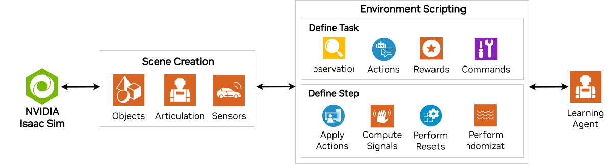

.. _feature-workflows:

Task Design Workflows
=====================

.. currentmodule:: isaaclab

A **Task** is defined by an environment with specific interfaces for observations to and actions from a specific agent (robot). The environment is what provides an agent with the current observations and executes that agent's actions by updating the simulation forward in time. There are many common components of simulating a robot in an environment, regardless of what you might want that robot to do or how it might be trained to do it.

This is especially true of Reinforcement Learning (RL), where managing the actions, observations, rewards, etc... across a vectorized GPU simulation can be daunting to even think about! To meet this need, Isaac Lab provides the ability to build your RL environments within our **Manager-based** system, allowing you to trust various minutia of the appropriate manager classes. However, we also recognize the need to exert granular control over an environment, especially during development. For this need, we also provide a **Direct** interface into the simulation, giving you full control!

* **Manager-based**: The environment is decomposed into individual components (or managers) that handle different
  aspects of the environment (such as computing observations, applying actions, and applying randomization). The
  user defines configuration classes for each component and the environment is responsible for coordinating the
  managers and calling their functions.

* **Direct**: The user defines a single class that implements the entire environment directly without the need for
  separate managers. This class is responsible for computing observations, applying actions, and computing rewards.

Both workflows have their own advantages and disadvantages. The manager-based workflow is more modular and allows
different components of the environment to be swapped out easily. This is useful when prototyping the environment
and experimenting with different configurations. On the other hand, the direct workflow is more efficient and allows
for more fine-grained control over the environment logic. This is useful when optimizing the environment for performance
or when implementing complex logic that is difficult to decompose into separate components.

Manager-Based Environments
--------------------------

.. image:: ../../_static/task-workflows/manager-based-light.svg
    :class: only-light
    :align: center
    :alt: Manager-based Task Workflow

.. image:: ../../_static/task-workflows/manager-based-dark.svg
    :class: only-dark
    :align: center
    :alt: Manager-based Task Workflow

Manager-based environments promote modular implementations of tasks by decomposing it into individually managed components. Each component of the task, such as calculating rewards, observations, etc... can be specified as configurations for a corresponding manager. These managers define configurable functions that are responsible for executing the specific computations as needed. Coordinating a collection of different managers is handled by an Environment class that inherits from :class:`envs.ManagerBasedEnv`. Configurations likewise must all inherit from :class:`envs.ManagerBasedEnvCfg`.

When developing new training environments, it is often beneficial to break the environment into independent components.  This can be highly effective for collaboration, as it lets individual developers focus on different aspects of the environment, while allowing those disparate efforts to be joined back together into a single runnable task. For example, you may have multiple robots with differing sensoriums, requiring different observation managers to process those sensory data into a form that's useful for downstream components.  You might have multiple members on the team with different ideas about what the reward should be to achieve your goals, and by having each one develop their own reward manager, you can swap and test as you see fit. The modular nature of the manager workflow is essential for more complex projects!

For reinforcement learning, much of this has been done for you already! In most cases, it will be enough to write your environment to inherit from
:class:`envs.ManagerBasedRLEnv` and and your configuration from :class:`envs.ManagerBasedRLEnvCfg`.

.. dropdown:: Example for defining the reward function for the Cartpole task using the manager-style
    :icon: plus

    The following class is a part of the Cartpole environment configuration class. The :class:`RewardsCfg` class
    defines individual terms that compose the reward function. Each reward term is defined by its function
    implementation, weight and additional parameters to be passed to the function. Users can define multiple
    reward terms and their weights to be used in the reward function.

    .. literalinclude:: ../../../../source/isaaclab_tasks/isaaclab_tasks/manager_based/classic/cartpole/cartpole_env_cfg.py
        :language: python
        :pyobject: RewardsCfg

.. seealso::

    We provide a more detailed tutorial for setting up an environment using the manager-based workflow at
    :ref:`tutorial-create-manager-rl-env`.

Direct Environments
-------------------

.. image:: ../../_static/task-workflows/direct-based-dark.svg
    :class: only-dark
    :align: center
    :alt: Direct-based Task Workflow

The direct-style environment aligns more closely with traditional implementations of environments from other libraries.
A single class implements the reward function, observation function, resets, and all the other components
of the environment. This approach does not require the manager classes. Instead, users are provided the complete freedom
to implement their task through the APIs of either :class:`envs.DirectRLEnv` or :class:`envs.DirectMARLEnv`. All direct task environments must inherit from one of these two classes.
Direct environments still require configurations to be defined, specifically by inheriting from either :class:`envs.DirectRLEnvCfg` or :class:`envs.DirectMARLEnvCfg`.
This workflow may be the most familiar for users migrating from the `IsaacGymEnvs`_ and `OmniIsaacGymEnvs`_ frameworks.

.. dropdown:: Example for defining the reward function for the Cartpole task using the direct-style
    :icon: plus

    The following function is a part of the Cartpole environment class and is responsible for computing the rewards.

    .. literalinclude:: ../../../../source/isaaclab_tasks/isaaclab_tasks/direct/cartpole/cartpole_env.py
        :language: python
        :pyobject: CartpoleEnv._get_rewards
        :dedent: 4

    It calls the :meth:`compute_rewards` function which is Torch JIT compiled for performance benefits.

    .. literalinclude:: ../../../../source/isaaclab_tasks/isaaclab_tasks/direct/cartpole/cartpole_env.py
        :language: python
        :pyobject: compute_rewards

This approach provides more transparency in the implementations of the environments, as logic is defined within the task
class instead of abstracted with the use of managers. This may be beneficial when implementing complex logic that is
difficult to decompose into separate components. Additionally, the direct-style implementation may bring more performance
benefits for the environment, as it allows implementing large chunks of logic with optimized frameworks such as
`PyTorch JIT`_ or `Warp`_. This may be valuable when scaling up training tremendously which requires optimizing individual
operations in the environment.

.. seealso::

    We provide a more detailed tutorial for setting up a RL environment using the direct workflow at
    :ref:`tutorial-create-direct-rl-env`.

.. _IsaacGymEnvs: https://github.com/isaac-sim/IsaacGymEnvs
.. _OmniIsaacGymEnvs: https://github.com/isaac-sim/OmniIsaacGymEnvs
.. _Pytorch JIT: https://pytorch.org/docs/stable/jit.html
.. _Warp: https://github.com/NVIDIA/warp
