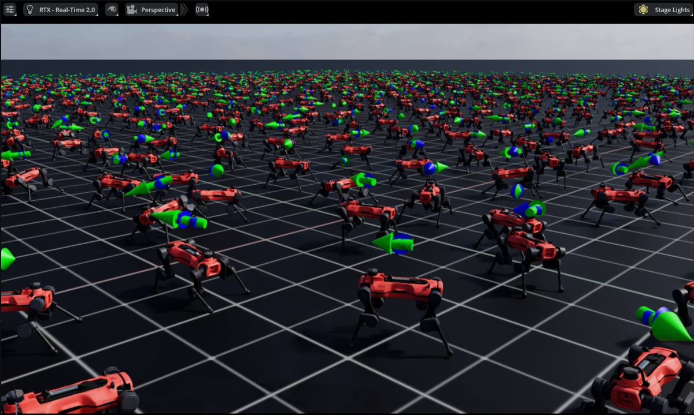
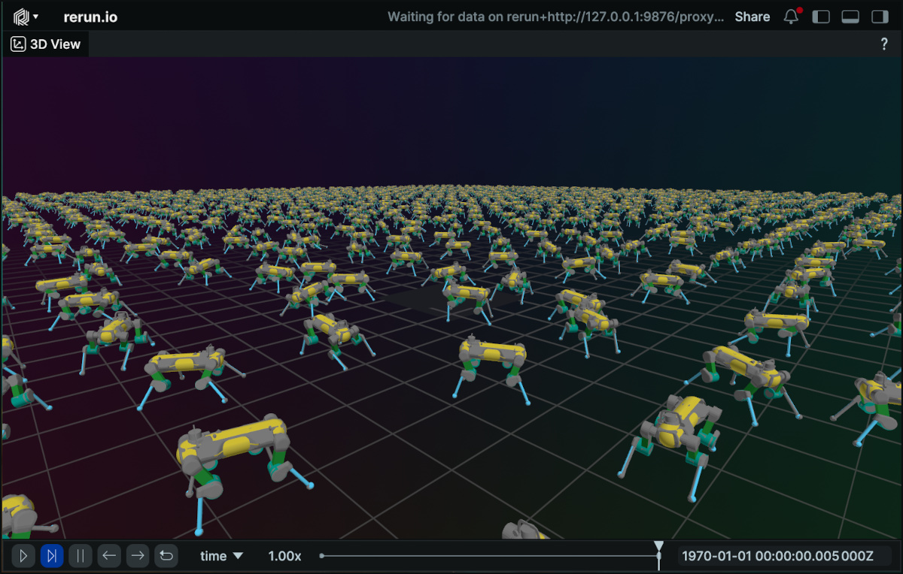

Visualization
=============

.. currentmodule:: isaaclab

Isaac Lab offers several lightweight visualizers for real-time simulation
inspection and debugging. Unlike renderers that process sensor data,
visualizers are meant for fast, interactive feedback.

Most visualizers can be combined with any physics engine or rendering backend.
The exception is the Kit visualizer with kit-less OV backends:
``--visualizer kit`` cannot be used with ``presets=ovphysx`` or
``ovrtx`` in the same process. Use ``--visualizer newton``,
``--visualizer rerun``, ``--visualizer viser``, or omit ``--visualizer``
for headless execution.

Overview
--------

Isaac Lab supports four visualizer backends, each optimized for different use cases:

.. list-table:: Visualizer Comparison
   :widths: 15 35 50
   :header-rows: 1

   * - Visualizer
     - Best For
     - Key Features
   * - **Omniverse**
     - High-fidelity, Isaac Sim integration
     - USD, visualization markers, live plots, tiled camera panel
   * - **Newton**
     - Fast iteration
     - Low overhead, visualization markers, tiled camera panel
   * - **Rerun**
     - Remote viewing, replay
     - Webviewer, time scrubbing, recording export, visualization markers
   * - **Viser**
     - Web-based remote visualization, sharing, recording
     - Warp-based rendering, browser-based, share URL, visualization markers

*The following visualizers are shown training the Isaac-Velocity-Flat-AnymalD environment.*

   Omniverse Visualizer

.. figure:: ../../_static/visualizers/newton_viz.jpg
   :width: 100%
   :alt: Newton Visualizer

   Newton Visualizer

   Rerun Visualizer

Quick Start
-----------

Launch visualizers from the command line with ``--visualizer`` (or ``--viz`` alias):

.. tab-set::

   .. tab-item:: uv (Recommended)

      .. code-block:: bash

          # Launch all visualizers (comma-delimited list, no spaces)
          uv run isaaclab train --rl_library rsl_rl --task Isaac-Cartpole --viz kit,newton,rerun

          # Launch only the Newton visualizer
          uv run isaaclab train --rl_library rsl_rl --task Isaac-Cartpole --viz newton

          # Launch the Viser web-based visualizer
          uv run isaaclab train --rl_library rsl_rl --task Isaac-Cartpole --viz viser

   .. tab-item:: isaaclab.sh / isaaclab.bat

      .. code-block:: bash

          # Launch all visualizers (comma-delimited list, no spaces)
          ./isaaclab.sh train --rl_library rsl_rl --task Isaac-Cartpole --viz kit,newton,rerun

          # Launch only the Newton visualizer
          ./isaaclab.sh train --rl_library rsl_rl --task Isaac-Cartpole --viz newton

          # Launch the Viser web-based visualizer
          ./isaaclab.sh train --rl_library rsl_rl --task Isaac-Cartpole --viz viser

To run in headless mode, omit the ``--viz`` argument:

.. tab-set::

   .. tab-item:: uv (Recommended)

      .. code-block:: bash

          uv run isaaclab train --rl_library rsl_rl --task Isaac-Cartpole

   .. tab-item:: isaaclab.sh / isaaclab.bat

      .. code-block:: bash

          ./isaaclab.sh train --rl_library rsl_rl --task Isaac-Cartpole

.. _visualization-configuration:

Configuration
~~~~~~~~~~~~~

Launching visualizers with the command line will use default visualizer configurations. Visualizer backends live in the ``isaaclab_visualizers`` package (e.g. ``source/isaaclab_visualizers/isaaclab_visualizers/kit``, ``newton``, ``rerun``, ``viser``).

You can also configure custom visualizers in the code by defining ``VisualizerCfg`` instances for the ``SimulationCfg``, for example:

.. code-block:: python

    from isaaclab.sim import SimulationCfg
    from isaaclab_visualizers.kit import KitVisualizerCfg
    from isaaclab_visualizers.newton import NewtonVisualizerCfg
    from isaaclab_visualizers.rerun import RerunVisualizerCfg
    from isaaclab_visualizers.viser import ViserVisualizerCfg

    sim_cfg = SimulationCfg(
        visualizer_cfgs=[
            KitVisualizerCfg(
                # Omit create_viewport (default False) to use the active viewport; set
                # create_viewport=True and optionally viewport_name to add a dedicated window.
                eye=(0.0, 0.0, 20.0), # high top down view
                lookat=(0.0, 0.0, 0.0),
            ),
            NewtonVisualizerCfg(
                eye=(5.0, 5.0, 5.0), # closer quarter view
                lookat=(0.0, 0.0, 0.0),
                show_joints=True,
            ),
            RerunVisualizerCfg(
                keep_historical_data=True,
                keep_scalar_history=True,
                record_to_rrd="my_training.rrd",
            ),
            ViserVisualizerCfg(
                port=8080,
                bind_address="0.0.0.0",
                display_address="localhost",
                share=False,
            ),
        ]
    )

Resolution Rules (CLI + Config)
~~~~~~~~~~~~~~~~~~~~~~~~~~~~~~~

The effective visualizer mode is resolved from both CLI and ``SimulationCfg.visualizer_cfgs``:

- ``--viz`` (alias: ``--visualizer``) uses comma-separated values (for example ``--viz kit,newton``).
- If ``--viz`` is omitted, Isaac Lab falls back to ``SimulationCfg.visualizer_cfgs`` (see :ref:`visualization-configuration`).
- ``--viz none`` explicitly disables all visualizers.

For the migration-focused summary and deprecation context, see
:doc:`/source/migration/migrating_to_isaaclab_3-0`.

Partial Visualization
~~~~~~~~~~~~~~~~~~~~~

Visualizers can be configured to visualize just a subset of environments.
This is called partial visualization.

There are 3 fields exposed in the ``VisualizerCfg`` for selecting environments for partial visualization:

- ``max_visible_envs`` caps how many envs are shown.
- ``visible_env_indices`` explicitly selects the envs to visualize.
- ``randomly_sample_visible_envs`` (default ``True``): when ``visible_env_indices`` is unset and ``max_visible_envs`` is set,
  enables randomly sampling the selected envs. If disabled, the first ``max_visible_envs`` envs are selected.

Also, there is a CLI arg ``--max_visible_envs`` that overrides ``VisualizerCfg.max_visible_envs`` for the run.

Newton environments can share simulated coordinates, for example when ``scene.env_spacing=0``.
Use :attr:`~isaaclab_visualizers.newton.NewtonVisualizerCfg.world_spacing` to arrange selected
worlds visually without changing their simulated poses:

.. code-block:: python

    from isaaclab_visualizers.newton import NewtonVisualizerCfg
    NewtonVisualizerCfg(
        visible_env_indices=[0, 1, 2, 3],
        world_spacing=(2.0, 2.0, 0.0),
    )

Dense environment-major :class:`~isaaclab.markers.VisualizationMarkers` batches follow the same
selection and visual offsets. This includes point-cloud and task-geometry markers.

.. _visualization-common-modes:

.. list-table:: Common modes
   :header-rows: 1
   :widths: 30 35 35

   * - CLI args
     - visualizer configs
     - Effective behavior
   * - no ``--viz``
     - ``[]``
     - Run headless.
   * - ``--viz kit,newton``
     - ``[]``
     - Launch default Kit and default Newton visualizers.
   * - ``--viz kit,newton``
     - ``[NewtonVisualizerCfg(...), RerunVisualizerCfg(...)]``
     - Launch default Kit and custom Newton; Rerun is not launched.
   * - no ``--viz``
     - ``[NewtonVisualizerCfg(...), RerunVisualizerCfg(...)]``
     - Launch custom Newton and custom Rerun visualizers from config.
   * - ``--viz none``
     - ``[NewtonVisualizerCfg(...), RerunVisualizerCfg(...)]``
     - Run headless with all visualizers disabled.

Camera Modes
~~~~~~~~~~~~

To configure camera modes, including launching a tiled camera view, edit the fields described below in the
``VisualizerCfg`` config class.

For runnable Kit and Newton examples that use generated and existing tiled cameras,
see :doc:`/source/how-to/visualizer_tiled_camera`.

The default visualizer camera mode is interactive, with ``eye`` and ``lookat`` specifying the initial pose.
Kit and Newton visualizers can also run additional tiled camera image panels.

If ``tiled_cam_view=True`` is set, another window is launched in the visualizer which shows
a non-interactive tiled camera image view. Number of tiles is capped at 100.

Kit tiled camera views work without an additional camera option.

.. list-table:: Camera Modes
   :header-rows: 1
   :widths: 24 30 46

   * - Mode
     - Key fields
     - Behavior
   * - **Default interactive**
     - ``tiled_cam_view=False``, ``eye=(4, -4, 3)``, ``lookat=(0, 0, 0)``
     - Interactive visualizer camera starts at ``eye`` and looks at the fixed ``lookat`` coordinate.
   * - Generated tiled camera
     - ``tiled_cam_view=True``, ``tiled_cam_prim_path=None``, ``tiled_cam_target_prim_path="/World/envs/*/Robot"``
     - The visualizer creates per-env cameras. Each camera looks at the matched target prim, with ``tiled_cam_eye`` as an offset from that target.
       Note that the ``tiled_cam_target_prim_path`` has a default value, but different environments may require different paths.
   * - Existing tiled camera sensors
     - ``tiled_cam_view=True``, ``tiled_cam_prim_path="/World/envs/*/Camera"``
     - The visualizer displays existing Isaac Lab ``Camera`` sensor output. Generated-camera fields such as ``tiled_cam_eye`` and
       ``tiled_cam_target_prim_path`` are ignored. Note that the ``tiled_cam_prim_path`` has a default value, but different
       environments may require different paths. This mode requires an environment that registers Isaac Lab ``Camera`` sensors
       in ``scene.sensors``. For Cartpole, use a camera task such as ``Isaac-Cartpole-Camera``. The plain ``Isaac-Cartpole``
       task has no ``/World/envs/*/Camera`` sensor, so leave ``tiled_cam_prim_path=None`` to use generated visualizer cameras.

**How to Access the Tiled Camera View in the UI**

- **Kit Visualizer:**
  To display the tiled camera panel, select the "Visualizer Tiled Camera" viewport from the viewport selection menu.

- **Newton Visualizer:**
  To enable or disable the tiled camera panel, use the "Visualizer Tiled Camera" option found in the Tiled Camera View dropdown menu on the left sidebar.

Live Plots
~~~~~~~~~~

Live plots stream per-step scalar data into the visualizer each step.  All four backends
support live plots.  Live plots are **enabled by default** (``enable_live_plots=True``)
but plot windows and panels start **hidden or collapsed**, so there is no overhead unless
you open them.

**What is plotted:**

- **Manager-based environments** (:class:`~isaaclab.envs.ManagerBasedRLEnv`): all active
  manager terms (actions, observations, rewards, commands, terminations, curriculum) grouped
  per manager, plus ``episode/total_reward`` and ``episode/episode_length`` as top-level
  training metrics.
- **Direct environments** (:class:`~isaaclab.envs.DirectRLEnv`): ``episode/total_reward``
  and ``episode/episode_length``.

Each multi-dimensional term (e.g. ``joint_pos`` with 8 joints) is displayed as a single
chart with one line per component, matching the Kit visualizer's per-term grouping.

**Disabling live plots:**

Live plots are on by default but are automatically skipped when running truly headless (no
Kit GUI and no standalone visualizer such as Newton, Rerun, or Viser).  To disable them
explicitly (e.g. to reduce overhead during profiling):

.. code-block:: python

    from isaaclab_visualizers.newton import NewtonVisualizerCfg

    visualizer_cfg = NewtonVisualizerCfg(
        enable_live_plots=False,
    )

**Per-backend behavior:**

- **Kit (Omniverse):** Plots appear as collapsible panels in the IsaacLab omni.ui window,
  collapsed by default.  Toggle individual panels to show them.
- **Newton:** A floating **"Live Plots"** ImGui window appears at the bottom-right of the
  viewport, collapsed to its title bar by default.  Click the title bar to expand it.
  Individual term groups are shown as collapsing headers inside the window.
- **Rerun:** One :class:`~rerun.blueprint.TimeSeriesView` per manager/group is added to the
  blueprint, hidden by default.  Toggle panels on via the Rerun blueprint panel on the left.
  Set ``keep_scalar_history=True`` in :class:`~isaaclab_visualizers.rerun.RerunVisualizerCfg`
  so that scalars accumulate as a time series in the Rerun timeline.
- **Viser:** One collapsible folder per term is added to the Viser sidebar, collapsed by
  default.  Expand individual folders to show their charts.

Video Recording
---------------

Video recording is configured on ``env_cfg.video_recorders`` and driven internally by
``env.step()`` — no gym wrapper required. The source string selects whether to capture from
a visualizer viewport (``"visualizer:kit"``, ``"visualizer:newton"``) or a named scene sensor
(``"sensor:tiled_camera"``), and each entry produces an independent ``mp4`` clip stream.

See :doc:`/source/how-to/record_video` for a full guide with examples.

Visualizer Backends
-------------------

Omniverse Visualizer
~~~~~~~~~~~~~~~~~~~~

**Main Features:**

- Native USD stage integration
- Live plots for monitoring training metrics
- Full Isaac Sim rendering capabilities and tooling
- Visualization markers for debugging (arrows, frames, object targets, etc.)
- Tiled camera views which can track multiple robots

**Core Configuration:**

.. code-block:: python

    from isaaclab_visualizers.kit import KitVisualizerCfg

    visualizer_cfg = KitVisualizerCfg(
        # Viewport: default is create_viewport=False (use active viewport).
        # Set create_viewport=True to create a docked window; viewport_name=None uses the default name.
        create_viewport=False,
        dock_position="SAME",
        window_width=1280,
        window_height=720,

        eye=(8.0, 8.0, 3.0),
        lookat=(0.0, 0.0, 0.0),

        enable_markers=True,
        enable_live_plots=True,  # set to False to disable live plots
    )

Newton Visualizer
~~~~~~~~~~~~~~~~~

**Main Features:**

- Lightweight OpenGL rendering with low overhead
- Simulation and rendering pause controls
- Adjustable update frequency for performance tuning
- Some customizable rendering options (shadows, sky, wireframe)
- Visualization markers (joints, contacts, springs, COM, debug markers)
- Tiled camera views which can track multiple robots

**Interactive Controls:**

.. list-table::
   :widths: 30 70
   :header-rows: 1

   * - Key/Input
     - Action
   * - **W, A, S, D** or **Arrow Keys**
     - Forward / Left / Back / Right
   * - **Q, E**
     - Down / Up
   * - **Left Click + Drag**
     - Look around
   * - **Mouse Scroll**
     - Zoom in/out
   * - **H**
     - Toggle UI sidebar
   * - **ESC**
     - Exit viewer

**Core Configuration:**

.. code-block:: python

    from isaaclab_visualizers.newton import NewtonVisualizerCfg

    visualizer_cfg = NewtonVisualizerCfg(
        # Window settings
        window_width=1920,                        # Window width in pixels
        window_height=1080,                       # Window height in pixels

        # Camera settings
        eye=(8.0, 8.0, 3.0),                     # Initial camera position (x, y, z)
        lookat=(0.0, 0.0, 0.0),                  # Camera look-at target
        focal_length=12.0,                        # Camera focal length in millimeters

        # Tiled camera view settings
        tiled_cam_view=True,                      # Enable non-interactive tiled camera image view
        tiled_cam_num=16,                         # Number of generated camera tiles to display
        tiled_cam_env_indices=None,               # Optional explicit env ids to show in the tiled view
        tiled_cam_prim_path=None,                 # Existing Camera sensor prim path, e.g. "/World/envs/*/Camera"
        tiled_cam_eye=(4.0, -4.0, 3.0),           # Eye offset for generated tiled cameras
        tiled_cam_target_prim_path=(              # Prim that generated cameras follow/look at
            "/World/envs/*/Robot"                 # This is the default value, but different environments
        ),                                        # may require a different paths.

        # Performance tuning
        update_frequency=1,                       # Update every N frames (1=every frame)

        # Physics debug visualization
        show_joints=False,                        # Show joint visualizations
        show_contacts=False,                      # Show contact points and normals
        show_springs=False,                       # Show spring constraints
        show_com=False,                           # Show center of mass markers

        # Rendering options
        enable_shadows=True,                      # Enable shadow rendering
        enable_sky=True,                          # Enable sky rendering
        enable_wireframe=False,                   # Enable wireframe mode

        # Color customization
        background_color=(0.53, 0.81, 0.92),     # Sky/background color (RGB [0,1])
        ground_color=(0.18, 0.20, 0.25),         # Ground plane color (RGB [0,1])
        light_color=(1.0, 1.0, 1.0),             # Directional light color (RGB [0,1])
    )

Rerun Visualizer
~~~~~~~~~~~~~~~~

**Main Features:**

- Web viewer interface accessible from local or remote browser
- Metadata logging and filtering
- Recording to .rrd files for offline replay (.rrd files can be opened with ctrl+O from the web viewer)
- Timeline scrubbing and playback controls of recordings
- Visualization debug markers
- **Pause Rendering** / **Reset Episode** controls via the ImGui sidebar (under **IsaacLab Controls**)

.. note::

   Rerun's ImGui overlay is embedded in the Newton viewer process. Custom interactive controls
   are limited to what ImGui exposes within that context; simulation pause is not supported from
   Rerun. Use the Viser visualizer for full interactive controls.

.. important::

   A highlighted Rerun browser URL is printed in the logs before the main simulation or training loop begins.
   Ctrl-click the printed URL in supported terminals/IDEs to open it. Set ``open_browser=True`` to automatically
   open the browser tab instead.

   Example:

   .. code-block:: text

      ╭─────────────────────────── rerun (listening *:9090) ───────────────────────────╮
      │             ╷                                                                  │
      │   URL       │ http://127.0.0.1:9090/?url=rerun%2Bhttp://127.0.0.1:9876/proxy   │
      │             ╵                                                                  │
      ╰────────────────────────────────────────────────────────────────────────────────╯

**Core Configuration:**

.. code-block:: python

    from isaaclab_visualizers.rerun import RerunVisualizerCfg

    visualizer_cfg = RerunVisualizerCfg(
        # Server settings
        app_id="isaaclab-simulation",             # Application identifier for viewer
        grpc_port=9876,                           # gRPC endpoint for logging SDK connection
        web_port=9090,                            # Port for local web viewer URL printed in logs
        bind_address="0.0.0.0",                  # Endpoint host formatting/reuse checks
        open_browser=False,                       # Set True to auto-launch the browser

        # Camera settings
        eye=(8.0, 8.0, 3.0),                     # Initial camera position (x, y, z)
        lookat=(0.0, 0.0, 0.0),                  # Camera look-at target

        # History settings
        keep_historical_data=False,               # Keep transforms for time scrubbing
        keep_scalar_history=False,                # Keep scalar/plot history

        # Recording
        record_to_rrd="recording.rrd",            # Path to save .rrd file (None = no recording)
    )

Rerun startup uses the Python SDK through ``newton.viewer.ViewerRerun`` (no external ``rerun`` CLI process
management). If ``grpc_port`` is already active, Isaac Lab reuses that server. If ``web_port`` is occupied while
starting a new server, initialization fails with a clear port-conflict error.

To save a replay, set ``record_to_rrd`` to the output ``.rrd`` path. Enable
``keep_historical_data`` and ``keep_scalar_history`` when you want transform and scalar history to be available
for timeline scrubbing. After the run, open the Rerun web viewer and press ``Ctrl+O`` to load the saved ``.rrd`` file.

Note, the timeline UI elements are for .rrd recording playback timeline scrubbing.

Viser Visualizer
~~~~~~~~~~~~~~~~

The `Viser <https://viser.studio/>`_ visualizer provides a **web-based** 3D viewer for Isaac Lab
simulations powered by the Newton Warp renderer. It streams the simulation state to a local web
server, allowing you to view and interact with the scene from any browser.

**Main Features:**

- Browser-based visualization accessible at ``http://localhost:8080`` by default
- Optional public share URL for remote viewing
- Recording to ``.viser`` format for replay
- Environment filtering to control which environments are rendered
- Visualization debug markers (joints, contacts, center of mass, particles, and more — toggled
  from the **Isaac Lab → Visualization Markers** sidebar panel)
- Interactive sidebar controls: **Pause Rendering** (freezes the 3D view without stopping physics),
  **Pause Simulation** (pauses the training/rollout loop), and **Reset Episode**

.. important::

   A highlighted Viser browser URL is printed in the logs before the main simulation or training loop begins.
   Ctrl-click the printed URL in supported terminals/IDEs to open it. Set ``open_browser=True`` to automatically
   open the browser tab instead. For remote access, keep ``bind_address="0.0.0.0"`` and set
   ``display_address`` to the hostname or IP address reachable from your browser.

   Example:

   .. code-block:: text

      ╭────── viser (listening *:8080) ───────╮
      │             ╷                         │
      │   URL       │ http://localhost:8080   │
      │             ╵                         │
      ╰───────────────────────────────────────╯

**Core Configuration:**

.. code-block:: python

    from isaaclab_visualizers.viser import ViserVisualizerCfg

    visualizer_cfg = ViserVisualizerCfg(
        # Server settings
        port=8080,                                # Port for local Viser web server
        bind_address="0.0.0.0",                  # Interface to listen on; use 0.0.0.0 for remote access
        display_address="localhost",             # Host/IP shown in the printed browser URL
        open_browser=False,                       # Set True to auto-launch the browser
        label="Isaac Lab Simulation",             # Page title shown in the viewer
        share=False,                              # Request a public share URL for remote viewing
        verbose=True,                             # Print viewer server startup information

        # Camera settings
        eye=(8.0, 8.0, 3.0),                     # Initial camera position (x, y, z)
        lookat=(0.0, 0.0, 0.0),                  # Camera look-at target

        # Environment filtering
        max_visible_envs=16,                      # Maximum number of environments to visualize

        # Recording
        record_to_viser="recording.viser",        # Path to save .viser file (None = no recording)
    )

Viser uses an in-process ``viser.ViserServer`` through ``newton.viewer.ViewerViser``. ``bind_address``
controls the network interface that the server listens on, while ``display_address`` controls only the
URL printed by Isaac Lab. On a remote machine, set ``display_address`` to the machine hostname/IP and
ensure the configured ``port`` is reachable from your browser. Set ``share=True`` to request Viser's
public share/tunnel URL when that service is available.

Performance Note
----------------

When visualizing large-scale environments, consider:

- Using Newton instead of Omniverse or Rerun
- Reducing window sizes
- Lower update frequencies
- Pausing visualizers while they are not being used

Limitations
-----------

**Rerun Visualizer Performance**

The Rerun web-based visualizer may experience performance issues or crashes when visualizing large-scale
environments. For large-scale simulations, the Newton visualizer is recommended. Alternatively, to reduce load,
the num of environments can be overwritten and decreased using ``--num_envs``:

.. tab-set::

   .. tab-item:: uv (Recommended)

      .. code-block:: bash

          uv run isaaclab train --rl_library rsl_rl --task Isaac-Cartpole --viz rerun --num_envs 512

   .. tab-item:: isaaclab.sh / isaaclab.bat

      .. code-block:: bash

          ./isaaclab.sh train --rl_library rsl_rl --task Isaac-Cartpole --viz rerun --num_envs 512

**Rerun Visualizer FPS Control**

The FPS control in the Rerun visualizer UI may not affect the visualization frame rate in all configurations.

**Newton Contact Visualization**

Newton's native ``Show Contacts`` view can show all contacts from the Newton physics contact buffer. When running
with PhysX, the Newton visualizer can only show contacts reported by configured Isaac Lab contact sensors, so
currently the set of displayed contacts may differ across backends.

**Viser Visualizer Renderer Requirement**

The Viser visualizer requires a Newton model, which is provided automatically by
:class:`~isaaclab.scene_data.SceneDataProvider` regardless of the active physics
backend or renderer. It is compatible with all rendering backends (RTX, Newton Warp, OVRTX).

**Newton Visualizer CUDA/OpenGL Interoperability Warnings**

On some system configurations, the Newton visualizer may display warnings about CUDA/OpenGL interoperability:

.. code-block:: text

    Warning: Could not get MSAA config, falling back to non-AA.
    Warp CUDA error 999: unknown error (in function wp_cuda_graphics_register_gl_buffer)
    Warp UserWarning: Could not register GL buffer since CUDA/OpenGL interoperability
    is not available. Falling back to copy operations between the Warp array and the
    OpenGL buffer.

The visualizer will still function correctly but may experience reduced performance due to falling back to
CPU copy operations instead of direct GPU memory sharing.

**Newton Visualizer OpenGL Context Failures**

The Newton visualizer is an OpenGL window. If pyglet reports that
``glCreateShader`` is not exported or that OpenGL 2.0 is required, the Python
process did not receive a usable OpenGL 2.0+ context from the active Windows or
Linux display session. This usually means the process is running in a
non-interactive/service session, through a remote desktop path without GPU
OpenGL acceleration, or with a software/basic OpenGL provider instead of the
NVIDIA driver. Run from a GPU-backed interactive display session, or omit
``--visualizer newton`` for headless inference.

**Newton Visualizer on Spark with Conda**

When running the Newton visualizer on Spark inside a conda environment, conda-installed X11 libraries
may conflict with the system libraries required by pyglet, causing the following error:

.. code-block:: text

    pyglet.window.xlib.XlibException: Could not create UTF8 text property

To resolve this, remove the conflicting conda packages so that the system-provided libraries are used
instead:

.. code-block:: bash

    conda remove --force xorg-libx11 libxcb

See Also
--------

- :doc:`/source/overview/core-concepts/renderers` — renderer backends (RTX, Newton Warp, OVRTX)
- :doc:`/source/overview/core-concepts/scene_data_providers` — how scene data flows from physics to visualizers
- :doc:`/source/overview/core-concepts/physical-backends/newton/index` — Newton backend guide
- :doc:`/source/migration/migrating_to_isaaclab_3-0` — migration guide for visualizer behavior
