.. _environments:

Available Environments
======================

The following lists comprises of all the RL and IL tasks implementations that are available in Isaac Lab.
While we try to keep this list up-to-date, you can always get the latest list of environments by
running the following command:

.. tab-set::
   :sync-group: os

   .. tab-item:: :icon:`fa-brands fa-linux` Linux
      :sync: linux

      .. note::
         Use ``--keyword <search_term>`` (optional) to filter environments by keyword.

      .. tab-set::

         .. tab-item:: uv (Recommended)

            .. code:: bash

               uv run python scripts/environments/list_envs.py --keyword <search_term>

         .. tab-item:: isaaclab.sh / isaaclab.bat

            .. code:: bash

               ./isaaclab.sh -p scripts/environments/list_envs.py --keyword <search_term>

   .. tab-item:: :icon:`fa-brands fa-windows` Windows
      :sync: windows

      .. note::
         Use ``--keyword <search_term>`` (optional) to filter environments by keyword.

      .. code:: batch

         isaaclab.bat -p scripts\environments\list_envs.py --keyword <search_term>

To also see the available presets for each environment, pass ``--show_presets``:

.. tab-set::
   :sync-group: os

   .. tab-item:: :icon:`fa-brands fa-linux` Linux
      :sync: linux

      .. tab-set::

         .. tab-item:: uv (Recommended)

            .. code:: bash

               uv run python scripts/environments/list_envs.py --show_presets

         .. tab-item:: isaaclab.sh / isaaclab.bat

            .. code:: bash

               ./isaaclab.sh -p scripts/environments/list_envs.py --show_presets

   .. tab-item:: :icon:`fa-brands fa-windows` Windows
      :sync: windows

      .. code:: batch

         isaaclab.bat -p scripts\environments\list_envs.py --show_presets

The **RL Library** and **Presets** columns in the :ref:`comprehensive-environment-list` below are
generated automatically from the Gym registry.

Environment IDs beginning with ``Isaac-`` identify core tasks maintained as part of Isaac Lab.
IDs beginning with ``IsaacContrib-`` identify contributed tasks, which showcase advanced tasks
and features but may not maintain the same level of support as core tasks.

We are actively working on adding more environments to the list. If you have any environments that
you would like to add to Isaac Lab, please feel free to open a pull request!

Preset Selectors
----------------

Many environments support multiple physics backends, rendering backends, and observation
modes. The **Presets** column in each table below is divided into three labeled groups:

* **physics=** — physics-backend name passed as ``physics=NAME``
  (e.g. ``physx``, ``isaacsim_physx``, ``newton_mjwarp``,
  ``newton_kamino``, ``ovphysx``, ``newton_mjwarp_vbd``). On tasks that
  expose automatic PhysX-family selection, ``physx`` uses Isaac Sim PhysX when
  Kit is required and OvPhysX otherwise when the task supports it. Tasks
  without an OvPhysX alternative fall back to Isaac Sim PhysX; use
  ``isaacsim_physx`` to force Isaac Sim PhysX directly.
* **renderer=** — renderer-backend name passed as ``renderer=NAME``
  (e.g. ``isaacsim_rtx``, ``newton_renderer``, ``ovrtx``, ``rtx``)
* **presets=** — environment-specific (domain) preset name passed as
  ``presets=NAME[,NAME,...]``
  (e.g. ``rgb``, ``depth``, ``single_camera``, ``duo_camera``)

If the **Presets** cell is empty, the environment does not expose any selectable physics, renderer,
or domain preset alternatives. Run it without a ``physics=``, ``renderer=``, or ``presets=``
selector; the environment will use its registered default configuration, which may already select a
fixed physics or renderer backend. Passing a selector that is not listed for the environment is not
supported and causes configuration validation to fail.

Pass ``--task=<task-name> --help`` to a training script to see all available
preset names grouped by selector type at the command line, or run
``./isaaclab.sh -p scripts/environments/list_envs.py --show_presets``
to list presets for every registered environment.

See the :doc:`Hydra preset system documentation </source/features/hydra>`
for all available backend names and how the typed selectors work.

Single-agent
------------

Classic
~~~~~~~

Classic environments that are based on IsaacGymEnvs implementation of MuJoCo-style environments.

.. table::
    :widths: 25 30 25 20

    +------------------+-----------------------------+-------------------------------------------------------------------------+------------------------------+
    | World            | Environment ID              | Description                                                             | Presets                      |
    +==================+=============================+=========================================================================+==============================+
    | |humanoid|       | |humanoid-link|             | Move towards a direction with the MuJoCo humanoid robot                 | **physics=**                 |
    |                  |                             |                                                                         | ``physx``,                   |
    |                  | |humanoid-direct-link|      |                                                                         | ``isaacsim_physx`` (direct   |
    |                  |                             |                                                                         | only), ``newton_mjwarp``,    |
    |                  |                             |                                                                         | ``ovphysx`` (direct only)    |
    +------------------+-----------------------------+-------------------------------------------------------------------------+------------------------------+
    | |ant|            | |ant-link|                  | Move towards a direction with the MuJoCo ant robot                      | **physics=**                 |
    |                  |                             |                                                                         | ``physx``,                   |
    |                  | |ant-direct-link|           |                                                                         | ``isaacsim_physx`` (direct   |
    |                  |                             |                                                                         | only), ``newton_mjwarp``,    |
    |                  |                             |                                                                         | ``newton_kamino``,           |
    |                  |                             |                                                                         | ``ovphysx`` (direct only)    |
    +------------------+-----------------------------+-------------------------------------------------------------------------+------------------------------+
    | |cartpole|       | |cartpole-link|             | Move the cart to keep the pole upwards in the classic cartpole control  | **physics=**                 |
    |                  |                             |                                                                         | ``physx``,                   |
    |                  | |cartpole-direct-link|      |                                                                         | ``isaacsim_physx`` (direct   |
    |                  |                             |                                                                         | only), ``newton_mjwarp``,    |
    |                  |                             |                                                                         | ``newton_kamino``,           |
    |                  |                             |                                                                         | ``ovphysx`` (direct only)    |
    +------------------+-----------------------------+-------------------------------------------------------------------------+------------------------------+
    | |fourbar-pole|   | |fourbar-pole-link|         | Swing up and balance a pole attached to a four-bar linkage              | **physics=**                 |
    |                  |                             |                                                                         | ``newton_kamino``            |
    +------------------+-----------------------------+-------------------------------------------------------------------------+------------------------------+
    | |cartpole|       | |cartpole-camera-presets|   | Move the cart to keep the pole upwards in the classic cartpole control  | **physics=**                 |
    |                  |                             | and perceptive inputs. Select data type via ``presets=``.               | ``physx``,                   |
    |                  |                             |                                                                         | ``isaacsim_physx``,          |
    |                  |                             |                                                                         | ``newton_mjwarp``,           |
    |                  |                             |                                                                         | ``ovphysx``                  |
    |                  |                             |                                                                         | **renderer=**                |
    |                  |                             |                                                                         | ``isaacsim_rtx``,            |
    |                  |                             |                                                                         | ``newton_renderer``,         |
    |                  |                             |                                                                         | ``ovrtx``                    |
    |                  |                             |                                                                         | **presets=** ``rgb``,        |
    |                  |                             |                                                                         | ``depth``, ``albedo``,       |
    |                  |                             |                                                                         | ``semantic_segmentation``,   |
    |                  |                             |                                                                         | ``simple_shading_*``         |
    +------------------+-----------------------------+-------------------------------------------------------------------------+------------------------------+
    | |cartpole|       | |cartpole-camera-link|      | Move the cart to keep the pole upwards in the classic cartpole control  | **physics=**                 |
    |                  |                             | from raw RGB/depth observations or features extracted by pre-trained    | ``physx``,                   |
    |                  |                             | frozen vision encoders. Select pipeline via ``presets=``.               | ``newton_mjwarp``            |
    |                  |                             |                                                                         | **presets=** ``rgb``,        |
    |                  |                             |                                                                         | ``depth``, ``resnet18``,     |
    |                  |                             |                                                                         | ``theia_tiny``               |
    +------------------+-----------------------------+-------------------------------------------------------------------------+------------------------------+

.. |humanoid| image:: ../_static/tasks/classic/humanoid.jpg
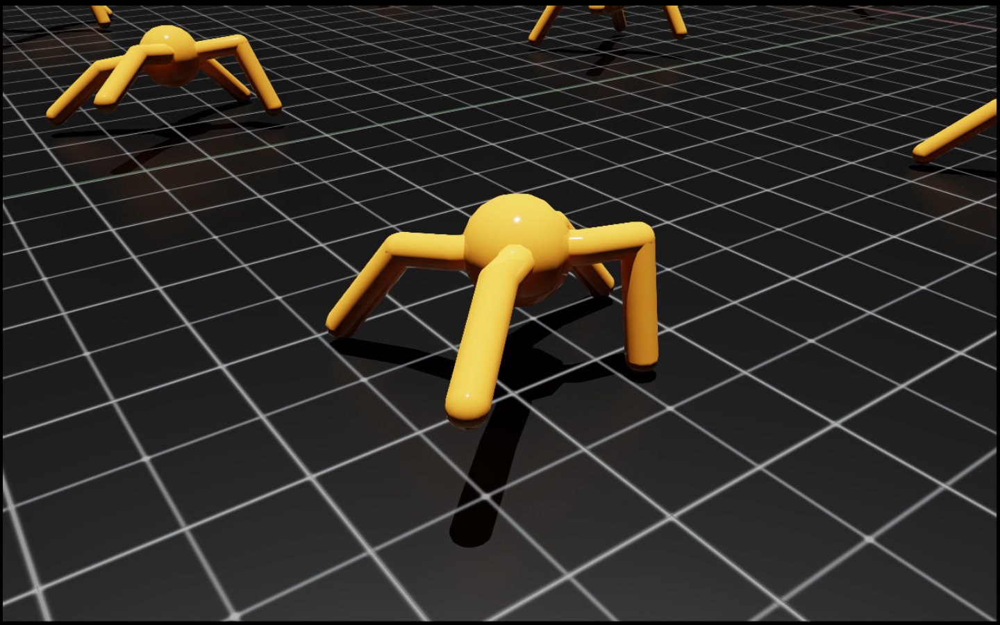
.. |cartpole| image:: ../_static/tasks/classic/cartpole.jpg
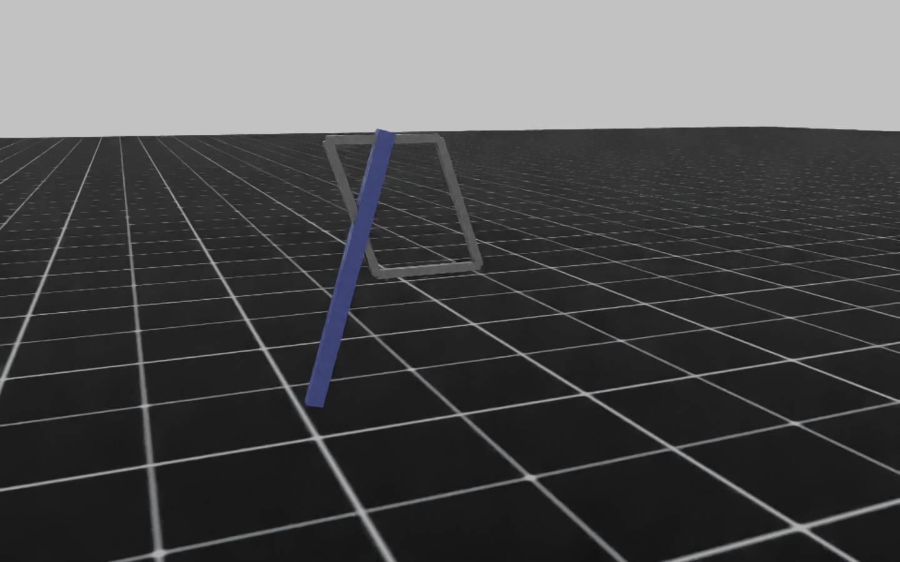

.. |humanoid-link| replace:: :isaaclab-source:`Isaac-Humanoid <source/isaaclab_tasks/isaaclab_tasks/core/locomotion/humanoid/humanoid_manager_env_cfg.py>`
.. |ant-link| replace:: :isaaclab-source:`Isaac-Ant <source/isaaclab_tasks/isaaclab_tasks/core/locomotion/ant/ant_manager_env_cfg.py>`
.. |cartpole-link| replace:: :isaaclab-source:`Isaac-Cartpole <source/isaaclab_tasks/isaaclab_tasks/core/cartpole/cartpole_manager_env_cfg.py>`
.. |fourbar-pole-link| replace:: :isaaclab-source:`Isaac-Fourbar-Pole-Swingup <source/isaaclab_tasks/isaaclab_tasks/core/fourbar_pole/fourbar_pole_manager_env_cfg.py>`
.. |cartpole-camera-presets| replace:: :isaaclab-source:`Isaac-Cartpole-Camera-Direct <source/isaaclab_tasks/isaaclab_tasks/core/cartpole/cartpole_direct_camera_env_cfg.py>`
.. |cartpole-camera-link| replace:: :isaaclab-source:`Isaac-Cartpole-Camera <source/isaaclab_tasks/isaaclab_tasks/core/cartpole/cartpole_manager_camera_env_cfg.py>`

.. |humanoid-direct-link| replace:: :isaaclab-source:`Isaac-Humanoid-Direct <source/isaaclab_tasks/isaaclab_tasks/core/locomotion/humanoid/humanoid_direct_env.py>`
.. |ant-direct-link| replace:: :isaaclab-source:`Isaac-Ant-Direct <source/isaaclab_tasks/isaaclab_tasks/core/locomotion/ant/ant_direct_env.py>`
.. |cartpole-direct-link| replace:: :isaaclab-source:`Isaac-Cartpole-Direct <source/isaaclab_tasks/isaaclab_tasks/core/cartpole/cartpole_direct_env.py>`

Manipulation
~~~~~~~~~~~~

Environments based on fixed-arm manipulation tasks.

For many of these tasks, we include configurations with different arm action spaces. For example,
for the lift-cube environment:

* |lift-cube-link|: Franka arm with joint position control
* |lift-cube-ik-abs-link|: Franka arm with absolute IK control
* |lift-cube-ik-rel-link|: Franka arm with relative IK control

.. table::
    :widths: 25 30 25 20

    +-------------------------+------------------------------+-----------------------------------------------------------------------------+------------------------------+
    | World                   | Environment ID               | Description                                                                 | Presets                      |
    +=========================+==============================+=============================================================================+==============================+
    | |reach-franka|          | |reach-franka-link|          | Move the end-effector to a sampled target pose with the Franka robot        | **physics=**                 |
    |                         |                              |                                                                             | ``isaacsim_physx``,          |
    |                         |                              |                                                                             | ``newton_mjwarp``,           |
    |                         |                              |                                                                             | ``newton_kamino``,           |
    |                         |                              |                                                                             | ``ovphysx``                  |
    |                         |                              |                                                                             | **presets=** ``joint_pos``,  |
    |                         |                              |                                                                             | ``diffik``, ``newton_ik``    |
    +-------------------------+------------------------------+-----------------------------------------------------------------------------+------------------------------+
    | |reach-ur10|            | |reach-ur10-link|            | Move the end-effector to a sampled target pose with the UR10 robot          | **physics=**                 |
    |                         |                              |                                                                             | ``isaacsim_physx``,          |
    |                         |                              |                                                                             | ``newton_mjwarp``            |
    +-------------------------+------------------------------+-----------------------------------------------------------------------------+------------------------------+
    | |deploy-reach-ur10e|    | |deploy-reach-ur10e-link|    | Move the end-effector to a sampled target pose with the UR10e robot         |                              |
    |                         |                              | This policy has been deployed to a real robot                               |                              |
    +-------------------------+------------------------------+-----------------------------------------------------------------------------+------------------------------+
    | |lift-cube|             | |lift-cube-link|             | Pick a cube and bring it to a sampled target position with the Franka robot |                              |
    +-------------------------+------------------------------+-----------------------------------------------------------------------------+------------------------------+
    | |lift-soft-franka|      | |lift-soft-franka-link|      | Pick a deformable soft body and bring it to a sampled target position with  | **physics=** ``physx``,      |
    |                         |                              | the Franka robot                                                            | ``newton_mjwarp_vbd``        |
    +-------------------------+------------------------------+-----------------------------------------------------------------------------+------------------------------+
    | |lift-soft-franka|      | |lift-soft-franka-cam-link|  | Camera (vision) variant of the soft-body lift task using RGB observations   | **physics=** ``physx``,      |
    |                         |                              |                                                                             | ``newton_mjwarp_vbd``,       |
    |                         |                              |                                                                             | ``newton_mjwarp_vbd_proxy``  |
    |                         |                              |                                                                             | **renderer=**                |
    |                         |                              |                                                                             | ``isaacsim_rtx``,            |
    |                         |                              |                                                                             | ``newton_renderer``,         |
    |                         |                              |                                                                             | ``ovrtx``, ``rtx``           |
    +-------------------------+------------------------------+-----------------------------------------------------------------------------+------------------------------+
    | |lift-cloth-franka|     | |lift-cloth-franka-link|     | Lift a deformable cloth from a table with the Franka robot                  | **physics=**                 |
    |                         |                              |                                                                             | ``newton_mjwarp_vbd``        |
    +-------------------------+------------------------------+-----------------------------------------------------------------------------+------------------------------+
    | |lift-cloth-franka|     | |lift-cloth-franka-cam-link| | Camera (vision) variant of the cloth lift task using RGB observations       | **physics=**                 |
    |                         |                              |                                                                             | ``newton_mjwarp_vbd``        |
    |                         |                              |                                                                             | **renderer=**                |
    |                         |                              |                                                                             | ``isaacsim_rtx``,            |
    |                         |                              |                                                                             | ``newton_renderer``,         |
    |                         |                              |                                                                             | ``ovrtx``, ``rtx``           |
    +-------------------------+------------------------------+-----------------------------------------------------------------------------+------------------------------+
    | |stack-cube|            | |stack-cube-link|            | Stack three cubes (bottom to top: blue, red, green) with the Franka robot.  |                              |
    |                         |                              | Blueprint env used for the NVIDIA Isaac GR00T blueprint for synthetic       |                              |
    |                         | |stack-cube-bp-link|         | manipulation motion generation                                              |                              |
    +-------------------------+------------------------------+-----------------------------------------------------------------------------+------------------------------+
    | |surface-gripper|       | |long-suction-link|          | Stack three cubes (bottom to top: blue, red, green)                         |                              |
    |                         |                              | with the UR10 arm and long surface gripper                                  |                              |
    |                         | |short-suction-link|         | or short surface gripper (cpu only).                                        |                              |
    +-------------------------+------------------------------+-----------------------------------------------------------------------------+------------------------------+
    | |cabi-franka|           | |cabi-franka-link|           | Grasp the handle of a cabinet's drawer and open it with the Franka robot    | **physics=** ``physx``,      |
    |                         |                              |                                                                             | ``newton_mjwarp``            |
    |                         | |franka-direct-link|         |                                                                             | ``isaacsim_physx`` (direct   |
    |                         |                              |                                                                             | only), ``ovphysx`` (direct   |
    |                         |                              |                                                                             | only)                        |
    +-------------------------+------------------------------+-----------------------------------------------------------------------------+------------------------------+
    | |cube-allegro|          | |cube-allegro-link|          | In-hand reorientation of a cube using Allegro hand                          | **physics=** ``physx``,      |
    |                         |                              |                                                                             | ``newton_mjwarp``,           |
    |                         | |allegro-direct-link|        |                                                                             | ``ovphysx`` (direct only)    |
    +-------------------------+------------------------------+-----------------------------------------------------------------------------+------------------------------+
    | |cube-shadow|           | |cube-shadow-link|           | In-hand reorientation of a cube using Shadow hand                           | **physics=** ``physx``,      |
    |                         |                              |                                                                             | ``newton_mjwarp``            |
    |                         | |cube-shadow-ff-link|        |                                                                             |                              |
    |                         |                              |                                                                             |                              |
    |                         | |cube-shadow-lstm-link|      |                                                                             |                              |
    +-------------------------+------------------------------+-----------------------------------------------------------------------------+------------------------------+
    | |cube-shadow|           | |cube-shadow-vis-link|       | In-hand reorientation of a cube using Shadow hand using perceptive inputs.  | **physics=** ``physx``,      |
    |                         |                              |                                                                             | ``newton_mjwarp``            |
    |                         |                              |                                                                             | **renderer=**                |
    |                         |                              |                                                                             | ``isaacsim_rtx``,            |
    |                         |                              |                                                                             | ``newton_renderer``,         |
    |                         |                              |                                                                             | ``ovrtx``                    |
    |                         |                              |                                                                             | **presets=** ``rgb``,        |
    |                         |                              |                                                                             | ``depth``, ``albedo``,       |
    |                         |                              |                                                                             | ``full``,                    |
    |                         |                              |                                                                             | ``semantic_segmentation``,   |
    |                         |                              |                                                                             | ``simple_shading_*``         |
    +-------------------------+------------------------------+-----------------------------------------------------------------------------+------------------------------+
    | |gr1_pick_place|        | |gr1_pick_place-link|        | Pick up and place an object in a basket with a GR-1 humanoid robot          | **physics=** ``physx``       |
    +-------------------------+------------------------------+-----------------------------------------------------------------------------+------------------------------+
    | |gr1_pp_waist|          | |gr1_pp_waist-link|          | Pick up and place an object in a basket with a GR-1 humanoid robot          | **physics=** ``physx``       |
    |                         |                              | with waist degrees-of-freedom enables that provides a wider reach space.    |                              |
    +-------------------------+------------------------------+-----------------------------------------------------------------------------+------------------------------+
    | |g1_pick_place|         | |g1_pick_place-link|         | Pick up and place an object in a basket with a Unitree G1 humanoid robot    | **physics=** ``physx``       |
    +-------------------------+------------------------------+-----------------------------------------------------------------------------+------------------------------+
    | |g1_pick_place_fixed|   | |g1_pick_place_fixed-link|   | Pick up and place an object in a basket with a Unitree G1 humanoid robot    | **physics=** ``physx``       |
    |                         |                              | with three-fingered hands. Robot is set up with the base fixed in place.    |                              |
    +-------------------------+------------------------------+-----------------------------------------------------------------------------+------------------------------+
    | |g1_pick_place_lm|      | |g1_pick_place_lm-link|      | Pick up and place an object in a basket with a Unitree G1 humanoid robot    | **physics=** ``physx``       |
    |                         |                              | with three-fingered hands and in-place locomanipulation capabilities        |                              |
    |                         |                              | enabled (i.e. Robot lower body balances in-place while upper body is        |                              |
    |                         |                              | controlled via Inverse Kinematics).                                         |                              |
    +-------------------------+------------------------------+-----------------------------------------------------------------------------+------------------------------+
    | |kuka-allegro-lift|     | |kuka-allegro-lift-link|     | Pick up a primitive shape on the table and lift it to target position.      | **physics=** ``physx``,      |
    |                         |                              |                                                                             | ``newton_mjwarp``            |
    +-------------------------+------------------------------+-----------------------------------------------------------------------------+------------------------------+
    | |kuka-allegro-lift|     | |ka-lift-cam-link|           | Camera (vision) variant of the lift task, adding single- and dual-camera    | **physics=** ``physx``,      |
    |                         |                              | observations via ``presets=single_camera`` / ``presets=duo_camera``.        | ``newton_mjwarp``            |
    |                         |                              |                                                                             | **renderer=**                |
    |                         |                              |                                                                             | ``isaacsim_rtx``,            |
    |                         |                              |                                                                             | ``newton_renderer``,         |
    |                         |                              |                                                                             | ``ovrtx``                    |
    |                         |                              |                                                                             | **presets=**                 |
    |                         |                              |                                                                             | ``single_camera``,           |
    |                         |                              |                                                                             | ``duo_camera``,              |
    |                         |                              |                                                                             | ``rgb{64,128,256}``,         |
    |                         |                              |                                                                             | ``depth/albedo{..}``,        |
    |                         |                              |                                                                             | ``simple_shading_*{..}``     |
    +-------------------------+------------------------------+-----------------------------------------------------------------------------+------------------------------+
    | |kuka-allegro-reorient| | |kuka-allegro-reorient-link| | Pick up a primitive shape on the table and orient it to target pose.        | **physics=** ``physx``,      |
    |                         |                              |                                                                             | ``newton_mjwarp``            |
    +-------------------------+------------------------------+-----------------------------------------------------------------------------+------------------------------+
    | |kuka-allegro-reorient| | |ka-reorient-cam-link|       | Camera (vision) variant of the reorient task, adding single- and            | **physics=** ``physx``,      |
    |                         |                              | dual-camera observations via ``presets=single_camera`` /                    | ``newton_mjwarp``            |
    |                         |                              | ``presets=duo_camera``.                                                     | **renderer=**                |
    |                         |                              |                                                                             | ``isaacsim_rtx``,            |
    |                         |                              |                                                                             | ``newton_renderer``,         |
    |                         |                              |                                                                             | ``ovrtx``                    |
    |                         |                              |                                                                             | **presets=**                 |
    |                         |                              |                                                                             | ``single_camera``,           |
    |                         |                              |                                                                             | ``duo_camera``,              |
    |                         |                              |                                                                             | ``rgb{64,128,256}``,         |
    |                         |                              |                                                                             | ``depth/albedo{..}``,        |
    |                         |                              |                                                                             | ``simple_shading_*{..}``     |
    +-------------------------+------------------------------+-----------------------------------------------------------------------------+------------------------------+
    | |galbot_stack|          | |galbot_stack-link|          | Stack three cubes (bottom to top: blue, red, green) with the left arm of    | **physics=** ``physx``       |
    |                         |                              | a Galbot humanoid robot                                                     |                              |
    +-------------------------+------------------------------+-----------------------------------------------------------------------------+------------------------------+
    | |agibot_place_mug|      | |agibot_place_mug-link|      | Pick up and place a mug upright with a Agibot A2D humanoid robot            |                              |
    +-------------------------+------------------------------+-----------------------------------------------------------------------------+------------------------------+
    | |agibot_place_toy|      | |agibot_place_toy-link|      | Pick up and place an object in a box with a Agibot A2D humanoid robot       |                              |
    +-------------------------+------------------------------+-----------------------------------------------------------------------------+------------------------------+
    | |reach_openarm_bi|      | |reach_openarm_bi-link|      | Move the end-effector to sampled target poses with the OpenArm robot        |                              |
    +-------------------------+------------------------------+-----------------------------------------------------------------------------+------------------------------+
    | |reach_openarm_uni|     | |reach_openarm_uni-link|     | Move the end-effector to a sampled target pose with the OpenArm robot       |                              |
    +-------------------------+------------------------------+-----------------------------------------------------------------------------+------------------------------+
    | |lift_openarm_uni|      | |lift_openarm_uni-link|      | Pick a cube and bring it to a sampled target position with the OpenArm robot|                              |
    +-------------------------+------------------------------+-----------------------------------------------------------------------------+------------------------------+
    | |cabi_openarm_uni|      | |cabi_openarm_uni-link|      | Grasp the handle of a cabinet's drawer and open it with the OpenArm robot   |                              |
    +-------------------------+------------------------------+-----------------------------------------------------------------------------+------------------------------+
    | |g1_assemble_trocar|    | |g1_assemble_trocar-link|    | Assemble trocar with a Unitree G1 humanoid robot with Dex3 hands            |                              |
    +-------------------------+------------------------------+-----------------------------------------------------------------------------+------------------------------+

.. |reach-franka| image:: ../_static/tasks/manipulation/franka_reach.jpg
.. |reach-ur10| image:: ../_static/tasks/manipulation/ur10_reach.jpg
.. |deploy-reach-ur10e| image:: ../_static/tasks/manipulation/ur10e_reach.jpg
.. |lift-cube| image:: ../_static/tasks/manipulation/franka_lift.jpg
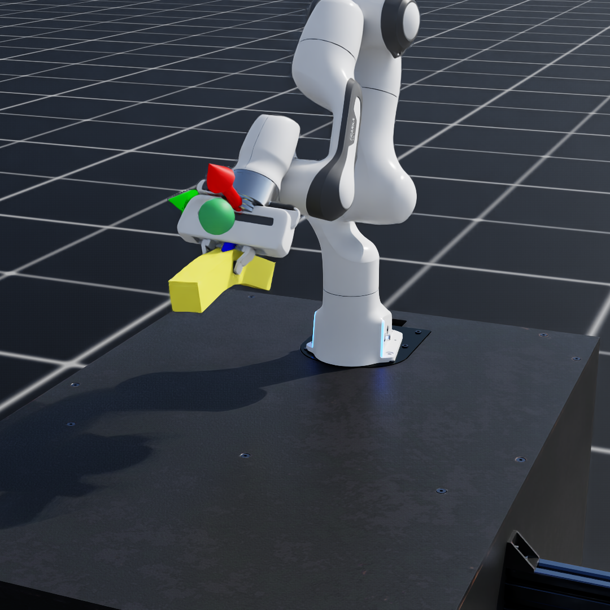
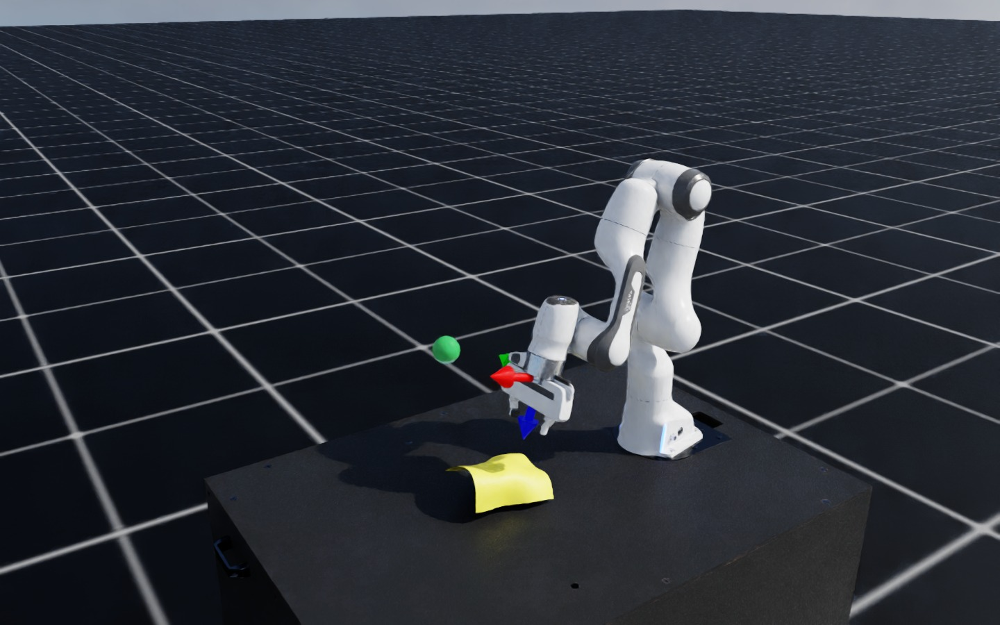
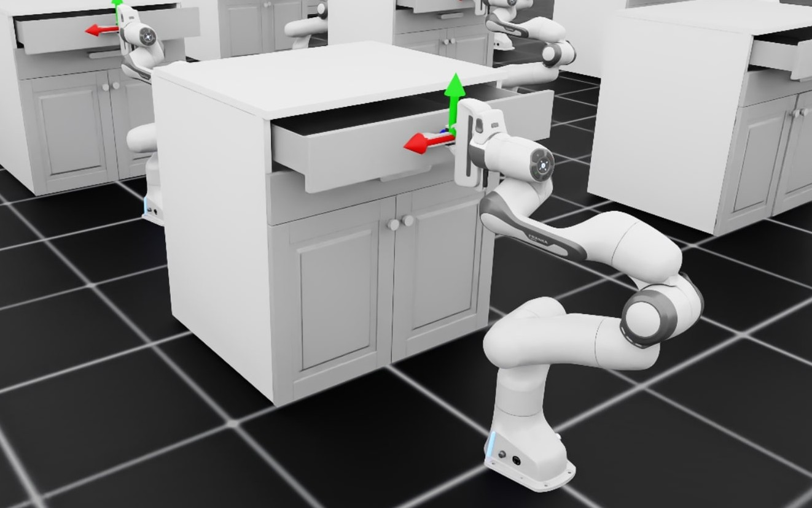
.. |cube-allegro| image:: ../_static/tasks/manipulation/allegro_cube.jpg
.. |cube-shadow| image:: ../_static/tasks/manipulation/shadow_cube.jpg
.. |stack-cube| image:: ../_static/tasks/manipulation/franka_stack.jpg
.. |gr1_pick_place| image:: ../_static/tasks/manipulation/gr-1_pick_place.jpg
.. |g1_pick_place| image:: ../_static/tasks/manipulation/g1_pick_place.jpg
.. |g1_pick_place_fixed| image:: ../_static/tasks/manipulation/g1_pick_place_fixed_base.jpg
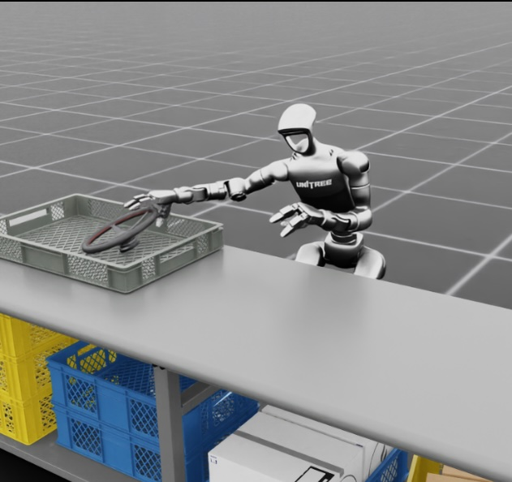
.. |surface-gripper| image:: ../_static/tasks/manipulation/ur10_stack_surface_gripper.jpg
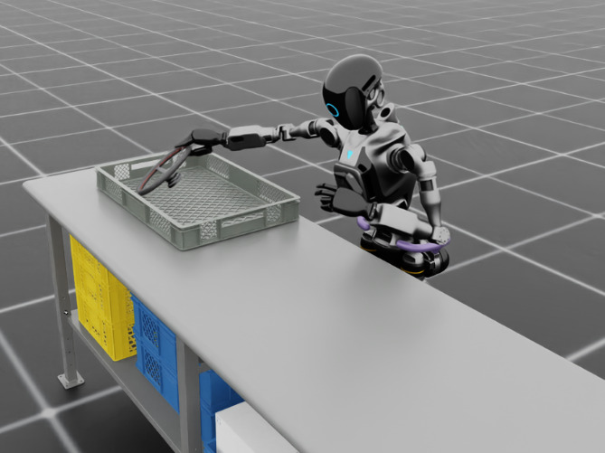
.. |galbot_stack| image:: ../_static/tasks/manipulation/galbot_stack_cube.jpg
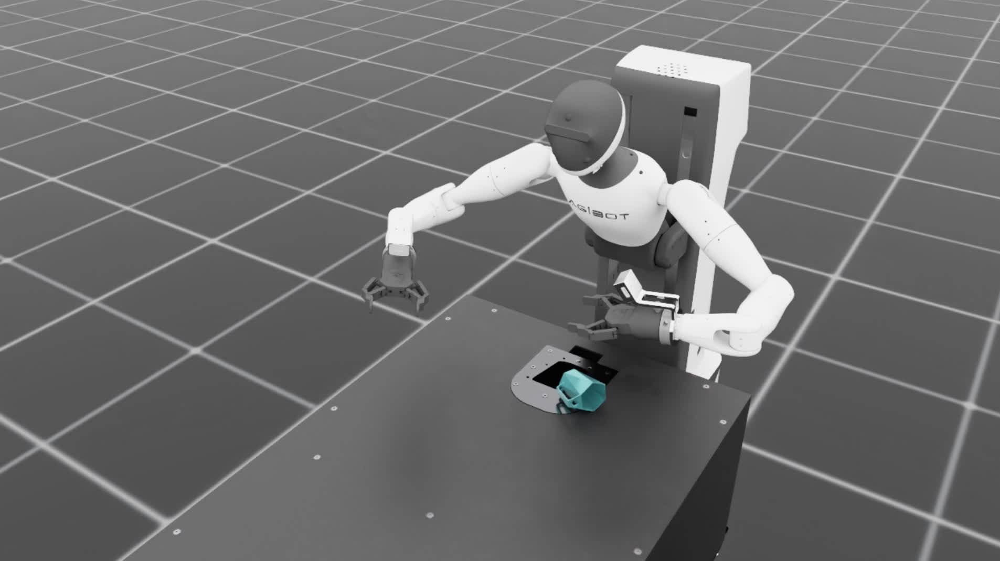
.. |agibot_place_toy| image:: ../_static/tasks/manipulation/agibot_place_toy.jpg
.. |kuka-allegro-lift| image:: ../_static/tasks/manipulation/kuka_allegro_lift.jpg
.. |kuka-allegro-reorient| image:: ../_static/tasks/manipulation/kuka_allegro_reorient.jpg
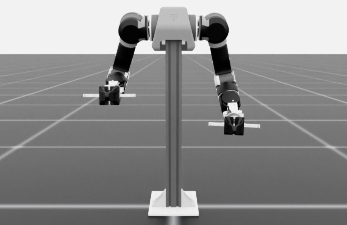
.. |reach_openarm_uni| image:: ../_static/tasks/manipulation/openarm_uni_reach.jpg
.. |lift_openarm_uni| image:: ../_static/tasks/manipulation/openarm_uni_lift.jpg
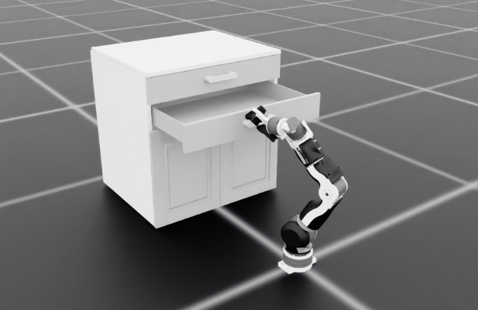
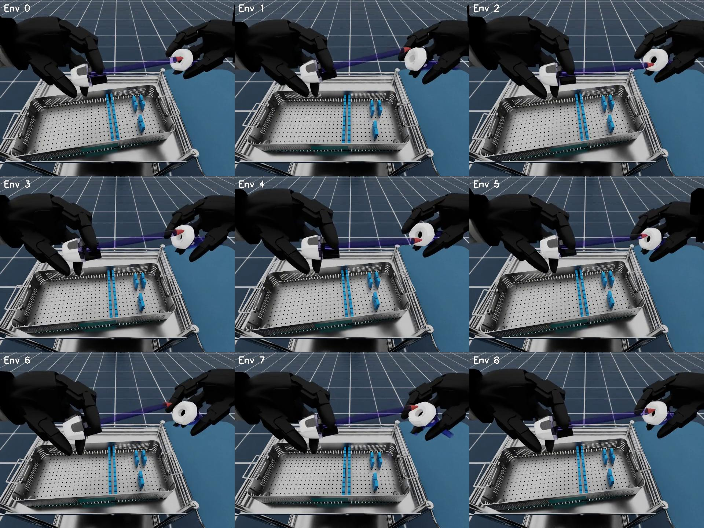

.. |reach-franka-link| replace:: :isaaclab-source:`Isaac-Reach-Franka <source/isaaclab_tasks/isaaclab_tasks/core/reach/config/franka/franka_reach_env_cfg.py>`
.. |reach-ur10-link| replace:: :isaaclab-source:`Isaac-Reach-UR10 <source/isaaclab_tasks/isaaclab_tasks/core/reach/config/ur_10/joint_pos_env_cfg.py>`
.. |deploy-reach-ur10e-link| replace:: :isaaclab-source:`IsaacContrib-Deploy-Reach-UR10e <source/isaaclab_tasks/isaaclab_tasks/contrib/deploy/reach/config/ur_10e/joint_pos_env_cfg.py>`
.. |lift-cube-link| replace:: :isaaclab-source:`Isaac-Lift-Cube-Franka <source/isaaclab_tasks/isaaclab_tasks/core/lift/config/franka/joint_pos_env_cfg.py>`
.. |lift-cube-ik-abs-link| replace:: :isaaclab-source:`IsaacContrib-Lift-Cube-Franka-IK-Abs <source/isaaclab_tasks/isaaclab_tasks/contrib/lift/config/franka/ik_abs_env_cfg.py>`
.. |lift-cube-ik-rel-link| replace:: :isaaclab-source:`IsaacContrib-Lift-Cube-Franka-IK-Rel <source/isaaclab_tasks/isaaclab_tasks/contrib/lift/config/franka/ik_rel_env_cfg.py>`
.. |lift-soft-franka-link| replace:: :isaaclab-source:`Isaac-Lift-Soft-Franka <source/isaaclab_tasks/isaaclab_tasks/core/lift/config/franka_soft/franka_soft_env_cfg.py>`
.. |lift-cloth-franka-link| replace:: :isaaclab-source:`Isaac-Lift-Cloth-Franka <source/isaaclab_tasks/isaaclab_tasks/core/lift/config/franka_soft/franka_cloth_env_cfg.py>`
.. |lift-soft-franka-cam-link| replace:: :isaaclab-source:`Isaac-Lift-Soft-Franka-Camera <source/isaaclab_tasks/isaaclab_tasks/core/lift/config/franka_soft/franka_soft_env_cfg.py>`
.. |lift-cloth-franka-cam-link| replace:: :isaaclab-source:`Isaac-Lift-Cloth-Franka-Camera <source/isaaclab_tasks/isaaclab_tasks/core/lift/config/franka_soft/franka_cloth_env_cfg.py>`
.. |cabi-franka-link| replace:: :isaaclab-source:`Isaac-Open-Drawer-Franka <source/isaaclab_tasks/isaaclab_tasks/core/cabinet/config/franka/joint_pos_env_cfg.py>`
.. |franka-direct-link| replace:: :isaaclab-source:`Isaac-Open-Drawer-Franka-Direct <source/isaaclab_tasks/isaaclab_tasks/core/cabinet/cabinet_direct_env.py>`
.. |cube-allegro-link| replace:: :isaaclab-source:`Isaac-Reorient-Cube-Allegro <source/isaaclab_tasks/isaaclab_tasks/core/reorient/config/allegro_hand/allegro_hand_manager_env_cfg.py>`
.. |allegro-direct-link| replace:: :isaaclab-source:`Isaac-Reorient-Cube-Allegro-Direct <source/isaaclab_tasks/isaaclab_tasks/core/reorient/config/allegro_hand/allegro_hand_direct_env_cfg.py>`
.. |stack-cube-link| replace:: :isaaclab-source:`IsaacContrib-Stack-Cube-Franka <source/isaaclab_tasks/isaaclab_tasks/contrib/stack/config/franka/stack_joint_pos_env_cfg.py>`
.. |stack-cube-bp-link| replace:: :isaaclab-source:`IsaacContrib-Stack-Cube-Franka-IK-Rel-Blueprint <source/isaaclab_tasks/isaaclab_tasks/contrib/stack/config/franka/stack_ik_rel_blueprint_env_cfg.py>`
.. |gr1_pick_place-link| replace:: :isaaclab-source:`IsaacContrib-PickPlace-GR1T2-Abs <source/isaaclab_tasks/isaaclab_tasks/contrib/pick_place/pickplace_gr1t2_env_cfg.py>`
.. |g1_pick_place-link| replace:: :isaaclab-source:`IsaacContrib-PickPlace-G1-InspireFTP-Abs <source/isaaclab_tasks/isaaclab_tasks/contrib/pick_place/pickplace_unitree_g1_inspire_hand_env_cfg.py>`
.. |g1_pick_place_fixed-link| replace:: :isaaclab-source:`IsaacContrib-PickPlace-FixedBaseUpperBodyIK-G1-Abs <source/isaaclab_tasks/isaaclab_tasks/contrib/locomanip_pick_place/fixed_base_upper_body_ik_g1_env_cfg.py>`
.. |g1_pick_place_lm-link| replace:: :isaaclab-source:`IsaacContrib-PickPlace-Locomanipulation-G1-Abs <source/isaaclab_tasks/isaaclab_tasks/contrib/locomanip_pick_place/locomanipulation_g1_env_cfg.py>`
.. |long-suction-link| replace:: :isaaclab-source:`IsaacContrib-Stack-Cube-UR10-Long-Suction-IK-Rel <source/isaaclab_tasks/isaaclab_tasks/contrib/stack/config/ur10_gripper/stack_ik_rel_env_cfg.py>`
.. |short-suction-link| replace:: :isaaclab-source:`IsaacContrib-Stack-Cube-UR10-Short-Suction-IK-Rel <source/isaaclab_tasks/isaaclab_tasks/contrib/stack/config/ur10_gripper/stack_ik_rel_env_cfg.py>`
.. |gr1_pp_waist-link| replace:: :isaaclab-source:`IsaacContrib-PickPlace-GR1T2-WaistEnabled-Abs <source/isaaclab_tasks/isaaclab_tasks/contrib/pick_place/pickplace_gr1t2_waist_enabled_env_cfg.py>`
.. |galbot_stack-link| replace:: :isaaclab-source:`IsaacContrib-Stack-Cube-Galbot-Left-Arm-Gripper-RmpFlow <source/isaaclab_tasks/isaaclab_tasks/contrib/stack/config/galbot/stack_rmp_rel_env_cfg.py>`
.. |kuka-allegro-lift-link| replace:: :isaaclab-source:`Isaac-Lift-KukaAllegro <source/isaaclab_tasks/isaaclab_tasks/core/dexsuite/config/kuka_allegro/dexsuite_kuka_allegro_env_cfg.py>`
.. |kuka-allegro-reorient-link| replace:: :isaaclab-source:`Isaac-Reorient-KukaAllegro <source/isaaclab_tasks/isaaclab_tasks/core/dexsuite/config/kuka_allegro/dexsuite_kuka_allegro_env_cfg.py>`
.. |ka-lift-cam-link| replace:: :isaaclab-source:`Isaac-Lift-KukaAllegro-Camera <source/isaaclab_tasks/isaaclab_tasks/core/dexsuite/config/kuka_allegro/dexsuite_kuka_allegro_camera_env_cfg.py>`
.. |ka-reorient-cam-link| replace:: :isaaclab-source:`Isaac-Reorient-KukaAllegro-Camera <source/isaaclab_tasks/isaaclab_tasks/core/dexsuite/config/kuka_allegro/dexsuite_kuka_allegro_camera_env_cfg.py>`
.. |cube-shadow-link| replace:: :isaaclab-source:`Isaac-Reorient-Cube-Shadow-Direct <source/isaaclab_tasks/isaaclab_tasks/core/reorient/config/shadow_hand/shadow_hand_direct_env_cfg.py>`
.. |cube-shadow-ff-link| replace:: :isaaclab-source:`Isaac-Reorient-Cube-Shadow-OpenAI-FF-Direct <source/isaaclab_tasks/isaaclab_tasks/core/reorient/config/shadow_hand/shadow_hand_direct_env_cfg.py>`
.. |cube-shadow-lstm-link| replace:: :isaaclab-source:`Isaac-Reorient-Cube-Shadow-OpenAI-LSTM-Direct <source/isaaclab_tasks/isaaclab_tasks/core/reorient/config/shadow_hand/shadow_hand_direct_env_cfg.py>`
.. |cube-shadow-vis-link| replace:: :isaaclab-source:`Isaac-Reorient-Cube-Shadow-Camera-Direct <source/isaaclab_tasks/isaaclab_tasks/core/reorient/config/shadow_hand/shadow_hand_direct_camera_env.py>`
.. |agibot_place_mug-link| replace:: :isaaclab-source:`IsaacContrib-Place-Mug-Agibot-Left-Arm-RmpFlow <source/isaaclab_tasks/isaaclab_tasks/contrib/place/config/agibot/place_upright_mug_rmp_rel_env_cfg.py>`
.. |agibot_place_toy-link| replace:: :isaaclab-source:`IsaacContrib-Place-Toy2Box-Agibot-Right-Arm-RmpFlow <source/isaaclab_tasks/isaaclab_tasks/contrib/place/config/agibot/place_toy2box_rmp_rel_env_cfg.py>`
.. |reach_openarm_bi-link| replace:: :isaaclab-source:`IsaacContrib-Reach-OpenArmBi <source/isaaclab_tasks/isaaclab_tasks/contrib/reach/config/openarm/bimanual/joint_pos_env_cfg.py>`
.. |reach_openarm_uni-link| replace:: :isaaclab-source:`IsaacContrib-Reach-OpenArm <source/isaaclab_tasks/isaaclab_tasks/contrib/reach/config/openarm/unimanual/joint_pos_env_cfg.py>`
.. |lift_openarm_uni-link| replace:: :isaaclab-source:`IsaacContrib-Lift-Cube-OpenArm <source/isaaclab_tasks/isaaclab_tasks/contrib/lift/config/openarm/joint_pos_env_cfg.py>`
.. |cabi_openarm_uni-link| replace:: :isaaclab-source:`IsaacContrib-Open-Drawer-OpenArm <source/isaaclab_tasks/isaaclab_tasks/contrib/cabinet/config/openarm/joint_pos_env_cfg.py>`
.. |g1_assemble_trocar-link| replace:: :isaaclab-source:`IsaacContrib-Assemble-Trocar-G129-Dex3 <source/isaaclab_tasks/isaaclab_tasks/contrib/assemble_trocar/g129_dex3_env_cfg.py>`

Contact-rich Manipulation
~~~~~~~~~~~~~~~~~~~~~~~~~

Environments based on contact-rich manipulation tasks such as peg insertion, gear meshing and nut-bolt fastening.

These tasks share the same task configurations and control options. You can switch between them by specifying the task name.
For example:

* |factory-peg-link|: Peg insertion with the Franka arm
* |factory-gear-link|: Gear meshing with the Franka arm
* |factory-nut-link|: Nut-Bolt fastening with the Franka arm

.. table::
    :widths: 25 30 25 20

    +--------------------+-------------------------+-----------------------------------------------------------------------------+------------------------------+
    | World              | Environment ID          | Description                                                                 | Presets                      |
    +====================+=========================+=============================================================================+==============================+
    | |factory-peg|      | |factory-peg-link|      | Insert peg into the socket with the Franka robot                            |                              |
    +--------------------+-------------------------+-----------------------------------------------------------------------------+------------------------------+
    | |factory-gear|     | |factory-gear-link|     | Insert and mesh gear into the base with other gears, using the Franka robot |                              |
    +--------------------+-------------------------+-----------------------------------------------------------------------------+------------------------------+
    | |factory-nut|      | |factory-nut-link|      | Thread the nut onto the first 2 threads of the bolt, using the Franka robot |                              |
    +--------------------+-------------------------+-----------------------------------------------------------------------------+------------------------------+

.. |factory-peg| image:: ../_static/tasks/factory/peg_insert.jpg
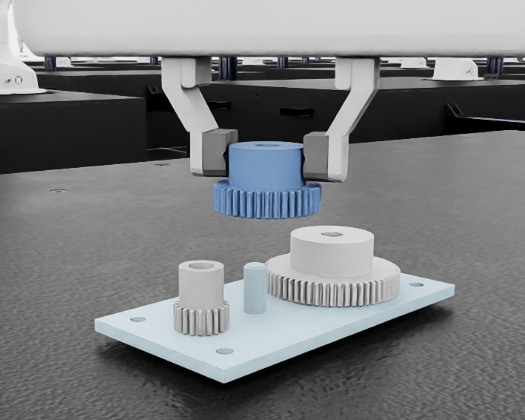
.. |factory-nut| image:: ../_static/tasks/factory/nut_thread.jpg

.. |factory-peg-link| replace:: :isaaclab-source:`IsaacContrib-Factory-PegInsert-Direct <source/isaaclab_tasks/isaaclab_tasks/contrib/factory/factory_env_cfg.py>`
.. |factory-gear-link| replace:: :isaaclab-source:`IsaacContrib-Factory-GearMesh-Direct <source/isaaclab_tasks/isaaclab_tasks/contrib/factory/factory_env_cfg.py>`
.. |factory-nut-link| replace:: :isaaclab-source:`IsaacContrib-Factory-NutThread-Direct <source/isaaclab_tasks/isaaclab_tasks/contrib/factory/factory_env_cfg.py>`

AutoMate
~~~~~~~~

Environments based on 100 diverse assembly tasks, each involving the insertion of a plug into a socket. These tasks share a common configuration and differ by th geometry and properties of the parts.

You can switch between tasks by specifying the corresponding asset ID. Available asset IDs include:

'00004', '00007', '00014', '00015', '00016', '00021', '00028', '00030', '00032', '00042', '00062', '00074', '00077', '00078', '00081', '00083', '00103', '00110', '00117', '00133', '00138', '00141', '00143', '00163', '00175', '00186', '00187', '00190', '00192', '00210', '00211', '00213', '00255', '00256', '00271', '00293', '00296', '00301', '00308', '00318', '00319', '00320', '00329', '00340', '00345', '00346', '00360', '00388', '00410', '00417', '00422', '00426', '00437', '00444', '00446', '00470', '00471', '00480', '00486', '00499', '00506', '00514', '00537', '00553', '00559', '00581', '00597', '00614', '00615', '00638', '00648', '00649', '00652', '00659', '00681', '00686', '00700', '00703', '00726', '00731', '00741', '00755', '00768', '00783', '00831', '00855', '00860', '00863', '01026', '01029', '01036', '01041', '01053', '01079', '01092', '01102', '01125', '01129', '01132', '01136'.

We provide environments for both disassembly and assembly.

.. attention::

  CUDA is recommended for running the AutoMate environments. If running with Nvidia driver 570 on Linux with architecture x86_64, we follow the below steps to install CUDA 12.8. This allows for computing rewards in AutoMate environments with CUDA. If you have a different operation system or architecture, please refer to the `CUDA installation page <https://developer.nvidia.com/cuda-12-8-0-download-archive>`_ for additional instruction.

  .. code-block:: bash

      wget https://developer.download.nvidia.com/compute/cuda/12.8.0/local_installers/cuda_12.8.0_570.86.10_linux.run
      sudo sh cuda_12.8.0_570.86.10_linux.run --toolkit

  When using conda, cuda toolkit can be installed with:

  .. code-block:: bash

      conda install cudatoolkit

  With 580 drivers on Linux with architecture x86_64, we install CUDA 13 and additionally install several packages. Please ensure that the pytorch version is compatible with the CUDA version.

  .. code-block:: bash

      wget https://developer.download.nvidia.com/compute/cuda/13.0.2/local_installers/cuda_13.0.2_580.95.05_linux.run
      sudo sh cuda_13.0.2_580.95.05_linux.run --toolkit
      pip install numba-cuda[cu13] coverage==7.6.1

* |disassembly-link|: The plug starts inserted in the socket. A low-level controller lifts the plug out and moves it to a random position. This process is purely scripted and does not involve any learned policy. Therefore, it does not require policy training or evaluation. The resulting trajectories serve as demonstrations for the reverse process, i.e., learning to assemble. To run disassembly for a specific task: ``python source/isaaclab_tasks/isaaclab_tasks/contrib/automate/run_disassembly_w_id.py --assembly_id=ASSEMBLY_ID --disassembly_dir=DISASSEMBLY_DIR``. All generated trajectories are saved to a local directory ``DISASSEMBLY_DIR``.
* |assembly-link|: The goal is to insert the plug into the socket. You can use this environment to train a policy via reinforcement learning or evaluate a pre-trained checkpoint.

  * To train an assembly policy, we run the command ``python source/isaaclab_tasks/isaaclab_tasks/contrib/automate/run_w_id.py --assembly_id=ASSEMBLY_ID --train``. We can customize the training process using the optional flags: ``--max_iterations=MAX_ITERATIONS`` to set the number of training iterations, ``--num_envs=NUM_ENVS`` to set the number of parallel environments during training, ``--seed=SEED`` to assign the random seed. The policy checkpoints will be saved automatically during training in the directory ``logs/rl_games/Assembly/test``.
  * To evaluate an assembly policy, we run the command ``python source/isaaclab_tasks/isaaclab_tasks/contrib/automate/run_w_id.py --assembly_id=ASSEMBLY_ID --checkpoint=CHECKPOINT --log_eval``. The evaluation results are stored in ``evaluation_{ASSEMBLY_ID}.h5``.

.. table::
    :widths: 25 30 25 20

    +--------------------+-------------------------+-----------------------------------------------------------------------------+------------------------------+
    | World              | Environment ID          | Description                                                                 | Presets                      |
    +====================+=========================+=============================================================================+==============================+
    | |disassembly|      | |disassembly-link|      | Lift a plug out of the socket with the Franka robot                         |                              |
    +--------------------+-------------------------+-----------------------------------------------------------------------------+------------------------------+
    | |assembly|         | |assembly-link|         | Insert a plug into its corresponding socket with the Franka robot           |                              |
    +--------------------+-------------------------+-----------------------------------------------------------------------------+------------------------------+

.. |assembly| image:: ../_static/tasks/automate/00004.jpg
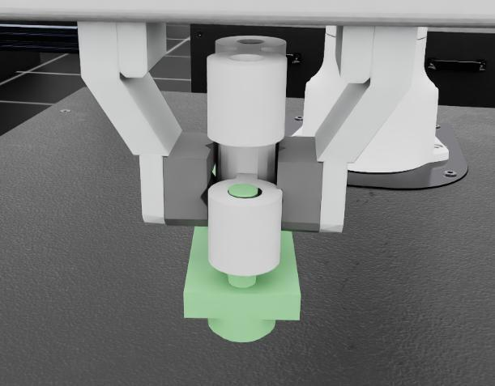

.. |assembly-link| replace:: :isaaclab-source:`IsaacContrib-AutoMate-Assembly-Direct <source/isaaclab_tasks/isaaclab_tasks/contrib/automate/assembly_env_cfg.py>`
.. |disassembly-link| replace:: :isaaclab-source:`IsaacContrib-AutoMate-Disassembly-Direct <source/isaaclab_tasks/isaaclab_tasks/contrib/automate/disassembly_env_cfg.py>`

FORGE
~~~~~~~~

FORGE environments extend Factory environments with:

* Force sensing: Add observations for force experienced by the end-effector.
* Excessive force penalty: Add an option to penalize the agent for excessive contact forces.
* Dynamics randomization: Randomize controller gains, asset properties (friction, mass), and dead-zone.
* Success prediction: Add an extra action that predicts task success.

These tasks share the same task configurations and control options. You can switch between them by specifying the task name.

* |forge-peg-link|: Peg insertion with the Franka arm
* |forge-gear-link|: Gear meshing with the Franka arm
* |forge-nut-link|: Nut-Bolt fastening with the Franka arm

.. table::
    :widths: 25 30 25 20

    +--------------------+-------------------------+-----------------------------------------------------------------------------+------------------------------+
    | World              | Environment ID          | Description                                                                 | Presets                      |
    +====================+=========================+=============================================================================+==============================+
    | |forge-peg|        | |forge-peg-link|        | Insert peg into the socket with the Franka robot                            |                              |
    +--------------------+-------------------------+-----------------------------------------------------------------------------+------------------------------+
    | |forge-gear|       | |forge-gear-link|       | Insert and mesh gear into the base with other gears, using the Franka robot |                              |
    +--------------------+-------------------------+-----------------------------------------------------------------------------+------------------------------+
    | |forge-nut|        | |forge-nut-link|        | Thread the nut onto the first 2 threads of the bolt, using the Franka robot |                              |
    +--------------------+-------------------------+-----------------------------------------------------------------------------+------------------------------+

.. |forge-peg| image:: ../_static/tasks/factory/peg_insert.jpg

.. |forge-nut| image:: ../_static/tasks/factory/nut_thread.jpg

.. |forge-peg-link| replace:: :isaaclab-source:`IsaacContrib-Forge-PegInsert-Direct <source/isaaclab_tasks/isaaclab_tasks/contrib/forge/forge_env_cfg.py>`
.. |forge-gear-link| replace:: :isaaclab-source:`IsaacContrib-Forge-GearMesh-Direct <source/isaaclab_tasks/isaaclab_tasks/contrib/forge/forge_env_cfg.py>`
.. |forge-nut-link| replace:: :isaaclab-source:`IsaacContrib-Forge-NutThread-Direct <source/isaaclab_tasks/isaaclab_tasks/contrib/forge/forge_env_cfg.py>`

Locomotion
~~~~~~~~~~

Environments based on legged locomotion tasks.

.. table::
    :widths: 25 30 25 20

    +------------------------------+----------------------------------------------+------------------------------------------------------------------------------+------------------------------+
    | World                        | Environment ID                               | Description                                                                  | Presets                      |
    +==============================+==============================================+==============================================================================+==============================+
    | |velocity-flat-anymal-b|     | |velocity-flat-anymal-b-link|                | Track a velocity command on flat terrain with the Anymal B robot             | **physics=** ``physx``,      |
    |                              |                                              |                                                                              | ``newton_mjwarp``            |
    +------------------------------+----------------------------------------------+------------------------------------------------------------------------------+------------------------------+
    | |velocity-rough-anymal-b|    | |velocity-rough-anymal-b-link|               | Track a velocity command on rough terrain with the Anymal B robot            | **physics=** ``physx``,      |
    |                              |                                              |                                                                              | ``newton_mjwarp``,           |
    |                              |                                              |                                                                              | ``ovphysx``                  |
    +------------------------------+----------------------------------------------+------------------------------------------------------------------------------+------------------------------+
    | |velocity-flat-anymal-c|     | |velocity-flat-anymal-c-link|                | Track a velocity command on flat terrain with the Anymal C robot             | **physics=** ``physx``,      |
    |                              |                                              |                                                                              | ``newton_mjwarp``            |
    |                              |                                              |                                                                              | (Manager-based only)         |
    |                              | |velocity-flat-anymal-c-direct-link|         |                                                                              |                              |
    +------------------------------+----------------------------------------------+------------------------------------------------------------------------------+------------------------------+
    | |velocity-rough-anymal-c|    | |velocity-rough-anymal-c-link|               | Track a velocity command on rough terrain with the Anymal C robot            | **physics=** ``physx``,      |
    |                              |                                              |                                                                              | ``newton_mjwarp``,           |
    |                              |                                              |                                                                              | ``ovphysx``                  |
    |                              |                                              |                                                                              | (Manager-based only)         |
    |                              | |velocity-rough-anymal-c-direct-link|        |                                                                              |                              |
    +------------------------------+----------------------------------------------+------------------------------------------------------------------------------+------------------------------+
    | |velocity-flat-anymal-d|     | |velocity-flat-anymal-d-link|                | Track a velocity command on flat terrain with the Anymal D robot             | **physics=** ``physx``,      |
    |                              |                                              |                                                                              | ``newton_mjwarp``,           |
    |                              |                                              |                                                                              | ``ovphysx``                  |
    +------------------------------+----------------------------------------------+------------------------------------------------------------------------------+------------------------------+
    | |velocity-rough-anymal-d|    | |velocity-rough-anymal-d-link|               | Track a velocity command on rough terrain with the Anymal D robot            | **physics=** ``physx``,      |
    |                              |                                              |                                                                              | ``newton_mjwarp``,           |
    |                              |                                              |                                                                              | ``ovphysx``                  |
    +------------------------------+----------------------------------------------+------------------------------------------------------------------------------+------------------------------+
    |                              | |velocity-rough-cassie-link|                 | Track a velocity command on rough terrain with the Cassie robot              | **physics=** ``physx``,      |
    |                              |                                              |                                                                              | ``newton_mjwarp``,           |
    |                              |                                              |                                                                              | ``ovphysx``                  |
    +------------------------------+----------------------------------------------+------------------------------------------------------------------------------+------------------------------+
    | |velocity-flat-unitree-a1|   | |velocity-flat-unitree-a1-link|              | Track a velocity command on flat terrain with the Unitree A1 robot           | **physics=** ``physx``,      |
    |                              |                                              |                                                                              | ``newton_mjwarp``            |
    +------------------------------+----------------------------------------------+------------------------------------------------------------------------------+------------------------------+
    | |velocity-rough-unitree-a1|  | |velocity-rough-unitree-a1-link|             | Track a velocity command on rough terrain with the Unitree A1 robot          | **physics=** ``physx``,      |
    |                              |                                              |                                                                              | ``newton_mjwarp``,           |
    |                              |                                              |                                                                              | ``ovphysx``                  |
    +------------------------------+----------------------------------------------+------------------------------------------------------------------------------+------------------------------+
    | |velocity-flat-unitree-go1|  | |velocity-flat-unitree-go1-link|             | Track a velocity command on flat terrain with the Unitree Go1 robot          | **physics=** ``physx``,      |
    |                              |                                              |                                                                              | ``newton_mjwarp``            |
    +------------------------------+----------------------------------------------+------------------------------------------------------------------------------+------------------------------+
    | |velocity-rough-unitree-go1| | |velocity-rough-unitree-go1-link|            | Track a velocity command on rough terrain with the Unitree Go1 robot         | **physics=** ``physx``,      |
    |                              |                                              |                                                                              | ``newton_mjwarp``,           |
    |                              |                                              |                                                                              | ``ovphysx``                  |
    +------------------------------+----------------------------------------------+------------------------------------------------------------------------------+------------------------------+
    | |velocity-flat-unitree-go2|  | |velocity-flat-unitree-go2-link|             | Track a velocity command on flat terrain with the Unitree Go2 robot          | **physics=** ``physx``,      |
    |                              |                                              |                                                                              | ``newton_mjwarp``            |
    +------------------------------+----------------------------------------------+------------------------------------------------------------------------------+------------------------------+
    | |velocity-rough-unitree-go2| | |velocity-rough-unitree-go2-link|            | Track a velocity command on rough terrain with the Unitree Go2 robot         | **physics=** ``physx``,      |
    |                              |                                              |                                                                              | ``newton_mjwarp``,           |
    |                              |                                              |                                                                              | ``ovphysx``                  |
    +------------------------------+----------------------------------------------+------------------------------------------------------------------------------+------------------------------+
    | |velocity-flat-spot|         | |velocity-flat-spot-link|                    | Track a velocity command on flat terrain with the Boston Dynamics Spot robot | **physics=** ``physx``,      |
    |                              |                                              |                                                                              | ``newton_mjwarp``            |
    +------------------------------+----------------------------------------------+------------------------------------------------------------------------------+------------------------------+
    | |velocity-flat-h1|           | |velocity-flat-h1-link|                      | Track a velocity command on flat terrain with the Unitree H1 robot           | **physics=** ``physx``,      |
    |                              |                                              |                                                                              | ``newton_mjwarp``            |
    +------------------------------+----------------------------------------------+------------------------------------------------------------------------------+------------------------------+
    | |velocity-rough-h1|          | |velocity-rough-h1-link|                     | Track a velocity command on rough terrain with the Unitree H1 robot          | **physics=** ``physx``,      |
    |                              |                                              |                                                                              | ``newton_mjwarp``,           |
    |                              |                                              |                                                                              | ``ovphysx``                  |
    +------------------------------+----------------------------------------------+------------------------------------------------------------------------------+------------------------------+
    | |velocity-flat-g1|           | |velocity-flat-g1-link|                      | Track a velocity command on flat terrain with the Unitree G1 robot           | **physics=** ``physx``,      |
    |                              |                                              |                                                                              | ``newton_mjwarp``            |
    +------------------------------+----------------------------------------------+------------------------------------------------------------------------------+------------------------------+
    | |velocity-rough-g1|          | |velocity-rough-g1-link|                     | Track a velocity command on rough terrain with the Unitree G1 robot          | **physics=** ``physx``,      |
    |                              |                                              |                                                                              | ``newton_mjwarp``,           |
    |                              |                                              |                                                                              | ``ovphysx``                  |
    +------------------------------+----------------------------------------------+------------------------------------------------------------------------------+------------------------------+
    | |dr-legs|                    | |dr-legs-hold-pose-link|                     | Hold a target pose or walk with the Disney Research Legs robot               | **physics=**                 |
    |                              |                                              |                                                                              | ``newton_kamino``            |
    |                              | |dr-legs-walk-link|                          |                                                                              |                              |
    +------------------------------+----------------------------------------------+------------------------------------------------------------------------------+------------------------------+
    | |velocity-flat-digit|        | |velocity-flat-digit-link|                   | Track a velocity command on flat terrain with the Agility Digit robot        | **physics=** ``physx``       |
    +------------------------------+----------------------------------------------+------------------------------------------------------------------------------+------------------------------+
    | |velocity-rough-digit|       | |velocity-rough-digit-link|                  | Track a velocity command on rough terrain with the Agility Digit robot       | **physics=** ``physx``       |
    +------------------------------+----------------------------------------------+------------------------------------------------------------------------------+------------------------------+
    | |tracking-loco-manip-digit|  | |tracking-loco-manip-digit-link|             | Track a root velocity and hand pose command with the Agility Digit robot     | **physics=** ``physx``       |
    +------------------------------+----------------------------------------------+------------------------------------------------------------------------------+------------------------------+

.. |velocity-flat-anymal-b-link| replace:: :isaaclab-source:`IsaacContrib-Velocity-Flat-AnymalB <source/isaaclab_tasks/isaaclab_tasks/contrib/velocity/config/anymal_b/flat_env_cfg.py>`
.. |velocity-rough-anymal-b-link| replace:: :isaaclab-source:`IsaacContrib-Velocity-Rough-AnymalB <source/isaaclab_tasks/isaaclab_tasks/contrib/velocity/config/anymal_b/rough_env_cfg.py>`

.. |velocity-flat-anymal-c-link| replace:: :isaaclab-source:`IsaacContrib-Velocity-Flat-AnymalC <source/isaaclab_tasks/isaaclab_tasks/contrib/velocity/config/anymal_c/flat_env_cfg.py>`
.. |velocity-rough-anymal-c-link| replace:: :isaaclab-source:`IsaacContrib-Velocity-Rough-AnymalC <source/isaaclab_tasks/isaaclab_tasks/contrib/velocity/config/anymal_c/rough_env_cfg.py>`

.. |velocity-flat-anymal-c-direct-link| replace:: :isaaclab-source:`IsaacContrib-Velocity-Flat-AnymalC-Direct <source/isaaclab_tasks/isaaclab_tasks/contrib/anymal_c_direct/anymal_c_env.py>`
.. |velocity-rough-anymal-c-direct-link| replace:: :isaaclab-source:`IsaacContrib-Velocity-Rough-AnymalC-Direct <source/isaaclab_tasks/isaaclab_tasks/contrib/anymal_c_direct/anymal_c_env.py>`

.. |velocity-flat-anymal-d-link| replace:: :isaaclab-source:`Isaac-Velocity-Flat-AnymalD <source/isaaclab_tasks/isaaclab_tasks/core/velocity/config/anymal_d/flat_env_cfg.py>`
.. |velocity-rough-anymal-d-link| replace:: :isaaclab-source:`Isaac-Velocity-Rough-AnymalD <source/isaaclab_tasks/isaaclab_tasks/core/velocity/config/anymal_d/rough_env_cfg.py>`
.. |velocity-rough-cassie-link| replace:: :isaaclab-source:`Isaac-Velocity-Rough-Cassie <source/isaaclab_tasks/isaaclab_tasks/core/velocity/config/cassie/rough_env_cfg.py>`

.. |velocity-flat-unitree-a1-link| replace:: :isaaclab-source:`IsaacContrib-Velocity-Flat-UnitreeA1 <source/isaaclab_tasks/isaaclab_tasks/contrib/velocity/config/a1/flat_env_cfg.py>`
.. |velocity-rough-unitree-a1-link| replace:: :isaaclab-source:`IsaacContrib-Velocity-Rough-UnitreeA1 <source/isaaclab_tasks/isaaclab_tasks/contrib/velocity/config/a1/rough_env_cfg.py>`

.. |velocity-flat-unitree-go1-link| replace:: :isaaclab-source:`IsaacContrib-Velocity-Flat-UnitreeGo1 <source/isaaclab_tasks/isaaclab_tasks/contrib/velocity/config/go1/flat_env_cfg.py>`
.. |velocity-rough-unitree-go1-link| replace:: :isaaclab-source:`IsaacContrib-Velocity-Rough-UnitreeGo1 <source/isaaclab_tasks/isaaclab_tasks/contrib/velocity/config/go1/rough_env_cfg.py>`

.. |velocity-flat-unitree-go2-link| replace:: :isaaclab-source:`Isaac-Velocity-Flat-UnitreeGo2 <source/isaaclab_tasks/isaaclab_tasks/core/velocity/config/go2/flat_env_cfg.py>`
.. |velocity-rough-unitree-go2-link| replace:: :isaaclab-source:`Isaac-Velocity-Rough-UnitreeGo2 <source/isaaclab_tasks/isaaclab_tasks/core/velocity/config/go2/rough_env_cfg.py>`

.. |velocity-flat-spot-link| replace:: :isaaclab-source:`Isaac-Velocity-Flat-Spot <source/isaaclab_tasks/isaaclab_tasks/core/velocity/config/spot/flat_env_cfg.py>`

.. |velocity-flat-h1-link| replace:: :isaaclab-source:`Isaac-Velocity-Flat-H1 <source/isaaclab_tasks/isaaclab_tasks/core/velocity/config/h1/flat_env_cfg.py>`
.. |velocity-rough-h1-link| replace:: :isaaclab-source:`Isaac-Velocity-Rough-H1 <source/isaaclab_tasks/isaaclab_tasks/core/velocity/config/h1/rough_env_cfg.py>`

.. |velocity-flat-g1-link| replace:: :isaaclab-source:`Isaac-Velocity-Flat-G1 <source/isaaclab_tasks/isaaclab_tasks/core/velocity/config/g1/flat_env_cfg.py>`
.. |velocity-rough-g1-link| replace:: :isaaclab-source:`Isaac-Velocity-Rough-G1 <source/isaaclab_tasks/isaaclab_tasks/core/velocity/config/g1/rough_env_cfg.py>`

.. |dr-legs-hold-pose-link| replace:: :isaaclab-source:`IsaacContrib-DrLegs-HoldPose <source/isaaclab_tasks/isaaclab_tasks/contrib/dr_legs/hold_pose_env_cfg.py>`
.. |dr-legs-walk-link| replace:: :isaaclab-source:`IsaacContrib-DrLegs-Walk <source/isaaclab_tasks/isaaclab_tasks/contrib/dr_legs/walk_env_cfg.py>`

.. |velocity-flat-digit-link| replace:: :isaaclab-source:`IsaacContrib-Velocity-Flat-Digit <source/isaaclab_tasks/isaaclab_tasks/contrib/velocity/config/digit/flat_env_cfg.py>`
.. |velocity-rough-digit-link| replace:: :isaaclab-source:`IsaacContrib-Velocity-Rough-Digit <source/isaaclab_tasks/isaaclab_tasks/contrib/velocity/config/digit/rough_env_cfg.py>`
.. |tracking-loco-manip-digit-link| replace:: :isaaclab-source:`IsaacContrib-Tracking-LocoManip-Digit <source/isaaclab_tasks/isaaclab_tasks/contrib/locomanip_tracking/config/digit/loco_manip_env_cfg.py>`

.. |velocity-flat-anymal-b| image:: ../_static/tasks/locomotion/anymal_b_flat.jpg
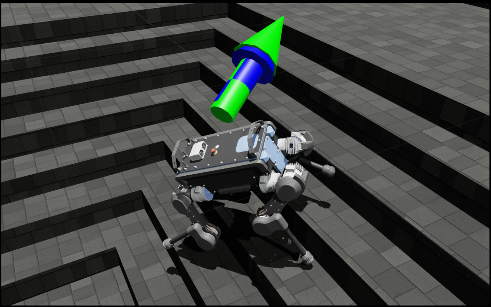
.. |velocity-flat-anymal-c| image:: ../_static/tasks/locomotion/anymal_c_flat.jpg
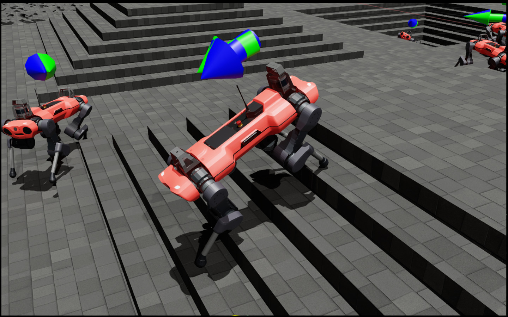
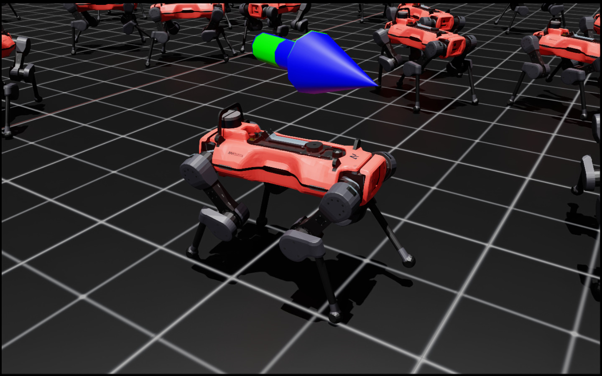
.. |velocity-rough-anymal-d| image:: ../_static/tasks/locomotion/anymal_d_rough.jpg
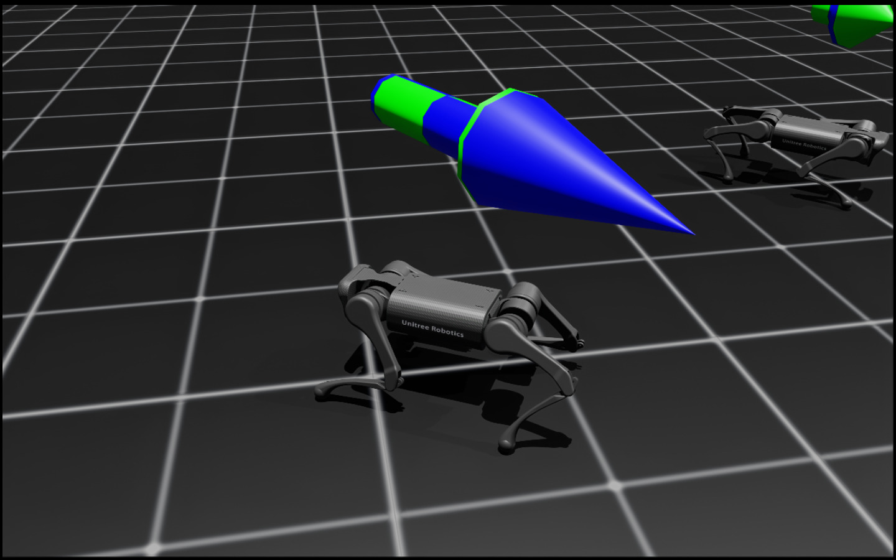
.. |velocity-rough-unitree-a1| image:: ../_static/tasks/locomotion/a1_rough.jpg
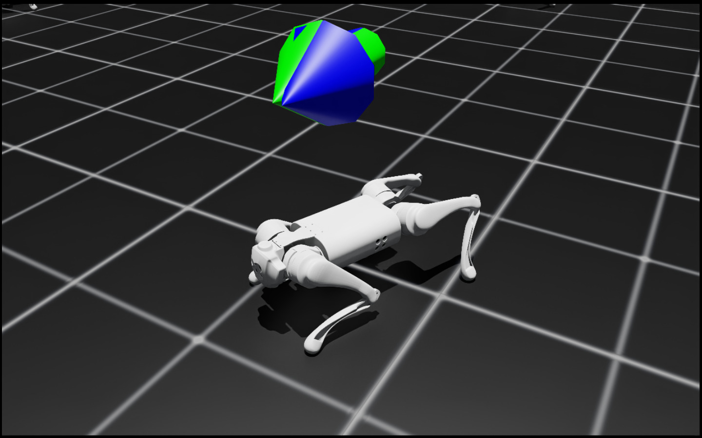
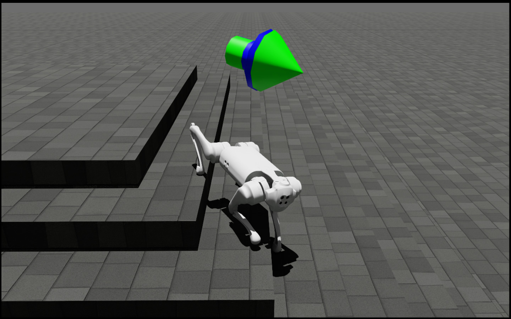
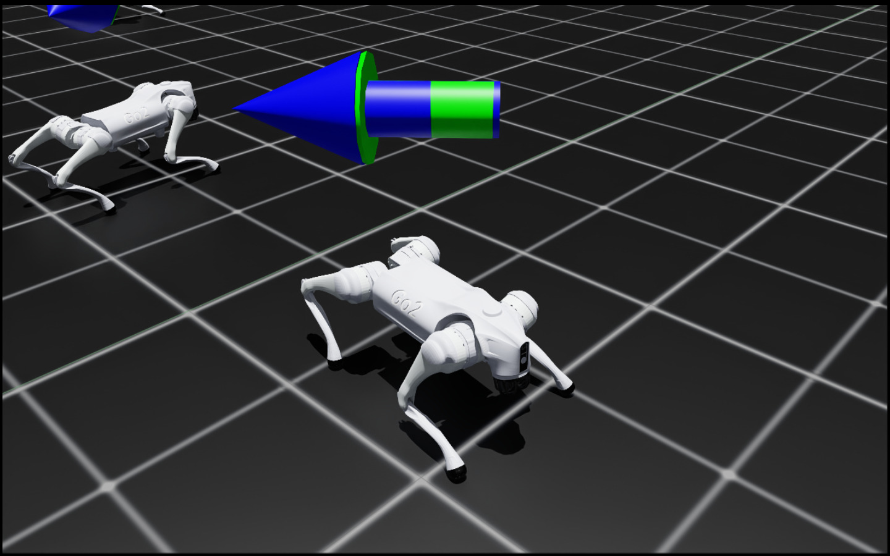
.. |velocity-rough-unitree-go2| image:: ../_static/tasks/locomotion/go2_rough.jpg
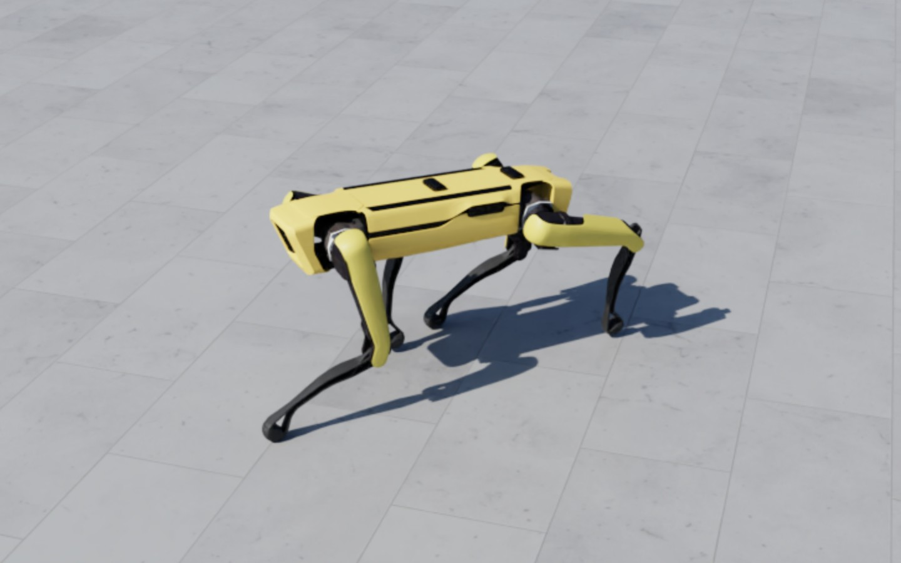
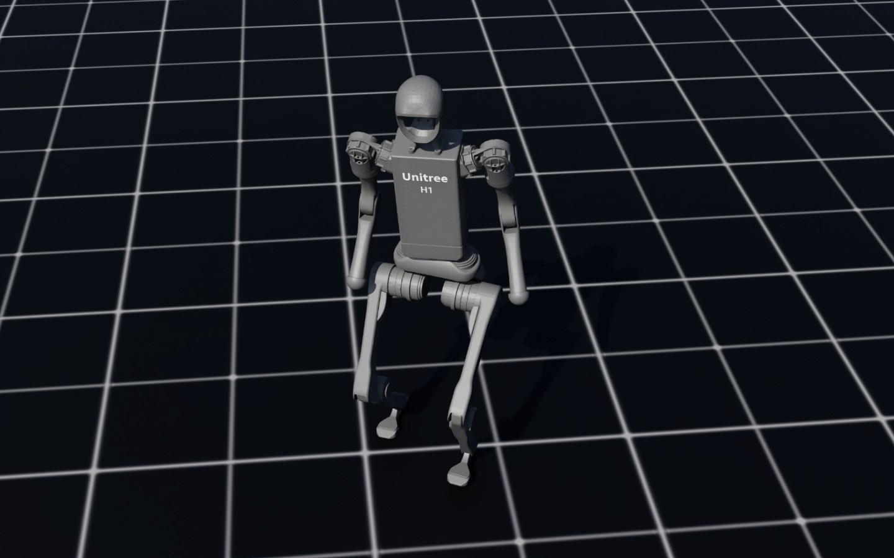
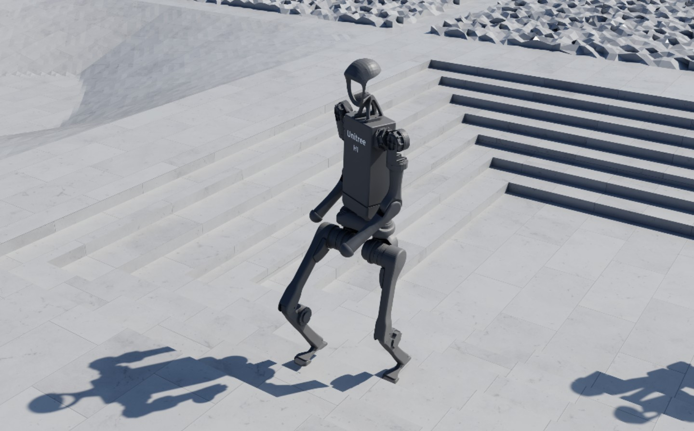
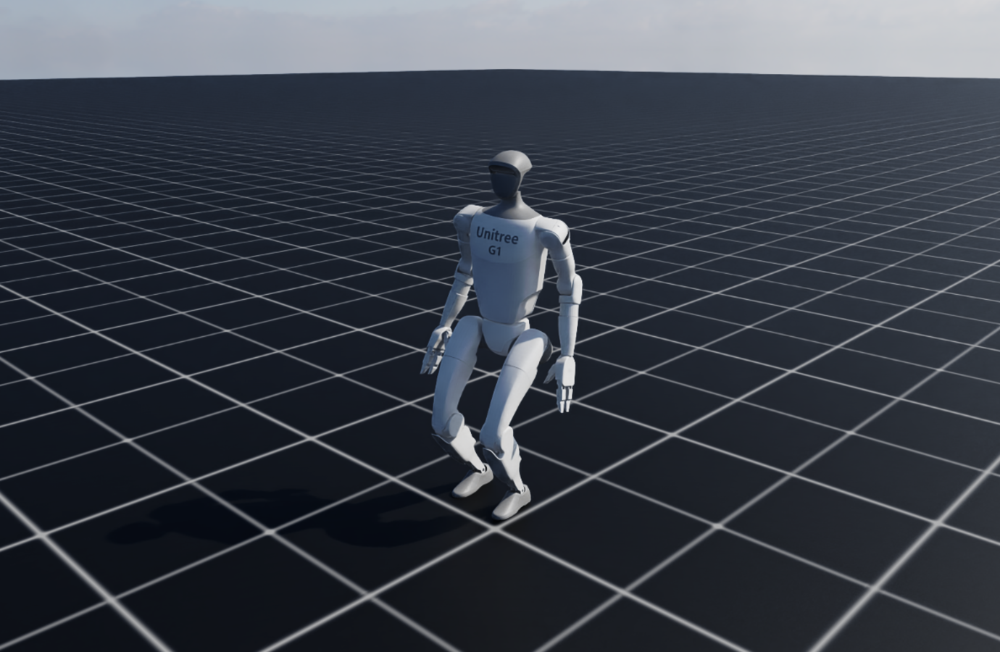
.. |velocity-rough-g1| image:: ../_static/tasks/locomotion/g1_rough.jpg
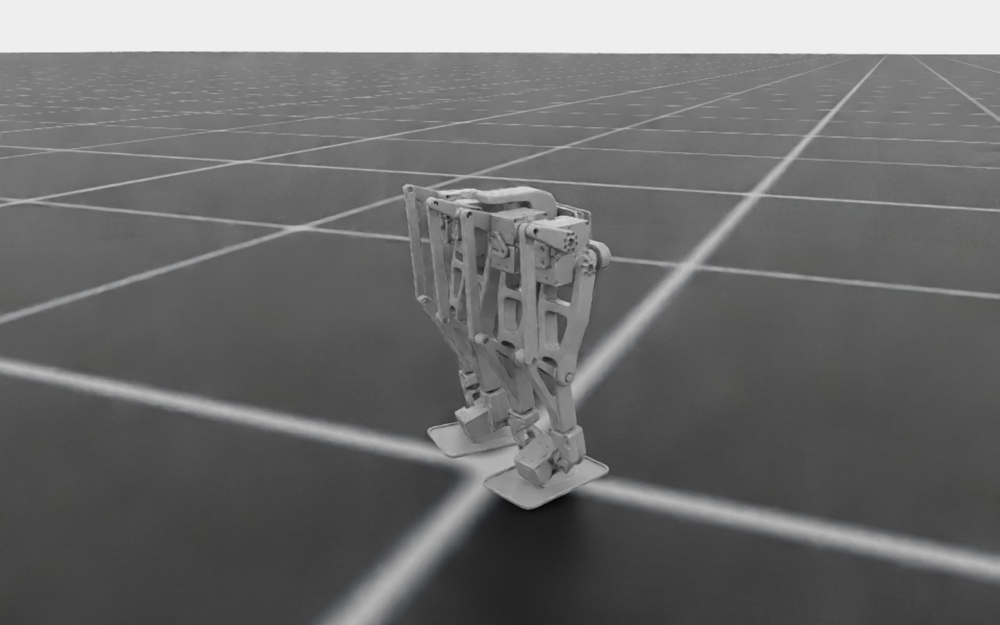
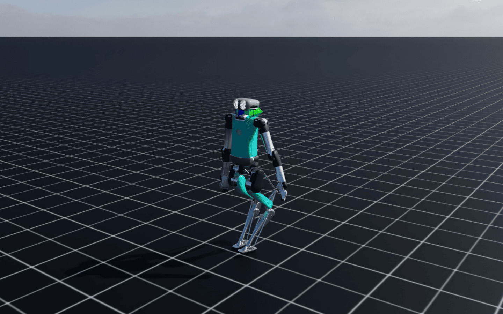
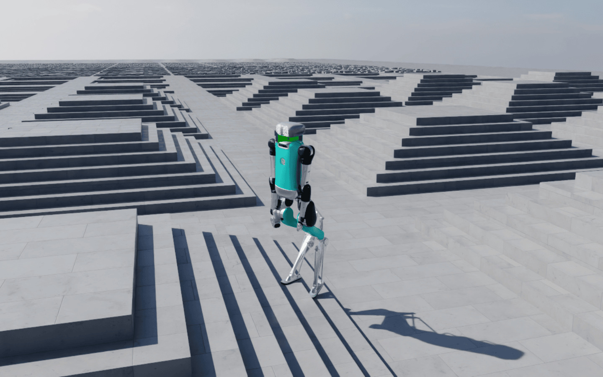
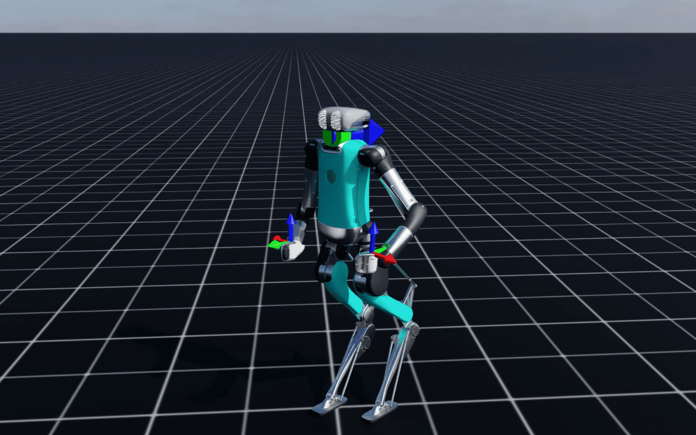

.. note::

   Agility Digit environments use closed-loop articulations (achilles rod, toe
   push-rods) that do not run correctly on ``newton_mjwarp``. Use ``physx`` for
   Digit-based tasks; see :ref:`known-issues-closed-loop-newton` for details.

Navigation
~~~~~~~~~~

.. table::
    :widths: 25 30 25 20

    +----------------+---------------------+-----------------------------------------------------------------------------+------------------------------+
    | World          | Environment ID      | Description                                                                 | Presets                      |
    +================+=====================+=============================================================================+==============================+
    | |anymal_c_nav| | |anymal_c_nav-link| | Navigate towards a target x-y position and heading with the ANYmal C robot. | **physics=** ``physx``,      |
    |                |                     |                                                                             | ``newton_mjwarp``            |
    +----------------+---------------------+-----------------------------------------------------------------------------+------------------------------+

.. |anymal_c_nav-link| replace:: :isaaclab-source:`IsaacContrib-Navigation-Flat-AnymalC <source/isaaclab_tasks/isaaclab_tasks/contrib/navigation/config/anymal_c/navigation_env_cfg.py>`

.. |anymal_c_nav| image:: ../_static/tasks/navigation/anymal_c_nav.jpg

Multirotor
~~~~~~~~~~

.. note::
    The multirotor entry provides an environment configuration for flying the ARL robot.
    See the `drone_arl` folder and the ARL robot config
    (`ARL_ROBOT_1_CFG`) in the codebase for details.

.. |arl_robot_track_position_state_based-link| replace:: :isaaclab-source:`IsaacContrib-TrackPositionNoObstacles-ARL-Robot-1 <source/isaaclab_tasks/isaaclab_tasks/contrib/drone_arl/track_position_state_based/config/arl_robot_1/track_position_state_based_env_cfg.py>`

.. |arl_robot_track_position_state_based| image:: ../_static/tasks/drone_arl/arl_robot_1_track_position_state_based.jpg

.. |arl_robot_navigation-link| replace:: :isaaclab-source:`IsaacContrib-Navigation-3DObstacles-ARL-Robot-1 <source/isaaclab_tasks/isaaclab_tasks/contrib/drone_arl/navigation/config/arl_robot_1/floating_obstacles_env_cfg.py>`

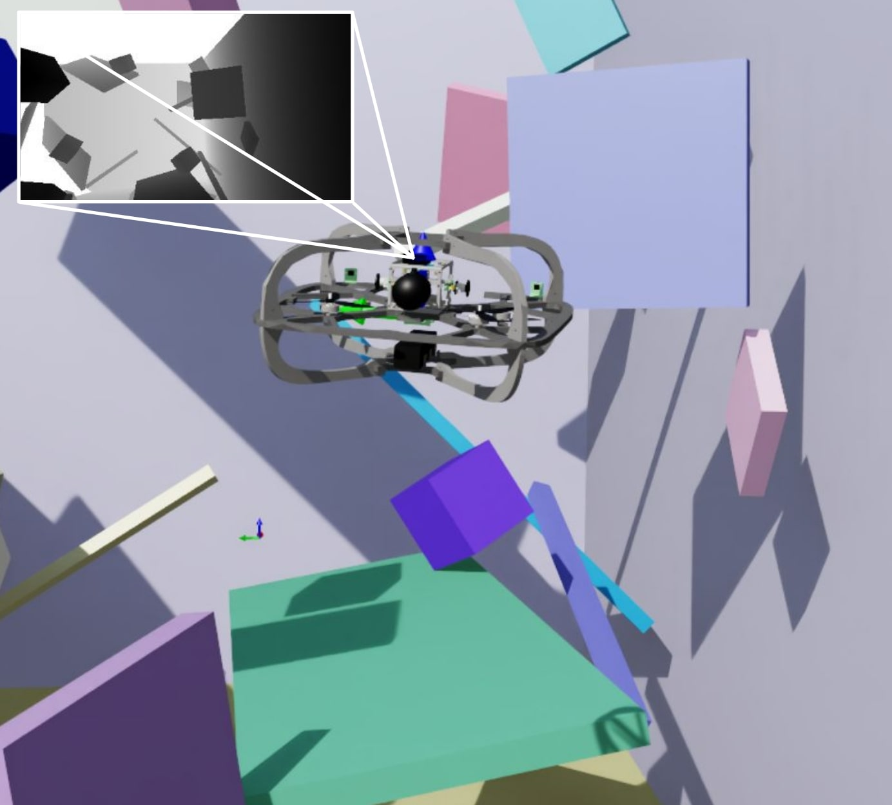

.. table::
    :widths: 25 30 25 20

    +----------------------------------------+---------------------------------------------+----------------------------------------------------------------------------------------+-----------------------+
    | World                                  | Environment ID                              | Description                                                                            | Presets               |
    +========================================+=============================================+========================================================================================+=======================+
    | |arl_robot_track_position_state_based| | |arl_robot_track_position_state_based-link| | Setpoint position control for the ARL robot using the track_position_state_based task. |                       |
    +----------------------------------------+---------------------------------------------+----------------------------------------------------------------------------------------+-----------------------+
    | |arl_robot_navigation|                 | |arl_robot_navigation-link|                 | Navigate through 3D obstacles with the ARL robot using depth camera sensing.           |                       |
    +----------------------------------------+---------------------------------------------+----------------------------------------------------------------------------------------+-----------------------+

Others
~~~~~~

.. note::

    Adversarial Motion Priors (AMP) training is only available with the `skrl` library, as it is the only one of the currently
    integrated libraries that supports it out-of-the-box (for the other libraries, it is necessary to implement the algorithm and architectures).
    See the `skrl's AMP Documentation <https://skrl.readthedocs.io/en/latest/api/agents/amp.html>`_ for more information.
    The AMP algorithm can be activated by adding the command line input ``--algorithm AMP`` to the train/play script.

    For evaluation, the play script's command line input ``--real-time`` allows the interaction loop between the environment and the agent to run in real time, if possible.

.. table::
    :widths: 25 30 25 20

    +----------------+---------------------------+-----------------------------------------------------------------------------+------------------------------+
    | World          | Environment ID            | Description                                                                 | Presets                      |
    +================+===========================+=============================================================================+==============================+
    | |humanoid_amp| | |humanoid_amp_dance-link| | Move a humanoid robot by imitating different pre-recorded human animations  |                              |
    |                |                           | (Adversarial Motion Priors).                                                |                              |
    |                | |humanoid_amp_run-link|   |                                                                             |                              |
    |                |                           |                                                                             |                              |
    |                | |humanoid_amp_walk-link|  |                                                                             |                              |
    +----------------+---------------------------+-----------------------------------------------------------------------------+------------------------------+

.. |humanoid_amp_dance-link| replace:: :isaaclab-source:`IsaacContrib-Humanoid-AMP-Dance-Direct <source/isaaclab_tasks/isaaclab_tasks/contrib/humanoid_amp/humanoid_amp_env_cfg.py>`
.. |humanoid_amp_run-link| replace:: :isaaclab-source:`IsaacContrib-Humanoid-AMP-Run-Direct <source/isaaclab_tasks/isaaclab_tasks/contrib/humanoid_amp/humanoid_amp_env_cfg.py>`
.. |humanoid_amp_walk-link| replace:: :isaaclab-source:`IsaacContrib-Humanoid-AMP-Walk-Direct <source/isaaclab_tasks/isaaclab_tasks/contrib/humanoid_amp/humanoid_amp_env_cfg.py>`

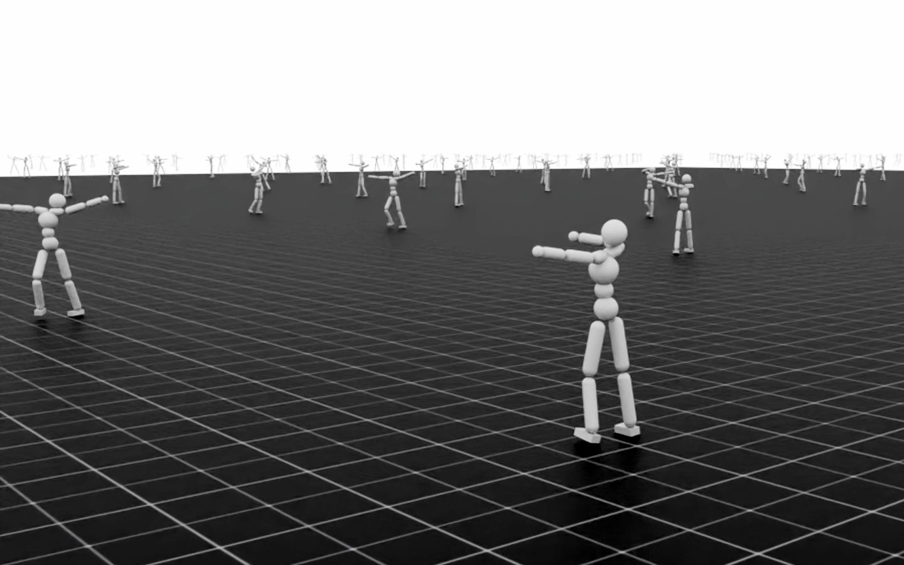

Spaces showcase
~~~~~~~~~~~~~~~

The |cartpole_showcase| folder contains showcase tasks (based on the *Cartpole* and *Cartpole-Camera* Direct tasks)
for the definition/use of the various Gymnasium observation and action spaces supported in Isaac Lab.

.. |cartpole_showcase| replace:: :isaaclab-source:`cartpole_showcase <source/isaaclab_tasks/isaaclab_tasks/contrib/cartpole_showcase>`

.. note::

    Currently, only Isaac Lab's Direct workflow supports the definition of observation and action spaces other than ``Box``.
    See Direct workflow's :py:obj:`~isaaclab.envs.DirectRLEnvCfg.observation_space` / :py:obj:`~isaaclab.envs.DirectRLEnvCfg.action_space`
    documentation for more details.

The following tables summarize the different pairs of showcased spaces for the *Cartpole* and *Cartpole-Camera* tasks.
Replace ``<OBSERVATION>`` and ``<ACTION>`` with the observation and action spaces to be explored in the task names for training and evaluation.

.. raw:: html

    <table class="showcase-table">
    <caption>
      
Showcase spaces for the <strong>Cartpole</strong> task

      
<code>Isaac-Cartpole-Showcase-&lt;OBSERVATION&gt;-&lt;ACTION&gt;-Direct-v0</code>

    </caption>
    <tbody>
      <tr>
        <td colspan="2" rowspan="2"></td>
        <td colspan="5" class="center">action space</td>
      </tr>
      <tr>
        <td><strong>&nbsp;Box</strong></td>
        <td><strong>&nbsp;Discrete</strong></td>
        <td><strong>&nbsp;MultiDiscrete</strong></td>
      </tr>
      <tr>
        <td rowspan="5" class="rot90 center">
observation

space
</td>
        <td><strong>&nbsp;Box</strong></td>
        <td class="center">x</td>
        <td class="center">x</td>
        <td class="center">x</td>
      </tr>
      <tr>
        <td><strong>&nbsp;Discrete</strong></td>
        <td class="center">x</td>
        <td class="center">x</td>
        <td class="center">x</td>
      </tr>
      <tr>
        <td><strong>&nbsp;MultiDiscrete</strong></td>
        <td class="center">x</td>
        <td class="center">x</td>
        <td class="center">x</td>
      </tr>
      <tr>
        <td><strong>&nbsp;Dict</strong></td>
        <td class="center">x</td>
        <td class="center">x</td>
        <td class="center">x</td>
      </tr>
      <tr>
        <td><strong>&nbsp;Tuple</strong></td>
        <td class="center">x</td>
        <td class="center">x</td>
        <td class="center">x</td>
      </tr>
    </tbody>
    </table>
     
    <table class="showcase-table">
    <caption>
        
Showcase spaces for the <strong>Cartpole-Camera</strong> task

        
<code>Isaac-Cartpole-Camera-Showcase-&lt;OBSERVATION&gt;-&lt;ACTION&gt;-Direct-v0</code>

    </caption>
    <tbody>
      <tr>
        <td colspan="2" rowspan="2"></td>
        <td colspan="5" class="center">action space</td>
      </tr>
      <tr>
        <td><strong>&nbsp;Box</strong></td>
        <td><strong>&nbsp;Discrete</strong></td>
        <td><strong>&nbsp;MultiDiscrete</strong></td>
      </tr>
      <tr>
        <td rowspan="5" class="rot90 center">
observation

space
</td>
        <td><strong>&nbsp;Box</strong></td>
        <td class="center">x</td>
        <td class="center">x</td>
        <td class="center">x</td>
      </tr>
      <tr>
        <td><strong>&nbsp;Discrete</strong></td>
        <td class="center">-</td>
        <td class="center">-</td>
        <td class="center">-</td>
      </tr>
      <tr>
        <td><strong>&nbsp;MultiDiscrete</strong></td>
        <td class="center">-</td>
        <td class="center">-</td>
        <td class="center">-</td>
      </tr>
      <tr>
        <td><strong>&nbsp;Dict</strong></td>
        <td class="center">x</td>
        <td class="center">x</td>
        <td class="center">x</td>
      </tr>
      <tr>
        <td><strong>&nbsp;Tuple</strong></td>
        <td class="center">x</td>
        <td class="center">x</td>
        <td class="center">x</td>
      </tr>
    </tbody></table>

Multi-agent
------------

.. note::

    True mutli-agent training is only available with the `skrl` library, see the `Multi-Agents Documentation <https://skrl.readthedocs.io/en/latest/api/multi_agents.html>`_ for more information.
    It supports the `IPPO` and `MAPPO` algorithms, which can be activated by adding the command line input ``--algorithm IPPO`` or ``--algorithm MAPPO`` to the train/play script.
    If these environments are run with other libraries or without the `IPPO` or `MAPPO` flags, they will be converted to single-agent environments under the hood.

Classic
~~~~~~~

.. table::
    :widths: 25 30 25 20

    +------------------------+------------------------------------+-----------------------------------------------------------------------------------------------------------------------+------------------------------+
    | World                  | Environment ID                     | Description                                                                                                           | Presets                      |
    +========================+====================================+=======================================================================================================================+==============================+
    | |cart-double-pendulum| | |cart-double-pendulum-direct-link| | Move the cart and the pendulum to keep the last one upwards in the classic inverted double pendulum on a cart control |                              |
    +------------------------+------------------------------------+-----------------------------------------------------------------------------------------------------------------------+------------------------------+

.. |cart-double-pendulum| image:: ../_static/tasks/classic/cart_double_pendulum.jpg

.. |cart-double-pendulum-direct-link| replace:: :isaaclab-source:`Isaac-Pendulum-Direct <source/isaaclab_tasks/isaaclab_tasks/core/pendulum/pendulum_env.py>`

Manipulation
~~~~~~~~~~~~

Environments based on fixed-arm manipulation tasks.

.. table::
    :widths: 25 30 25 20

    +----------------------+--------------------------------+--------------------------------------------------------+------------------------------+
    | World                | Environment ID                 | Description                                            | Presets                      |
    +======================+================================+========================================================+==============================+
    | |shadow-hand-over|   | |shadow-hand-over-direct-link| | Passing an object from one hand over to the other hand |                              |
    +----------------------+--------------------------------+--------------------------------------------------------+------------------------------+

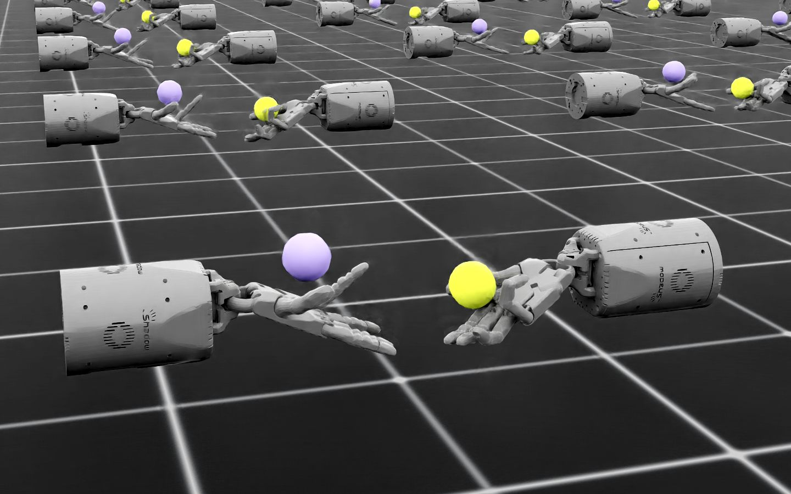

.. |shadow-hand-over-direct-link| replace:: :isaaclab-source:`Isaac-Shadow-Handover-Direct <source/isaaclab_tasks/isaaclab_tasks/core/handover/handover_env.py>`

|

.. _comprehensive-environment-list:

Comprehensive List of Environments
==================================

To run inference on a trained task, pass its task name to ``play.py``. The play script applies the environment
configuration's ``play_mode`` overrides automatically, providing configurations more suitable for inferencing,
including disabling runtime perturbations used for training.

.. note::

   Warp-native environment implementations no longer register separate ``-Warp`` task ids.
   Run the same stable tasks on the Warp runtime by passing ``--frontend warp`` together with
   ``presets=newton_mjwarp`` to the training and play entry points. See
   :doc:`core-concepts/physical-backends/newton/warp-environments` for details.

.. START-AUTO-GENERATED: comprehensive-environment-list

.. list-table::
    :widths: 22 12 30 36

    * - **Task Name**
      - **Workflow**
      - **RL Library**
      - **Presets**
    * - Isaac-Ant
      - Manager Based
      - **rl_games** (PPO), **rsl_rl** (PPO), **skrl** (PPO), **sb3** (PPO)
      - **physics=** ``newton_kamino``, ``newton_mjwarp``, ``physx``
    * - Isaac-Ant-Direct
      - Direct
      - **rl_games** (PPO), **rsl_rl** (PPO), **skrl** (PPO)
      - **physics=** ``isaacsim_physx``, ``newton_kamino``, ``newton_mjwarp``, ``ovphysx``, ``physx``
    * - Isaac-Cartpole
      - Manager Based
      - **rl_games** (PPO), **rsl_rl** (PPO), **skrl** (PPO), **sb3** (PPO)
      - **physics=** ``newton_kamino``, ``newton_mjwarp``, ``ovphysx``, ``physx``
    * - Isaac-Cartpole-Camera
      - Manager Based
      - **rl_games** (PPO, FEATURE), **rsl_rl** (PPO, FEATURE)
      - | **physics=** ``newton_kamino``, ``newton_mjwarp``, ``ovphysx``, ``physx``
          | **renderer=** ``isaacsim_rtx``, ``newton_renderer``, ``ovrtx``, ``rtx``
          | **presets=** ``albedo``, ``depth``, ``resnet18``, ``rgb``, ``semantic_segmentation``, ``simple_shading_constant_diffuse``, ``simple_shading_diffuse_mdl``, ``simple_shading_full_mdl``, ``theia_tiny``
    * - Isaac-Cartpole-Camera-Direct
      - Direct
      - **rl_games** (PPO), **rsl_rl** (PPO), **skrl** (PPO)
      - | **physics=** ``isaacsim_physx``, ``newton_kamino``, ``newton_mjwarp``, ``ovphysx``, ``physx``
          | **renderer=** ``isaacsim_rtx``, ``newton_renderer``, ``ovrtx``, ``rtx``
          | **presets=** ``albedo``, ``depth``, ``rgb``, ``semantic_segmentation``, ``simple_shading_constant_diffuse``, ``simple_shading_diffuse_mdl``, ``simple_shading_full_mdl``
    * - Isaac-Cartpole-Direct
      - Direct
      - **rl_games** (PPO), **rsl_rl** (PPO), **skrl** (PPO), **sb3** (PPO)
      - **physics=** ``isaacsim_physx``, ``newton_kamino``, ``newton_mjwarp``, ``ovphysx``, ``physx``
    * - Isaac-Fourbar-Pole-Swingup
      - Manager Based
      - **rsl_rl** (PPO)
      - **physics=** ``newton_kamino``
    * - Isaac-Humanoid
      - Manager Based
      - **rl_games** (PPO), **rsl_rl** (PPO), **skrl** (PPO), **sb3** (PPO)
      - **physics=** ``newton_mjwarp``, ``physx``
    * - Isaac-Humanoid-Direct
      - Direct
      - **rl_games** (PPO), **rsl_rl** (PPO), **skrl** (PPO)
      - **physics=** ``isaacsim_physx``, ``newton_mjwarp``, ``ovphysx``, ``physx``
    * - Isaac-Lift-Cloth-Franka
      - Manager Based
      - **rsl_rl** (PPO)
      - **physics=** ``newton_mjwarp_vbd``
    * - Isaac-Lift-Cloth-Franka-Camera
      - Manager Based
      - **rsl_rl** (PPO)
      - | **physics=** ``newton_mjwarp_vbd``
          | **renderer=** ``isaacsim_rtx``, ``newton_renderer``, ``ovrtx``, ``rtx``
    * - Isaac-Lift-Cube-Franka
      - Manager Based
      - **rl_games** (PPO), **rsl_rl** (PPO), **skrl** (PPO), **sb3** (PPO)
      -
    * - Isaac-Lift-Franka
      - Manager Based
      - **rsl_rl** (PPO)
      - | **physics=** ``newton_mjwarp``, ``physx``
          | **presets=** ``cube``, ``shapes``
    * - Isaac-Lift-KukaAllegro
      - Manager Based
      - **rsl_rl** (PPO)
      - | **physics=** ``newton_mjwarp``, ``ovphysx``, ``isaacsim_physx``
          | **presets=** ``cube``, ``shapes``
    * - Isaac-Lift-KukaAllegro-Camera
      - Manager Based
      - **rsl_rl** (PPO)
      - | **physics=** ``newton_mjwarp``, ``ovphysx``, ``physx``
          | **renderer=** ``isaacsim_rtx``, ``newton_renderer``, ``ovrtx``, ``rtx``
          | **presets=** ``albedo128``, ``albedo256``, ``albedo64``, ``cube``, ``depth128``, ``depth256``, ``depth64``, ``duo_camera``, ``raycaster_depth128``, ``raycaster_depth256``, ``raycaster_depth64``, ``rgb128``, ``rgb256``, ``rgb64``, ``semantic_segmentation128``, ``semantic_segmentation256``, ``semantic_segmentation64``, ``shapes``, ``simple_shading_constant_diffuse128``, ``simple_shading_constant_diffuse256``, ``simple_shading_constant_diffuse64``, ``simple_shading_diffuse_mdl128``, ``simple_shading_diffuse_mdl256``, ``simple_shading_diffuse_mdl64``, ``simple_shading_full_mdl128``, ``simple_shading_full_mdl256``, ``simple_shading_full_mdl64``, ``single_camera``
    * - Isaac-Lift-Soft-Franka
      - Manager Based
      - **rsl_rl** (PPO)
      - **physics=** ``newton_mjwarp_vbd``, ``newton_mjwarp_vbd_proxy``, ``physx``
    * - Isaac-Lift-Soft-Franka-Camera
      - Manager Based
      - **rsl_rl** (PPO)
      - | **physics=** ``newton_mjwarp_vbd``, ``newton_mjwarp_vbd_proxy``, ``physx``
          | **renderer=** ``isaacsim_rtx``, ``newton_renderer``, ``ovrtx``, ``rtx``
    * - Isaac-Open-Drawer-Franka
      - Manager Based
      - **rl_games** (PPO), **rsl_rl** (PPO), **skrl** (PPO)
      -
    * - Isaac-Open-Drawer-Franka-Direct
      - Direct
      - **rl_games** (PPO), **rsl_rl** (PPO), **skrl** (PPO)
      - **physics=** ``isaacsim_physx``, ``newton_mjwarp``, ``ovphysx``, ``physx``
    * - Isaac-Pendulum-Direct
      - Direct
      - **rl_games** (PPO), **skrl** (PPO, IPPO, MAPPO)
      -
    * - Isaac-Reach-Franka
      - Manager Based
      - **rl_games** (PPO), **rsl_rl** (PPO), **skrl** (PPO)
      - | **physics=** ``isaacsim_physx``, ``newton_kamino``, ``newton_mjwarp``, ``ovphysx``
          | **presets=** ``diffik``, ``joint_pos``, ``newton_ik``
    * - Isaac-Reach-Franka-OSC
      - Manager Based
      - **rsl_rl** (PPO)
      - **physics=** ``isaacsim_physx``, ``newton_kamino``, ``newton_mjwarp``, ``ovphysx``
    * - Isaac-Reach-UR10
      - Manager Based
      - **rl_games** (PPO), **rsl_rl** (PPO), **skrl** (PPO)
      - **physics=** ``isaacsim_physx``, ``newton_kamino``, ``newton_mjwarp``, ``ovphysx``
    * - Isaac-Reorient-Cube-Allegro
      - Manager Based
      - **rl_games** (PPO), **rsl_rl** (PPO), **skrl** (PPO)
      -
    * - Isaac-Reorient-Cube-Allegro-Direct
      - Direct
      - **rl_games** (PPO), **rsl_rl** (PPO), **skrl** (PPO)
      - **physics=** ``newton_mjwarp``, ``ovphysx``, ``physx``
    * - Isaac-Reorient-Cube-Shadow-Camera-Direct
      - Direct
      - **rl_games** (PPO), **rsl_rl** (PPO)
      - | **physics=** ``newton_kamino``, ``newton_mjwarp``, ``ovphysx``, ``physx``
          | **renderer=** ``isaacsim_rtx``, ``newton_renderer``, ``ovrtx``, ``rtx``
          | **presets=** ``albedo``, ``depth``, ``full``, ``rgb``, ``semantic_segmentation``, ``simple_shading_constant_diffuse``, ``simple_shading_diffuse_mdl``, ``simple_shading_full_mdl``
    * - Isaac-Reorient-Cube-Shadow-Direct
      - Direct
      - **rl_games** (PPO), **rsl_rl** (PPO), **skrl** (PPO)
      - **physics=** ``newton_kamino``, ``newton_mjwarp``, ``ovphysx``, ``physx``
    * - Isaac-Reorient-Cube-Shadow-OpenAI-FF-Direct
      - Direct
      - **rl_games** (PPO), **rsl_rl** (PPO), **skrl** (PPO)
      - **physics=** ``newton_kamino``, ``newton_mjwarp``, ``ovphysx``, ``physx``
    * - Isaac-Reorient-Cube-Shadow-OpenAI-LSTM-Direct
      - Direct
      - **rl_games** (PPO), **rsl_rl** (PPO)
      - **physics=** ``newton_kamino``, ``newton_mjwarp``, ``ovphysx``, ``physx``
    * - Isaac-Reorient-Franka
      - Manager Based
      - **rsl_rl** (PPO)
      - | **physics=** ``newton_mjwarp``, ``physx``
          | **presets=** ``cube``, ``shapes``
    * - Isaac-Reorient-KukaAllegro
      - Manager Based
      - **rsl_rl** (PPO)
      - | **physics=** ``newton_mjwarp``, ``ovphysx``, ``physx``
          | **presets=** ``cube``, ``shapes``
    * - Isaac-Reorient-KukaAllegro-Camera
      - Manager Based
      - **rsl_rl** (PPO)
      - | **physics=** ``newton_mjwarp``, ``ovphysx``, ``physx``
          | **renderer=** ``isaacsim_rtx``, ``newton_renderer``, ``ovrtx``, ``rtx``
          | **presets=** ``albedo128``, ``albedo256``, ``albedo64``, ``cube``, ``depth128``, ``depth256``, ``depth64``, ``duo_camera``, ``raycaster_depth128``, ``raycaster_depth256``, ``raycaster_depth64``, ``rgb128``, ``rgb256``, ``rgb64``, ``semantic_segmentation128``, ``semantic_segmentation256``, ``semantic_segmentation64``, ``shapes``, ``simple_shading_constant_diffuse128``, ``simple_shading_constant_diffuse256``, ``simple_shading_constant_diffuse64``, ``simple_shading_diffuse_mdl128``, ``simple_shading_diffuse_mdl256``, ``simple_shading_diffuse_mdl64``, ``simple_shading_full_mdl128``, ``simple_shading_full_mdl256``, ``simple_shading_full_mdl64``, ``single_camera``
    * - Isaac-Shadow-Handover-Direct
      - Direct
      - **rl_games** (PPO), **skrl** (PPO, IPPO, MAPPO)
      - **physics=** ``newton_mjwarp``, ``physx``
    * - Isaac-Velocity-Flat-AnymalD
      - Manager Based
      - **rsl_rl** (PPO, DISTILLATION, DISTILLATION_RECURRENT, RECURRENT), **skrl** (PPO)
      - **physics=** ``newton_mjwarp``, ``ovphysx``, ``physx``
    * - Isaac-Velocity-Flat-Cassie
      - Manager Based
      - **rsl_rl** (PPO), **skrl** (PPO)
      - **physics=** ``newton_kamino``, ``newton_mjwarp``, ``physx``
    * - Isaac-Velocity-Flat-G1
      - Manager Based
      - **rsl_rl** (PPO), **skrl** (PPO)
      - **physics=** ``newton_kamino``, ``newton_mjwarp``, ``physx``
    * - Isaac-Velocity-Flat-H1
      - Manager Based
      - **rsl_rl** (PPO), **skrl** (PPO)
      - **physics=** ``newton_kamino``, ``newton_mjwarp``, ``physx``
    * - Isaac-Velocity-Flat-Spot
      - Manager Based
      - **rsl_rl** (PPO), **skrl** (PPO)
      - **physics=** ``newton_kamino``, ``newton_mjwarp``, ``physx``
    * - Isaac-Velocity-Flat-UnitreeGo2
      - Manager Based
      - **rsl_rl** (PPO), **skrl** (PPO)
      - **physics=** ``newton_kamino``, ``newton_mjwarp``, ``physx``
    * - Isaac-Velocity-Rough-AnymalD
      - Manager Based
      - **rsl_rl** (PPO), **skrl** (PPO)
      - **physics=** ``newton_mjwarp``, ``ovphysx``, ``physx``
    * - Isaac-Velocity-Rough-Cassie
      - Manager Based
      - **rsl_rl** (PPO), **skrl** (PPO)
      - **physics=** ``newton_mjwarp``, ``ovphysx``, ``physx``
    * - Isaac-Velocity-Rough-G1
      - Manager Based
      - **rsl_rl** (PPO), **skrl** (PPO)
      - **physics=** ``newton_mjwarp``, ``ovphysx``, ``physx``
    * - Isaac-Velocity-Rough-H1
      - Manager Based
      - **rsl_rl** (PPO), **skrl** (PPO)
      - **physics=** ``newton_mjwarp``, ``ovphysx``, ``physx``
    * - Isaac-Velocity-Rough-UnitreeGo2
      - Manager Based
      - **rsl_rl** (PPO), **skrl** (PPO)
      - **physics=** ``newton_mjwarp``, ``ovphysx``, ``physx``
    * - IsaacContrib-Assemble-Trocar-G129-Dex3
      - Manager Based
      - **rlinf** (PPO)
      -
    * - IsaacContrib-AutoMate-Assembly-Direct
      - Direct
      - **rl_games** (PPO)
      -
    * - IsaacContrib-AutoMate-Disassembly-Direct
      - Direct
      - **rl_games** (PPO)
      -
    * - IsaacContrib-Cartpole-Camera-Showcase-Direct
      - Direct
      - **skrl** (PPO, BOX_BOX, BOX_DISCRETE, BOX_MULTIDISCRETE, DICT_BOX, DICT_DISCRETE, DICT_MULTIDISCRETE, TUPLE_BOX, TUPLE_DISCRETE, TUPLE_MULTIDISCRETE)
      - **presets=** ``box_box``, ``box_discrete``, ``box_multidiscrete``, ``dict_box``, ``dict_discrete``, ``dict_multidiscrete``, ``tuple_box``, ``tuple_discrete``, ``tuple_multidiscrete``
    * - IsaacContrib-Cartpole-Showcase-Direct
      - Direct
      - **skrl** (PPO, BOX_BOX, BOX_DISCRETE, BOX_MULTIDISCRETE, DICT_BOX, DICT_DISCRETE, DICT_MULTIDISCRETE, DISCRETE_BOX, DISCRETE_DISCRETE, DISCRETE_MULTIDISCRETE, MULTIDISCRETE_BOX, MULTIDISCRETE_DISCRETE, MULTIDISCRETE_MULTIDISCRETE, TUPLE_BOX, TUPLE_DISCRETE, TUPLE_MULTIDISCRETE)
      - | **physics=** ``isaacsim_physx``, ``newton_kamino``, ``newton_mjwarp``, ``ovphysx``, ``physx``
          | **presets=** ``box_box``, ``box_discrete``, ``box_multidiscrete``, ``dict_box``, ``dict_discrete``, ``dict_multidiscrete``, ``discrete_box``, ``discrete_discrete``, ``discrete_multidiscrete``, ``multidiscrete_box``, ``multidiscrete_discrete``, ``multidiscrete_multidiscrete``, ``tuple_box``, ``tuple_discrete``, ``tuple_multidiscrete``
    * - IsaacContrib-Deploy-GearAssembly-Rizon4s-Grav
      - Manager Based
      - **rsl_rl** (PPO)
      -
    * - IsaacContrib-Deploy-GearAssembly-Rizon4s-Grav-ROS-Inference
      - Manager Based
      - **rsl_rl** (PPO)
      -
    * - IsaacContrib-Deploy-GearAssembly-UR10e-2F140
      - Manager Based
      - **rsl_rl** (PPO)
      -
    * - IsaacContrib-Deploy-GearAssembly-UR10e-2F140-ROS-Inference
      - Manager Based
      - **rsl_rl** (PPO)
      -
    * - IsaacContrib-Deploy-GearAssembly-UR10e-2F85
      - Manager Based
      - **rsl_rl** (PPO)
      -
    * - IsaacContrib-Deploy-GearAssembly-UR10e-2F85-ROS-Inference
      - Manager Based
      - **rsl_rl** (PPO)
      -
    * - IsaacContrib-Deploy-Reach-Rizon4s
      - Manager Based
      - **rsl_rl** (PPO)
      -
    * - IsaacContrib-Deploy-Reach-Rizon4s-ROS-Inference
      - Manager Based
      - **rsl_rl** (PPO)
      -
    * - IsaacContrib-Deploy-Reach-UR10e
      - Manager Based
      - **rsl_rl** (PPO)
      -
    * - IsaacContrib-Deploy-Reach-UR10e-ROS-Inference
      - Manager Based
      - **rsl_rl** (PPO)
      -
    * - IsaacContrib-DrLegs-HoldPose
      - Manager Based
      - **rsl_rl** (PPO)
      - **physics=** ``newton_kamino``, ``physx``
    * - IsaacContrib-DrLegs-Walk
      - Manager Based
      - **rsl_rl** (PPO)
      - **physics=** ``newton_kamino``, ``physx``
    * - IsaacContrib-ExhaustPipe-GR1T2-Pink-IK-Abs
      - Manager Based
      -
      -
    * - IsaacContrib-Factory-GearMesh-Direct
      - Direct
      - **rl_games** (PPO)
      -
    * - IsaacContrib-Factory-NutThread-Direct
      - Direct
      - **rl_games** (PPO)
      -
    * - IsaacContrib-Factory-PegInsert-Direct
      - Direct
      - **rl_games** (PPO)
      -
    * - IsaacContrib-Forge-GearMesh-Direct
      - Direct
      - **rl_games** (PPO)
      -
    * - IsaacContrib-Forge-NutThread-Direct
      - Direct
      - **rl_games** (PPO)
      -
    * - IsaacContrib-Forge-PegInsert-Direct
      - Direct
      - **rl_games** (PPO)
      -
    * - IsaacContrib-Humanoid-AMP-Dance-Direct
      - Direct
      - **skrl** (AMP)
      -
    * - IsaacContrib-Humanoid-AMP-Run-Direct
      - Direct
      - **skrl** (AMP)
      -
    * - IsaacContrib-Humanoid-AMP-Walk-Direct
      - Direct
      - **skrl** (AMP)
      -
    * - IsaacContrib-Lift-Cube-Franka-IK-Abs
      - Manager Based
      -
      -
    * - IsaacContrib-Lift-Cube-Franka-IK-Rel
      - Manager Based
      -
      -
    * - IsaacContrib-Lift-Cube-OpenArm
      - Manager Based
      - **rl_games** (PPO), **rsl_rl** (PPO)
      -
    * - IsaacContrib-Navigation-3DObstacles-ARL-Robot-1
      - Manager Based
      - **rl_games** (PPO), **rsl_rl** (PPO), **skrl** (PPO)
      -
    * - IsaacContrib-Navigation-Flat-AnymalC
      - Manager Based
      - **rsl_rl** (PPO), **skrl** (PPO)
      -
    * - IsaacContrib-NutPour-GR1T2-Pink-IK-Abs
      - Manager Based
      -
      -
    * - IsaacContrib-Open-Drawer-Franka-IK-Abs
      - Manager Based
      -
      -
    * - IsaacContrib-Open-Drawer-Franka-IK-Rel
      - Manager Based
      -
      -
    * - IsaacContrib-Open-Drawer-OpenArm
      - Manager Based
      - **rl_games** (PPO), **rsl_rl** (PPO)
      -
    * - IsaacContrib-PickPlace-FixedBaseUpperBodyIK-G1-Abs
      - Manager Based
      -
      -
    * - IsaacContrib-PickPlace-G1-InspireFTP-Abs
      - Manager Based
      -
      -
    * - IsaacContrib-PickPlace-GR1T2-Abs
      - Manager Based
      -
      -
    * - IsaacContrib-PickPlace-GR1T2-WaistEnabled-Abs
      - Manager Based
      -
      -
    * - IsaacContrib-PickPlace-Locomanipulation-G1-Abs
      - Manager Based
      -
      -
    * - IsaacContrib-Place-Mug-Agibot-Left-Arm-RmpFlow
      - Manager Based
      -
      - **physics=** ``newton_mjwarp``, ``physx``
    * - IsaacContrib-Place-Toy2Box-Agibot-Right-Arm-RmpFlow
      - Manager Based
      -
      - **physics=** ``newton_mjwarp``, ``physx``
    * - IsaacContrib-Reach-Franka-IK-Abs
      - Manager Based
      -
      - **physics=** ``isaacsim_physx``, ``newton_kamino``, ``newton_mjwarp``, ``ovphysx``
    * - IsaacContrib-Reach-OpenArm
      - Manager Based
      - **rl_games** (PPO), **rsl_rl** (PPO), **skrl** (PPO)
      -
    * - IsaacContrib-Reach-OpenArmBi
      - Manager Based
      - **rl_games** (PPO), **rsl_rl** (PPO)
      -
    * - IsaacContrib-Stack-Cube-Bin-Franka-IK-Rel-Mimic
      - Manager Based
      -
      - **physics=** ``newton_mjwarp``, ``physx``
    * - IsaacContrib-Stack-Cube-BlueGreen-Franka-IK-Rel
      - Manager Based
      -
      - **physics=** ``newton_mjwarp``, ``physx``
    * - IsaacContrib-Stack-Cube-BlueGreenRed-Franka-IK-Rel
      - Manager Based
      -
      - **physics=** ``newton_mjwarp``, ``physx``
    * - IsaacContrib-Stack-Cube-Franka
      - Manager Based
      -
      - **physics=** ``newton_mjwarp``, ``physx``
    * - IsaacContrib-Stack-Cube-Franka-IK-Abs
      - Manager Based
      -
      - **physics=** ``newton_mjwarp``, ``physx``
    * - IsaacContrib-Stack-Cube-Franka-IK-Rel
      - Manager Based
      -
      - **physics=** ``newton_mjwarp``, ``physx``
    * - IsaacContrib-Stack-Cube-Franka-IK-Rel-Blueprint
      - Manager Based
      -
      - **physics=** ``newton_mjwarp``, ``physx``
    * - IsaacContrib-Stack-Cube-Franka-IK-Rel-Skillgen
      - Manager Based
      -
      - **physics=** ``newton_mjwarp``, ``physx``
    * - IsaacContrib-Stack-Cube-Franka-IK-Rel-Visuomotor
      - Manager Based
      -
      - **physics=** ``newton_mjwarp``, ``physx``
    * - IsaacContrib-Stack-Cube-Franka-IK-Rel-Visuomotor-Cosmos
      - Manager Based
      -
      - **physics=** ``newton_mjwarp``, ``physx``
    * - IsaacContrib-Stack-Cube-Galbot-Left-Arm-Gripper-RmpFlow
      - Manager Based
      -
      - **physics=** ``newton_mjwarp``, ``physx``
    * - IsaacContrib-Stack-Cube-Galbot-Left-Arm-Gripper-Visuomotor
      - Manager Based
      -
      - | **physics=** ``newton_mjwarp``, ``physx``
          | **renderer=** ``isaacsim_rtx``, ``newton_renderer``, ``ovrtx``, ``rtx``
    * - IsaacContrib-Stack-Cube-Galbot-Left-Arm-Gripper-Visuomotor-Joint-Position
      - Manager Based
      -
      - | **physics=** ``newton_mjwarp``, ``physx``
          | **renderer=** ``isaacsim_rtx``, ``newton_renderer``, ``ovrtx``, ``rtx``
    * - IsaacContrib-Stack-Cube-Galbot-Left-Arm-Gripper-Visuomotor-RmpFlow
      - Manager Based
      -
      - | **physics=** ``newton_mjwarp``, ``physx``
          | **renderer=** ``isaacsim_rtx``, ``newton_renderer``, ``ovrtx``, ``rtx``
    * - IsaacContrib-Stack-Cube-Galbot-Right-Arm-Suction-RmpFlow
      - Manager Based
      -
      - **physics=** ``newton_mjwarp``, ``physx``
    * - IsaacContrib-Stack-Cube-Instance-Randomize-Franka
      - Manager Based
      -
      -
    * - IsaacContrib-Stack-Cube-Instance-Randomize-Franka-IK-Rel
      - Manager Based
      -
      -
    * - IsaacContrib-Stack-Cube-RedGreen-Franka-IK-Rel
      - Manager Based
      -
      - **physics=** ``newton_mjwarp``, ``physx``
    * - IsaacContrib-Stack-Cube-RedGreenBlue-Franka-IK-Rel
      - Manager Based
      -
      - **physics=** ``newton_mjwarp``, ``physx``
    * - IsaacContrib-Stack-Cube-SO101-IK-Abs-v0
      - Manager Based
      -
      - **physics=** ``newton_mjwarp``, ``physx``
    * - IsaacContrib-Stack-Cube-SO101-Joint-Teleop-v0
      - Manager Based
      -
      - **physics=** ``newton_mjwarp``, ``physx``
    * - IsaacContrib-Stack-Cube-SO101-v0
      - Manager Based
      -
      - **physics=** ``newton_mjwarp``, ``physx``
    * - IsaacContrib-Stack-Cube-UR10-Long-Suction-IK-Rel
      - Manager Based
      -
      - **physics=** ``newton_mjwarp``, ``physx``
    * - IsaacContrib-Stack-Cube-UR10-Short-Suction-IK-Rel
      - Manager Based
      -
      - **physics=** ``newton_mjwarp``, ``physx``
    * - IsaacContrib-TrackPositionNoObstacles-ARL-Robot-1
      - Manager Based
      - **rl_games** (PPO), **rsl_rl** (PPO), **skrl** (PPO)
      -
    * - IsaacContrib-Tracking-LocoManip-Digit
      - Manager Based
      - **rsl_rl** (PPO)
      - **physics=** ``physx``
    * - IsaacContrib-Velocity-Flat-AnymalB
      - Manager Based
      - **rsl_rl** (PPO), **skrl** (PPO)
      - **physics=** ``newton_kamino``, ``newton_mjwarp``, ``physx``
    * - IsaacContrib-Velocity-Flat-AnymalC
      - Manager Based
      - **rl_games** (PPO), **rsl_rl** (PPO), **skrl** (PPO)
      - **physics=** ``newton_kamino``, ``newton_mjwarp``, ``physx``
    * - IsaacContrib-Velocity-Flat-AnymalC-Direct
      - Direct
      - **rl_games** (PPO), **rsl_rl** (PPO), **skrl** (PPO)
      -
    * - IsaacContrib-Velocity-Flat-Digit
      - Manager Based
      - **rsl_rl** (PPO)
      - **physics=** ``physx``
    * - IsaacContrib-Velocity-Flat-UnitreeA1
      - Manager Based
      - **rsl_rl** (PPO), **skrl** (PPO), **sb3** (PPO)
      - **physics=** ``newton_kamino``, ``newton_mjwarp``, ``physx``
    * - IsaacContrib-Velocity-Flat-UnitreeGo1
      - Manager Based
      - **rsl_rl** (PPO), **skrl** (PPO)
      - **physics=** ``newton_kamino``, ``newton_mjwarp``, ``physx``
    * - IsaacContrib-Velocity-Rough-AnymalB
      - Manager Based
      - **rsl_rl** (PPO), **skrl** (PPO)
      - **physics=** ``newton_mjwarp``, ``ovphysx``, ``physx``
    * - IsaacContrib-Velocity-Rough-AnymalC
      - Manager Based
      - **rl_games** (PPO), **rsl_rl** (PPO), **skrl** (PPO)
      - **physics=** ``newton_mjwarp``, ``ovphysx``, ``physx``
    * - IsaacContrib-Velocity-Rough-AnymalC-Direct
      - Direct
      - **rl_games** (PPO), **rsl_rl** (PPO), **skrl** (PPO)
      -
    * - IsaacContrib-Velocity-Rough-Digit
      - Manager Based
      - **rsl_rl** (PPO)
      - **physics=** ``physx``
    * - IsaacContrib-Velocity-Rough-UnitreeA1
      - Manager Based
      - **rsl_rl** (PPO), **skrl** (PPO), **sb3** (PPO)
      - **physics=** ``newton_mjwarp``, ``ovphysx``, ``physx``
    * - IsaacContrib-Velocity-Rough-UnitreeGo1
      - Manager Based
      - **rsl_rl** (PPO), **skrl** (PPO)
      - **physics=** ``newton_mjwarp``, ``ovphysx``, ``physx``

.. END-AUTO-GENERATED: comprehensive-environment-list
