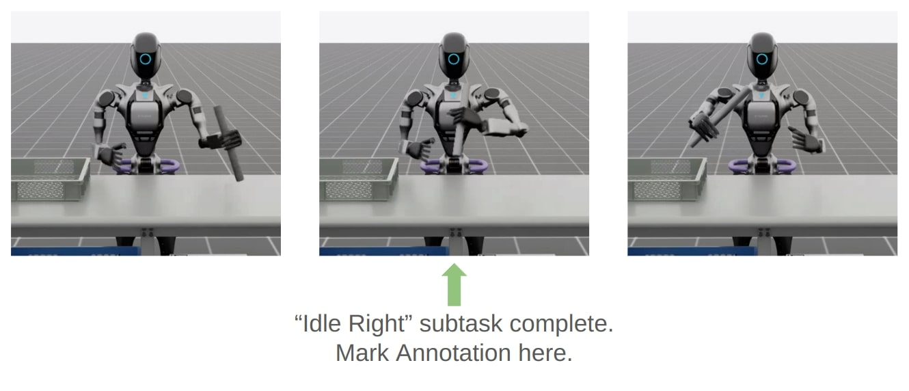

.. _data-generation-imitation-learning-humanoids:

Examples: Data Generation and Imitation Learning for Humanoids
==============================================================

This page covers data generation and imitation learning workflows for humanoid robots (GR-1, G1) with Isaac Lab Mimic:

* **Demo 1:** Data generation and policy training for a humanoid robot (GR-1 pick and place)
* **Demo 2:** Visuomotor policy for a humanoid robot (GR-1 nut pouring)
* **Demo 3:** Data generation and policy training for humanoid robot locomanipulation (Unitree G1)

.. important::

   Complete the tutorial in :ref:`Teleoperation and Imitation Learning with Isaac Lab Mimic <teleoperation-imitation-learning>`
   before proceeding with the following demonstrations to
   understand the data collection, annotation, and generation steps of Isaac Lab Mimic.

Demo 1: Data Generation and Policy Training for a Humanoid Robot
~~~~~~~~~~~~~~~~~~~~~~~~~~~~~~~~~~~~~~~~~~~~~~~~~~~~~~~~~~~~~~~~

.. figure:: https://download.isaacsim.omniverse.nvidia.com/isaaclab/images/gr-1_steering_wheel_pick_place.gif
   :width: 100%
   :align: center
   :alt: GR-1 humanoid robot performing a pick and place task
   :figclass: align-center

Isaac Lab Mimic supports data generation for robots with multiple end effectors. In the following demonstration, we will show how to generate data
to train a Fourier GR-1 humanoid robot to perform a pick and place task.

Optional: Collect and annotate demonstrations
^^^^^^^^^^^^^^^^^^^^^^^^^^^^^^^^^^^^^^^^^^^^^

Collect human demonstrations
""""""""""""""""""""""""""""
.. note::

   Data collection for the GR-1 humanoid robot environment requires use of an Apple Vision Pro headset. If you do not have access to
   an Apple Vision Pro, you may skip this step and continue on to the next step: :ref:`Generate the dataset <generate-the-dataset>`.
   A pre-recorded annotated dataset is provided in the next step.

.. tip::
   The GR1 scene utilizes the wrist poses from the Apple Vision Pro (AVP) as setpoints for a differential IK controller (Pink-IK).
   The differential IK controller requires the user's wrist pose to be close to the robot's initial or current pose for optimal performance.
   Rapid movements of the user's wrist may cause it to deviate significantly from the goal state, which could prevent the IK controller from finding the optimal solution.
   This may result in a mismatch between the user's wrist and the robot's wrist.
   You can increase the gain of all the `Pink-IK controller's FrameTasks <https://github.com/isaac-sim/IsaacLab/blob/main/source/isaaclab_tasks/isaaclab_tasks/manager_based/manipulation/pick_place/pickplace_gr1t2_env_cfg.py>`__ to track the AVP wrist poses with lower latency.
   However, this may lead to more jerky motion.
   Separately, the finger joints of the robot are retargeted to the user's finger joints using the `dex-retargeting <https://github.com/dexsuite/dex-retargeting>`_ library.

Set up the CloudXR Runtime and Apple Vision Pro for teleoperation by following the steps in :ref:`cloudxr-teleoperation`.
CPU simulation is used in the following steps for better XR performance when running a single environment.

Collect a set of human demonstrations.
A success demo requires the object to be placed in the bin and for the robot's right arm to be retracted to the starting position.

The Isaac Lab Mimic Env GR-1 humanoid robot is set up such that the left hand has a single subtask, while the right hand has two subtasks.
The first subtask involves the right hand remaining idle while the left hand picks up and moves the object to the position where the right hand will grasp it.
This setup allows Isaac Lab Mimic to interpolate the right hand's trajectory accurately by using the object's pose, especially when poses are randomized during data generation.
Therefore, avoid moving the right hand while the left hand picks up the object and brings it to a stable position.

.. |good_demo| image:: https://download.isaacsim.omniverse.nvidia.com/isaaclab/images/gr-1_steering_wheel_pick_place_good_demo.gif
   :width: 49%
   :alt: GR-1 humanoid robot performing a good pick and place demonstration

.. |bad_demo| image:: https://download.isaacsim.omniverse.nvidia.com/isaaclab/images/gr-1_steering_wheel_pick_place_bad_demo.gif
   :width: 49%
   :alt: GR-1 humanoid robot performing a bad pick and place demonstration

|good_demo| |bad_demo|

.. centered:: Left: A good human demonstration with smooth and steady motion. Right: A bad demonstration with jerky and exaggerated motion.

Collect five demonstrations by running the following command:

.. code:: bash

   ./isaaclab.sh -p scripts/tools/record_demos.py \
   --task Isaac-PickPlace-GR1T2-Abs-v0 \
   --visualizer kit \
   --device cpu \
   --enable_pinocchio \
   --teleop_device handtracking \
   --num_demos 5 \
   --dataset_file ./datasets/dataset_gr1.hdf5

.. note::
   We also provide a GR-1 pick and place task with waist degrees-of-freedom enabled ``Isaac-PickPlace-GR1T2-WaistEnabled-Abs-v0`` (see :ref:`environments` for details on the available environments, including the GR1 Waist Enabled variant). The same command above applies but with the task name changed to ``Isaac-PickPlace-GR1T2-WaistEnabled-Abs-v0``.

.. tip::
   If a demo fails during data collection, the environment can be reset using the teleoperation controls panel in the XR teleop client
   on the Apple Vision Pro or via voice control by saying "reset". See :ref:`teleoperate-apple-vision-pro` for more details.

   The robot uses simplified collision meshes for physics calculations that differ from the detailed visual meshes displayed in the simulation. Due to this difference, you may occasionally observe visual artifacts where parts of the robot appear to penetrate other objects or itself, even though proper collision handling is occurring in the physics simulation.

You can replay the collected demonstrations by running the following command:

.. code:: bash

   ./isaaclab.sh -p scripts/tools/replay_demos.py \
   --task Isaac-PickPlace-GR1T2-Abs-v0 \
   --visualizer kit \
   --device cpu \
   --enable_pinocchio \
   --dataset_file ./datasets/dataset_gr1.hdf5

.. note::
   Non-determinism may be observed during replay as physics in IsaacLab are not determimnistically reproducible when using ``env.reset``.

Annotate the demonstrations
"""""""""""""""""""""""""""

Unlike the :ref:`Franka stacking task <generating-additional-demonstrations>`, the GR-1 pick and place task uses manual annotation to define subtasks.

The pick and place task has one subtask for the left arm (pick) and two subtasks for the right arm (idle, place).
Annotations denote the end of a subtask. For the pick and place task, this means there are no annotations for the left arm and one annotation for the right arm (the end of the final subtask is always implicit).

Each demo requires a single annotation between the first and second subtask of the right arm. This annotation ("S" button press) should be done when the right robot arm finishes the "idle" subtask and begins to
move towards the target object. An example of a correct annotation is shown below:

Annotate the demonstrations by running the following command:

.. code:: bash

   ./isaaclab.sh -p scripts/imitation_learning/isaaclab_mimic/annotate_demos.py \
   --task Isaac-PickPlace-GR1T2-Abs-Mimic-v0 \
   --visualizer kit \
   --device cpu \
   --enable_pinocchio \
   --input_file ./datasets/dataset_gr1.hdf5 \
   --output_file ./datasets/dataset_annotated_gr1.hdf5

.. note::

   The script prints the keyboard commands for manual annotation and the current subtask being annotated:

   .. code:: text

      Annotating episode #0 (demo_0)
         Playing the episode for subtask annotations for eef "right".
         Subtask signals to annotate:
            - Termination:	['idle_right']

         Press "N" to begin.
         Press "B" to pause.
         Press "S" to annotate subtask signals.
         Press "Q" to skip the episode.

.. tip::

   If the object does not get placed in the bin during annotation, you can press "N" to replay the episode and annotate again. Or you can press "Q" to skip the episode and annotate the next one.

.. _generate-the-dataset:

Generate the dataset
^^^^^^^^^^^^^^^^^^^^

If you skipped the prior collection and annotation step, download the pre-recorded annotated dataset ``dataset_annotated_gr1.hdf5`` from
here: `[Annotated GR1 Dataset] <https://omniverse-content-production.s3-us-west-2.amazonaws.com/Assets/Isaac/6.0/Isaac/IsaacLab/Mimic/pick_place_datasets/dataset_annotated_gr1.hdf5>`_.
Place the file under ``IsaacLab/datasets`` and run the following command to generate a new dataset with 1000 demonstrations.

.. code:: bash

   ./isaaclab.sh -p scripts/imitation_learning/isaaclab_mimic/generate_dataset.py \
   --device cpu \
   --headless \
   --num_envs 20 \
   --enable_pinocchio \
   --generation_num_trials 1000 \
   --input_file ./datasets/dataset_annotated_gr1.hdf5 \
   --output_file ./datasets/generated_dataset_gr1.hdf5

Train a policy
^^^^^^^^^^^^^^

Use `Robomimic <https://robomimic.github.io/>`__ to train a policy for the generated dataset.

.. code:: bash

   ./isaaclab.sh -p scripts/imitation_learning/robomimic/train.py \
   --task Isaac-PickPlace-GR1T2-Abs-v0 \
   --algo bc \
   --normalize_training_actions \
   --dataset ./datasets/generated_dataset_gr1.hdf5

The training script will normalize the actions in the dataset to the range [-1, 1].
The normalization parameters are saved in the model directory under ``PATH_TO_MODEL_DIRECTORY/logs/normalization_params.txt``.
Record the normalization parameters for later use in the visualization step.

.. note::
   By default the trained models and logs will be saved to ``IssacLab/logs/robomimic``.

Visualize the results
^^^^^^^^^^^^^^^^^^^^^

Visualize the results of the trained policy by running the following command, using the normalization parameters recorded in the prior training step:

.. code:: bash

   ./isaaclab.sh -p scripts/imitation_learning/robomimic/play.py \
   --task Isaac-PickPlace-GR1T2-Abs-v0 \
   --visualizer kit \
   --device cpu \
   --enable_pinocchio \
   --num_rollouts 50 \
   --horizon 400 \
   --norm_factor_min <NORM_FACTOR_MIN> \
   --norm_factor_max <NORM_FACTOR_MAX> \
   --checkpoint /PATH/TO/desired_model_checkpoint.pth

.. note::
   Change the ``NORM_FACTOR`` in the above command with the values generated in the training step.

.. tip::

   **If you don't see expected performance results:** It is critical to test policies from various checkpoint epochs.
   Performance can vary significantly between epochs, and the best-performing checkpoint is often not the final one.

.. figure:: https://download.isaacsim.omniverse.nvidia.com/isaaclab/images/gr-1_steering_wheel_pick_place_policy.gif
   :width: 100%
   :align: center
   :alt: GR-1 humanoid robot performing a pick and place task
   :figclass: align-center

   The trained policy performing the pick and place task in Isaac Lab.

.. note::

   **Expected Success Rates and Timings for Pick and Place GR1T2 Task**

   * Success rate for data generation depends on the quality of human demonstrations (how well the user performs them) and dataset annotation quality. Both data generation and downstream policy success are sensitive to these factors and can show high variance. See :ref:`Common Pitfalls when Generating Data <common-pitfalls-generating-data>` for tips to improve your dataset.
   * Data generation success for this task is typically 65-80% over 1000 demonstrations, taking 18-40 minutes depending on GPU hardware and success rate (19 minutes on a RTX ADA 6000 @ 80% success rate).
   * Behavior Cloning (BC) policy success is typically 75-86% (evaluated on 50 rollouts) when trained on 1000 generated demonstrations for 2000 epochs (default), depending on demonstration quality. Training takes approximately 29 minutes on a RTX ADA 6000.
   * **Recommendation:** Train for 2000 epochs with 1000 generated demonstrations, and **evaluate multiple checkpoints saved between the 1000th and 2000th epochs** to select the best-performing policy. Testing various epochs is essential for finding optimal performance.

Demo 2: Visuomotor Policy for a Humanoid Robot
~~~~~~~~~~~~~~~~~~~~~~~~~~~~~~~~~~~~~~~~~~~~~~

.. figure:: https://download.isaacsim.omniverse.nvidia.com/isaaclab/images/gr-1_nut_pouring_policy.gif
   :width: 100%
   :align: center
   :alt: GR-1 humanoid robot performing a pouring task
   :figclass: align-center

Download the Dataset
^^^^^^^^^^^^^^^^^^^^

Download the pre-generated dataset from `here <https://omniverse-content-production.s3-us-west-2.amazonaws.com/Assets/Isaac/6.0/Isaac/IsaacLab/Mimic/pick_place_datasets/generated_dataset_gr1_nut_pouring.hdf5>`__ and place it under ``IsaacLab/datasets/generated_dataset_gr1_nut_pouring.hdf5``
(**Note: The dataset size is approximately 15GB**). The dataset contains 1000 demonstrations of a humanoid robot performing a pouring/placing task that was
generated using Isaac Lab Mimic for the ``Isaac-NutPour-GR1T2-Pink-IK-Abs-Mimic-v0`` task.

.. hint::

   If desired, data collection, annotation, and generation can be done using the same commands as the prior examples.

   The robot first picks up the red beaker and pours the contents into the yellow bowl.
   Then, it drops the red beaker into the blue bin. Lastly, it places the yellow bowl onto the white scale.
   See the video in the :ref:`visualize-results-demo-2` section below for a visual demonstration of the task.

   **The success criteria for this task requires the red beaker to be placed in the blue bin, the green nut to be in the yellow bowl,
   and the yellow bowl to be placed on top of the white scale.**

   .. attention::
      **The following commands are only for your reference and are not required for this demo.**

   To collect demonstrations:

   .. code:: bash

      ./isaaclab.sh -p scripts/tools/record_demos.py \
      --task Isaac-NutPour-GR1T2-Pink-IK-Abs-v0 \
      --visualizer kit \
      --device cpu \
      --enable_pinocchio \
      --teleop_device handtracking \
      --num_demos 5 \
      --dataset_file ./datasets/dataset_gr1_nut_pouring.hdf5

   To annotate the demonstrations:

   .. code:: bash

      ./isaaclab.sh -p scripts/imitation_learning/isaaclab_mimic/annotate_demos.py \
      --task Isaac-NutPour-GR1T2-Pink-IK-Abs-Mimic-v0 \
      --visualizer kit \
      --enable_cameras \
      --device cpu \
      --enable_pinocchio \
      --input_file ./datasets/dataset_gr1_nut_pouring.hdf5 \
      --output_file ./datasets/dataset_annotated_gr1_nut_pouring.hdf5

   .. warning::
      There are multiple right eef annotations for this task. Annotations for subtasks for the same eef cannot have the same action index.
      Make sure to annotate the right eef subtasks with different action indices.

   To generate the dataset:

   .. code:: bash

      ./isaaclab.sh -p scripts/imitation_learning/isaaclab_mimic/generate_dataset.py \
      --task Isaac-NutPour-GR1T2-Pink-IK-Abs-Mimic-v0 \
      --visualizer kit \
      --enable_cameras \
      --device cpu \
      --headless \
      --enable_pinocchio \
      --generation_num_trials 1000 \
      --num_envs 5 \
      --input_file ./datasets/dataset_annotated_gr1_nut_pouring.hdf5 \
      --output_file ./datasets/generated_dataset_gr1_nut_pouring.hdf5

Train a policy
^^^^^^^^^^^^^^

Use `Robomimic <https://robomimic.github.io/>`__ to train a visuomotor BC agent for the task.

.. code:: bash

   ./isaaclab.sh -p scripts/imitation_learning/robomimic/train.py \
   --task Isaac-NutPour-GR1T2-Pink-IK-Abs-v0 \
   --algo bc \
   --normalize_training_actions \
   --dataset ./datasets/generated_dataset_gr1_nut_pouring.hdf5

The training script will normalize the actions in the dataset to the range [-1, 1].
The normalization parameters are saved in the model directory under ``PATH_TO_MODEL_DIRECTORY/logs/normalization_params.txt``.
Record the normalization parameters for later use in the visualization step.

.. note::
   By default the trained models and logs will be saved to ``IsaacLab/logs/robomimic``.

You can also post-train a `GR00T <https://github.com/NVIDIA/Isaac-GR00T>`__ foundation model to deploy a Vision-Language-Action policy for the task.

Please refer to the `IsaacLabEvalTasks <https://github.com/isaac-sim/IsaacLabEvalTasks/>`__ repository for more details.

.. _visualize-results-demo-2:

Visualize the results
^^^^^^^^^^^^^^^^^^^^^

Visualize the results of the trained policy by running the following command, using the normalization parameters recorded in the prior training step:

.. code:: bash

   ./isaaclab.sh -p scripts/imitation_learning/robomimic/play.py \
   --task Isaac-NutPour-GR1T2-Pink-IK-Abs-v0 \
   --visualizer kit \
   --device cpu \
   --enable_cameras \
   --enable_pinocchio \
   --num_rollouts 50 \
   --horizon 350 \
   --norm_factor_min <NORM_FACTOR_MIN> \
   --norm_factor_max <NORM_FACTOR_MAX> \
   --checkpoint /PATH/TO/desired_model_checkpoint.pth

.. note::
   Change the ``NORM_FACTOR`` in the above command with the values generated in the training step.

.. tip::

   **If you don't see expected performance results:** Test policies from various checkpoint epochs, not just the final one.
   Policy performance can vary substantially across training, and intermediate checkpoints often yield better results.

.. figure:: https://download.isaacsim.omniverse.nvidia.com/isaaclab/images/gr-1_nut_pouring_policy.gif
   :width: 100%
   :align: center
   :alt: GR-1 humanoid robot performing a pouring task
   :figclass: align-center

   The trained visuomotor policy performing the pouring task in Isaac Lab.

.. note::

   **Expected Success Rates and Timings for Visuomotor Nut Pour GR1T2 Task**

   * Success rate for data generation depends on the quality of human demonstrations (how well the user performs them) and dataset annotation quality. Both data generation and downstream policy success are sensitive to these factors and can show high variance. See :ref:`Common Pitfalls when Generating Data <common-pitfalls-generating-data>` for tips to improve your dataset.
   * Data generation for 1000 demonstrations takes approximately 10 hours on a RTX ADA 6000.
   * Behavior Cloning (BC) policy success is typically 50-60% (evaluated on 50 rollouts) when trained on 1000 generated demonstrations for 600 epochs (default). Training takes approximately 15 hours on a RTX ADA 6000.
   * **Recommendation:** Train for 600 epochs with 1000 generated demonstrations, and **evaluate multiple checkpoints saved between the 300th and 600th epochs** to select the best-performing policy. Testing various epochs is critical for achieving optimal performance.

Demo 3: Data Generation and Policy Training for Humanoid Robot Locomanipulation with Unitree G1
~~~~~~~~~~~~~~~~~~~~~~~~~~~~~~~~~~~~~~~~~~~~~~~~~~~~~~~~~~~~~~~~~~~~~~~~~~~~~~~~~~~~~~~~~~~~~~~~~

In this demo, we showcase the integration of locomotion and manipulation capabilities within a single humanoid robot system.
This locomanipulation environment enables data collection for complex tasks that combine navigation and object manipulation.
The demonstration follows a multi-step process: first, it generates pick and place tasks similar to Demo 1, then introduces
a navigation component that uses specialized scripts to generate scenes where the humanoid robot must move from point A to point B.
The robot picks up an object at the initial location (point A) and places it at the target destination (point B).

.. figure:: https://download.isaacsim.omniverse.nvidia.com/isaaclab/images/locomanipulation-g-1_steering_wheel_pick_place.gif
   :width: 100%
   :align: center
   :alt: G1 humanoid robot with locomanipulation performing a pick and place task
   :figclass: align-center

.. note::
   **Locomotion policy training**

   The locomotion policy used in this integration example was trained using the `AGILE <https://github.com/nvidia-isaac/WBC-AGILE>`__ framework.
   AGILE is an officially supported humanoid control training pipeline that leverages the manager based environment in Isaac Lab. It will also be
   seamlessly integrated with other evaluation and deployment tools across Isaac products. This allows teams to rely on a single, maintained stack
   covering all necessary infrastructure and tooling for policy training, with easy export to real-world deployment. The AGILE repository contains
   updated pre-trained policies with separate upper and lower body policies for flexibtility. They have been verified in the real world and can be
   directly deployed. Users can also train their own locomotion or whole-body control policies using the AGILE framework.

Generate the manipulation dataset
^^^^^^^^^^^^^^^^^^^^^^^^^^^^^^^^^^^

The same data generation and policy training steps from Demo 1 can be applied to the G1 humanoid robot with locomanipulation capabilities.
This demonstration shows how to train a G1 robot to perform pick and place tasks with full-body locomotion and manipulation.

The process follows the same workflow as Demo 1, but uses the ``Isaac-PickPlace-Locomanipulation-G1-Abs-v0`` task environment.

Follow the same data collection, annotation, and generation process as demonstrated in Demo 1, but adapted for the G1 locomanipulation task.

.. hint::

   If desired, data collection and annotation can be done using the same commands as the prior examples for validation of the dataset.

   The G1 robot with locomanipulation capabilities combines full-body locomotion with manipulation to perform pick and place tasks.

   **Note that the following commands are only for your reference and dataset validation purposes - they are not required for this demo.**

   To collect demonstrations:

   .. code:: bash

      ./isaaclab.sh -p scripts/tools/record_demos.py \
      --device cpu \
      --task Isaac-PickPlace-Locomanipulation-G1-Abs-v0 \
      --teleop_device handtracking \
      --dataset_file ./datasets/dataset_g1_locomanip.hdf5 \
      --num_demos 5 --enable_pinocchio

   .. note::

      Depending on how the Apple Vision Pro app was initialized, the hands of the operator might be very far up or far down compared to the hands of the G1 robot. If this is the case, you can click **Stop AR** in the AR tab in Isaac Lab, and move the AR Anchor prim. Adjust it down to bring the hands of the operator lower, and up to bring them higher. Click **Start AR** to resume teleoperation session. Make sure to match the hands of the robot before clicking **Play** in the Apple Vision Pro, otherwise there will be an undesired large force generated initially.

   You can replay the collected demonstrations by running:

   .. code:: bash

      ./isaaclab.sh -p scripts/tools/replay_demos.py \
      --device cpu \
      --task Isaac-PickPlace-Locomanipulation-G1-Abs-v0 \
      --dataset_file ./datasets/dataset_g1_locomanip.hdf5 --enable_pinocchio

   To annotate the demonstrations:

   .. code:: bash

      ./isaaclab.sh -p scripts/imitation_learning/isaaclab_mimic/annotate_demos.py \
      --device cpu \
      --task Isaac-Locomanipulation-G1-Abs-Mimic-v0 \
      --input_file ./datasets/dataset_g1_locomanip.hdf5 \
      --output_file ./datasets/dataset_annotated_g1_locomanip.hdf5 --enable_pinocchio

If you skipped the prior collection and annotation step, download the pre-recorded annotated dataset ``dataset_annotated_g1_locomanip.hdf5`` from
here: `[Annotated G1 Dataset] <https://omniverse-content-production.s3-us-west-2.amazonaws.com/Assets/Isaac/6.0/Isaac/IsaacLab/Mimic/pick_place_datasets/dataset_annotated_g1_locomanip.hdf5>`_.
Place the file under ``IsaacLab/datasets`` and run the following command to generate a new dataset with 1000 demonstrations.

.. code:: bash

   ./isaaclab.sh -p scripts/imitation_learning/isaaclab_mimic/generate_dataset.py \
   --device cpu --headless --num_envs 20 --generation_num_trials 1000 --enable_pinocchio \
   --input_file ./datasets/dataset_annotated_g1_locomanip.hdf5 --output_file ./datasets/generated_dataset_g1_locomanip.hdf5

Train a manipulation-only policy
^^^^^^^^^^^^^^^^^^^^^^^^^^^^^^^^^

At this point you can train a policy that only performs manipulation tasks using the generated dataset:

.. code:: bash

   ./isaaclab.sh -p scripts/imitation_learning/robomimic/train.py \
   --task Isaac-PickPlace-Locomanipulation-G1-Abs-v0 --algo bc \
   --normalize_training_actions \
   --dataset ./datasets/generated_dataset_g1_locomanip.hdf5

Visualize the results
^^^^^^^^^^^^^^^^^^^^^

Visualize the trained policy performance:

.. code:: bash

   ./isaaclab.sh -p scripts/imitation_learning/robomimic/play.py \
   --device cpu \
   --enable_pinocchio \
   --task Isaac-PickPlace-Locomanipulation-G1-Abs-v0 \
   --num_rollouts 50 \
   --horizon 400 \
   --norm_factor_min <NORM_FACTOR_MIN> \
   --norm_factor_max <NORM_FACTOR_MAX> \
   --checkpoint /PATH/TO/desired_model_checkpoint.pth

.. note::
   Change the ``NORM_FACTOR`` in the above command with the values generated in the training step.

.. tip::

   **If you don't see expected performance results:** Always test policies from various checkpoint epochs.
   Different epochs can produce significantly different results, so evaluate multiple checkpoints to find the optimal model.

.. figure:: https://download.isaacsim.omniverse.nvidia.com/isaaclab/images/locomanipulation-g-1_steering_wheel_pick_place.gif
   :width: 100%
   :align: center
   :alt: G1 humanoid robot performing a pick and place task
   :figclass: align-center

   The trained policy performing the pick and place task in Isaac Lab.

.. note::

   **Expected Success Rates and Timings for Locomanipulation Pick and Place Task**

   * Success rate for data generation depends on the quality of human demonstrations (how well the user performs them) and dataset annotation quality. Both data generation and downstream policy success are sensitive to these factors and can show high variance. See :ref:`Common Pitfalls when Generating Data <common-pitfalls-generating-data>` for tips to improve your dataset.
   * Data generation success for this task is typically 65-82% over 1000 demonstrations, taking 18-40 minutes depending on GPU hardware and success rate (18 minutes on a RTX ADA 6000 @ 82% success rate).
   * Behavior Cloning (BC) policy success is typically 75-85% (evaluated on 50 rollouts) when trained on 1000 generated demonstrations for 2000 epochs (default), depending on demonstration quality. Training takes approximately 40 minutes on a RTX ADA 6000.
   * **Recommendation:** Train for 2000 epochs with 1000 generated demonstrations, and **evaluate multiple checkpoints saved between the 1000th and 2000th epochs** to select the best-performing policy. Testing various epochs is essential for finding optimal performance.

Generate the dataset with manipulation and point-to-point navigation
^^^^^^^^^^^^^^^^^^^^^^^^^^^^^^^^^^^^^^^^^^^^^^^^^^^^^^^^^^^^^^^^^^^^

To create a comprehensive locomanipulation dataset that combines both manipulation and navigation capabilities, you can generate a navigation dataset using the manipulation dataset from the previous step as input.

.. figure:: https://download.isaacsim.omniverse.nvidia.com/isaaclab/images/disjoint_navigation.gif
   :width: 100%
   :align: center
   :alt: G1 humanoid robot combining navigation with locomanipulation
   :figclass: align-center

   G1 humanoid robot performing locomanipulation with navigation capabilities.

The locomanipulation dataset generation process takes the previously generated manipulation dataset and creates scenarios where the robot must navigate from one location to another while performing manipulation tasks. This creates a more complex dataset that includes both locomotion and manipulation behaviors.

To generate the locomanipulation dataset, use the following command:

.. code:: bash

   ./isaaclab.sh -p \
       scripts/imitation_learning/locomanipulation_sdg/generate_data.py \
       --device cpu \
       --kit_args="--enable isaacsim.replicator.mobility_gen" \
       --task="Isaac-G1-SteeringWheel-Locomanipulation" \
       --dataset ./datasets/generated_dataset_g1_locomanip.hdf5 \
       --num_runs 1 \
       --lift_step 60 \
       --navigate_step 130 \
       --enable_pinocchio \
       --output_file ./datasets/generated_dataset_g1_locomanipulation_sdg.hdf5 \
       --enable_cameras

.. note::

   The input dataset (``--dataset``) should be the manipulation dataset generated in the previous step. You can specify any output filename using the ``--output_file_name`` parameter.

The key parameters for locomanipulation dataset generation are:

* ``--lift_step 70``: Number of steps for the lifting phase of the manipulation task.  This should mark the point immediately after the robot has grasped the object.
* ``--navigate_step 120``: Number of steps for the navigation phase between locations.  This should make the point where the robot has lifted the object and is ready to walk.
* ``--output_file``: Name of the output dataset file

This process creates a dataset where the robot performs the manipulation task at different locations, requiring it to navigate between points while maintaining the learned manipulation behaviors. The resulting dataset can be used to train policies that combine both locomotion and manipulation capabilities.

.. note::

   You can visualize the robot trajectory results with the following script command:

   .. code:: bash

      ./isaaclab.sh -p scripts/imitation_learning/locomanipulation_sdg/plot_navigation_trajectory.py --input_file datasets/generated_dataset_g1_locomanipulation_sdg.hdf5 --output_dir /PATH/TO/DESIRED_OUTPUT_DIR

The data generated from this locomanipulation pipeline can also be used to finetune an imitation learning policy using GR00T N1.5.  To do this,
you may convert the generated dataset to LeRobot format as expected by GR00T N1.5, and then run the finetuning script provided
in the GR00T N1.5 repository.  An example closed-loop policy rollout is shown in the video below:

.. figure:: https://download.isaacsim.omniverse.nvidia.com/isaaclab/images/locomanipulation_sdg_disjoint_nav_groot_policy_4x.gif
   :width: 100%
   :align: center
   :alt: Simulation rollout of GR00T N1.5 policy finetuned for locomanipulation
   :figclass: align-center

   Simulation rollout of GR00T N1.5 policy finetuned for locomanipulation.

The policy shown above uses the camera image, hand poses, hand joint positions, object pose, and base goal pose as inputs.
The output of the model is the target base velocity, hand poses, and hand joint positions for the next several timesteps.
