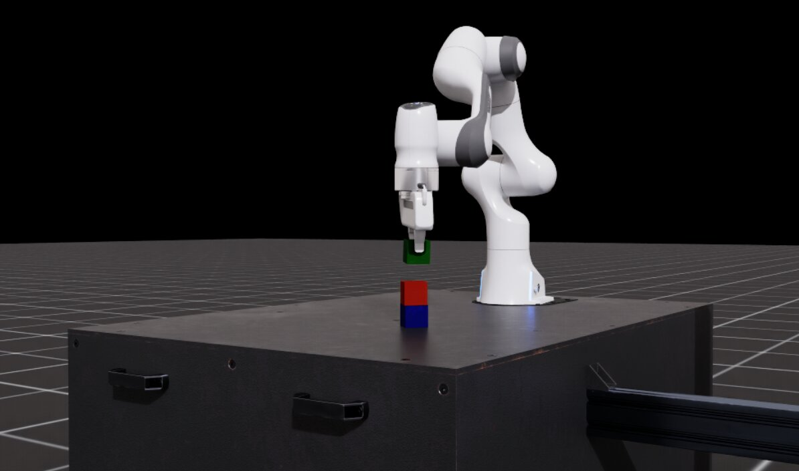

.. _teleoperation-imitation-learning:

Teleoperation and Imitation Learning with Isaac Lab Mimic
=========================================================

Teleoperation
~~~~~~~~~~~~~

We provide interfaces for providing commands in SE(2) and SE(3) space
for robot control. In case of SE(2) teleoperation, the returned command
is the linear x-y velocity and yaw rate, while in SE(3), the returned
command is a 6-D vector representing the change in pose.

.. note::

   Presently, Isaac Lab Mimic is only supported in Linux.

To play inverse kinematics (IK) control with a keyboard device:

.. code:: bash

   ./isaaclab.sh -p scripts/environments/teleoperation/teleop_se3_agent.py --task Isaac-Stack-Cube-Franka-IK-Rel-v0 --num_envs 1 --teleop_device keyboard

For smoother operation and off-axis operation, we recommend using a SpaceMouse as the input device. Providing smoother demonstrations will make it easier for the policy to clone the behavior. To use a SpaceMouse, simply change the teleop device accordingly:

.. code:: bash

   ./isaaclab.sh -p scripts/environments/teleoperation/teleop_se3_agent.py --task Isaac-Stack-Cube-Franka-IK-Rel-v0 --num_envs 1 --teleop_device spacemouse

.. note::

   If the SpaceMouse is not detected, you may need to grant additional user permissions by running ``sudo chmod 666 /dev/hidraw<#>`` where ``<#>`` corresponds to the device index
   of the connected SpaceMouse.

   To determine the device index, list all ``hidraw`` devices by running ``ls -l /dev/hidraw*``.
   Identify the device corresponding to the SpaceMouse by running ``cat /sys/class/hidraw/hidraw<#>/device/uevent`` on each of the devices listed
   from the prior step.

   We recommend using local deployment of Isaac Lab to use the SpaceMouse. If using container deployment (:ref:`deployment-docker`), you must manually mount the SpaceMouse to the ``isaac-lab-base`` container by
   adding a ``devices`` attribute with the path to the device in your ``docker-compose.yaml`` file:

   .. code:: yaml

      devices:
         - /dev/hidraw<#>:/dev/hidraw<#>

   where ``<#>`` is the device index of the connected SpaceMouse.

   If you are using the IsaacLab + CloudXR container deployment (:ref:`cloudxr-teleoperation`), you can add the ``devices`` attribute under the ``services -> isaac-lab-base`` section of the
   ``docker/docker-compose.cloudxr-runtime.patch.yaml`` file.

   Isaac Lab is only compatible with the SpaceMouse Wireless and SpaceMouse Compact models from 3Dconnexion.

For tasks that benefit from the use of an extended reality (XR) device with hand tracking, Isaac Lab supports using NVIDIA CloudXR to immersively stream the scene to compatible XR devices for teleoperation. Note that when using hand tracking we recommend using the absolute variant of the task (``Isaac-Stack-Cube-Franka-IK-Abs-v0``), which requires the ``handtracking`` device:

.. code:: bash

   ./isaaclab.sh -p scripts/environments/teleoperation/teleop_se3_agent.py --task Isaac-Stack-Cube-Franka-IK-Abs-v0 --visualizer kit --teleop_device handtracking

.. note::

   See :ref:`cloudxr-teleoperation` to learn how to use CloudXR and experience teleoperation with Isaac Lab.

The script prints the teleoperation events configured. For keyboard,
these are as follows:

.. code:: text

   Keyboard Controller for SE(3): Se3Keyboard
      Reset all commands: R
      Toggle gripper (open/close): K
      Move arm along x-axis: W/S
      Move arm along y-axis: A/D
      Move arm along z-axis: Q/E
      Rotate arm along x-axis: Z/X
      Rotate arm along y-axis: T/G
      Rotate arm along z-axis: C/V

For SpaceMouse, these are as follows:

.. code:: text

   SpaceMouse Controller for SE(3): Se3SpaceMouse
      Reset all commands: Right click
      Toggle gripper (open/close): Click the left button on the SpaceMouse
      Move arm along x/y-axis: Tilt the SpaceMouse
      Move arm along z-axis: Push or pull the SpaceMouse
      Rotate arm: Twist the SpaceMouse

The next section describes how teleoperation devices can be used for data collection for imitation learning.

Imitation Learning with Isaac Lab Mimic
~~~~~~~~~~~~~~~~~~~~~~~~~~~~~~~~~~~~~~~

What is Isaac Lab Mimic?
^^^^^^^^^^^^^^^^^^^^^^^^

Isaac Lab Mimic (Mimic) is a trajectory data generation tool that can be used to
augment human demonstrations by generating new synthetic data. Given a set of human demonstrations,
Mimic can automatically generate new demonstrations involving the same task but with different spatial configurations.
The generated data can be used to train imitation learning policies that are more robust to spatial variations
even if just a handful of manual demonstrations are available.

Mimic works by taking a set of human demonstrations and splitting each demonstration into a sequence of subtasks.
Subtasks are defined based on reference objects that dictate the motion of the robot's end-effectors (eefs). Each subtask
is a contiguous segment of the demonstration where the eef's motion is dictated by a single reference object. A new subtask begins
when the reference object changes. Annotations mark points in the demonstration where a subtask is completed.

During data generation, Mimic takes the human demonstration subtask segments and applies rigid body transformations to the robot's actions
to transform them into new demonstrations involving the same task but with different spatial configurations.
The new demonstrations are evaluated to determine if they are successful, and if so, are added to the output dataset.

Mimic is compatible with a variety of embodiments including single-eef (e.g. manipulator robots) and multi-eef (e.g. humanoid robots).
The use of rigid body transformations requires that the embodiment's action space is defined in **task space**. If
the embodiment's action is in joint space, then the action must be converted to task space using forward kinematics.

In the following section, we will show how to collect a small batch of human demonstrations for a stacking task
with the Franka robot and then increase the size of the dataset by generating new synthetic data using Isaac Lab Mimic.

Pre-recorded demonstrations
^^^^^^^^^^^^^^^^^^^^^^^^^^^

We provide a pre-recorded ``dataset.hdf5`` containing 10 human demonstrations for ``Isaac-Stack-Cube-Franka-IK-Rel-v0``
here: `[Franka Dataset] <https://omniverse-content-production.s3-us-west-2.amazonaws.com/Assets/Isaac/6.0/Isaac/IsaacLab/Mimic/franka_stack_datasets/dataset.hdf5>`__.
This dataset may be downloaded and used in the remaining tutorial steps if you do not wish to collect your own demonstrations.

If using the pre-recorded dataset, skip the next section and proceed directly to the :ref:`Generating additional demonstrations <generating-additional-demonstrations>` section.

.. note::
   Use of the pre-recorded dataset is optional.

Collecting demonstrations
^^^^^^^^^^^^^^^^^^^^^^^^^

To collect demonstrations with teleoperation for the environment ``Isaac-Stack-Cube-Franka-IK-Rel-v0``, use the following commands:

.. code:: bash

   #Create folder for datasets
   mkdir -p datasets

   # Collect data with a selected teleoperation device. Replace <teleop_device> with your preferred input device.
   # Recommended options: spacemouse, keyboard
   ./isaaclab.sh -p scripts/tools/record_demos.py --task Isaac-Stack-Cube-Franka-IK-Rel-v0 --visualizer kit --teleop_device <teleop_device> --dataset_file ./datasets/dataset.hdf5 --num_demos 10

.. note::

   The order of the stacked cubes should be blue (bottom), red (middle), green (top).

Collect 10 successful demonstrations before proceeding with the next step.

Here are some tips to perform demonstrations that lead to successful policy training:

* Keep demonstrations short. Shorter demonstrations mean fewer decisions for the policy, making training easier.
* Take a direct path. Do not follow along arbitrary axis, but move straight toward the goal.
* Do not pause. Perform smooth, continuous motions instead. It is not obvious for a policy why and when to pause, hence continuous motions are easier to learn.

If a mistake is made while performing a demonstration, press the ``R`` key (if using a keyboard) or the
right button (if using a SpaceMouse) to discard the current demonstration and reset to a new starting position.

.. _generating-additional-demonstrations:

Generating additional demonstrations with Isaac Lab Mimic
^^^^^^^^^^^^^^^^^^^^^^^^^^^^^^^^^^^^^^^^^^^^^^^^^^^^^^^^^

In the following example, we will show how to use Isaac Lab Mimic to generate additional demonstrations that can be used to train either a state-based policy
(using the ``Isaac-Stack-Cube-Franka-IK-Rel-Mimic-v0`` environment) or visuomotor policy (using the ``Isaac-Stack-Cube-Franka-IK-Rel-Visuomotor-Mimic-v0`` environment)
to teach a Franka robot to stack cubes.

Before generating additional demonstrations, the human demonstrations must first be annotated to define the boundary of each subtask.
Subtasks are defined for each end-effector (eef) and are segments in the demonstrations where the eef is performing an action relative to a specific object.
Any time the target object of the eef changes, a new subtask begins. For example, in the stacking task, the first subtask is to grasp the red cube
(eef motion is dictated by the red cube), while the second subtask is to stack the red cube on top of the blue cube (eef motion is dictated by the blue cube).
Subtasks can be annotated manually or (if the environment supports it) automatically using heuristics. For this tutorial, our environment
supports automatic annotation which will be used in the following step.

.. important::

   All commands in the following sections must keep a consistent policy type. For example, if choosing to use a state-based policy, then all commands used should be from the "State-based policy" tab.

Annotate the subtasks in the recording:

.. tab-set::
   :sync-group: policy_type

   .. tab-item:: State-based policy
      :sync: state

      .. code:: bash

         ./isaaclab.sh -p scripts/imitation_learning/isaaclab_mimic/annotate_demos.py \
         --task Isaac-Stack-Cube-Franka-IK-Rel-Mimic-v0 \
         --visualizer kit \
         --auto \
         --input_file ./datasets/dataset.hdf5 \
         --output_file ./datasets/annotated_dataset.hdf5

   .. tab-item:: Visuomotor policy
      :sync: visuomotor

      .. code:: bash

         ./isaaclab.sh -p scripts/imitation_learning/isaaclab_mimic/annotate_demos.py \
         --task Isaac-Stack-Cube-Franka-IK-Rel-Visuomotor-Mimic-v0 \
         --visualizer kit \
         --enable_cameras \
         --auto \
         --input_file ./datasets/dataset.hdf5 \
         --output_file ./datasets/annotated_dataset.hdf5

Next, use Isaac Lab Mimic to generate some additional demonstrations:

.. tab-set::
   :sync-group: policy_type

   .. tab-item:: State-based policy
      :sync: state

      .. code:: bash

         ./isaaclab.sh -p scripts/imitation_learning/isaaclab_mimic/generate_dataset.py \
         --visualizer kit \
         --num_envs 10 \
         --generation_num_trials 10 \
         --input_file ./datasets/annotated_dataset.hdf5 \
         --output_file ./datasets/generated_dataset_small.hdf5

   .. tab-item:: Visuomotor policy
      :sync: visuomotor

      .. code:: bash

         ./isaaclab.sh -p scripts/imitation_learning/isaaclab_mimic/generate_dataset.py \
         --visualizer kit \
         --enable_cameras \
         --num_envs 10 \
         --generation_num_trials 10 \
         --input_file ./datasets/annotated_dataset.hdf5 \
         --output_file ./datasets/generated_dataset_small.hdf5

.. figure:: ../../_static/mimic/franka_datagen.jpg
   :width: 100%
   :align: center
   :alt: Franka robot performing a stacking task
   :figclass: align-center

   Parallel data generation for the Franka robot stacking task.

.. note::

   The output_file of the ``annotate_demos.py`` script is the input_file to the ``generate_dataset.py`` script

Inspect the output of generated data (filename: ``generated_dataset_small.hdf5``), and if satisfactory, generate the full dataset:

.. tab-set::
   :sync-group: policy_type

   .. tab-item:: State-based policy
      :sync: state

      .. code:: bash

         ./isaaclab.sh -p scripts/imitation_learning/isaaclab_mimic/generate_dataset.py \
         --headless \
         --num_envs 10 \
         --generation_num_trials 1000 \
         --input_file ./datasets/annotated_dataset.hdf5 \
         --output_file ./datasets/generated_dataset.hdf5

   .. tab-item:: Visuomotor policy
      :sync: visuomotor

      .. code:: bash

         ./isaaclab.sh -p scripts/imitation_learning/isaaclab_mimic/generate_dataset.py \
         --visualizer kit \
         --enable_cameras \
         --headless \
         --num_envs 10 \
         --generation_num_trials 1000 \
         --input_file ./datasets/annotated_dataset.hdf5 \
         --output_file ./datasets/generated_dataset.hdf5

The number of demonstrations ``--generation_num_trials`` can be changed. 1000 demonstrations have been shown to provide good training results for this task.

The number of environments in the ``--num_envs`` parameter can be adjusted to speed up data generation.
The suggested number of 10 can be executed on a moderate laptop GPU.
On a more powerful desktop machine, use a larger number of environments for a significant speedup of this step.

Robomimic setup
^^^^^^^^^^^^^^^

Next, we will train a Behavior Cloning (BC) agent implemented in `Robomimic <https://robomimic.github.io/>`__ to demonstrate a policy.

To install the robomimic framework, use the following command:

.. code:: bash

   # install the dependencies
   sudo apt install cmake build-essential
   # install python module (for robomimic)
   ./isaaclab.sh -i robomimic

Training an agent
^^^^^^^^^^^^^^^^^

Using the Mimic generated data we can now train a state-based BC agent for ``Isaac-Stack-Cube-Franka-IK-Rel-v0``, or a visuomotor BC agent for ``Isaac-Stack-Cube-Franka-IK-Rel-Visuomotor-v0``:

.. tab-set::
   :sync-group: policy_type

   .. tab-item:: State-based policy
      :sync: state

      .. code:: bash

         ./isaaclab.sh -p scripts/imitation_learning/robomimic/train.py \
         --task Isaac-Stack-Cube-Franka-IK-Rel-v0 \
         --algo bc \
         --dataset ./datasets/generated_dataset.hdf5

   .. tab-item:: Visuomotor policy
      :sync: visuomotor

      .. code:: bash

         ./isaaclab.sh -p scripts/imitation_learning/robomimic/train.py \
         --task Isaac-Stack-Cube-Franka-IK-Rel-Visuomotor-v0 \
         --algo bc \
         --dataset ./datasets/generated_dataset.hdf5

.. note::
   By default the trained models and logs will be saved to ``IssacLab/logs/robomimic``.

Visualizing results
^^^^^^^^^^^^^^^^^^^

.. tip::

   **Important: Testing Multiple Checkpoint Epochs**

   When evaluating policy performance, it is common for different training epochs to yield different results.
   If you don't see the expected performance, **always test policies from various epochs** (not just the final checkpoint)
   to find the best-performing model. Model performance can vary substantially across training, and the final epoch
   is not always optimal.

Run a the trained policy to visualize the results:

.. tab-set::
   :sync-group: policy_type

   .. tab-item:: State-based policy
      :sync: state

      .. code:: bash

         ./isaaclab.sh -p scripts/imitation_learning/robomimic/play.py \
         --task Isaac-Stack-Cube-Franka-IK-Rel-v0 \
         --visualizer kit \
         --num_rollouts 50 \
         --checkpoint /PATH/TO/desired_model_checkpoint.pth

   .. tab-item:: Visuomotor policy
      :sync: visuomotor

      .. code:: bash

         ./isaaclab.sh -p scripts/imitation_learning/robomimic/play.py \
         --task Isaac-Stack-Cube-Franka-IK-Rel-Visuomotor-v0 \
         --visualizer kit \
         --enable_cameras \
         --num_rollouts 50 \
         --checkpoint /PATH/TO/desired_model_checkpoint.pth

.. note::

   **Expected Success Rates and Timings for Franka Cube Stack Task**

   * Data generation success rate: ~40% (for both state + visuomotor)
   * Data generation time: ~30 mins for state, ~4 hours for visuomotor (varies based on num envs the user runs)
   * BC RNN training time: 1000 epochs + ~30 mins (for state), 600 epochs + ~6 hours (for visuomotor)
   * BC RNN policy success rate: ~40-60% (for both state + visuomotor)
   * **Recommendation:** Evaluate checkpoints from various epochs throughout training to identify the best-performing model

Humanoid Examples
~~~~~~~~~~~~~~~~~

For examples of data generation and policy training with humanoid robots (GR-1, G1),
see the page: :ref:`Examples: Data Generation and Imitation Learning for Humanoids <data-generation-imitation-learning-humanoids>`.

.. _common-pitfalls-generating-data:

Common Pitfalls when Generating Data
~~~~~~~~~~~~~~~~~~~~~~~~~~~~~~~~~~~~

**Demonstrations are too long:**

* Longer time horizon is harder to learn for a policy
* Start close to the first object and minimize motions

**Demonstrations are not smooth:**

* Irregular motion is hard for policy to decipher
* Better teleop devices result in better data (i.e. SpaceMouse is better than Keyboard)

**Pauses in demonstrations:**

* Pauses are difficult to learn
* Keep the human motions smooth and fluid

**Excessive number of subtasks:**

* Minimize the number of defined subtasks for completing a given task
* Less subtacks results in less stitching of trajectories, yielding higher data generation success rate

**Lack of action noise:**

* Action noise makes policies more robust

**Recording cropped too tight:**

* If recording stops on the frame the success term triggers, it may not re-trigger during replay
* Allow for some buffer at the end of recording

**Non-deterministic replay:**

* Physics in IsaacLab are not deterministically reproducible when using ``env.reset`` so demonstrations may fail on replay
* Collect more human demos than needed, use the ones that succeed during annotation
* All data in Isaac Lab Mimic generated HDF5 file represent a successful demo and can be used for training (even if non-determinism causes failure when replayed)

Creating Your Own Isaac Lab Mimic Compatible Environments
~~~~~~~~~~~~~~~~~~~~~~~~~~~~~~~~~~~~~~~~~~~~~~~~~~~~~~~~~

How it works
^^^^^^^^^^^^

Isaac Lab Mimic works by splitting the input demonstrations into subtasks. Subtasks are user-defined segments in the demonstrations that are common to all demonstrations. Examples for subtasks are "grasp an object", "move end effector to some pre-defined position", "release object" etc.. Note that most subtasks are defined with respect to some object that the robot interacts with.

Subtasks need to be defined, and then annotated for each input demonstration. Annotation can either happen algorithmically by defining heuristics for subtask detection, as was done in the example above, or it can be done manually.

With subtasks defined and annotated, Isaac Lab Mimic utilizes a small number of helper methods to then transform the subtask segments, and generate new demonstrations by stitching them together to match the new task at hand.

For each thusly generated candidate demonstration, Isaac Lab Mimic uses a boolean success criteria to determine whether the demonstration succeeded in performing the task, and if so, add it to the output dataset. Success rate of candidate demonstrations can be as high as 70% in simple cases, and as low as <1%, depending on the difficulty of the task, and the complexity of the robot itself.

Configuration and subtask definition
^^^^^^^^^^^^^^^^^^^^^^^^^^^^^^^^^^^^

Subtasks, among other configuration settings for Isaac Lab Mimic, are defined in a Mimic compatible environment configuration class that is created by extending the existing environment config with additional Mimic required parameters.

All Mimic required config parameters are specified in the :class:`~isaaclab.envs.MimicEnvCfg` class.

The config class :class:`~isaaclab_mimic.envs.FrankaCubeStackIKRelMimicEnvCfg` serves as an example of creating a Mimic compatible environment config class for the Franka stacking task that was used in the examples above.

The ``DataGenConfig`` member contains various parameters that influence how data is generated. It is initially sufficient to just set the ``name`` parameter, and revise the rest later.

Subtasks are a list of :class:`~isaaclab.envs.SubTaskConfig` objects, of which the most important members are:

* ``object_ref`` is the object that is being interacted with. This will be used to adjust motions relative to this object during data generation. Can be ``None`` if the current subtask does not involve any object.
* ``subtask_term_signal`` is the ID of the signal indicating whether the subtask is active or not.

For multi end-effector environments, subtask ordering between end-effectors can be enforced by specifying subtask constraints. These constraints are defined in the :class:`~isaaclab.envs.SubTaskConstraintConfig` class.

Subtask annotation
^^^^^^^^^^^^^^^^^^

Once the subtasks are defined, they need to be annotated in the source data. There are two methods to annotate source demonstrations for subtask boundaries: Manual annotation or using heuristics.

It is often easiest to perform manual annotations, since the number of input demonstrations is usually very small. To perform manual annotations, use the ``annotate_demos.py`` script without the ``--auto`` flag. Then press ``B`` to pause, ``N`` to continue, and ``S`` to annotate a subtask boundary.

For more accurate boundaries, or to speed up repeated processing of a given task for experiments, heuristics can be implemented to perform the same task. Heuristics are observations in the environment. An example how to add subtask terms can be found in ``source/isaaclab_tasks/isaaclab_tasks/manager_based/manipulation/stack/stack_env_cfg.py``, where they are added as an observation group called ``SubtaskCfg``. This example is using prebuilt heuristics, but custom heuristics are easily implemented.

Helpers for demonstration generation
^^^^^^^^^^^^^^^^^^^^^^^^^^^^^^^^^^^^

Helpers needed for Isaac Lab Mimic are defined in the environment. All tasks that are to be used with Isaac Lab Mimic are derived from the :class:`~isaaclab.envs.ManagerBasedRLMimicEnv` base class, and must implement the following functions:

* ``get_robot_eef_pose``: Returns the current robot end effector pose in the same frame as used by the robot end effector controller.

* ``target_eef_pose_to_action``: Takes a target pose and a gripper action for the end effector controller and returns an action which achieves the target pose.

* ``action_to_target_eef_pose``: Takes an action and returns a target pose for the end effector controller.

* ``actions_to_gripper_actions``: Takes a sequence of actions and returns the gripper actuation part of the actions.

* ``get_object_poses``: Returns the pose of each object in the scene that is used for data generation.

* ``get_subtask_term_signals``: Returns a dictionary of binary flags for each subtask in a task. The flag of true is set when the subtask has been completed and false otherwise.

The class :class:`~isaaclab_mimic.envs.FrankaCubeStackIKRelMimicEnv` shows an example of creating a Mimic compatible environment from an existing Isaac Lab environment.

Registering the environment
^^^^^^^^^^^^^^^^^^^^^^^^^^^

Once both Mimic compatible environment and environment config classes have been created, a new Mimic compatible environment can be registered using ``gym.register``. For the Franka stacking task in the examples above, the Mimic environment is registered as ``Isaac-Stack-Cube-Franka-IK-Rel-Mimic-v0``.

The registered environment is now ready to be used with Isaac Lab Mimic.

Tips for Successful Data Generation with Isaac Lab Mimic
~~~~~~~~~~~~~~~~~~~~~~~~~~~~~~~~~~~~~~~~~~~~~~~~~~~~~~~~

Splitting subtasks
^^^^^^^^^^^^^^^^^^

A general rule of thumb is to split the task into as few subtasks as possible, while still being able to complete the task. Isaac Lab Mimic data generation uses linear interpolation to bridge and stitch together subtask segments.
More subtasks result in more stitching of trajectories which can result in less smooth motions and more failed demonstrations. For this reason, it is often best to annoatate subtask boundaries where the robot's motion is unlikely to collide with other objects.

For example, in the scenario below, there is a subtask partition after the robot's left arm grasps the object. On the left, the subtask annotation is marked immediately after the grasp, while on the right, the annotation is marked after the robot has grasped and lifted the object.
In the left case, the interpolation causes the robot's left arm to collide with the table and it's motion lags while on the right the motion is continuous and smooth.

.. figure:: https://download.isaacsim.omniverse.nvidia.com/isaaclab/images/lagging_subtask.gif
   :width: 99%
   :align: center
   :alt: Subtask splitting example
   :figclass: align-center

.. centered:: Motion lag/collision caused by poor subtask splitting (left)

Selecting number of interpolation steps
^^^^^^^^^^^^^^^^^^^^^^^^^^^^^^^^^^^^^^^

The number of interpolation steps between subtask segments can be specified in the :class:`~isaaclab.envs.SubTaskConfig` class. Once transformed, the subtask segments don't start/end at the same spot, thus to create a continuous motion, Isaac Lab Mimic
will apply linear interpolation between the last point of the previous subtask and the first point of the next subtask.

The number of interpolation steps can be tuned to control the smoothness of the generated demonstrations during this stitching process.
The appropriate number of interpolation steps depends on the speed of the robot and the complexity of the task. A complex task with a large object reset distribution will have larger gaps between subtask segments and require more interpolation steps to create a smooth motion.
Alternatively, a task with small gaps between subtask segments should use a small number of interpolation steps to avoid unnecessary motion lag caused by too many steps.

An example of how the number of interpolation steps can affect the generated demonstrations is shown below.
In the example, an interpolation is applied to the right arm of the robot to bridge the gap between the left arm's grasp and the right arm's placement. With 0 steps, the right arm exhibits a jerky jump in motion while with 20 steps, the motion is laggy. With 5 steps, the motion is
smooth and natural.

.. |0_interp_steps| image:: https://download.isaacsim.omniverse.nvidia.com/isaaclab/images/0_interpolation_steps.gif
   :width: 32%
   :alt: GR-1 robot with 0 interpolation steps

.. |5_interp_steps| image:: https://download.isaacsim.omniverse.nvidia.com/isaaclab/images/5_interpolation_steps.gif
   :width: 32%
   :alt: GR-1 robot with 5 interpolation steps

.. |20_interp_steps| image:: https://download.isaacsim.omniverse.nvidia.com/isaaclab/images/20_interpolation_steps.gif
   :width: 32%
   :alt: GR-1 robot with 20 interpolation steps

|0_interp_steps| |5_interp_steps| |20_interp_steps|

.. centered:: Left: 0 steps. Middle: 5 steps. Right: 20 steps.

.. _glossary-mimic-terminology:

Glossary
~~~~~~~~

.. glossary::

   Isaac Lab Mimic (Mimic)
      Tool for generating spatially new robot demonstrations from a small number of human demonstrations.

   Subtask
      A contiguous segment of a human demonstration where the robot's end-effector action is dictated by a single rigid object.

   Annotated Dataset
      An HDF5 dataset with human demonstrations marked with subtask completion boundaries.

   IK
      Inverse kinematics.

   FK
      Forward kinematics.

   Task Space Action
      A robot action defined in the robot's end-effector space given by spatial translation (XYZ) and orientation (quaternion or euler).

   State-based Policy
      A policy that takes state vectors as input and outputs a robot action.

   Visuomotor Policy:
      A policy that takes camera images as input and outputs a robot action.
