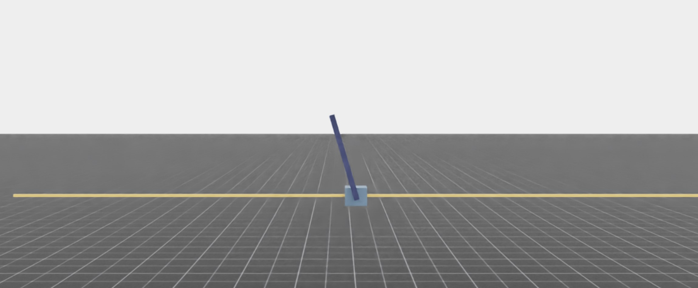

.. Copyright (c) 2022-2026, The Isaac Lab Project Developers (https://github.com/isaac-sim/IsaacLab/blob/main/CONTRIBUTORS.md).
.. All rights reserved.
..
.. SPDX-License-Identifier: BSD-3-Clause

Performance Benchmarks
======================

Isaac Lab leverages end-to-end GPU training for reinforcement learning workflows,
allowing for fast parallel training across thousands of environments.
In this section, we provide runtime performance benchmark results for reinforcement learning
training of various example environments on different GPU setups.
Multi-GPU and multi-node training performance results are also outlined.

Benchmark Results
-----------------

All benchmarking results were performed with the RL Games library in headless mode on Ubuntu 22.04.
``Isaac-Velocity-Rough-G1`` environment benchmarks were performed with the RSL RL library.
The PhysX backend was used for all benchmarks.

Memory Consumption
^^^^^^^^^^^^^^^^^^

+------------------------------------+----------------+-------------------+----------+-----------+
| Environment Name                   |                | # of Environments | RAM (GB) | VRAM (GB) |
+====================================+================+===================+==========+===========+
| Isaac-Cartpole-Direct              | |cartpole|     | 4096              | 3.7      | 3.3       |
+------------------------------------+----------------+-------------------+----------+-----------+
| Isaac-Cartpole-Camera-Direct       | |cartpole-cam| | 1024              | 7.5      | 16.7      |
+------------------------------------+----------------+-------------------+----------+-----------+
| Isaac-Velocity-Rough-G1            | |g1|           | 4096              | 6.5      | 6.1       |
+------------------------------------+----------------+-------------------+----------+-----------+
| Isaac-Reorient-Cube-Shadow-Direct  | |shadow|       | 8192              | 6.7      | 6.4       |
+------------------------------------+----------------+-------------------+----------+-----------+

.. |cartpole-cam| image:: ../../_static/benchmarks/cartpole_camera.jpg
    :width: 80
    :height: 45
.. |g1| image:: ../../_static/benchmarks/g1_rough.jpg
    :width: 80
    :height: 45
.. |shadow| image:: ../../_static/benchmarks/shadow.jpg
    :width: 80
    :height: 45

Single GPU - RTX 4090
^^^^^^^^^^^^^^^^^^^^^

CPU: AMD Ryzen 9 7950X 16-Core Processor

+-------------------------------------+-------------------+--------------+-------------------+--------------------+
| Environment Name                    | # of Environments | Environment  | Environment Step  | Environment Step,  |
|                                     |                   | Step FPS     | and               | Inference,         |
|                                     |                   |              | Inference FPS     | and Train FPS      |
+=====================================+===================+==============+===================+====================+
| Isaac-Cartpole-Direct               | 4096              | 1100000      | 910000            | 510000             |
+-------------------------------------+-------------------+--------------+-------------------+--------------------+
| Isaac-Cartpole-Camera-Direct        | 1024              | 50000        | 45000             | 32000              |
+-------------------------------------+-------------------+--------------+-------------------+--------------------+
| Isaac-Velocity-Rough-G1             | 4096              | 94000        | 88000             | 82000              |
+-------------------------------------+-------------------+--------------+-------------------+--------------------+
| Isaac-Reorient-Cube-Shadow-Direct   | 8192              | 200000       | 190000            | 170000             |
+-------------------------------------+-------------------+--------------+-------------------+--------------------+

Single GPU - L40
^^^^^^^^^^^^^^^^

CPU: Intel(R) Xeon(R) Platinum 8362 CPU @ 2.80GHz

+-------------------------------------+-------------------+--------------+-------------------+--------------------+
| Environment Name                    | # of Environments | Environment  | Environment Step  | Environment Step,  |
|                                     |                   | Step FPS     | and               | Inference,         |
|                                     |                   |              | Inference FPS     | and Train FPS      |
+=====================================+===================+==============+===================+====================+
| Isaac-Cartpole-Direct               | 4096              | 620000       | 490000            | 260000             |
+-------------------------------------+-------------------+--------------+-------------------+--------------------+
| Isaac-Cartpole-Camera-Direct        | 1024              | 30000        | 28000             | 21000              |
+-------------------------------------+-------------------+--------------+-------------------+--------------------+
| Isaac-Velocity-Rough-G1             | 4096              | 72000        | 64000             | 62000              |
+-------------------------------------+-------------------+--------------+-------------------+--------------------+
| Isaac-Reorient-Cube-Shadow-Direct   | 8192              | 170000       | 140000            | 120000             |
+-------------------------------------+-------------------+--------------+-------------------+--------------------+

Single-Node, 4 x L40 GPUs
^^^^^^^^^^^^^^^^^^^^^^^^^

CPU: Intel(R) Xeon(R) Platinum 8362 CPU @ 2.80GHz

+-------------------------------------+-------------------+--------------+-------------------+--------------------+
| Environment Name                    | # of Environments | Environment  | Environment Step  | Environment Step,  |
|                                     |                   | Step FPS     | and               | Inference,         |
|                                     |                   |              | Inference FPS     | and Train FPS      |
+=====================================+===================+==============+===================+====================+
| Isaac-Cartpole-Direct               | 4096              | 2700000      | 2100000           | 950000             |
+-------------------------------------+-------------------+--------------+-------------------+--------------------+
| Isaac-Cartpole-Camera-Direct        | 1024              | 130000       | 120000            | 90000              |
+-------------------------------------+-------------------+--------------+-------------------+--------------------+
| Isaac-Velocity-Rough-G1             | 4096              | 290000       | 270000            | 250000             |
+-------------------------------------+-------------------+--------------+-------------------+--------------------+
| Isaac-Reorient-Cube-Shadow-Direct   | 8192              | 440000       | 420000            | 390000             |
+-------------------------------------+-------------------+--------------+-------------------+--------------------+

4 Nodes, 4 x L40 GPUs per node
^^^^^^^^^^^^^^^^^^^^^^^^^^^^^^

CPU: Intel(R) Xeon(R) Platinum 8362 CPU @ 2.80GHz

+-------------------------------------+-------------------+--------------+-------------------+--------------------+
| Environment Name                    | # of Environments | Environment  | Environment Step  | Environment Step,  |
|                                     |                   | Step FPS     | and               | Inference,         |
|                                     |                   |              | Inference FPS     | and Train FPS      |
+=====================================+===================+==============+===================+====================+
| Isaac-Cartpole-Direct               | 4096              | 10200000     | 8200000           | 3500000            |
+-------------------------------------+-------------------+--------------+-------------------+--------------------+
| Isaac-Cartpole-Camera-Direct        | 1024              | 530000       | 490000            | 260000             |
+-------------------------------------+-------------------+--------------+-------------------+--------------------+
| Isaac-Velocity-Rough-G1             | 4096              | 1200000      | 1100000           | 960000             |
+-------------------------------------+-------------------+--------------+-------------------+--------------------+
| Isaac-Reorient-Cube-Shadow-Direct   | 8192              | 2400000      | 2300000           | 1800000            |
+-------------------------------------+-------------------+--------------+-------------------+--------------------+

Run these workloads
-------------------

Use the supported workflows in :ref:`developer_tools_benchmarking` to reproduce
these workload types. Record the task, backend, CPU, GPU, software revision,
environment count, seed, warm-up, and measured window with every result.
