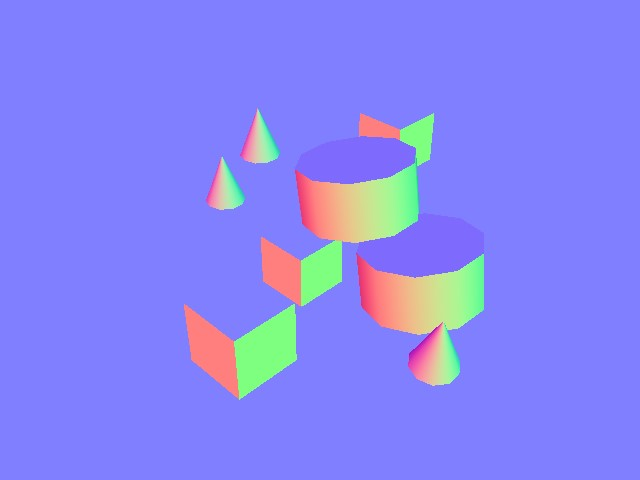
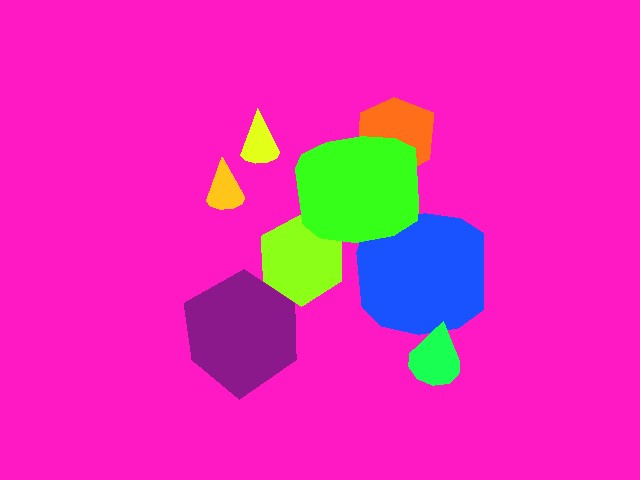
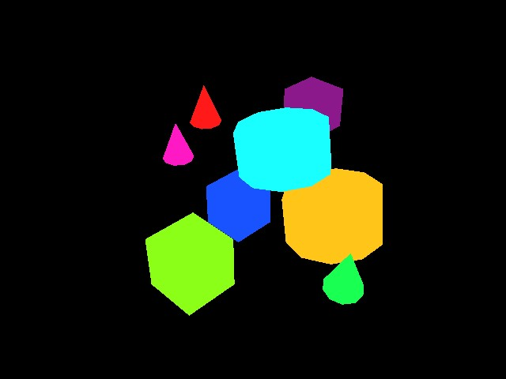

.. _overview_sensors_camera:

Camera
========

Camera sensors are uniquely defined by the use of the ``render_product``, a structure for managing data generated by the rendering pipeline (images). Isaac Lab provides the ability to fully control how these renderings are created through camera parameters like focal length, pose, type, etc... and what kind of data you want to render through the use of Annotators, allowing you to record not only RGB, but also Instance segmentation, object pose, object ID, etc...

Rendered images are unique among the supported data types in Isaac Lab due to the inherently large bandwidth requirements for moving those data. A single 800 x 600 image with 32-bit color (a single float per pixel) clocks in at just under 2 MB. If we render at 60 fps and record every frame, that camera needs to move 120 MB/s. Multiply this by the number of cameras in an environment and environments in a simulation, and you can quickly see how scaling a naive vectorization of camera data could lead to bandwidth challenges. NVIDIA's Isaac Lab leverages our expertise in GPU hardware to provide an API that specifically addresses these scaling challenges in the rendering pipeline.

Tiled Rendering
~~~~~~~~~~~~~~~~~

.. note::

    This feature is only available from Isaac Sim version 4.2.0 onwards.

    Tiled rendering in combination with image processing networks require heavy memory resources, especially
    at larger resolutions. We recommend running 512 cameras in the scene on RTX 4090 GPUs or similar.

The Tiled Rendering APIs provide a vectorized interface for collecting data from camera sensors. This is useful for reinforcement learning environments where parallelization can be exploited to accelerate data collection and thus the training loop. Tiled rendering works by using a single ``render_product`` for **all** clones of a single camera in the scene. The desired dimensions of a single image and the number of environments are used to compute a much larger ``render_product``, consisting of the tiled individual renders from the separate clones of the camera. When all cameras have populated their buffers the render product is "completed" and can be moved around as a single, large image, dramatically reducing the overhead for moving the data from the host to the device, for example.  Only a single call is used to synchronize the device data, instead of one call per camera, and this is a big part of what makes the Tiled Rendering API more efficient for working with vision data.

Isaac Lab provides tiled rendering APIs for RGB, depth, along with other annotators through the :class:`~sensors.TiledCamera` class. Configurations for the tiled rendering APIs can be defined through the :class:`~sensors.TiledCameraCfg` class, specifying parameters such as the regex expression for all camera paths, the transform for the cameras, the desired data type, the type of cameras to add to the scene, and the camera resolution.

.. code-block:: python

    tiled_camera: TiledCameraCfg = TiledCameraCfg(
        prim_path="/World/envs/env_.*/Camera",
        offset=TiledCameraCfg.OffsetCfg(pos=(-7.0, 0.0, 3.0), rot=(0.9945, 0.0, 0.1045, 0.0), convention="world"),
        data_types=["rgb"],
        spawn=sim_utils.PinholeCameraCfg(
            focal_length=24.0, focus_distance=400.0, horizontal_aperture=20.955, clipping_range=(0.1, 20.0)
        ),
        width=80,
        height=80,
    )

To access the tiled rendering interface, a :class:`~sensors.TiledCamera` object can be created and used to retrieve data from the cameras.

.. code-block:: python

    tiled_camera = TiledCamera(cfg.tiled_camera)
    data_type = "rgb"
    data = tiled_camera.data.output[data_type]

The returned data will be transformed into the shape (num_cameras, height, width, num_channels), which can be used directly as observation for reinforcement learning.

When working with rendering, make sure to add the ``--enable_cameras`` argument when launching the environment. For example:

.. code-block:: shell

    python scripts/reinforcement_learning/rl_games/train.py --task=Isaac-Cartpole-RGB-Camera-Direct-v0 --headless --enable_cameras

Annotators
~~~~~~~~~~~~~~~~~

Both :class:`~sensors.TiledCamera` and :class:`~sensors.Camera` classes provide APIs for retrieving various types annotator data from replicator:

* ``"rgb"``: A 3-channel rendered color image.
* ``"rgba"``: A 4-channel rendered color image with alpha channel.
* ``"distance_to_camera"``: An image containing the distance to camera optical center.
* ``"distance_to_image_plane"``: An image containing distances of 3D points from camera plane along camera's z-axis.
* ``"depth"``: The same as ``"distance_to_image_plane"``.
* ``"normals"``: An image containing the local surface normal vectors at each pixel.
* ``"motion_vectors"``: An image containing the motion vector data at each pixel.
* ``"semantic_segmentation"``: The semantic segmentation data.
* ``"instance_segmentation_fast"``: The instance segmentation data.
* ``"instance_id_segmentation_fast"``: The instance id segmentation data.

RGB and RGBA
~~~~~~~~~~~~

.. figure:: ../../_static/overview/overview_sensors_rgb.jpg
    :align: center
    :figwidth: 100%
    :alt: A scene captured in RGB

``rgb`` data type returns a 3-channel RGB colored image of type ``torch.uint8``, with dimension (B, H, W, 3).

``rgba`` data type returns a 4-channel RGBA colored image of type ``torch.uint8``, with dimension (B, H, W, 4).

To convert the ``torch.uint8`` data to ``torch.float32``, divide the buffer by 255.0 to obtain a ``torch.float32`` buffer containing data from 0 to 1.

Depth and Distances
~~~~~~~~~~~~~~~~~~~

.. figure:: ../../_static/overview/overview_sensors_depth.jpg
    :align: center
    :figwidth: 100%
    :alt: A scene captured in RGB

``distance_to_camera`` returns a single-channel depth image with distance to the camera optical center. The dimension for this annotator is (B, H, W, 1) and has type ``torch.float32``.

``distance_to_image_plane`` returns a single-channel depth image with distances of 3D points from the camera plane along the camera's Z-axis. The dimension for this annotator is (B, H, W, 1) and has type ``torch.float32``.

``depth`` is provided as an alias for ``distance_to_image_plane`` and will return the same data as the ``distance_to_image_plane`` annotator, with dimension (B, H, W, 1) and type ``torch.float32``.

Normals
~~~~~~~

``normals`` returns an image containing the local surface normal vectors at each pixel. The buffer has dimension (B, H, W, 3), containing the (x, y, z) information for each vector, and has data type ``torch.float32``.

Motion Vectors
~~~~~~~~~~~~~~

``motion_vectors`` returns the per-pixel motion vectors in image space, with a 2D array of motion vectors representing the relative motion of a pixel in the camera’s viewport between frames. The buffer has dimension (B, H, W, 2), representing x - the motion distance in the horizontal axis (image width) with movement to the left of the image being positive and movement to the right being negative and y - motion distance in the vertical axis (image height) with movement towards the top of the image being positive and movement to the bottom being negative. The data type is ``torch.float32``.

Semantic Segmentation
~~~~~~~~~~~~~~~~~~~~~

.. figure:: ../../_static/overview/overview_sensors_semantic.jpg
    :align: center
    :figwidth: 100%
    :alt: A scene captured in RGB

``semantic_segmentation`` outputs semantic segmentation of each entity in the camera’s viewport that has semantic labels. In addition to the image buffer, an ``info`` dictionary can be retrieved with ``tiled_camera.data.info['semantic_segmentation']`` containing ID to labels information.

- If ``colorize_semantic_segmentation=True`` in the camera config, a 4-channel RGBA image will be returned with dimension (B, H, W, 4) and type ``torch.uint8``. The info ``idToLabels`` dictionary will be the mapping from color to semantic labels.

- If ``colorize_semantic_segmentation=False``, a buffer of dimension (B, H, W, 1) of type ``torch.int32`` will be returned, containing the semantic ID of each pixel. The info ``idToLabels`` dictionary will be the mapping from semantic ID to semantic labels.

Instance ID Segmentation
~~~~~~~~~~~~~~~~~~~~~~~~

``instance_id_segmentation_fast`` outputs instance ID segmentation of each entity in the camera’s viewport. The instance ID is unique for each prim in the scene with different paths. In addition to the image buffer, an ``info`` dictionary can be retrieved with ``tiled_camera.data.info['instance_id_segmentation_fast']`` containing ID to labels information.

The main difference between ``instance_id_segmentation_fast`` and ``instance_segmentation_fast`` are that instance segmentation annotator goes down the hierarchy to the lowest level prim which has semantic labels, where instance ID segmentation always goes down to the leaf prim.

- If ``colorize_instance_id_segmentation=True`` in the camera config, a 4-channel RGBA image will be returned with dimension (B, H, W, 4) and type ``torch.uint8``. The info ``idToLabels`` dictionary will be the mapping from color to USD prim path of that entity.

- If ``colorize_instance_id_segmentation=False``, a buffer of dimension (B, H, W, 1) of type ``torch.int32`` will be returned, containing the instance ID of each pixel. The info ``idToLabels`` dictionary will be the mapping from instance ID to USD prim path of that entity.

Instance Segmentation
"""""""""""""""""""""

``instance_segmentation_fast`` outputs instance segmentation of each entity in the camera’s viewport. In addition to the image buffer, an ``info`` dictionary can be retrieved with ``tiled_camera.data.info['instance_segmentation_fast']`` containing ID to labels and ID to semantic information.

- If ``colorize_instance_segmentation=True`` in the camera config, a 4-channel RGBA image will be returned with dimension (B, H, W, 4) and type ``torch.uint8``.

- If ``colorize_instance_segmentation=False``, a buffer of dimension (B, H, W, 1) of type ``torch.int32`` will be returned, containing the instance ID of each pixel.

The info ``idToLabels`` dictionary will be the mapping from color to USD prim path of that semantic entity. The info ``idToSemantics`` dictionary will be the mapping from color to semantic labels of that semantic entity.

Current Limitations
-------------------

For performance reasons, we default to using DLSS for denoising, which generally provides better performance.
This may result in renders of lower quality, which may be especially evident at lower resolutions.
Due to this, we recommend using per-tile or per-camera resolution of at least 100 x 100.
For renders at lower resolutions, we advice setting the ``antialiasing_mode`` attribute in :class:`~sim.RenderCfg` to
``DLAA``, and also potentially enabling ``enable_dl_denoiser``. Both of these settings should help improve render
quality, but also comes at a cost of performance. Additional rendering parameters can also be specified in :class:`~sim.RenderCfg`.
