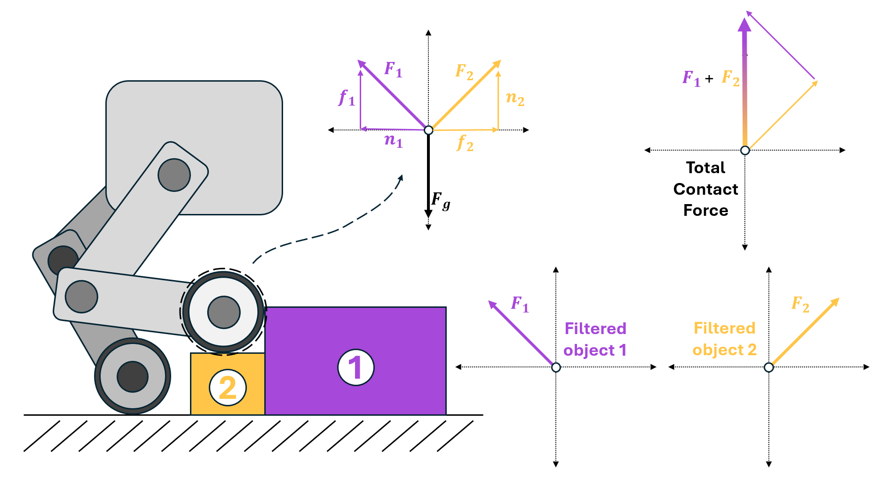

.. _overview_sensors_contact:

Contact Sensor
================

The contact sensor is designed to return the net contact force acting on a given ridgid body. The sensor is written to behave as a physical object, and so the "scope" of the contact sensor is limited to the body (or bodies) that defines it. There are multiple ways to define this scope, depending on your need to filter the forces coming from the contact.

By default, the reported force is the total contact force, but your application may only care about contact forces due to specific objects. Retrieving contact forces from specific objects requires filtering, and this can only be done in a "many-to-one" way. A multi-legged robot that needs filterable contact information for its feet would require one sensor per foot to be defined in the environment, but a robotic hand with contact sensors on the tips of each finger can be defined with a single sensor.

Consider a simple environment with an Anymal Quadruped and a block

.. code-block:: python

  @configclass
  class ContactSensorsSceneCfg(InteractiveSceneCfg):
      """Design the scene with sensors on the robot."""

      # ground plane
      ground = AssetBaseCfg(prim_path="/World/defaultGroundPlane", spawn=sim_utils.GroundPlaneCfg())

      # lights
      dome_light = AssetBaseCfg(
          prim_path="/World/Light", spawn=sim_utils.DomeLightCfg(intensity=3000.0, color=(0.75, 0.75, 0.75))
      )

      # robot
      robot = ANYMAL_C_CFG.replace(prim_path="{ENV_REGEX_NS}/Robot")

      # Rigid Object
      cube = RigidObjectCfg(
          prim_path="{ENV_REGEX_NS}/Cube",
          spawn=sim_utils.CuboidCfg(
              size=(0.5,0.5,0.1),
              rigid_props=sim_utils.RigidBodyPropertiesCfg(),
              mass_props=sim_utils.MassPropertiesCfg(mass=100.0),
              collision_props=sim_utils.CollisionPropertiesCfg(),
              physics_material=sim_utils.RigidBodyMaterialCfg(static_friction=1.0),
              visual_material=sim_utils.PreviewSurfaceCfg(diffuse_color=(0.0, 1.0, 0.0), metallic=0.2),
          ),
          init_state=RigidObjectCfg.InitialStateCfg(pos=(0.5, 0.5, 0.05)),
      )

      contact_forces_LF = ContactSensorCfg(
          prim_path="{ENV_REGEX_NS}/Robot/LF_FOOT",
          update_period=0.0,
          history_length=6,
          debug_vis=True,
          filter_prim_paths_expr=["{ENV_REGEX_NS}/Cube"],
      )

      contact_forces_RF = ContactSensorCfg(
          prim_path="{ENV_REGEX_NS}/Robot/RF_FOOT",
          update_period=0.0,
          history_length=6,
          debug_vis=True,
          filter_prim_paths_expr=["{ENV_REGEX_NS}/Cube"],
      )

      contact_forces_H = ContactSensorCfg(
          prim_path="{ENV_REGEX_NS}/Robot/.*H_FOOT",
          update_period=0.0,
          history_length=6,
          debug_vis=True,
      )

We define the sensors on the feet of the robot in two different ways.  The front feet are independent sensors (one sensor body per foot) and the "Cube" is placed under the left foot.  The hind feet are defined as a single sensor with multiple bodies.

We can then run the scene and print the data from the sensors

.. code-block:: python

  def run_simulator(sim: sim_utils.SimulationContext, scene: InteractiveScene):
    .
    .
    .
    # Simulate physics
    while simulation_app.is_running():
      .
      .
      .
      # print information from the sensors
      print("-------------------------------")
      print(scene["contact_forces_LF"])
      print("Received force matrix of: ", scene["contact_forces_LF"].data.force_matrix_w)
      print("Received contact force of: ", scene["contact_forces_LF"].data.net_forces_w)
      print("-------------------------------")
      print(scene["contact_forces_RF"])
      print("Received force matrix of: ", scene["contact_forces_RF"].data.force_matrix_w)
      print("Received contact force of: ", scene["contact_forces_RF"].data.net_forces_w)
      print("-------------------------------")
      print(scene["contact_forces_H"])
      print("Received force matrix of: ", scene["contact_forces_H"].data.force_matrix_w)
      print("Received contact force of: ", scene["contact_forces_H"].data.net_forces_w)

Here, we print both the net contact force and the filtered force matrix for each contact sensor defined in the scene. The front left and front right feet report the following

.. code-block:: bash

  -------------------------------
  Contact sensor @ '/World/envs/env_.*/Robot/LF_FOOT':
          view type         : <class 'omni.physics.tensors.impl.api.RigidBodyView'>
          update period (s) : 0.0
          number of bodies  : 1
          body names        : ['LF_FOOT']

  Received force matrix of:  tensor([[[[-1.3923e-05,  1.5727e-04,  1.1032e+02]]]], device='cuda:0')
  Received contact force of:  tensor([[[-1.3923e-05,  1.5727e-04,  1.1032e+02]]], device='cuda:0')
  -------------------------------
  Contact sensor @ '/World/envs/env_.*/Robot/RF_FOOT':
          view type         : <class 'omni.physics.tensors.impl.api.RigidBodyView'>
          update period (s) : 0.0
          number of bodies  : 1
          body names        : ['RF_FOOT']

  Received force matrix of:  tensor([[[[0., 0., 0.]]]], device='cuda:0')
  Received contact force of:  tensor([[[1.3529e-05, 0.0000e+00, 1.0069e+02]]], device='cuda:0')

Notice that even with filtering, both sensors report the net contact force acting on the foot. However only the left foot has a non zero "force matrix", because the right foot isn't standing on the filtered body, ``/World/envs/env_.*/Cube``. Now, checkout the data coming from the hind feet!

.. code-block:: bash

  -------------------------------
  Contact sensor @ '/World/envs/env_.*/Robot/.*H_FOOT':
          view type         : <class 'omni.physics.tensors.impl.api.RigidBodyView'>
          update period (s) : 0.0
          number of bodies  : 2
          body names        : ['LH_FOOT', 'RH_FOOT']

  Received force matrix of:  None
  Received contact force of:  tensor([[[9.7227e-06, 0.0000e+00, 7.2364e+01],
          [2.4322e-05, 0.0000e+00, 1.8102e+02]]], device='cuda:0')

In this case, the contact sensor has two bodies: the left and right hind feet.  When the force matrix is queried, the result is ``None`` because this is a many body sensor, and presently Isaac Lab only supports "many to one" contact force filtering. Unlike the single body contact sensor, the reported force tensor has multiple entries, with each "row" corresponding to the contact force on a single body of the sensor (matching the ordering at construction).

.. code-block:: python

  # Copyright (c) 2022-2024, The Isaac Lab Project Developers.
  # All rights reserved.
  #
  # SPDX-License-Identifier: BSD-3-Clause

  """Launch Isaac Sim Simulator first."""

  import argparse

  from omni.isaac.lab.app import AppLauncher

  # add argparse arguments
  parser = argparse.ArgumentParser(description="Tutorial on adding sensors on a robot.")
  parser.add_argument("--num_envs", type=int, default=1, help="Number of environments to spawn.")
  # append AppLauncher cli args
  AppLauncher.add_app_launcher_args(parser)
  # parse the arguments
  args_cli = parser.parse_args()

  # launch omniverse app
  app_launcher = AppLauncher(args_cli)
  simulation_app = app_launcher.app

  """Rest everything follows."""

  import torch

  import omni.isaac.lab.sim as sim_utils
  from omni.isaac.lab.assets import ArticulationCfg, AssetBaseCfg, RigidObjectCfg, RigidObject
  from omni.isaac.lab.scene import InteractiveScene, InteractiveSceneCfg
  from omni.isaac.lab.sensors import ContactSensorCfg
  from omni.isaac.lab.utils import configclass

  ##
  # Pre-defined configs
  ##
  from omni.isaac.lab_assets.anymal import ANYMAL_C_CFG  # isort: skip

  @configclass
  class ContactSensorSceneCfg(InteractiveSceneCfg):
      """Design the scene with sensors on the robot."""

      # ground plane
      ground = AssetBaseCfg(prim_path="/World/defaultGroundPlane", spawn=sim_utils.GroundPlaneCfg())

      # lights
      dome_light = AssetBaseCfg(
          prim_path="/World/Light", spawn=sim_utils.DomeLightCfg(intensity=3000.0, color=(0.75, 0.75, 0.75))
      )

      # robot
      robot = ANYMAL_C_CFG.replace(prim_path="{ENV_REGEX_NS}/Robot")

      # Rigid Object
      cube = RigidObjectCfg(
          prim_path="{ENV_REGEX_NS}/Cube",
          spawn=sim_utils.CuboidCfg(
              size=(0.5,0.5,0.1),
              rigid_props=sim_utils.RigidBodyPropertiesCfg(),
              mass_props=sim_utils.MassPropertiesCfg(mass=100.0),
              collision_props=sim_utils.CollisionPropertiesCfg(),
              physics_material=sim_utils.RigidBodyMaterialCfg(static_friction=1.0),
              visual_material=sim_utils.PreviewSurfaceCfg(diffuse_color=(0.0, 1.0, 0.0), metallic=0.2),
          ),
          init_state=RigidObjectCfg.InitialStateCfg(pos=(0.5, 0.5, 0.05)),
      )

      contact_forces_LF = ContactSensorCfg(
          prim_path="{ENV_REGEX_NS}/Robot/LF_FOOT",
          update_period=0.0,
          history_length=6,
          debug_vis=True,
          filter_prim_paths_expr=["{ENV_REGEX_NS}/Cube"],
      )

      contact_forces_RF = ContactSensorCfg(
          prim_path="{ENV_REGEX_NS}/Robot/RF_FOOT",
          update_period=0.0,
          history_length=6,
          debug_vis=True,
          filter_prim_paths_expr=["{ENV_REGEX_NS}/Cube"],
      )

      contact_forces_H = ContactSensorCfg(
          prim_path="{ENV_REGEX_NS}/Robot/.*H_FOOT",
          update_period=0.0,
          history_length=6,
          debug_vis=True,
      )

  def run_simulator(sim: sim_utils.SimulationContext, scene: InteractiveScene):
      """Run the simulator."""
      # Define simulation stepping
      sim_dt = sim.get_physics_dt()
      sim_time = 0.0
      count = 0

      # Simulate physics
      while simulation_app.is_running():

          if count % 500 == 0:
              # reset counter
              count = 0
              # reset the scene entities
              # root state
              # we offset the root state by the origin since the states are written in simulation world frame
              # if this is not done, then the robots will be spawned at the (0, 0, 0) of the simulation world
              root_state = scene["robot"].data.default_root_state.clone()
              root_state[:, :3] += scene.env_origins
              scene["robot"].write_root_state_to_sim(root_state)
              # set joint positions with some noise
              joint_pos, joint_vel = (
                  scene["robot"].data.default_joint_pos.clone(),
                  scene["robot"].data.default_joint_vel.clone(),
              )
              joint_pos += torch.rand_like(joint_pos) * 0.1
              scene["robot"].write_joint_state_to_sim(joint_pos, joint_vel)
              # clear internal buffers
              scene.reset()
              print("[INFO]: Resetting robot state...")
          # Apply default actions to the robot
          # -- generate actions/commands
          targets = scene["robot"].data.default_joint_pos
          # -- apply action to the robot
          scene["robot"].set_joint_position_target(targets)
          # -- write data to sim
          scene.write_data_to_sim()
          # perform step
          sim.step()
          # update sim-time
          sim_time += sim_dt
          count += 1
          # update buffers
          scene.update(sim_dt)

          # print information from the sensors
          print("-------------------------------")
          print(scene["contact_forces_LF"])
          print("Received force matrix of: ", scene["contact_forces_LF"].data.force_matrix_w)
          print("Received contact force of: ", scene["contact_forces_LF"].data.net_forces_w)
          print("-------------------------------")
          print(scene["contact_forces_RF"])
          print("Received force matrix of: ", scene["contact_forces_RF"].data.force_matrix_w)
          print("Received contact force of: ", scene["contact_forces_RF"].data.net_forces_w)
          print("-------------------------------")
          print(scene["contact_forces_H"])
          print("Received force matrix of: ", scene["contact_forces_H"].data.force_matrix_w)
          print("Received contact force of: ", scene["contact_forces_H"].data.net_forces_w)

  def main():
      """Main function."""

      # Initialize the simulation context
      sim_cfg = sim_utils.SimulationCfg(dt=0.005, device=args_cli.device)
      sim = sim_utils.SimulationContext(sim_cfg)
      # Set main camera
      sim.set_camera_view(eye=[3.5, 3.5, 3.5], target=[0.0, 0.0, 0.0])
      # design scene
      scene_cfg = ContactSensorSceneCfg(num_envs=args_cli.num_envs, env_spacing=2.0)
      scene = InteractiveScene(scene_cfg)
      # Play the simulator
      sim.reset()
      # Now we are ready!
      print("[INFO]: Setup complete...")
      # Run the simulator
      run_simulator(sim, scene)

  if __name__ == "__main__":
      # run the main function
      main()
      # close sim app
      simulation_app.close()
