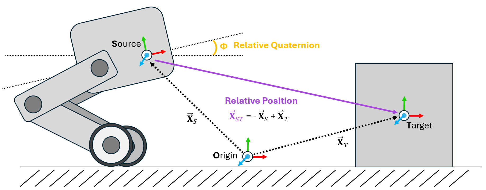
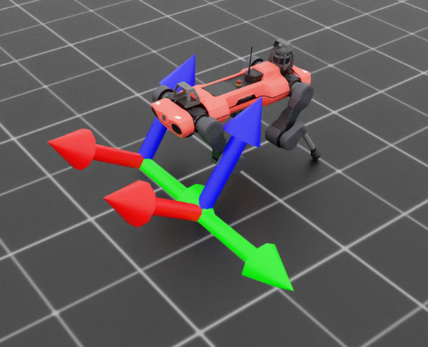

.. _overview_sensors_frame_transformer:

Frame Transformer
====================

..
  Do YOU want to know where things are relative to other things at a glance?  Then the frame transformer is the sensor for you!*

One of the most common operations that needs to be performed within a physics simulation is the frame transformation: rewriting a vector or quaternion in the basis of an arbitrary euclidean coordinate system. There are many ways to accomplish this within Isaac and USD, but these methods can be cumbersome to implement within Isaac Lab's GPU based simulation and cloned environments. To mitigate this problem, we have designed the Frame Transformer Sensor, that tracks and calculate the relative frame transformations for rigid bodies of interest to the scene.

The sensory is minimally defined by a source frame and a list of target frames.  These definitions take the form of a prim path (for the source) and list of regex capable prim paths the rigid bodies to be tracked (for the targets).

.. code-block:: python

  @configclass
  class FrameTransformerSensorSceneCfg(InteractiveSceneCfg):
      """Design the scene with sensors on the robot."""

      # ground plane
      ground = AssetBaseCfg(prim_path="/World/defaultGroundPlane", spawn=sim_utils.GroundPlaneCfg())

      # lights
      dome_light = AssetBaseCfg(
          prim_path="/World/Light", spawn=sim_utils.DomeLightCfg(intensity=3000.0, color=(0.75, 0.75, 0.75))
      )

      # robot
      robot = ANYMAL_C_CFG.replace(prim_path="{ENV_REGEX_NS}/Robot")

      # Rigid Object
      cube = RigidObjectCfg(
          prim_path="{ENV_REGEX_NS}/Cube",
          spawn=sim_utils.CuboidCfg(
              size=(1,1,1),
              rigid_props=sim_utils.RigidBodyPropertiesCfg(),
              mass_props=sim_utils.MassPropertiesCfg(mass=100.0),
              collision_props=sim_utils.CollisionPropertiesCfg(),
              physics_material=sim_utils.RigidBodyMaterialCfg(static_friction=1.0),
              visual_material=sim_utils.PreviewSurfaceCfg(diffuse_color=(0.0, 1.0, 0.0), metallic=0.2),
          ),
          init_state=RigidObjectCfg.InitialStateCfg(pos=(5, 0, 0.5)),
      )

      specific_transforms = FrameTransformerCfg(
          prim_path="{ENV_REGEX_NS}/Robot/base",
          target_frames=[
              FrameTransformerCfg.FrameCfg(prim_path="{ENV_REGEX_NS}/Robot/LF_FOOT"),
              FrameTransformerCfg.FrameCfg(prim_path="{ENV_REGEX_NS}/Robot/RF_FOOT"),
          ],
          debug_vis=True,
      )

      cube_transform = FrameTransformerCfg(
          prim_path="{ENV_REGEX_NS}/Robot/base",
          target_frames=[
              FrameTransformerCfg.FrameCfg(prim_path="{ENV_REGEX_NS}/Cube")
          ],
          debug_vis=False,
      )

      robot_transforms = FrameTransformerCfg(
          prim_path="{ENV_REGEX_NS}/Robot/base",
          target_frames=[
              FrameTransformerCfg.FrameCfg(prim_path="{ENV_REGEX_NS}/Robot/.*")
          ],
          debug_vis=False,
      )

We can now run the scene and query the sensor for data

.. code-block:: python

  def run_simulator(sim: sim_utils.SimulationContext, scene: InteractiveScene):
    .
    .
    .
    # Simulate physics
    while simulation_app.is_running():
      .
      .
      .

      # print information from the sensors
      print("-------------------------------")
      print(scene["specific_transforms"])
      print("relative transforms:", scene["specific_transforms"].data.target_pos_source)
      print("relative orientations:", scene["specific_transforms"].data.target_quat_source)
      print("-------------------------------")
      print(scene["cube_transform"])
      print("relative transform:", scene["cube_transform"].data.target_pos_source)
      print("-------------------------------")
      print(scene["robot_transforms"])
      print("relative transforms:", scene["robot_transforms"].data.target_pos_source)

Let's take a look at the result for tracking specific objects. First, we can take a look at the data coming from the sensors on the feet

.. code-block:: bash

  -------------------------------
  FrameTransformer @ '/World/envs/env_.*/Robot/base':
          tracked body frames: ['base', 'LF_FOOT', 'RF_FOOT']
          number of envs: 1
          source body frame: base
          target frames (count: ['LF_FOOT', 'RF_FOOT']): 2

  relative transforms: tensor([[[ 0.4658,  0.3085, -0.4840],
          [ 0.4487, -0.2959, -0.4828]]], device='cuda:0')
  relative orientations: tensor([[[ 0.9623,  0.0072, -0.2717, -0.0020],
          [ 0.9639,  0.0052, -0.2663, -0.0014]]], device='cuda:0')

By activating the visualizer, we can see that the frames of the feet are rotated "upward" slightly.  We can also see the explicit relative positions and rotations by querying the sensor for data, which returns these values as a list with the same order as the tracked frames.  This becomes even more apparent if we examine the transforms specified by regex.

.. code-block:: bash

  -------------------------------
  FrameTransformer @ '/World/envs/env_.*/Robot/base':
          tracked body frames: ['base', 'LF_FOOT', 'LF_HIP', 'LF_SHANK', 'LF_THIGH', 'LH_FOOT', 'LH_HIP', 'LH_SHANK', 'LH_THIGH', 'RF_FOOT', 'RF_HIP', 'RF_SHANK', 'RF_THIGH', 'RH_FOOT', 'RH_HIP', 'RH_SHANK', 'RH_THIGH', 'base']
          number of envs: 1
          source body frame: base
          target frames (count: ['LF_FOOT', 'LF_HIP', 'LF_SHANK', 'LF_THIGH', 'LH_FOOT', 'LH_HIP', 'LH_SHANK', 'LH_THIGH', 'RF_FOOT', 'RF_HIP', 'RF_SHANK', 'RF_THIGH', 'RH_FOOT', 'RH_HIP', 'RH_SHANK', 'RH_THIGH', 'base']): 17

  relative transforms: tensor([[[ 4.6581e-01,  3.0846e-01, -4.8398e-01],
          [ 2.9990e-01,  1.0400e-01, -1.7062e-09],
          [ 2.1409e-01,  2.9177e-01, -2.4214e-01],
          [ 3.5980e-01,  1.8780e-01,  1.2608e-03],
          [-4.8813e-01,  3.0973e-01, -4.5927e-01],
          [-2.9990e-01,  1.0400e-01,  2.7044e-09],
          [-2.1495e-01,  2.9264e-01, -2.4198e-01],
          [-3.5980e-01,  1.8780e-01,  1.5582e-03],
          [ 4.4871e-01, -2.9593e-01, -4.8277e-01],
          [ 2.9990e-01, -1.0400e-01, -2.7057e-09],
          [ 1.9971e-01, -2.8554e-01, -2.3778e-01],
          [ 3.5980e-01, -1.8781e-01, -9.1049e-04],
          [-5.0090e-01, -2.9095e-01, -4.5746e-01],
          [-2.9990e-01, -1.0400e-01,  6.3592e-09],
          [-2.1860e-01, -2.8251e-01, -2.5163e-01],
          [-3.5980e-01, -1.8779e-01, -1.8792e-03],
          [ 0.0000e+00,  0.0000e+00,  0.0000e+00]]], device='cuda:0')

Here, the sensor is tracking all rigid body children of ``Robot/base``, but this expression is **inclusive**, meaning that the source body itself is also a target. This can be seen both by examining the source and target list, where ``base`` appears twice, and also in the returned data, where the sensor returns the relative transform to itself, (0, 0, 0).

.. code-block:: python

    # Copyright (c) 2022-2024, The Isaac Lab Project Developers.
    # All rights reserved.
    #
    # SPDX-License-Identifier: BSD-3-Clause

    import argparse

    from omni.isaac.lab.app import AppLauncher

    # add argparse arguments
    parser = argparse.ArgumentParser(description="Tutorial on adding sensors on a robot.")
    parser.add_argument("--num_envs", type=int, default=1, help="Number of environments to spawn.")
    # append AppLauncher cli args
    AppLauncher.add_app_launcher_args(parser)
    # parse the arguments
    args_cli = parser.parse_args()

    # launch omniverse app
    app_launcher = AppLauncher(args_cli)
    simulation_app = app_launcher.app

    """Rest everything follows."""

    import torch

    import omni.isaac.lab.sim as sim_utils
    from omni.isaac.lab.assets import ArticulationCfg, AssetBaseCfg, RigidObjectCfg, RigidObject
    from omni.isaac.lab.scene import InteractiveScene, InteractiveSceneCfg
    from omni.isaac.lab.sensors import FrameTransformer, FrameTransformerCfg, OffsetCfg
    from omni.isaac.lab.utils import configclass

    ##
    # Pre-defined configs
    ##
    from omni.isaac.lab_assets.anymal import ANYMAL_C_CFG  # isort: skip

    @configclass
    class FrameTransformerSensorSceneCfg(InteractiveSceneCfg):
        """Design the scene with sensors on the robot."""

        # ground plane
        ground = AssetBaseCfg(prim_path="/World/defaultGroundPlane", spawn=sim_utils.GroundPlaneCfg())

        # lights
        dome_light = AssetBaseCfg(
            prim_path="/World/Light", spawn=sim_utils.DomeLightCfg(intensity=3000.0, color=(0.75, 0.75, 0.75))
        )

        # robot
        robot = ANYMAL_C_CFG.replace(prim_path="{ENV_REGEX_NS}/Robot")

        # Rigid Object
        cube = RigidObjectCfg(
            prim_path="{ENV_REGEX_NS}/Cube",
            spawn=sim_utils.CuboidCfg(
                size=(1,1,1),
                rigid_props=sim_utils.RigidBodyPropertiesCfg(),
                mass_props=sim_utils.MassPropertiesCfg(mass=100.0),
                collision_props=sim_utils.CollisionPropertiesCfg(),
                physics_material=sim_utils.RigidBodyMaterialCfg(static_friction=1.0),
                visual_material=sim_utils.PreviewSurfaceCfg(diffuse_color=(0.0, 1.0, 0.0), metallic=0.2),
            ),
            init_state=RigidObjectCfg.InitialStateCfg(pos=(5, 0, 0.5)),
        )

        specific_transforms = FrameTransformerCfg(
            prim_path="{ENV_REGEX_NS}/Robot/base",
            target_frames=[
                FrameTransformerCfg.FrameCfg(prim_path="{ENV_REGEX_NS}/Robot/LF_FOOT"),
                FrameTransformerCfg.FrameCfg(prim_path="{ENV_REGEX_NS}/Robot/RF_FOOT"),
            ],
            debug_vis=True,
        )

        cube_transform = FrameTransformerCfg(
            prim_path="{ENV_REGEX_NS}/Robot/base",
            target_frames=[
                FrameTransformerCfg.FrameCfg(prim_path="{ENV_REGEX_NS}/Cube")
            ],
            debug_vis=False,
        )

        robot_transforms = FrameTransformerCfg(
            prim_path="{ENV_REGEX_NS}/Robot/base",
            target_frames=[
                FrameTransformerCfg.FrameCfg(prim_path="{ENV_REGEX_NS}/Robot/.*")
            ],
            debug_vis=False,
        )

    def run_simulator(sim: sim_utils.SimulationContext, scene: InteractiveScene):
        """Run the simulator."""
        # Define simulation stepping
        sim_dt = sim.get_physics_dt()
        sim_time = 0.0
        count = 0

        # Simulate physics
        while simulation_app.is_running():

            if count % 500 == 0:
                # reset counter
                count = 0
                # reset the scene entities
                # root state
                # we offset the root state by the origin since the states are written in simulation world frame
                # if this is not done, then the robots will be spawned at the (0, 0, 0) of the simulation world
                root_state = scene["robot"].data.default_root_state.clone()
                root_state[:, :3] += scene.env_origins
                scene["robot"].write_root_state_to_sim(root_state)
                # set joint positions with some noise
                joint_pos, joint_vel = (
                    scene["robot"].data.default_joint_pos.clone(),
                    scene["robot"].data.default_joint_vel.clone(),
                )
                joint_pos += torch.rand_like(joint_pos) * 0.1
                scene["robot"].write_joint_state_to_sim(joint_pos, joint_vel)
                # clear internal buffers
                scene.reset()
                print("[INFO]: Resetting robot state...")
            # Apply default actions to the robot
            # -- generate actions/commands
            targets = scene["robot"].data.default_joint_pos
            # -- apply action to the robot
            scene["robot"].set_joint_position_target(targets)
            # -- write data to sim
            scene.write_data_to_sim()
            # perform step
            sim.step()
            # update sim-time
            sim_time += sim_dt
            count += 1
            # update buffers
            scene.update(sim_dt)

            # print information from the sensors
            print("-------------------------------")
            print(scene["specific_transforms"])
            print("relative transforms:", scene["specific_transforms"].data.target_pos_source)
            print("relative orientations:", scene["specific_transforms"].data.target_quat_source)
            print("-------------------------------")
            print(scene["cube_transform"])
            print("relative transform:", scene["cube_transform"].data.target_pos_source)
            print("-------------------------------")
            print(scene["robot_transforms"])
            print("relative transforms:", scene["robot_transforms"].data.target_pos_source)
    def main():
        """Main function."""

        # Initialize the simulation context
        sim_cfg = sim_utils.SimulationCfg(dt=0.005, device=args_cli.device)
        sim = sim_utils.SimulationContext(sim_cfg)
        # Set main camera
        sim.set_camera_view(eye=[3.5, 3.5, 3.5], target=[0.0, 0.0, 0.0])
        # design scene
        scene_cfg = FrameTransformerSensorSceneCfg(num_envs=args_cli.num_envs, env_spacing=2.0)
        scene = InteractiveScene(scene_cfg)
        # Play the simulator
        sim.reset()
        # Now we are ready!
        print("[INFO]: Setup complete...")
        # Run the simulator
        run_simulator(sim, scene)

    if __name__ == "__main__":
        # run the main function
        main()
        # close sim app
        simulation_app.close()
