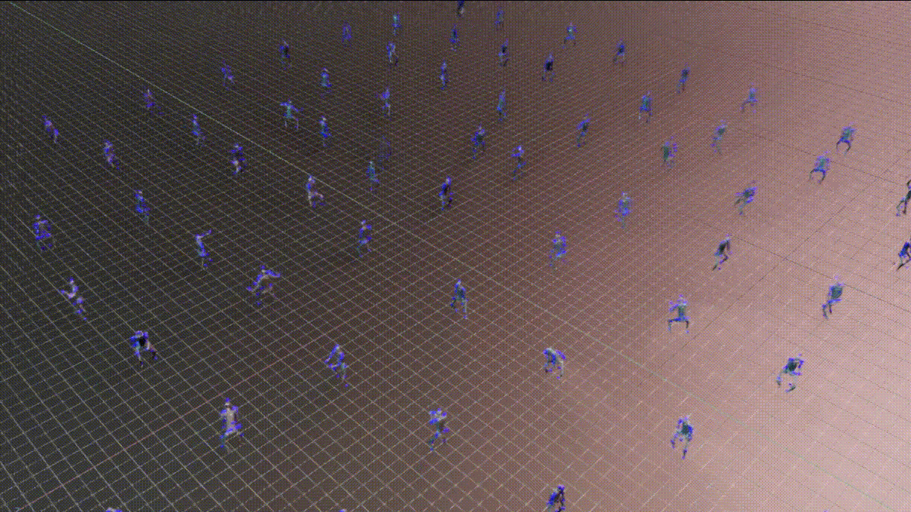
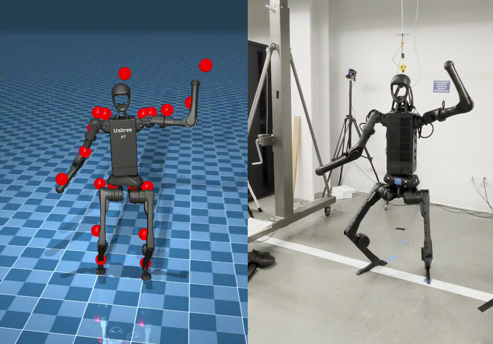

Training & Deploying HOVER Policy
=================================

This tutorial shows you an example of how to train and deploy HOVER which is a whole-body control (WBC) policy for humanoid robots in the Isaac Lab simulation environment.
It uses the `HOVER`_ repository, which provides an Isaac Lab extension for training neural whole-body control policy for humanoids, as described in the `HOVER Paper`_ and `OMNIH2O Paper`_ papers.
For video demonstrations and more details about the project, please visit the `HOVER Project Website`_ and the `OMNIH2O Project Website`_.

Installation
------------

.. note::

   This tutorial is for linux only.

   HOVER supports Isaac Lab 2.0 and Isaac Sim 4.5. Please ensure you have the correct version of Isaac Lab and Isaac Sim installed to run the HOVER workflow.

1. Install Isaac Lab following the instructions in the `Isaac Lab Installation Guide`_.

2. Define the following environment variable to specify the path to your Isaac Lab installation:

.. code-block:: bash

    # Set the ISAACLAB_PATH environment variable to point to your Isaac Lab installation directory
    export ISAACLAB_PATH=<your_isaac_lab_path>

3. Clone the `HOVER`_ repository and its submodules in your workspace.

.. code-block:: bash

    git clone --recurse-submodules https://github.com/NVlabs/HOVER.git

4. Install the dependencies.

.. code-block:: bash

    cd HOVER
    ./install_deps.sh

Training the Policy
-------------------

Dataset
~~~~~~~
Refer to the `HOVER Dataset`_ repository for the steps to obtain and process data for training the policy.

Training the teacher policy
~~~~~~~~~~~~~~~~~~~~~~~~~~~
Execute the following command from the ``HOVER`` directory to train the teacher policy.

.. code-block:: bash

    ${ISAACLAB_PATH:?}/isaaclab.sh -p scripts/rsl_rl/train_teacher_policy.py \
        --num_envs 1024 \
        --reference_motion_path neural_wbc/data/data/motions/stable_punch.pkl \
        --headless

The teacher policy is trained for 10000000 iterations, or until the user interrupts the training.
The resulting checkpoint is stored in ``neural_wbc/data/data/policy/h1:teacher/`` and the filename is ``model_<iteration_number>.pt``.

Training the student policy
~~~~~~~~~~~~~~~~~~~~~~~~~~~
Execute the following command from the ``HOVER`` directory to train the student policy using teacher policy checkpoint.

.. code-block:: bash

    ${ISAACLAB_PATH:?}/isaaclab.sh -p scripts/rsl_rl/train_student_policy.py \
        --num_envs 1024 \
        --reference_motion_path neural_wbc/data/data/motions/stable_punch.pkl \
        --teacher_policy.resume_path neural_wbc/data/data/policy/h1:teacher \
        --teacher_policy.checkpoint model_<iteration_number>.pt \
        --headless

This assumes that you have already trained the teacher policy as there is no provided teacher policy in the repo.

Please refer to these sections on the HOVER repository for more details about training configurations:
    - `General Remarks for Training`_
    - `Generalist vs Specialist Policy`_

Testing the trained policy
--------------------------

Play teacher policy
~~~~~~~~~~~~~~~~~~~
Execute the following command from the ``HOVER`` directory to play the trained teacher policy checkpoint.

.. code-block:: bash

    ${ISAACLAB_PATH:?}/isaaclab.sh -p scripts/rsl_rl/play.py \
        --num_envs 10 \
        --reference_motion_path neural_wbc/data/data/motions/stable_punch.pkl \
        --teacher_policy.resume_path neural_wbc/data/data/policy/h1:teacher \
        --teacher_policy.checkpoint model_<iteration_number>.pt

Play student policy
~~~~~~~~~~~~~~~~~~~
Execute the following command from the ``HOVER`` directory to play the trained student policy checkpoint.

.. code-block:: bash

    ${ISAACLAB_PATH:?}/isaaclab.sh -p scripts/rsl_rl/play.py \
        --num_envs 10 \
        --reference_motion_path neural_wbc/data/data/motions/stable_punch.pkl \
        --student_player \
        --student_path neural_wbc/data/data/policy/h1:student \
        --student_checkpoint model_<iteration_number>.pt

Evaluate the trained policy
---------------------------
Evaluate the trained policy checkpoint in the Isaac Lab environment.
The evaluation iterates through all the reference motions included in the dataset specified by the ``--reference_motion_path`` option and exits when all motions are evaluated. Randomization is turned off during evaluation.

Refer to the `HOVER Evaluation`_ repository for more details about the evaluation pipeline and the metrics used.

The evaluation script, ``scripts/rsl_rl/eval.py``, uses the same arguments as the play script, ``scripts/rsl_rl/play.py``. You can use it for both teacher and student policies.

.. code-block:: bash

    ${ISAACLAB_PATH}/isaaclab.sh -p scripts/rsl_rl/eval.py \
    --num_envs 10 \
    --teacher_policy.resume_path neural_wbc/data/data/policy/h1:teacher \
    --teacher_policy.checkpoint model_<iteration_number>.pt

Validation of the policy
------------------------
The trained policy in Isaac Lab can be validated in another simulation environment or on the real robot.

    Stable Wave - Mujoco (left) & Real Robot (right)

Sim-to-Sim Validation
~~~~~~~~~~~~~~~~~~~~~
Use the provided `Mujoco Environment`_ for conducting sim-to-sim validation of the trained policy. To run the evaluation of Sim2Sim,

.. code-block:: bash

    ${ISAACLAB_PATH:?}/isaaclab.sh -p neural_wbc/inference_env/scripts/eval.py \
        --num_envs 1 \
        --headless \
        --student_path neural_wbc/data/data/policy/h1:student/ \
        --student_checkpoint model_<iteration_number>.pt

Please be aware that the mujoco_wrapper only supports one environment at a time. For reference, it will take up to 5h to evaluate 8k reference motions. The inference_env is designed for maximum versatility.

Sim-to-Real Deployment
~~~~~~~~~~~~~~~~~~~~~~
For sim-to-real deployment, we provide a `Hardware Environment`_ for `Unitree H1 Robot`_.
Detailed steps of setting up a Sim-to-Real deployment workflow is explained at `README of Sim2Real deployment`_.

To deploy the trained policy on the H1 robot,

.. code-block:: bash

    ${ISAACLAB_PATH:?}/isaaclab.sh -p neural_wbc/inference_env/scripts/s2r_player.py \
        --student_path neural_wbc/data/data/policy/h1:student/ \
        --student_checkpoint model_<iteration_number>.pt \
        --reference_motion_path neural_wbc/data/data/motions/<motion_name>.pkl \
        --robot unitree_h1 \
        --max_iterations 5000 \
        --num_envs 1 \
        --headless

.. note::

    The sim-to-real deployment wrapper currently only supports the Unitree H1 robot. It can be extended to other robots by implementing the corresponding hardware wrapper interface.

.. _Isaac Lab Installation Guide: https://isaac-sim.github.io/IsaacLab/v2.0.0/source/setup/installation/index.html
.. _HOVER: https://github.com/NVlabs/HOVER
.. _HOVER Dataset: https://github.com/NVlabs/HOVER/?tab=readme-ov-file#data-processing
.. _HOVER Evaluation: https://github.com/NVlabs/HOVER/?tab=readme-ov-file#evaluation
.. _General Remarks for Training: https://github.com/NVlabs/HOVER/?tab=readme-ov-file#general-remarks-for-training
.. _Generalist vs Specialist Policy: https://github.com/NVlabs/HOVER/?tab=readme-ov-file#generalist-vs-specialist-policy
.. _HOVER Paper: https://arxiv.org/abs/2410.21229
.. _HOVER Project Website: https://omni.human2humanoid.com/
.. _OMNIH2O Paper: https://arxiv.org/abs/2410.21229
.. _OMNIH2O Project Website: https://hover-versatile-humanoid.github.io/
.. _README of Sim2Real deployment: https://github.com/NVlabs/HOVER/blob/main/neural_wbc/hw_wrappers/README.md
.. _Hardware Environment: https://github.com/NVlabs/HOVER/blob/main/neural_wbc/hw_wrappers/README.md
.. _Mujoco Environment: https://github.com/NVlabs/HOVER/tree/main/neural_wbc/mujoco_wrapper
.. _Unitree H1 Robot: https://unitree.com/h1
