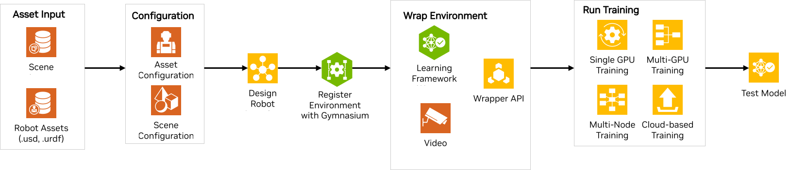
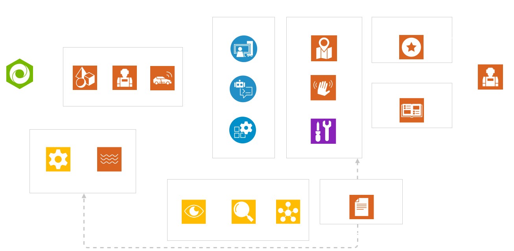
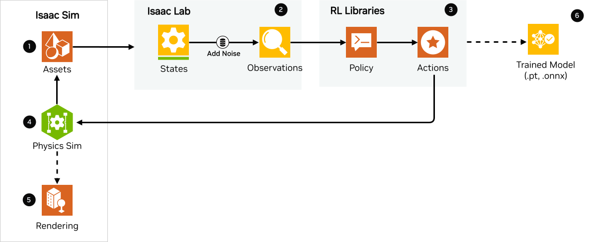
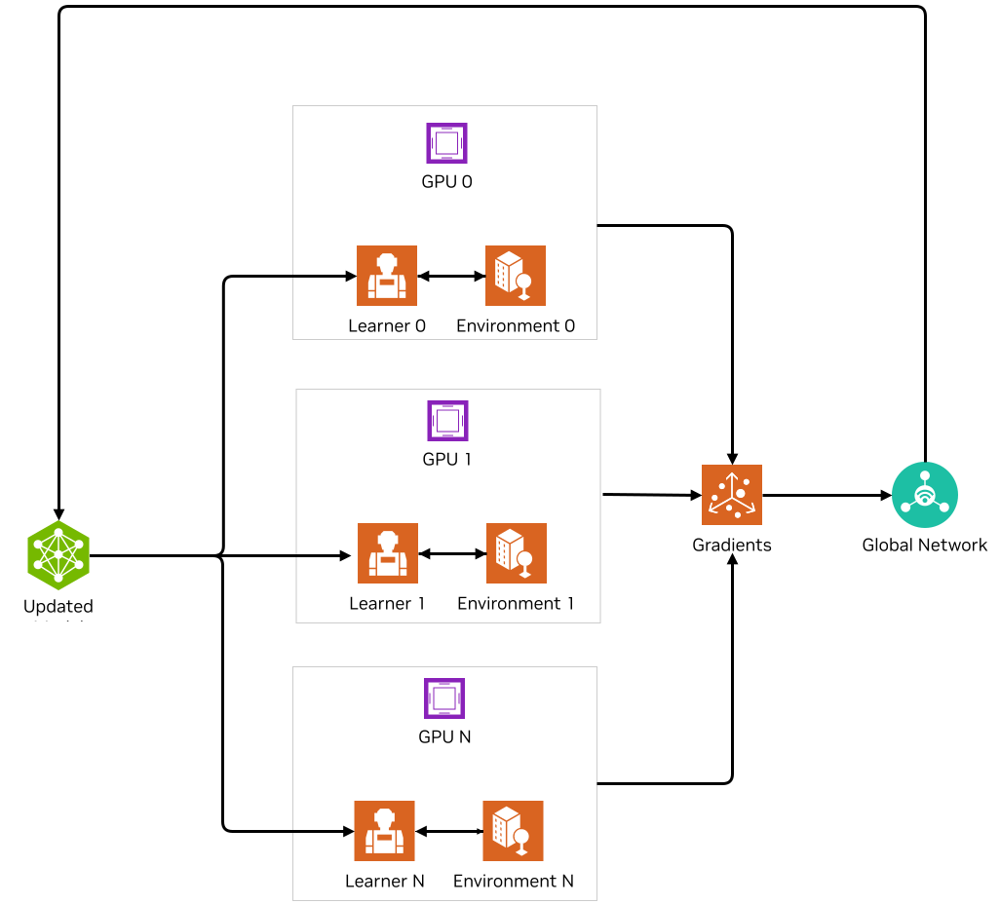
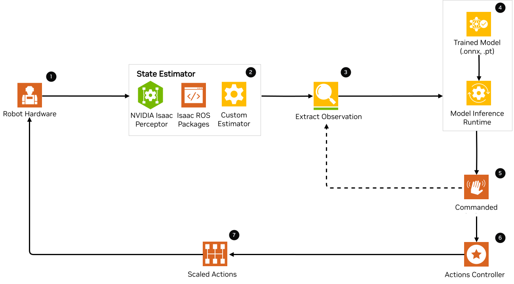

.. _ref_arch:

Reference Architecture
======================

This document presents an overview of the end-to-end robot learning process with
Isaac Lab and Isaac Sim. This is demonstrated using a reference architecture that highlights
the major building blocks for training and deployment workflows. It provides a comprehensive,
user-friendly guide on the entire process of developing applications from training to deploying
the trained model in the real world, including links to demos, working examples, and documentation.

Who is this document for?
~~~~~~~~~~~~~~~~~~~~~~~~~~

This document is designed to assist robotics developers and researchers working with NVIDIA Isaac Lab
in the robot learning field, including those at research labs, Original Equipment Manufacturers (OEM),
Solutions Providers, Solutions Integrators (SI),  and independent software vendors (ISV). It offers
guidance on utilizing Isaac Lab’s robot training framework and workflows as a foundational starting
point for environment configuration, task design, and policy training and testing.

.. image:: ../../_static/reference-architecture/isaac-lab-ra-dark.svg
    :class: only-dark
    :align: center
    :alt: Isaac Lab Reference Architecture

|

The reference architecture for Isaac Lab comprises the following components:

1. :ref:`Asset Input<ra-asset-input>`
2. :ref:`Configuration - Assets & Scene<ra-configuration>`
3. :ref:`Robot Learning Task Design<ra-robot-learning-task-design>`
4. :ref:`Register with Gymnasium<ra-register-gym>`
5. :ref:`Environment Wrapping<ra-env-wrap>`
6. :ref:`Run Training<ra-run-training>`
7. :ref:`Run Testing<ra-run-testing>`

Components
~~~~~~~~~~~
In this section, we will briefly discuss the individual blocks for creating a
sample reference application in Isaac Lab.

.. _ra-asset-input:

Component 1 - Asset Input
---------------------------
Isaac Lab accepts URDF, MJCF XML or USD files for the assets. The first step to training using Isaac Lab is to
have the USD file of your asset and the USD or URDF file of your robot. This can be achieved in
the following ways:

1. Design your assets or robot in Isaac Sim and export the USD file.

2. Design your assets or robot in any software of your choice and export it to USD using Isaac Sim converters. Isaac Sim supports the different converters/importers to USD such as the `CAD Converter`_, `URDF Importer`_, `MJCF Importer`_, `Onshape Importer`_, etc. More details are found in the `Importing Assets section`_ in the `Isaac Sim Reference Architecture`_.

3. If you already have the URDF or MJCF file of your robot, you do not need to convert to USD as Isaac Lab takes URDF and MJCF XML.

.. _ra-configuration:

Component 2 -  Configuration (Assets and Scene)
------------------------------------------------------

Asset Configuration
^^^^^^^^^^^^^^^^^^^^^^^^

Given that you have the asset file for your robot and other assets such as environment objects based on the task, the next step is to import them into Isaac Lab. Isaac Lab uses asset configuration classes to spawn various objects (or prims) into the scene using Python. The first step is to write a configuration class to define the properties for the assets needed to complete the task. For example, a simple go-to-goal task for a mobile robot will include the robot asset, an object like cubes to signify the goal pose visually, lights, ground plane, etc. Isaac Lab understands these assets using the configuration classes. Isaac Lab provides various sim-ready assets such as physically accurate
3D objects that encompass accurate physical properties and behavior. It also provides connected data streams to represent the real world in simulated digital worlds such as `robots <https://github.com/isaac-sim/IsaacLab/tree/main/source/isaaclab_assets/isaaclab_assets>`__
like ANYbotics Anymal, Unitree H1 Humanoid, etc. as well as `sensors <https://github.com/isaac-sim/IsaacLab/tree/main/source/isaaclab/isaaclab/sensors>`__. We provide these assets configuration classes. Users can also define their own assets using the configuration classes.

Follow the tutorial on `how to write an Articulation and ArticulationCfg class <https://isaac-sim.github.io/IsaacLab/main/source/how-to/write_articulation_cfg.html>`__.

Scene Configuration
^^^^^^^^^^^^^^^^^^^^^^^^

Given the individual asset configurations, the next step is to put all the assets together into a
scene. The scene configuration is a simple config class that initializes all the assets in the
scene that are needed for the task and for visualization. This is an example for the
`Cartpole example scene configuration <https://isaac-sim.github.io/IsaacLab/main/source/tutorials/02_scene/create_scene.html#scene-configuration>`__,
which includes the cartpole, ground plane, and dome light.

.. _ra-robot-learning-task-design:

Component 3 - Robot Learning Task Design
------------------------------------------------------
Now, we have the scene for the task, but we need to define the robot learning task. We will focus on
`reinforcement learning (RL) <https://www.andrew.cmu.edu/course/10-703/textbook/BartoSutton.pdf>`__ algorithm here. We define the RL task
that the agent is going to do. RL tasks are defined as a Markov Decision Process (MDP),
which is a stochastic decision-making process where optional decisions are made for the agents
considering their current state and environment they interact with. The environment provides the
agents’ current state or observations, and executes the actions provided by the agent.
The environment responds to the agents by providing the next states, reward of taking the
action, done flag and information about the current episode. Therefore, different components
of the MDP formulation (the environment) – states, actions, rewards, reset, done, etc. — must
be defined by the user for the agent to perform the given task.

In Isaac Lab, we provide two different workflows for designing environments.

Manager-based
^^^^^^^^^^^^^^^^^
.. image:: ../../_static/task-workflows/manager-based-light.svg
    :class: only-light
    :align: center
    :alt: Manager-based Task Workflow

This workflow is modular, and the environment is decomposed into individual components (or managers)
that handle the different aspects of the environment, such as computing observations,
applying actions, and applying randomization. As a user, you define different configuration classes
for each component.

- An RL task should have the following configuration classes:

  - Observations Config: Defines the agents’ observations for the task.
  - Actions Config: Defines the agent’s action type, i.e. how the output of the agent are mapped to
    the robot's control inputs.
  - Rewards Config: Defines the reward function for the task
  - Terminations Config: Defines the conditions for termination of an episode or when the task
    is completed.

- You can add other optional configuration classes such as Event Config which defines the set of randomizations and noisification for the agent and environment, Curriculum Config for tasks that require `curriculum learning`_ and Commands Config for tasks where the input is from a controller/setpoint controls e.g. a gamepad controller.

.. tip::

  To learn more on how you can design your own manager-based environment, see :ref:`tutorial-create-manager-rl-env`.

Direct
^^^^^^^^
.. image:: ../../_static/task-workflows/direct-based-light.svg
    :class: only-light
    :align: center
    :alt: Direct-based Task Workflow

.. image:: ../../_static/task-workflows/direct-based-dark.svg
    :class: only-dark
    :align: center
    :alt: Direct-based Task Workflow

In this workflow, you implement a single class that is responsible for computing observations, applying actions, and computing rewards. This workflow allows for direct control of the environment logic.

.. tip::
  To learn more on how you can design your own direct environment, see :ref:`tutorial-create-direct-rl-env`.

Users can choose from Isaac Lab’s large suite of pre-configured environments or users can define
their own environments. For more technical information about the two workflows, please see the
`documentation <https://isaac-sim.github.io/IsaacLab/main/source/overview/core-concepts/task_workflows.html>`__.

In addition to designing the RL task, you will need to design your agent’s model, the neural
network policy and value function. To train the RL agent to solve the task, you need to define
the hyperparameters such as number of epochs, learning rate, etc. for training and the
policy/value model architecture. This is defined in the training configuration file specific
to the RL library you want to use. Examples are created under the agent's folder in each task directory.
See an example of `RSL-RL <https://github.com/isaac-sim/IsaacLab/blob/main/source/isaaclab_tasks/isaaclab_tasks/manager_based/locomotion/velocity/config/anymal_b/agents/rsl_rl_ppo_cfg.py>`__ for Anymal-B.

.. _ra-register-gym:

Component 4 - Register with Gymnasium
------------------------------------------------------

The next step is to register the environments with the gymnasium registry to allow you to create the environment using the unique environment name.
Registration is a way to make the environment accessible and reusable across different
RL algorithms and experiments. This is common in the RL community. Follow the tutorial on
`Registering an Environment <https://isaac-sim.github.io/IsaacLab/main/source/tutorials/03_envs/register_rl_env_gym.html>`__ to learn more about how to register in your own environment.

.. _ra-env-wrap:

Component 5 - Environment Wrapping
------------------------------------------------------
In running your RL task, you might want to change the behavior of your environment without
changing the environment itself. For example, you might want to create functions to modify
observations or rewards, record videos, or enforce time limits. Isaac Lab utilizes the API
available in the `gymnasium.Wrapper <https://gymnasium.farama.org/api/wrappers/table/>`__ class to create interfaces to the simulated environments.

Some wrappers include:

* `Video Wrappers <https://isaac-sim.github.io/IsaacLab/main/source/how-to/wrap_rl_env.html#wrapper-for-recording-videos>`__
* `RL Libraries Wrappers <https://isaac-sim.github.io/IsaacLab/main/source/how-to/wrap_rl_env.html#wrapper-for-learning-frameworks>`__

.. currentmodule:: isaaclab_rl

Most RL libraries expect their own variation of an environment interface. This means the
data types needed by each library differs. Isaac Lab provides its own wrappers to convert
the environment into the expected interface by the RL library a user wants to use. These are
specified in :class:`isaaclab_rl`

See the `full list <https://gymnasium.farama.org/api/wrappers/#gymnasium.Wrapper>`__ of other wrappers APIs. For more information on how these wrappers work,
please refer to the `Wrapping environments <https://isaac-sim.github.io/IsaacLab/main/source/how-to/wrap_rl_env.html#how-to-env-wrappers>`__ documentation.

Adding your own wrappers
^^^^^^^^^^^^^^^^^^^^^^^^

You can define your own wrappers by adding them to the Isaac Lab utils wrapper module. More information is available `on the GitHub page for wrapping environments <https://isaac-sim.github.io/IsaacLab/main/source/how-to/wrap_rl_env.html#adding-new-wrappers>`__.

.. _ra-run-training:

Component 6 - Run Training
---------------------------

Finally, the last step is to run the training of the RL agent. Isaac Lab provides scripts which utilizes four popular RL libraries for training the models (GPU-based training):

* `StableBaselines3 <https://stable-baselines3.readthedocs.io/en/master/>`__
* `RSL-RL <https://github.com/leggedrobotics/rsl_rl>`__
* `RL-Games <https://github.com/Denys88/rl_games>`__
* `SKRL <https://skrl.readthedocs.io/en/latest/>`__

.. note::

  Isaac Lab does not provide the implementation of these RL libraries. They are already implemented by different authors. We provide the environments and framework wrappers for the RL libraries.

If you want to integrate a different version of the provided algorithms or your learning library, you can follow
`these instructions <https://isaac-sim.github.io/IsaacLab/main/source/how-to/add_own_library.html>`__.

Single GPU Training
^^^^^^^^^^^^^^^^^^^^^^^^

Isaac Lab supports training massively parallel environments to speed up RL training and provides rich data for the model to train.
For single GPU training, the following steps show how training works in Isaac Sim and Isaac Lab:

1. **In Isaac Sim**

* Isaac Sim provides the asset states such as robot and sensor states, including the observations defined in the task observation config class.

2. **In Isaac Lab**

* Randomizations are added to the states defined in the event configuration class to obtain the observation for the task. Randomizations are however optional. If not defined, the states are the observations.
* The observations are computed as PyTorch tensors, and it can optionally include the action provided by the trained model based on the task.

3. **In the RL library**

* The observation is passed to the policy.
* The policy is trained to output the right actions for the robot using RL library algorithms such as PPO, TRPO, etc.
* The actions can serve either as a setpoint for a controller that generates the action to the robot or used directly as the action to the robot based on the task.
* Action types such as joint position for a quadruped is an input to a joint controller, velocity of 1 or 0 is used to control the cart directly in the cartpole task, etc.
* In addition, based on how the task is defined, the previous action can be part of the next set of observations that is sent.

4. **In Isaac Sim**

* The actions from the policy are sent back to Isaac Sim to control the agent that is learning i.e. the robot. This is the physics simulation (sim) step. This generates the next states in Isaac Sim and the rewards are calculated in Isaac Lab.

5. **Rendering**

* The scene can be rendered to produce the cameras' images.

The next state is then passed in the flow till the training reaches the specified training steps or epochs. The final product is the trained model/agent.

Multi-GPU and Multi-Node Training
^^^^^^^^^^^^^^^^^^^^^^^^^^^^^^^^^^^^^^^^^^^^^^^^

Isaac Lab supports scaling up training by taking advantage of multi-GPU and multi-node training on Linux. Follow the tutorial on `Multi-GPU training <https://isaac-sim.github.io/IsaacLab/main/source/features/multi_gpu.html#multi-gpu-training>`__ and `Multi-Node training <https://isaac-sim.github.io/IsaacLab/main/source/features/multi_gpu.html#multi-node-training>`__ to get started.

Cloud-Based Training
^^^^^^^^^^^^^^^^^^^^^^^^
Isaac Lab can be deployed alongside Isaac Sim onto the public clouds with `Isaac Automator <https://github.com/isaac-sim/IsaacAutomator>`__. AWS, GCP, Azure, and Alibaba Cloud are currently supported. Follow the tutorial on `how to run Isaac Lab in the cloud <https://isaac-sim.github.io/IsaacLab/main/source/setup/installation/cloud_installation.html>`__.

.. note::

  Both multi-GPU and multi-node jobs can be easily scaled across heterogeneous environments with `OSMO <https://developer.nvidia.com/osmo>`__, a cloud-native, orchestration platform for scheduling complex multi-stage and multi-container heterogeneous computing workflows. Isaac Lab also provides the tools to run your RL task in Docker. See more details on `container deployment <https://isaac-sim.github.io/IsaacLab/main/source/deployment/index.html>`__.

.. _ra-run-testing:

Component 7: Run Testing
-----------------------------
Isaac Lab provides scripts for `testing/playing the trained policy <https://isaac-sim.github.io/IsaacLab/main/source/tutorials/03_envs/run_rl_training.html#playing-the-trained-agent>`__ on the environment and functions for converting the trained model from .pt to
.jit and .onnx for deployment.

Deployment on Physical Robots
~~~~~~~~~~~~~~~~~~~~~~~~~~~~~~~~~

.. image:: ../../_static/reference-architecture/deployment-light.svg
    :class: only-light
    :align: center
    :alt: Isaac Lab Trained Policy Deployment

To deploy your trained model on a real robot, you would need what is shown in the flow diagram. Note, this is a sample reference architecture, hence it can be tweaked for a different application.
First, you need a robot with the required sensors and processing computer such as `NVIDIA Jetson <https://www.nvidia.com/en-us/autonomous-machines/embedded-systems/>`__ to deploy on. Next, you need a state estimator for your robot. The state estimator should be able to deliver the list of observations used for training.

Once the observations are extracted, they are passed into the model which delivers the action using the model inferencing runtime. The commanded action from the model serves as setpoints for the action controller. The action controller outputs scaled actions which are then used to control the robot to get to the next state, and this continues till the task is done.

NVIDIA Isaac platform provides some tools for state estimation, including visual slam and inferencing engines such as `TensorRT <https://developer.nvidia.com/tensorrt-getting-started#:~:text=NVIDIA%C2%AE%20TensorRT%E2%84%A2%20is,high%20throughput%20for%20production%20applications.>`__. Other inferencing runtime includes `OnnxRuntime <https://onnxruntime.ai/>`__, direct inferencing on the PyTorch model, etc.

Summary
~~~~~~~~~~~

This document presents a reference architecture for Isaac Lab that has undergone SQA testing. We have provided a user-friendly guide to end-to-end robot learning with Isaac Lab and Isaac Sim from training to real-world deployment, including demos, examples, and documentation links.

How to Get Started
~~~~~~~~~~~~~~~~~~~~~~
Check out our resources on using Isaac Lab with your robots.

Review Our Documentation & Samples Resources

* :ref:`Isaac Lab Tutorials <tutorials>`
* `Fast-Track Robot Learning in Simulation Using NVIDIA Isaac Lab`_
* `Supercharge Robotics Workflows with AI and Simulation Using NVIDIA Isaac Sim 4.0 and NVIDIA Isaac Lab`_
* `Closing the Sim-to-Real Gap: Training Spot Quadruped Locomotion with NVIDIA Isaac Lab <https://developer.nvidia.com/blog/closing-the-sim-to-real-gap-training-spot-quadruped-locomotion-with-nvidia-isaac-lab/>`__
* `Additional Resources`_

Learn More About Featured NVIDIA Solutions

* `Scale AI-Enabled Robotics Development Workloads with NVIDIA OSMO`_
* `Parkour and More: How Simulation-Based RL Helps to Push the Boundaries in Legged Locomotion (GTC session) <https://www.nvidia.com/en-us/on-demand/session/gtc24-s63140/>`__
* `Isaac Perceptor`_
* `Isaac Manipulator`_

.. _curriculum learning: https://arxiv.org/abs/2109.11978
.. _CAD Converter: https://docs.omniverse.nvidia.com/extensions/latest/ext_cad-converter.html
.. _URDF Importer: https://docs.isaacsim.omniverse.nvidia.com/latest/importer_exporter/ext_isaacsim_asset_importer_urdf.html
.. _MJCF Importer: https://docs.isaacsim.omniverse.nvidia.com/latest/importer_exporter/ext_isaacsim_asset_importer_mjcf.html
.. _Onshape Importer: https://docs.omniverse.nvidia.com/extensions/latest/ext_onshape.html
.. _Isaac Sim Reference Architecture: https://docs.isaacsim.omniverse.nvidia.com/latest/introduction/reference_architecture.html
.. _Importing Assets section: https://docs.isaacsim.omniverse.nvidia.com/latest/importer_exporter/importers_exporters.html

.. _Scale AI-Enabled Robotics Development Workloads with NVIDIA OSMO: https://developer.nvidia.com/blog/scale-ai-enabled-robotics-development-workloads-with-nvidia-osmo/
.. _Isaac Perceptor: https://developer.nvidia.com/isaac/perceptor
.. _Isaac Manipulator: https://developer.nvidia.com/isaac/manipulator
.. _Additional Resources: https://isaac-sim.github.io/IsaacLab/main/source/refs/additional_resources.html
.. _Fast-Track Robot Learning in Simulation Using NVIDIA Isaac Lab: https://developer.nvidia.com/blog/fast-track-robot-learning-in-simulation-using-nvidia-isaac-lab/
.. _Supercharge Robotics Workflows with AI and Simulation Using NVIDIA Isaac Sim 4.0 and NVIDIA Isaac Lab: https://developer.nvidia.com/blog/supercharge-robotics-workflows-with-ai-and-simulation-using-nvidia-isaac-sim-4-0-and-nvidia-isaac-lab/
