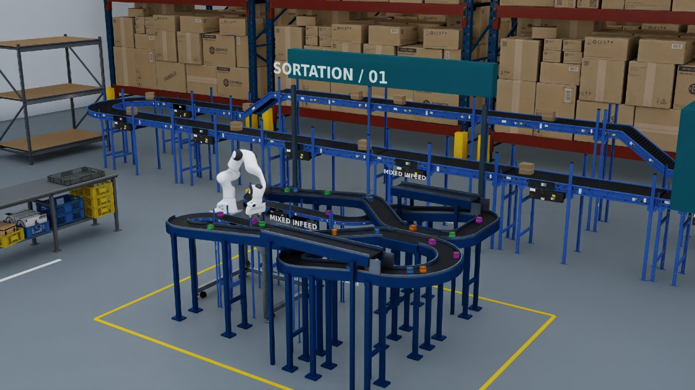

Conveyor Franka (Contrib)
=========================

A Franka transfers parcels between two moving conveyors. The compact task supports Newton
GPU training and native PhysX CPU playback. An optional USD warehouse demonstrates the same
checkpoint with textured cartons, elevated returns, gravity infeeds, and color sorting.

.. list-table:: Available variants
   :header-rows: 1
   :widths: 22 24 54

   * - Variant
     - Physics / device
     - Intended use
   * - Newton
     - Newton MJWarp / GPU
     - Train or play the original four-cube transfer task.
   * - Newton Play
     - Newton MJWarp / GPU
     - Play the warehouse demonstration with 24 physical parcels.
   * - PhysX CPU
     - Isaac Sim PhysX / CPU
     - Compare native surface-velocity behavior with an explicit checkpoint.

Run the pretrained policy
-------------------------

Use the standard Isaac Lab installation with the Isaac Sim extra for Kit/RTX visuals:

.. code-block:: bash

   uv run --extra isaacsim isaaclab play --rl_library rsl_rl \
     --task IsaacContrib-Conveyor-Franka-Newton-Play-v0 \
     --checkpoint https://omniverse-content-production.s3-us-west-2.amazonaws.com/Assets/Isaac/6.1/Isaac/IsaacLab/PretrainedCheckpoints/rsl_rl/IsaacContrib-Conveyor-Franka-Newton-v0_newtonmjwarp_none_rsl_rl.pt --num_envs 1 --device cuda:0 --viz kit --real-time \
     --kit_args=--/UJITSO/geometry=false

The first launch downloads the referenced Omniverse assets. The warehouse uses USD-authored
materials and lighting; Kit/RTX is the intended viewer. The launch override disables experimental
geometry streaming, including saved Kit preferences, which can hide meshes updated through Fabric.
For compact, lightweight playback:

.. code-block:: bash

   uv run isaaclab play --rl_library rsl_rl \
     --task IsaacContrib-Conveyor-Franka-Newton-v0 \
     --checkpoint pretrained --num_envs 8 --device cuda:0 --viz newton_gl --real-time

The published policy is iteration 7998 of the
`conveyor training run <https://wandb.ai/nvidia-isaac/isaaclab-conveyor-franka/runs/conveyor-franka-resume-22gpu-model3999-exactsrc-pxr1-l40-20260810-3>`__.
The warehouse command uses that same checkpoint URL explicitly. Both retain 123 observations,
eight actions, 120 Hz physics, and a 60 Hz policy rate. Checkpoints remain outside the repository.

Train or compare backends
-------------------------

.. code-block:: bash

   uv run isaaclab train --rl_library rsl_rl \
     --task IsaacContrib-Conveyor-Franka-Newton-v0 --num_envs 256 --device cuda:0

   uv run --extra isaacsim isaaclab play --rl_library rsl_rl \
     --task IsaacContrib-Conveyor-Franka-PhysX-CPU-v0 \
     --checkpoint /path/to/model.pt --num_envs 1 --device cpu --viz kit --real-time \
     agent.device=cpu

Native PhysX surface velocity requires CPU simulation for this task. GPU dynamics can drop
belt contacts in the supported Isaac Sim runtime. The PhysX variant rejects CUDA devices;
its separately named pretrained artifact is not published. Policy shape compatibility does
not imply identical behavior between backends.

Warehouse sorting
-----------------

The original manipulation straights and adjoining 90-degree bends remain fixed. Twenty-four
40 mm cartons circulate through the extended layout. Each reset shuffles a balanced batch of
six blue, six green, six orange, and six purple cartons. Blue/green belong on the positive-Y
loop; orange/purple belong on the negative-Y loop. Four policy slots are reassigned to arriving
parcels while an active grasp retains its identity. Destination classes are supervisory metadata;
the state-based checkpoint does not recognize colors from images.

This is a presentation and policy-reuse demonstration, not a reliably solved 24-parcel benchmark.
The unchanged checkpoint can miss grasps and reset before finishing a batch. The original
four-cube training and CPU reference configurations retain their compact layout.

.. raw:: html

   <video controls muted loop playsinline preload="metadata" style="width:100%;max-width:960px"
          poster="../../_static/conveyor_franka.jpg">
     <source src="https://github.com/maxkra15/IsaacLab/releases/download/conveyor-franka-preview/conveyor_franka.mp4" type="video/mp4">
     Your browser does not support embedded video.
   </video>

`Download the warehouse preview <https://github.com/maxkra15/IsaacLab/releases/download/conveyor-franka-preview/conveyor_franka.mp4>`__.

The task's
:download:`README <../../../source/isaaclab_tasks/isaaclab_tasks/contrib/conveyor_franka/README.md>`
describes the USD assets, collision ownership, slot adapter, and sorting metrics.
