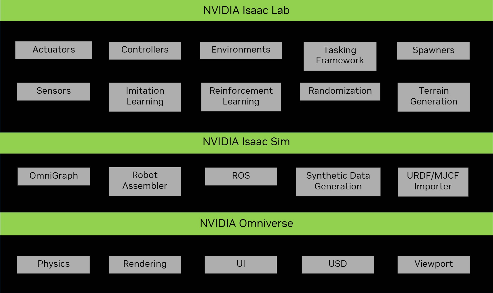

Isaac Lab Ecosystem
===================

Isaac Lab is built on top of Isaac Sim to provide a unified and flexible framework
for robot learning that exploits latest simulation technologies. It is designed to be modular and extensible,
and aims to simplify common workflows in robotics research (such as RL, learning from demonstrations, and
motion planning). While it includes some pre-built environments, sensors, and tasks, its main goal is to
provide an open-sourced, unified, and easy-to-use interface for developing and testing custom environments
and robot learning algorithms.

Working with Isaac Lab requires the installation of Isaac Sim, which is packaged with core robotics tools
that Isaac Lab depends on, including URDF and MJCF importers, simulation managers, and ROS features. Isaac
Sim also builds on top of the NVIDIA Omniverse platform, leveraging advanced physics simulation from PhysX,
photorealistic rendering technologies, and Universal Scene Description (USD) for scene creation.

Isaac Lab not only inherits the capabilities of Isaac Sim, but also adds a number
of new features that pertain to robot learning research. For example, including actuator dynamics in the
simulation, procedural terrain generation, and support to collect data from human demonstrations.

.. image:: ../_static/setup/ecosystem-light.jpg
    :class: only-light
    :align: center
    :alt: The Isaac Lab, Isaac Sim, and NVIDIA Omniverse ecosystem

For a detailed explanation of NVIDIA's development journey of robot learning frameworks, please visit
the `FAQ page <faq.html>`_.
