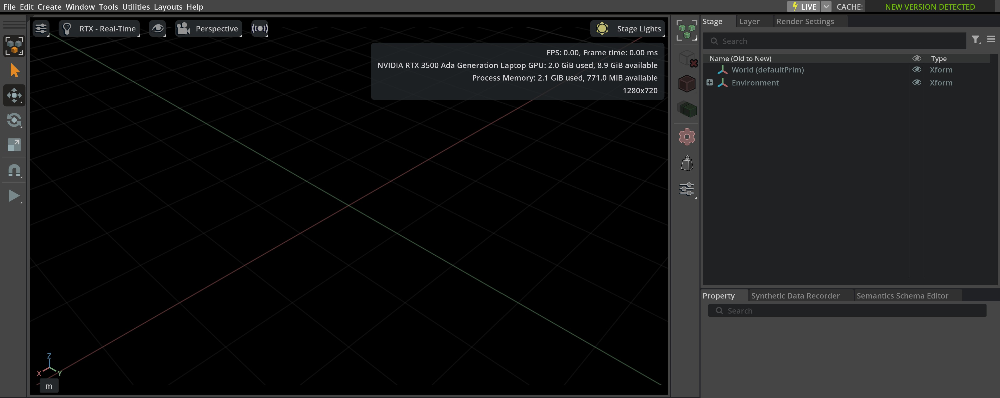

Asset Caching
=============

Assets used in Isaac Lab are hosted on AWS S3 buckets on the cloud.
Asset loading time can depend on your network connection and geographical location.
In some cases, it is possible that asset loading times can be long when assets are pulled from the AWS servers.

If you run into cases where assets take a few minutes to load for each run,
we recommend enabling asset caching following the below steps.

First, launch the Isaac Sim app:

.. tab-set::
   :sync-group: os

   .. tab-item:: :icon:`fa-brands fa-linux` Linux
      :sync: linux

      .. code:: bash

         ./isaaclab.sh -s

   .. tab-item:: :icon:`fa-brands fa-windows` Windows
      :sync: windows

      .. code:: batch

         isaaclab.bat -s

On the top right of the Isaac Sim app, there will be an icon labelled ``CACHE:``.
There may be a message indicating ``HUB NOT DETECTED`` or ``NEW VERSION DETECTED``.

Click on the message, which will enable `Hub <https://docs.omniverse.nvidia.com/utilities/latest/cache/hub-workstation.html>`_
for asset caching. Once enabled, Hub will run automatically each time an Isaac Lab or Isaac Sim instance is run.

Note that for the first run, assets will still need to be pulled from the cloud, which could lead to longer loading times.
However, subsequent runs that use the same assets will be able to use the cached files from Hub.
Hub will provide better control for caching of assets used in Isaac Lab.

Nucleus
-------

Prior to Isaac Sim 4.5, assets were accessible from the Omniverse Nucleus server and through setting up a local Nucleus server.
Although from Isaac Sim 4.5, we have deprecated the use of Omniverse Nucleus and the Omniverse Launcher, any existing instances
or setups of local Nucleus instances should still work. We recommend keeping existing setups if a local Nucleus server
was previously already set up.
