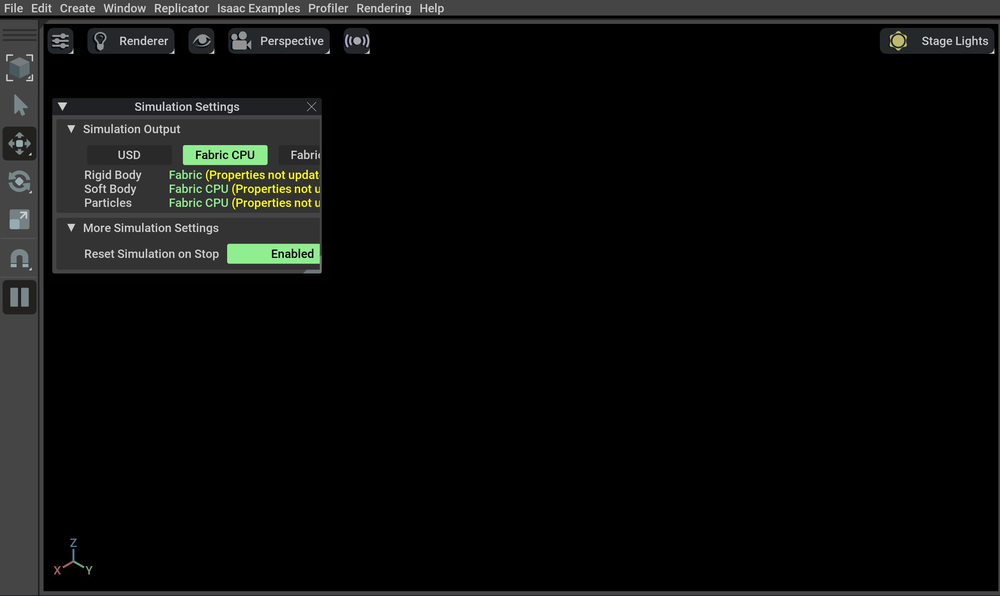
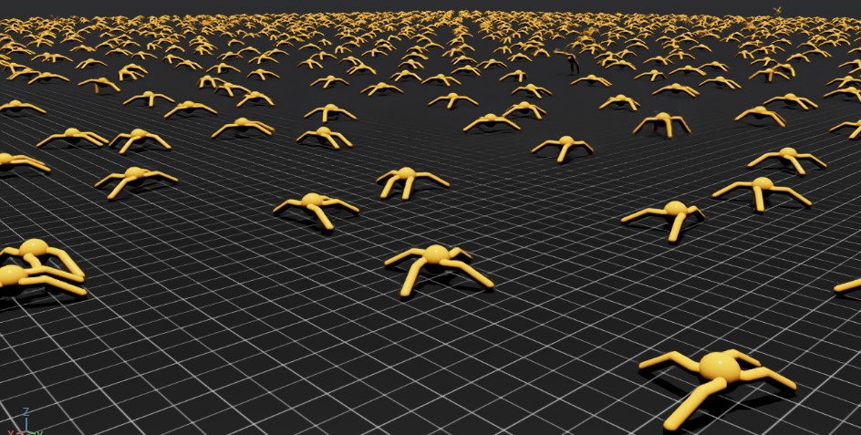

.. _isaaclab-pip-installation:

Installation using Isaac Sim pip
================================

Isaac Lab requires Isaac Sim. This tutorial first installs Isaac Sim from pip, then Isaac Lab from source code.

Installing Isaac Sim
--------------------

From Isaac Sim 4.0 release, it is possible to install Isaac Sim using pip.
This approach makes it easier to install Isaac Sim without requiring to download the Isaac Sim binaries.
If you encounter any issues, please report them to the
`Isaac Sim Forums <https://docs.isaacsim.omniverse.nvidia.com//latest/common/feedback.html>`_.

.. attention::

   Installing Isaac Sim with pip requires GLIBC 2.34+ version compatibility.
   To check the GLIBC version on your system, use command ``ldd --version``.

   This may pose compatibility issues with some Linux distributions. For instance, Ubuntu 20.04 LTS has GLIBC 2.31
   by default. If you encounter compatibility issues, we recommend following the
   :ref:`Isaac Sim Binaries Installation <isaaclab-binaries-installation>` approach.

.. attention::

   For details on driver requirements, please see the `Technical Requirements <https://docs.omniverse.nvidia.com/materials-and-rendering/latest/common/technical-requirements.html>`_ guide!

   On Windows, it may be necessary to `enable long path support <https://learn.microsoft.com/en-us/windows/win32/fileio/maximum-file-path-limitation?tabs=registry#enable-long-paths-in-windows-10-version-1607-and-later>`_ to avoid installation errors due to OS limitations.

.. attention::

   If you plan to :ref:`Set up Visual Studio Code <setup-vs-code>` later, we recommend following the
   :ref:`Isaac Sim Binaries Installation <isaaclab-binaries-installation>` approach.

.. note::

   If you use Conda, we recommend using `Miniconda <https://docs.anaconda.com/miniconda/miniconda-other-installer-links/>`_.

-  To use the pip installation approach for Isaac Sim, we recommend first creating a virtual environment.
   Ensure that the python version of the virtual environment is **Python 3.11**.

   .. tab-set::

      .. tab-item:: conda environment

         .. code-block:: bash

            conda create -n env_isaaclab python=3.11
            conda activate env_isaaclab

      .. tab-item:: venv environment

         .. tab-set::
            :sync-group: os

            .. tab-item:: :icon:`fa-brands fa-linux` Linux
               :sync: linux

               .. code-block:: bash

                  # create a virtual environment named env_isaaclab with python3.11
                  python3.11 -m venv env_isaaclab
                  # activate the virtual environment
                  source env_isaaclab/bin/activate

            .. tab-item:: :icon:`fa-brands fa-windows` Windows
               :sync: windows

               .. code-block:: batch

                  # create a virtual environment named env_isaaclab with python3.11
                  python3.11 -m venv env_isaaclab
                  # activate the virtual environment
                  env_isaaclab\Scripts\activate

-  Before installing Isaac Sim, ensure the latest pip version is installed. To update pip, run

   .. tab-set::
      :sync-group: os

      .. tab-item:: :icon:`fa-brands fa-linux` Linux
         :sync: linux

         .. code-block:: bash

            pip install --upgrade pip

      .. tab-item:: :icon:`fa-brands fa-windows` Windows
         :sync: windows

         .. code-block:: batch

            python -m pip install --upgrade pip

-  Next, install a CUDA-enabled PyTorch 2.7.0 build.

   .. code-block:: bash

      pip install torch==2.7.0 torchvision==0.22.0 --index-url https://download.pytorch.org/whl/cu128

-  Then, install the Isaac Sim packages.

   .. code-block:: none

      pip install "isaacsim[all,extscache]==5.0.0" --extra-index-url https://pypi.nvidia.com

Verifying the Isaac Sim installation
~~~~~~~~~~~~~~~~~~~~~~~~~~~~~~~~~~~~

-  Make sure that your virtual environment is activated (if applicable)

-  Check that the simulator runs as expected:

   .. code:: bash

      # note: you can pass the argument "--help" to see all arguments possible.
      isaacsim

-  It's also possible to run with a specific experience file, run:

   .. code:: bash

      # experience files can be absolute path, or relative path searched in isaacsim/apps or omni/apps
      isaacsim isaacsim.exp.full.kit

.. attention::

   When running Isaac Sim for the first time, all dependent extensions will be pulled from the registry.
   This process can take upwards of 10 minutes and is required on the first run of each experience file.
   Once the extensions are pulled, consecutive runs using the same experience file will use the cached extensions.

.. attention::

   The first run will prompt users to accept the NVIDIA Software License Agreement.
   To accept the EULA, reply ``Yes`` when prompted with the below message:

   .. code:: bash

      By installing or using Isaac Sim, I agree to the terms of NVIDIA SOFTWARE LICENSE AGREEMENT (EULA)
      in https://www.nvidia.com/en-us/agreements/enterprise-software/nvidia-software-license-agreement

      Do you accept the EULA? (Yes/No): Yes

If the simulator does not run or crashes while following the above
instructions, it means that something is incorrectly configured. To
debug and troubleshoot, please check Isaac Sim
`documentation <https://docs.omniverse.nvidia.com/dev-guide/latest/linux-troubleshooting.html>`__
and the
`forums <https://docs.isaacsim.omniverse.nvidia.com//latest/isaac_sim_forums.html>`__.

Installing Isaac Lab
--------------------

Cloning Isaac Lab
~~~~~~~~~~~~~~~~~

.. note::

   We recommend making a `fork <https://github.com/isaac-sim/IsaacLab/fork>`_ of the Isaac Lab repository to contribute
   to the project but this is not mandatory to use the framework. If you
   make a fork, please replace ``isaac-sim`` with your username
   in the following instructions.

Clone the Isaac Lab repository into your workspace:

.. tab-set::

   .. tab-item:: SSH

      .. code:: bash

         git clone git@github.com:isaac-sim/IsaacLab.git

   .. tab-item:: HTTPS

      .. code:: bash

         git clone https://github.com/isaac-sim/IsaacLab.git

.. note::
   We provide a helper executable `isaaclab.sh <https://github.com/isaac-sim/IsaacLab/blob/main/isaaclab.sh>`_ that provides
   utilities to manage extensions:

   .. tab-set::
      :sync-group: os

      .. tab-item:: :icon:`fa-brands fa-linux` Linux
         :sync: linux

         .. code:: text

            ./isaaclab.sh --help

            usage: isaaclab.sh [-h] [-i] [-f] [-p] [-s] [-t] [-o] [-v] [-d] [-n] [-c] -- Utility to manage Isaac Lab.

            optional arguments:
               -h, --help           Display the help content.
               -i, --install [LIB]  Install the extensions inside Isaac Lab and learning frameworks (rl_games, rsl_rl, sb3, skrl) as extra dependencies. Default is 'all'.
               -f, --format         Run pre-commit to format the code and check lints.
               -p, --python         Run the python executable provided by Isaac Sim or virtual environment (if active).
               -s, --sim            Run the simulator executable (isaac-sim.sh) provided by Isaac Sim.
               -t, --test           Run all python pytest tests.
               -o, --docker         Run the docker container helper script (docker/container.sh).
               -v, --vscode         Generate the VSCode settings file from template.
               -d, --docs           Build the documentation from source using sphinx.
               -n, --new            Create a new external project or internal task from template.
               -c, --conda [NAME]   Create the conda environment for Isaac Lab. Default name is 'env_isaaclab'.

      .. tab-item:: :icon:`fa-brands fa-windows` Windows
         :sync: windows

         .. code:: text

            isaaclab.bat --help

            usage: isaaclab.bat [-h] [-i] [-f] [-p] [-s] [-v] [-d] [-n] [-c] -- Utility to manage Isaac Lab.

            optional arguments:
               -h, --help           Display the help content.
               -i, --install [LIB]  Install the extensions inside Isaac Lab and learning frameworks (rl_games, rsl_rl, sb3, skrl) as extra dependencies. Default is 'all'.
               -f, --format         Run pre-commit to format the code and check lints.
               -p, --python         Run the python executable provided by Isaac Sim or virtual environment (if active).
               -s, --sim            Run the simulator executable (isaac-sim.bat) provided by Isaac Sim.
               -t, --test           Run all python pytest tests.
               -v, --vscode         Generate the VSCode settings file from template.
               -d, --docs           Build the documentation from source using sphinx.
               -n, --new            Create a new external project or internal task from template.
               -c, --conda [NAME]   Create the conda environment for Isaac Lab. Default name is 'env_isaaclab'.

Installation
~~~~~~~~~~~~

-  Install dependencies using ``apt`` (on Ubuntu):

   .. code:: bash

      sudo apt install cmake build-essential

- Run the install command that iterates over all the extensions in ``source`` directory and installs them
  using pip (with ``--editable`` flag):

.. tab-set::
   :sync-group: os

   .. tab-item:: :icon:`fa-brands fa-linux` Linux
      :sync: linux

      .. code:: bash

         ./isaaclab.sh --install # or "./isaaclab.sh -i"

   .. tab-item:: :icon:`fa-brands fa-windows` Windows
      :sync: windows

      .. code:: bash

         isaaclab.bat --install :: or "isaaclab.bat -i"

.. note::

   By default, this will install all the learning frameworks. If you want to install only a specific framework, you can
   pass the name of the framework as an argument. For example, to install only the ``rl_games`` framework, you can run

   .. tab-set::
      :sync-group: os

      .. tab-item:: :icon:`fa-brands fa-linux` Linux
         :sync: linux

         .. code:: bash

            ./isaaclab.sh --install rl_games  # or "./isaaclab.sh -i rl_games"

      .. tab-item:: :icon:`fa-brands fa-windows` Windows
         :sync: windows

         .. code:: bash

            isaaclab.bat --install rl_games :: or "isaaclab.bat -i rl_games"

   The valid options are ``rl_games``, ``rsl_rl``, ``sb3``, ``skrl``, ``robomimic``, ``none``.

Verifying the Isaac Lab installation
~~~~~~~~~~~~~~~~~~~~~~~~~~~~~~~~~~~~

To verify that the installation was successful, run the following command from the
top of the repository:

.. tab-set::
   :sync-group: os

   .. tab-item:: :icon:`fa-brands fa-linux` Linux
      :sync: linux

      .. code:: bash

         # Option 1: Using the isaaclab.sh executable
         # note: this works for both the bundled python and the virtual environment
         ./isaaclab.sh -p scripts/tutorials/00_sim/create_empty.py

         # Option 2: Using python in your virtual environment
         python scripts/tutorials/00_sim/create_empty.py

   .. tab-item:: :icon:`fa-brands fa-windows` Windows
      :sync: windows

      .. code:: batch

         :: Option 1: Using the isaaclab.bat executable
         :: note: this works for both the bundled python and the virtual environment
         isaaclab.bat -p scripts\tutorials\00_sim\create_empty.py

         :: Option 2: Using python in your virtual environment
         python scripts\tutorials\00_sim\create_empty.py

The above command should launch the simulator and display a window with a black
viewport as shown below. You can exit the script by pressing ``Ctrl+C`` on your terminal.
On Windows machines, please terminate the process from Command Prompt using
``Ctrl+Break`` or ``Ctrl+fn+B``.

If you see this, then the installation was successful! |:tada:|

Train a robot!
~~~~~~~~~~~~~~~

You can now use Isaac Lab to train a robot through Reinforcement Learning! The quickest way to use Isaac Lab is through the predefined workflows using one of our **Batteries-included** robot tasks. Execute the following command to quickly train an ant to walk!
We recommend adding ``--headless`` for faster training.

.. tab-set::
   :sync-group: os

   .. tab-item:: :icon:`fa-brands fa-linux` Linux
      :sync: linux

      .. code:: bash

         ./isaaclab.sh -p scripts/reinforcement_learning/rsl_rl/train.py --task=Isaac-Ant-v0 --headless

   .. tab-item:: :icon:`fa-brands fa-windows` Windows
      :sync: windows

      .. code:: batch

         isaaclab.bat -p scripts/reinforcement_learning/rsl_rl/train.py --task=Isaac-Ant-v0 --headless

... Or a robot dog!

.. tab-set::
   :sync-group: os

   .. tab-item:: :icon:`fa-brands fa-linux` Linux
      :sync: linux

      .. code:: bash

         ./isaaclab.sh -p scripts/reinforcement_learning/rsl_rl/train.py --task=Isaac-Velocity-Rough-Anymal-C-v0 --headless

   .. tab-item:: :icon:`fa-brands fa-windows` Windows
      :sync: windows

      .. code:: batch

         isaaclab.bat -p scripts/reinforcement_learning/rsl_rl/train.py --task=Isaac-Velocity-Rough-Anymal-C-v0 --headless

Isaac Lab provides the tools you'll need to create your own **Tasks** and **Workflows** for whatever your project needs may be. Take a look at our :ref:`how-to` guides like `Adding your own learning Library <source/how-to/add_own_library>`_ or `Wrapping Environments <source/how-to/wrap_rl_env>`_ for details.

