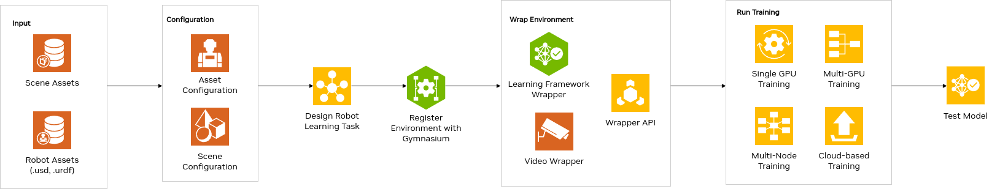

Isaac Lab Reference Architecture
====================================

What is NVIDIA Isaac Lab?
---------------------------------
Isaac Lab is a unified and modular framework for robot learning that aims to simplify common workflows in robotics research, such as reinforcement learning (RL) and imitation learning). It is built upon NVIDIA Isaac Sim to leverage the latest simulation capabilities for photorealistic scenes, as well as  fast and accurate simulation.

Isaac Lab provides over 16 robots with 26 environments, and we are actively working on adding more environments to the list. Current Environments include four (4) Classic tasks - Cartpole, Cartpole with camera, Humanoid, and Ant; six (6) fixed-arm manipulation tasks; seventeen (17) Legged locomotion tasks - Quadrupeds and Humanoids; and two (2) Navigation tasks - Quadruped and Quadcopter. Robots include but are not limited to:

* Classic - Cartpole, Humanoid, Ant
* Fixed-Arms - UR10, Franka, Allegro, Shadow Hand
* Quadrupeds – Anybotics Anymal-B, Anymal-C, Anymal-D, Unitree A1, Unitree Go1, Unitree Go2, Boston Dynamics Spot
* Humanoids - Unitree H1, Unitree G1

Key features available in Isaac Lab include fast and accurate physics simulation provided by PhysX, tiled rendering APIs for vectorized rendering, domain randomization for improving robustness and adaptability, and support for running in the cloud.

What is this document?
---------------------------------
This document presents an overview of the end-to-end reinforcement learning process with 
Isaac Lab and Isaac Sim. This is demonstrated using a reference architecture that highlights 
the major building blocks for training and deployment workflows. It provides a comprehensive, 
user-friendly guide on the entire process of developing applications from training to deploying 
the trained model in the real world, including links to demos, working examples, and documentation.

Who is this document for?
---------------------------------

This document is designed to assist robotics developers and researchers working with NVIDIA Isaac Lab 
in the robot learning field, including those at research labs, Original Equipment Manufacturers (OEM), 
Solutions Providers, Solutions Integrators (SI),  and independent software vendors (ISV). It offers 
guidance on utilizing Isaac Lab’s robot training framework and workflows as a foundational starting 
point for environment configuration, task design, and policy training and testing. 

The reference architecture for Isaac Lab comprises the following components:

1. Asset Input
2. Asset Configuration
3. Scene Configuration
4. Robot Learning Task Design 
5. Register with Gymnasium
6. Environment Wrapping
7. Run Training 
  - Single GPU Training
  - Multi-GPU Training
  - Multi-Node Training
  - Cloud-based Training
8. Run Testing

**Components**
-----------------
In this section, we will briefly discuss the individual blocks for creating a 
sample reference application in Isaac Lab. 

**Component 1 - Asset Input**
^^^^^^^^^^^^^^^^^^^^^^^^^^^^^^
Isaac Lab accepts URDF or USD files for assets. The first step to training using Isaac Lab is to 
have the USD file of your asset and the USD or URDF file of your robot. This can be achieved in 
the following ways:

a. Design your assets or robot in Isaac Sim and export the USD file.
b. Design your assets or robot in any software of your choice and export it to USD using Isaac Sim 
converters. 
  - Isaac Sim supports the different converters/importers to USD such as the `CAD Converter<https://docs.omniverse.nvidia.com/extensions/latest/ext_cad-converter.html>`__, 
  `URDF Importer<https://docs.omniverse.nvidia.com/isaacsim/latest/advanced_tutorials/tutorial_advanced_import_urdf.html>`__, 
  `MJCF Importer<https://docs.omniverse.nvidia.com/isaacsim/latest/advanced_tutorials/tutorial_advanced_import_mjcf.html#import-mjcf>`__, 
  `Onshape Importer<https://docs.omniverse.nvidia.com/extensions/latest/ext_onshape.html>` etc. More details are found here and in the 
  Importing Robots section in the `Isaac Sim Reference Architecture<https://docs.omniverse.nvidia.com/isaacsim/latest/isaac_sim_reference_architecture.html>`__
c. If you already have the URDF file of your robot, you do not need to convert to USD as Isaac Lab takes URDF.

**Component 2 - Asset Configuration**
^^^^^^^^^^^^^^^^^^^^^^^^^^^^^^^^^^^^^^

Given that you have the asset file for your robot and other assets such as environment objects based 
on the task, the next step is to import them into Isaac Lab. Isaac Lab uses asset configuration classes
to spawn various objects (or prims) into the scene using Python. The first step is to write a 
configuration class to define the properties for the assets needed to complete the task. For example, 
a simple go-to-goal task for a mobile robot will include the robot asset, an object like cubes to 
signify the goal pose visually, lights, ground plane, etc. Isaac Lab understands these assets using 
the configuration classes. Isaac Lab provides various sim-ready assets such as. physically accurate 
3D objects that encompass accurate physical properties and behavior. It also provides connected 
data streams to represent the real world in simulated digital worlds 
such as `robots<https://github.com/isaac-sim/IsaacLab/tree/main/source/extensions/omni.isaac.lab_assets/omni/isaac/lab_assets>`__ 
like Anyrobotics Anymal, Unitree H1 Humanoid, etc. as well as 
`sensors<https://github.com/isaac-sim/IsaacLab/tree/main/source/extensions/omni.isaac.lab/omni/isaac/lab/sensors>`__, 
`shapes<https://github.com/isaac-sim/IsaacLab/tree/main/source/extensions/omni.isaac.lab/omni/isaac/lab/sim/spawners/shapes>`__, 
lights, and more. We provide their asset file and configuration classes. 
Users can also define their own assets using the configuration classes. 

Follow the tutorial on `how to write an Articulation and ArticulationCfg class<https://isaac-sim.github.io/IsaacLab/main/source/how-to/write_articulation_cfg.html>`__. 

**Component 3 - Scene Configuration**
^^^^^^^^^^^^^^^^^^^^^^^^^^^^^^^^^^^^^^

Given the individual asset configurations, the next step is to put all the assets together into a 
scene. The scene configuration is a simple config class that initializes all the assets in the 
scene that are needed for the task and for visualization. This is an example for the 
`Cartpole example scene configuration<https://isaac-sim.github.io/IsaacLab/main/source/tutorials/02_scene/create_scene.html#scene-configuration>`__,
which includes the cartpole, ground plane, and dome light. 

**Component 4 - Robot Learning Task Design**
^^^^^^^^^^^^^^^^^^^^^^^^^^^^^^^^^^^^^^^^^^^^^^
Now, we have the scene for the task, but we need to define the 
`reinforcement learning<https://www.andrew.cmu.edu/course/10-703/textbook/BartoSutton.pdf>`__ (RL) task 
that the agent is going to do. RL tasks are defined as a Markov Decision Process (MDP), 
which is a stochastic decision-making process where optional decisions are made for the agents 
considering their current state and environment they interact with. The environment provides the 
agents’ current state or observations, and executes the actions provided by the agent. 
The environment responds to the agents by providing the next states, reward of taking the 
action, done flag and information about the current episode. Therefore, different components 
of the MDP formulation (the environment) – states, actions, rewards, reset, done, etc. — must 
be defined by the user for the agent to perform the given task.

In Isaac Lab, we provide two different workflows for designing environments.

.. admonition:: Manager-based 

.. image:: ./images/x.png
      :width: 600px
      :align: center
      :alt: Manager-Based Taskflow RA

This workflow is modular, and the environment is decomposed into individual components (or managers) 
that handle the different aspects of the environment, such as computing observations, 
applying actions, and applying randomization. As a user, you define different configuration classes 
for each component. 

- An RL task should have the following configuration classes:
  - Observations Config: Defines the agents’ observations for the task.
  - Actions Config: Defines the agent’s action type, i.e. how the output of the agent are mapped to 
    the robot's control inputs.
  - Event Config: Defines the set of randomizations and noisification for the agent and environment. This also includes what happens at the reset of the environment.
  - Rewards Config: Defines the reward function for the task
  - Terminations Config: Defines the conditions for termination of an episode or when the task 
    is completed.

- You can add other optional configuration classes such as Curriculum Config for tasks that require curriculum learning and Commands Config for tasks where the input is from a controller/ setpoint controls e.g. a gamepad controller.

.. admonition:: Useful Links
  - To learn more on how you can design your own manager-based environment, see :ref:`tutorial-create-manager-rl-env`.

.. admonition:: Direct

.. image:: ./images/x.png
    :width: 600px
    :align: center
    :alt: Direct Taskflow RA

In this workflow, you implement a single class that is responsible for computing observations, applying actions, and computing rewards. This workflow allows for direct control of the environment logic.

.. admonition:: Useful Links
  - To learn more on how you can design your own direct environment, see :ref:`tutorial-create-direct-rl-env`.

Users can choose from Isaac Lab’s large suite of pre-configured environments or users can define 
their own environments. For more technical information about the two workflows, please see the 
`documentation <https://isaac-sim.github.io/IsaacLab/main/source/overview/core-concepts/task_workflows.html>`__. 

In addition to designing the RL task, you will need to design your agent’s model, the neural 
network policy and value function. To train the RL agent to solve the task, you need to define 
the hyperparameters such as number of epochs, learning rate etc. for training and the 
policy/value model architecture. This is defined in the training configuration file specific 
to the RL library you want to use. Examples are created under the agent's folder in each task directory. 
See an example of `RSL-RL<https://github.com/isaac-sim/IsaacLab/blob/main/source/extensions/omni.isaac.lab_tasks/omni/isaac/lab_tasks/manager_based/locomotion/velocity/config/anymal_b/agents/rsl_rl_ppo_cfg.py>`__ for Anymal-B.

**Component 5 - Register with Gymnasium**
^^^^^^^^^^^^^^^^^^^^^^^^^^^^^^^^^^^^^^^^^^^^^^

The next step is to register the environments with the gymnasium registry. 
Registration is a way to make the environment accessible and reusable across different 
RL algorithms and experiments. This is common in the RL community. Follow the tutorial on 
`Registering an Environment<https://isaac-sim.github.io/IsaacLab/main/source/tutorials/03_envs/register_rl_env_gym.html>`__ to learn more about how to register in your own environment.

**Component 6 - Environment Wrapping**
^^^^^^^^^^^^^^^^^^^^^^^^^^^^^^^^^^^^^^^^^^^^^^
In running your RL task, you might want to change the behavior of your environment without 
changing the environment itself. For example, you might want to create functions to modify 
observations or rewards, record videos, or enforce time limits. Isaac Lab utilizes the API 
available in the `gymnasium.Wrapper<https://gymnasium.farama.org/api/wrappers/#gymnasium.Wrapper>`__ class to create interfaces to the simulated environments. 

Some wrappers include:
- `Video Wrappers<https://isaac-sim.github.io/IsaacLab/main/source/how-to/wrap_rl_env.html#wrapper-for-recording-videos>`__
- `RL Libraries Wrappers<https://isaac-sim.github.io/IsaacLab/main/source/how-to/wrap_rl_env.html#wrapper-for-learning-frameworks>`__

Most RL libraries expect their own variation of an environment interface. This means the 
data types needed by each library differs. Isaac Lab provides its own wrappers to convert 
the environment into the expected interface by the RL library a user wants to use. These are 
specified in the `Isaac Lab utils wrapper module<https://isaac-sim.github.io/IsaacLab/main/source/api/lab_tasks/omni.isaac.lab_tasks.utils.wrappers.html#module-omni.isaac.lab_tasks.utils.wrappers>`__.

See the `full list<https://gymnasium.farama.org/api/wrappers/#gymnasium.Wrapper>`__ of other wrappers APIs.. For more information on how these wrappers work, 
please refer to the `Wrapping environments<https://isaac-sim.github.io/IsaacLab/main/source/how-to/wrap_rl_env.html#how-to-env-wrappers>`__ documentation.

.. admonition:: Adding your own wrappers
You can define your own wrappers by adding them to the Isaac Lab utils wrapper module. 
More information is available `on the GitHub page for wrapping environments<https://isaac-sim.github.io/IsaacLab/main/source/how-to/wrap_rl_env.html#adding-new-wrappers>`__.

**Component 7 - Run Training**
^^^^^^^^^^^^^^^^^^^^^^^^^^^^^^^^