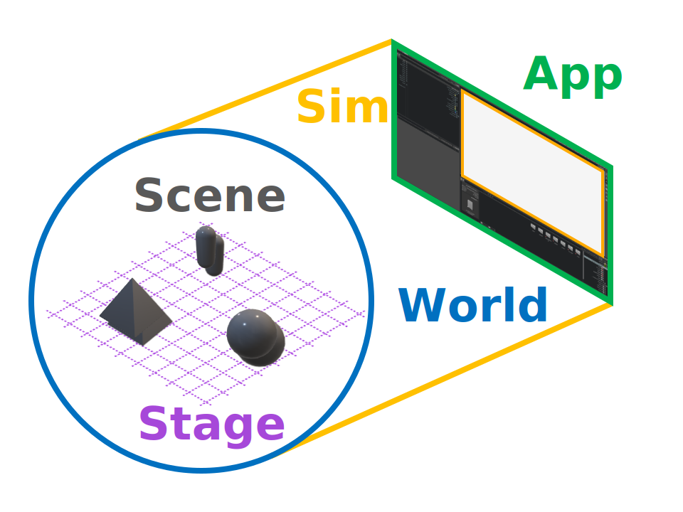
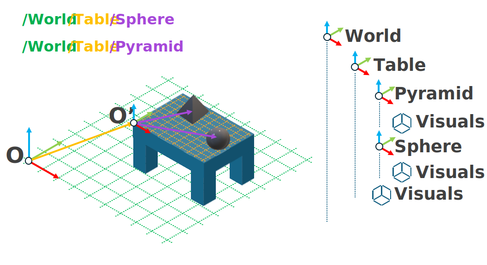

.. _walkthrough_concepts_env_design:

Environment Design Background
==============================

Now that we have our project installed, we can start designing the environment. In the traditional description
of a reinforcement learning (RL) problem, the environment is responsible for using the actions produced by the agent to
update the state of the "world", and finally compute and return the observations and the reward signal. However, there are
some additional concepts that are unique to Isaac Sim and Lab regarding the mechanics of the simulation itself.
The traditional description of a reinforcement learning problem presumes a "world", but we get no such luxury; we must define
the world ourselves, and success depends on understanding on how to construct that world and how it will fit into the simulation.

App, Sim, World, Stage, and Scene
----------------------------------

The **World** is defined by the origin of a cartesian coordinate system and the units that define it. How big or how small? How
near or how far?  The answers to questions like these can only be defined *relative* to some contextual reference frame, and that
reference frame is what defines the world.

"Above" the world in structure is the **Sim**\ ulation and the **App**\ lication.  The **Application** is "the thing responsible for
everything else": It governs all resource management as well as launching and destroying the simulation when we are done with it.
When we :ref:`launched training with the template<template-generator>`, the window that appears with the viewport of cartpoles
training is the Application window.  The application is not defined by the GUI however, and even when running in headless mode all
simulations have an application that governs them.

The **Simulation** controls the "rules" of the world.  It defines the laws of physics, such as how time and gravity should work, and how frequently to perform
rendering. If the application holds the sim, then the sim holds the world. The simulation governs a single step through time by dividing it into many different
sub-steps, each devoted to a specific aspect of updating the world into a state. Many of the APIs in Isaac Lab are written to specifically hook into
these various steps and you will often see functions named like ``_pre_XYZ_step`` and ``_post_XYZ_step`` where ``XYZ_step`` is the name of one of these sub-steps of
the simulation, such as the ``physics_step`` or the ``render_step``.

"Below" the world in structure is the **Stage** and the **Scene**.  If the world provides spatial context to the sim, then
the **Stage** provides the *compositional context* for the world. Suppose we want to simulate a table set for a meal in a room:
the room is the "world" in this case, and we choose the origin of the world to be one of the corners of the room. The position of the
table in the room is defined as a vector from the origin of the world to some point on the table that we choose to be the origin of a *new* coordinate
system, fixed to the table.  It's not useful to us, *the agent*\ , to talk about the location of the food and the utensils on the table with respect to the
corner of the room: instead it is preferable to use the coordinates defined with respect to the table. However, the simulation needs to know
these global coordinates in order to properly simulate the next time step, so we must define how these two coordinate systems are *composed* together.

This is what the stage accomplishes: everything in the simulation is a `USD primitive <https://openusd.org/release/glossary.html#usdglossary-prim>`_ and the
stage represents the relationships between these primitives as a tree, with the context being defined by the relative path in the tree. Every prim on the stage
has a name and therefore a path in this tree, such as ``/room/table/food`` or ``room/table/utensils``. Relationships are defined by the "parents" and "children"
of a given node in this tree: the ``table`` is a child of the ``room`` but a parent of ``food``. Compositional properties of the parent are applied to all of its
children, but child prims have the ability to override parent properties if necessary, as is often the case for materials.

Armed with this vocabulary, we can finally talk about the **Scene**, one of the most critical elements to understand about Isaac Lab. Deep learning, in
all its forms, is rooted in the analysis of data.  This is true even in robot learning, where data is acquired through the sensors of the robot being trained.
The time required to setup the robot, collect data, and reset the robot to collect more, is a fundamental bottleneck in teaching robots to do *anything*, with any method.
Isaac Sim gives us access to robots without the need for literal physical robots, but Isaac Lab gives us access to *vectorization*: the ability to simulate many copies
of a training procedure efficiently, thus multiplying the rate of data generation and accelerating training proportionally. The scene governs those primitives on the stage
that matter to this vectorization process, known as **simulation entities**.

Suppose the reason why you want to simulate a table set for a meal is because you would like to train a robot to place the table settings for you! The robot, the table,
and all the things on it can be registered to the scene of an environment.  We can then specify how many copies we want and the scene will automatically
construct and run those copies on the stage. These copies are placed at new coordinates on the stage, defining a new reference frame from which observations
and rewards can be computed. Every copy of the scene exists on the stage and is being simulated by the same world.  This is much more efficient
than running unique simulations for each copy, but it does open up the possibility of unwanted interactions between copies of the scene, so it's important
to keep this in mind while debugging.

Now that we have a grasp on the mechanics, we can take a look at the code generated for our template project!
